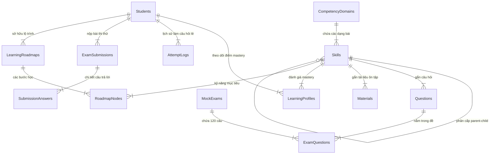
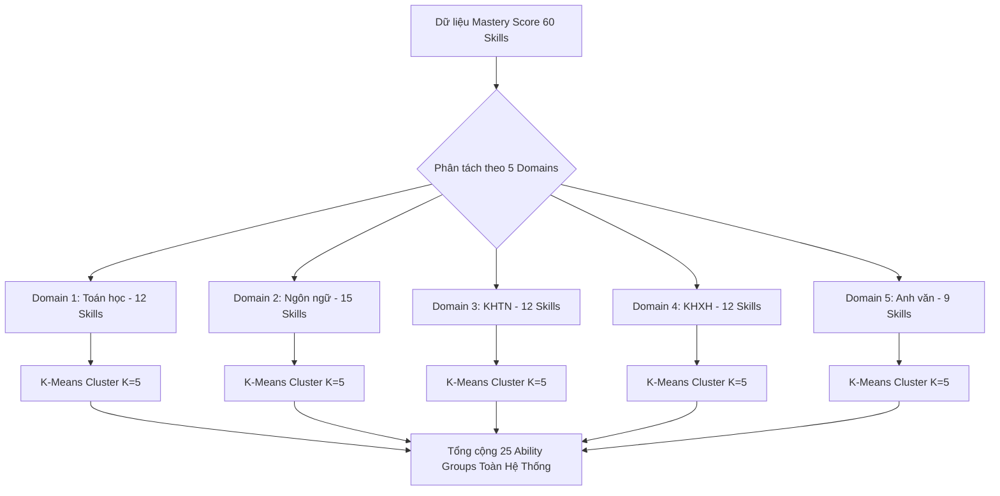

# BÁO CÁO PHÂN TÍCH LUỒNG SCHEMA SQL & THIẾT KẾ THUẬT TOÁN GOM NHÓM (ABILITY GROUPS)

> **Dự án**: V-Eval Platform  
> **Tài liệu tham chiếu**: [SQL.sql](./SQL.sql)  
> **Ngày cập nhật**: 19/09/2026  
> **Mục đích**: Kiểm kê luồng dữ liệu hiện tại trong SQL schema, phân tích nguy cơ nổ tổ hợp (Combinatorial Explosion) khi gom nhóm năng lực học sinh (`ability_groups`), đề xuất giải pháp giảm chiều dữ liệu (Domain-based Clustering), làm rõ thiết kế bảng CSDL đi kèm và đánh giá các rủi ro thực tế của thuật toán Clustering.

---

## 1. KIỂM KÊ LUỒNG DỮ LIỆU & SCHEMA CSDL HIỆN TẠI (`SQL.sql`)

Dựa trên schema PostgreSQL V2 hiện tại ([SQL.sql](./SQL.sql)), các thực thể và luồng dữ liệu cho phân hệ học tập cá nhân hóa được cấu trúc như sau:



### Chi tiết các khối nghiệp vụ chính:
1. **Khung năng lực (`CompetencyDomains` & `Skills`)**:
   - `CompetencyDomains`: Quản lý các môn/miền thi (VD: Toán học, Ngôn ngữ, KHTN, KHXH...). Đề ĐGNL tiêu chuẩn gồm **5 domains**.
   - `Skills`: Cấu trúc cây tự tham chiếu (`parent_id`) đại diện cho các dạng bài/kỹ năng chi tiết. Mỗi domain có từ **10-15 skills con** → Tổng toàn hệ thống có từ **50-75 skills**.
2. **Ngân hàng đề & Thi thử (`Questions` & `MockExams`)**:
   - `Questions`: Gắn liền với `skill_id`, `difficulty_level` (1-5), `content_latex`.
   - `MockExams`: Đề thi chuẩn hóa (gồm **120 câu hỏi**, phân bổ qua 5 domain). Tất cả học sinh đều làm đề thi gốc chung để đảm bảo so sánh năng lực công bằng.
3. **Theo dõi năng lực (`LearningProfiles` & `AttemptLogs` / `SubmissionAnswers`)**:
   - `LearningProfiles`: Lưu trữ điểm thành thục (`mastery_score` từ 0.0 - 1.0) của 1 học sinh trên từng `skill_id`.
   - `AttemptLogs` & `SubmissionAnswers`: Dữ liệu thô thu thập từ quá trình làm bài (đúng/sai, thời gian làm `time_spent`) dùng làm đầu vào để tái tính toán `mastery_score`.
4. **Cá nhân hóa lộ trình (`LearningRoadmaps` & `RoadmapNodes`)**:
   - Định hướng chuỗi bài học (`RoadmapNodes`) và đề xuất tài liệu ôn tập (`Materials`) phù hợp với điểm yếu của từng nhóm học sinh.

---

## 2. PHÂN TÍCH BÀI TOÁN TOÁN HỌC: NGUY CƠ "NỔ TỔ HỢP" (COMBINATORIAL EXPLOSION)

### 2.1. Đặt bài toán
- **Mục tiêu gom nhóm (`ability_groups`)**: Nhóm các học sinh có hồ sơ năng lực tương đồng lại với nhau để:
  1. Tạo nội dung gợi ý học tập / tài liệu ôn tập (`Materials`) chung cho cả nhóm.
  2. Gửi Prompt đến AI Tutor / RAG theo nhóm thay vì từng cá nhân → **Tiết kiệm chi phí gọi LLM / API RAG tới 80-90%**.

### 2.2. Tại sao phương pháp Naive (Gom nhóm trên Vector toàn bộ Skills) bị nổ tổ hợp?
Nếu xây dựng Vector năng lực cho 1 học sinh bằng cách ghép toàn bộ M skills toàn hệ thống (với M ≈ 60 skills):

```text
V_student = [mastery(skill_1), mastery(skill_2), ..., mastery(skill_60)]
```

Giả sử mỗi skill được chia thành 3 mức độ năng lực (Yếu / Trung Bình / Khá-Giỏi):
- **Trường hợp 1 (Gom nhóm theo từng Skill × Severity độc lập)**:

  ```text
  Số groups = 60 skills × 3 mức độ = 180 groups
  ```
  Với 5,000 học sinh → Trung bình mỗi group có ~27 học sinh (Mức độ gom nhóm thấp, hiệu quả quản lý kém).

- **Trường hợp 2 (Gom nhóm theo Tổ hợp đa chiều đầy đủ)**:
  Số tổ hợp trong không gian trạng thái lý thuyết:

  ```text
  Số tổ hợp lý thuyết = 3^60 ≈ 4.23 × 10^28 tổ hợp
  ```

  → **Hệ quả cực kỳ nghiêm trọng**: Với dữ liệu thực tế, K-Means hoặc GMM chạy trên không gian 60 chiều sẽ bị **Curse of Dimensionality** (Lời nguyền số chiều). Hầu như mỗi học sinh sẽ rơi vào một góc riêng biệt trong không gian đa chiều, dẫn đến **mỗi học sinh là 1 nhóm riêng** → Quay trở lại đúng bài toán "Cá nhân hóa 1-1 tốn kém" ban đầu.

---

## 3. GIẢI PHÁP TỐI ƯU KIẾN TRÚC: GIẢM CHIỀU DỮ LIỆU TRƯỚC KHI CLUSTER

Để khắc phục triệt để nguy cơ nổ tổ hợp, hệ thống áp dụng **3 chiến lược giảm chiều dữ liệu thực tế**:



### 3.1. Hướng 1: Cluster theo TỪNG DOMAIN riêng biệt (Domain-level Clustering)
- **Cơ chế**: Thay vì dùng 1 vector 60 chiều toàn cục, tách thành **5 bài toán Clustering độc lập**, mỗi bài toán chỉ chạy trên các skill thuộc về 1 `domain_id`.
- **Ví dụ**:
  - Vector Toán học: 12 chiều (chỉ chứa các skill con của Toán).
  - Vector Ngôn ngữ: 15 chiều (chỉ chứa các skill con của Ngôn ngữ).
- **Kết quả**: K-Means trên 10-15 chiều hội tụ rất nhanh, không lo bùng nổ số cụm.
- **Tính toán số lượng nhóm**:

  ```text
  Tổng số Groups toàn hệ thống = 5 domains × K cụm/domain = 5 × 5 = 25 groups
  ```

### 3.2. Hướng 2: Giới hạn cứng số cụm K (Fixed Cluster Count)
- Thuật toán K-Means bắt buộc truyền tham số K cố định (ví dụ K = 5 đại diện cho: *Rất Yếu, Yếu Nổi Bật Skill A, Yếu Nổi Bật Skill B, Trung Bình Đều, Khá Giỏi*).
- K được kiểm soát hoàn toàn bởi Academic Manager / AI Service, không để thuật toán tự sinh cụm ngẫu nhiên.

### 3.3. Hướng 3: Lọc Top-K Skill yếu nhất (Weakness Focus Filtering)
- Khi tính toán đặc trưng đầu vào cho Clustering, chỉ cần quan tâm **Top 3-5 skill có điểm `mastery_score` thấp nhất** của học sinh trong domain đó.
- Bỏ qua các skill học sinh đã đạt mức thành thục > 0.8. Việc này giúp gom các học sinh "gặp cùng vấn đề chính" vào chung 1 nhóm học tập mà không bị nhiễu bởi những kỹ năng đã giỏi.

---

## 4. THIẾT KẾ CSDL BỔ SUNG CHO PHÂN HỆ GOM NHÓM

Dựa trên phân tích ở Hướng 1 (Mỗi học sinh có **nhiều group memberships** — 1 membership đại diện cho 1 domain), ta bổ sung 2 bảng CSDL vào PostgreSQL Schema:

```sql
-- ---------------------------------------------------------------------
-- 10. ABILITY GROUP — GOM NHÓM NĂNG LỰC (Cluster-then-Classify)
-- Chỉ lưu KẾT QUẢ (state) sau khi phân cụm/phân loại ở tầng ứng dụng/ML
-- service (K-Means chạy định kỳ, KNN classify real-time). Không lưu
-- quy trình/tham số thuật toán trong ERD.
-- ---------------------------------------------------------------------
CREATE TABLE "AbilityGroups" (
  "group_id" uuid PRIMARY KEY,
  "domain_id" uuid NOT NULL,
  "skill_id" uuid,
  "group_label" varchar NOT NULL,
  "description" text,
  "created_at" timestamp DEFAULT (now())
);

CREATE TABLE "StudentGroupMemberships" (
  "membership_id" uuid PRIMARY KEY,
  "student_id" uuid NOT NULL,
  "group_id" uuid NOT NULL,
  "assigned_at" timestamp DEFAULT (now()),
  "is_current" boolean DEFAULT true
);

-- RÀNG BUỘC KHÓA NGOẠI (FOREIGN KEYS)
ALTER TABLE "AbilityGroups" ADD FOREIGN KEY ("domain_id") REFERENCES "CompetencyDomains" ("domain_id");
ALTER TABLE "AbilityGroups" ADD FOREIGN KEY ("skill_id") REFERENCES "Skills" ("skill_id");
ALTER TABLE "StudentGroupMemberships" ADD FOREIGN KEY ("student_id") REFERENCES "Students" ("student_id") ON DELETE CASCADE;
ALTER TABLE "StudentGroupMemberships" ADD FOREIGN KEY ("group_id") REFERENCES "AbilityGroups" ("group_id") ON DELETE CASCADE;

-- INDEXES HỖ TRỢ TRUY VẤN NHAU
CREATE INDEX "idx_sgm_student_current" ON "StudentGroupMemberships" ("student_id", "is_current");
CREATE INDEX "idx_ability_groups_domain" ON "AbilityGroups" ("domain_id");
```

### Minh họa dữ liệu thực tế cho 1 Học sinh trong `StudentGroupMemberships` (khi `is_current = true`):

| student_id | group_id | Tên group_label tương ứng (thuộc Domain) | is_current |
| :--- | :--- | :--- | :--- |
| `STU-001` | `GRP-MATH-02` | Toán - Cụm Yếu Hình Học & Số Phức | `true` |
| `STU-001` | `GRP-LANG-05` | Ngôn ngữ - Cụm Khá Giỏi Đọc Hiểu | `true` |
| `STU-001` | `GRP-KHTN-01` | KHTN - Cụm Trung Bình Lý Hóa | `true` |
| `STU-001` | `GRP-KHXH-04` | KHXH - Cụm Khá Giỏi Sử Địa | `true` |
| `STU-001` | `GRP-ENG-03` | Anh văn - Cụm Yếu Ngữ Pháp | `true` |

---

## 5. ĐIỀU CHỈNH LUỒNG NGHIỆP VỤ BÀI THI (120 CÂU) VS TÀI LIỆU ÔN TẬP

| Hạng mục | Quy trình xử lý | Lý do thiết kế |
| :--- | :--- | :--- |
| **Đề thi thử (`MockExams`)** | **Dùng chung 1 đề gốc 120 câu** cho toàn bộ học sinh (Không chia đề theo Group). | Đảm bảo tính công bằng, chuẩn hóa điểm số thi thử ĐGNL giữa tất cả học sinh toàn hệ thống. |
| **Gợi ý ôn tập (`Materials`)** | **Phân hóa theo `AbilityGroups` của từng Domain**. | Học sinh thuộc nhóm `GRP-MATH-02` sẽ nhận được tài liệu bổ trợ chuyên sâu về Hình Học Không Gian & Số Phức. |
| **Tạo Prompt cho AI Tutor / RAG** | **Dùng chung 1 Context / Remedial Plan** cho cả nhóm `group_id`. | Giảm 90% chi phí gọi LLM API. Thay vì gen 5,000 lộ trình cá nhân hóa riêng lẻ, AI Engine chỉ cần gen 25 lộ trình chuẩn cho 25 Groups. |

---

## 6. BÀI TOÁN BẢNG TÍNH MINH HỌA QUY MÔ (SCALE EXAMPLE)

Giả định hệ thống có **10,000 học sinh** tham gia làm đề thi thử:

```text
[Trước khi Tối ưu - Naive Single Vector 60D]
- Số lượng tổ hợp có thể phát sinh: vô hạn (mỗi học sinh là 1 vector khác nhau).
- Số lượng Prompt gọi AI RAG: 10,000 calls / đợt thi.
- Chi phí ước tính ($0.02 / call): 10,000 × $0.02 = $200 / đợt thi.

[Sau khi Tối ưu - Domain-based Clustering K=5]
- Số lượng Ability Groups toàn hệ thống: 5 domains × 5 clusters = 25 groups.
- Số lượng Prompt gọi AI RAG sinh tài liệu gợi ý: 25 calls / đợt thi.
- Chi phí ước tính ($0.02 / call): 25 × $0.02 = $0.50 / đợt thi.
=> TIẾT KIỆM 99.75% CHI PHÍ AI & TỐC ĐỘ HỘI TỤ CLUSTER DƯỚI 1 GIÂY.
```

---

## 7. PHÂN TÍCH RỦI RO THUẬT TOÁN CLUSTERING TRONG NGỮ CẢNH GOM NHÓM NĂNG LỰC

K-Means (hay bất kỳ thuật toán clustering nào) **không tự nhiên "đúng"** — nó luôn tìm ra được nhóm, nhưng nhóm đó có phản ánh đúng thực tế hay không lại là chuyện khác. Dưới đây là 8 rủi ro chính xếp theo mức độ nghiêm trọng:

### 7.1. Chọn sai số cụm K (Nghiêm trọng nhất, hay gặp nhất)
- **Vấn đề**: K-Means yêu cầu phải tự chọn trước K (bao nhiêu nhóm). Thuật toán không tự biết "nên có 3 nhóm hay 8 nhóm" — nó chỉ cố chia dữ liệu thành đúng K nhóm được truyền vào, dù dữ liệu thực tế có thể không có cấu trúc K nhóm.
- **Hậu quả cụ thể**: Nếu chọn K = 3 (Yếu/TB/Khá) nhưng thực tế học sinh có 2 kiểu khiếm khuyết rất khác nhau ở cùng mức điểm (ví dụ: 1 nhóm sai vì chưa học kiến thức, 1 nhóm sai vì hiểu nhưng làm ẩu/thiếu thời gian) → K-Means sẽ **gộp nhầm 2 kiểu này vào 1 nhóm** vì chỉ nhìn điểm số trung bình.
- **Cách giảm rủi ro**: Dùng kỹ thuật Elbow Method hoặc Silhouette Score để chọn K hợp lý dựa trên dữ liệu, không chọn K theo cảm tính.

### 7.2. Dữ liệu thưa/thiếu — Học sinh chưa làm đủ câu để tính điểm chính xác
- **Vấn đề**: `mastery_score` của 1 skill được tính từ `AttemptLogs` — nhưng nếu học sinh mới làm 2-3 câu của 1 skill (chưa đủ đại diện năng lực), điểm số này rất **nhiễu (noisy)**.
- **Hậu quả**: K-Means coi mọi điểm số là đáng tin cậy như nhau → Nó sẽ **gom nhầm** học sinh mới làm vài câu (điểm ngẫu nhiên) vào chung nhóm với học sinh đã luyện tập kỹ.
- **Cách giảm rủi ro**: Chỉ tính `mastery_score` khi đã có đủ số lượng attempt tối thiểu (ví dụ ≥ 10 câu/skill), hoặc gắn thêm trọng số độ tin cậy (confidence) vào điểm số trước khi cluster.

### 7.3. Không chuẩn hóa dữ liệu (Scaling) trước khi chạy
- **Vấn đề**: K-Means dựa vào khoảng cách Euclidean giữa các điểm dữ liệu. Nếu các chiều dữ liệu có đơn vị/khoảng giá trị khác nhau (ví dụ: `mastery_score` từ 0-100, nhưng `weight` của skill chỉ từ 0-1), chiều có giá trị lớn hơn sẽ **áp đảo hoàn toàn** chiều nhỏ hơn.
- **Hậu quả**: Thuật toán bị 1 tiêu chí có số trị lớn lấn át hết ảnh hưởng của các tiêu chí quan trọng khác.
- **Cách giảm rủi ro**: Luôn chuẩn hóa (Standardize/Normalize) toàn bộ các chiều về cùng một thang đo trước khi đưa vào K-Means.

### 7.4. Nhạy cảm với Outlier (Điểm dữ liệu bất thường)
- **Vấn đề**: K-Means tính tâm cụm (centroid) bằng giá trị trung bình. Một vài học sinh có điểm bất thường (ví dụ: gian lận, click bừa làm nhanh, hoặc lỗi hệ thống ghi sai điểm) sẽ **kéo lệch tâm cụm**.
- **Hậu quả**: Cả nhóm bị gán lộ trình sai lệch, vì tâm cụm không còn phản ánh đúng "học sinh trung bình" trong nhóm.
- **Cách giảm rủi ro**: Lọc outlier trước khi cluster (loại bỏ các attempt có `time_spent` quá ngắn — dấu hiệu click bừa), hoặc dùng thuật toán K-Medoids.

### 7.5. Giả định hình dạng cụm là hình cầu (Spherical Assumption)
- **Vấn đề**: K-Means giả định các nhóm có hình dạng tròn/cầu đều nhau. Nhưng phân bố năng lực thực tế của học sinh **hiếm khi tròn đều** (nhóm "yếu toàn diện" có thể trải rộng hơn nhiều so với nhóm "khá đều").
- **Hậu quả**: K-Means bị cắt sai ranh giới giữa 2 nhóm liền kề ở vùng biên — học sinh nằm giữa 2 nhóm dễ bị xếp nhầm.
- **Cách giảm rủi ro**: Nếu dữ liệu không tròn đều, có thể đổi sang Gaussian Mixture Model (GMM) hoặc DBSCAN (đánh đổi là độ phức tạp cao hơn).

### 7.6. "Cluster Drift" — Nhóm cũ không còn đúng theo thời gian
- **Vấn đề**: Clustering chạy định kỳ (ví dụ đầu tháng), nhưng học sinh học tiếp và điểm số thay đổi liên tục. Sau vài tuần, **phân bố thực tế đã lệch khỏi lúc cluster ban đầu**.
- **Hậu quả**: Học sinh bị giữ ở nhóm dựa trên dữ liệu cũ, lộ trình không còn phù hợp với năng lực hiện tại.
- **Cách giảm rủi ro**: Quy định rõ chu kỳ chạy lại clustering (ví dụ mỗi 2 tuần), và dùng trường `is_current` để đánh dấu membership cũ đã lỗi thời (đó là lý do bảng `StudentGroupMemberships` đã thiết kế sẵn cột `is_current`).

### 7.7. "Cold Start" — Học sinh mới chưa có đủ dữ liệu
- **Vấn đề**: Học sinh vừa đăng ký, chưa làm bài nào → `LearningProfiles.mastery_score` chưa tồn tại → Không có dữ liệu để đưa vào clustering hay classification.
- **Hậu quả**: Học sinh mới không được gán nhóm nào, dẫn tới không nhận được lộ trình gợi ý ban đầu.
- **Cách giảm rủi ro**: Cần có **bài kiểm tra đầu vào (Diagnostic Test)** — đúng như bảng `ClassEnrollments.diagnostic_submission_id` đã có sẵn trong ERD gốc — để tạo điểm số ban đầu ngay lập tức.

### 7.8. Số nhóm không ổn định giữa các lần chạy lại (Label Instability)
- **Vấn đề**: K-Means có yếu tố khởi tạo ngẫu nhiên (random initialization). Chạy 2 lần trên cùng dữ liệu có thể ra 2 kết quả nhóm khác thứ tự.
- **Hậu quả**: `group_label` ("Nhóm 3") của tháng này không khớp ý nghĩa với "Nhóm 3" của tháng trước.
- **Cách giảm rủi ro**: Chạy nhiều lần với seed khác nhau, chọn kết quả có Silhouette Score cao nhất, và gán `group_label` theo đặc điểm centroid thay vì gán số thứ tự ngẫu nhiên.

---

### 7.9. Tổng hợp — Top 3 Rủi Ro Đáng Lo Nhất Cho Hệ Thống V-ACT
Trong 8 điểm trên, với ngữ cảnh V-ACT (ĐGNL, 120 câu, 5 domain), **3 điểm đáng ưu tiên xử lý nhất** là:

1. **Dữ liệu thưa (Mục 7.2)**: Do học sinh mới luyện tập ít, điểm số chưa đủ độ tin cậy.
2. **Cold Start (Mục 7.7)**: Do hệ thống có luồng Diagnostic Test, cần đảm bảo có điểm trước khi phân nhóm.
3. **Chọn sai số cụm K (Mục 7.1)**: Do 5 domain có độ khó khác nhau, mỗi domain cần số cụm K linh hoạt (VD: Toán cần nhiều nhóm hơn Từ vựng).

---

## 8. KẾT LUẬN & HƯỚNG TRIỂN KHAI TIẾP THEO

1. **Đồng bộ Schema**: Bảng `AbilityGroups` và `StudentGroupMemberships` đã được định hình hoàn chỉnh trong [SQL.sql](./SQL.sql).
2. **Triển khai AI Service**: Viết pipeline K-Means trong `V-Eval-Ai_Engine` nhận dữ liệu từ `LearningProfiles`, xử lý chuẩn hóa dữ liệu, loại bỏ outlier/cold start, phân nhóm theo từng `domain_id` và ghi nhận kết quả vào `StudentGroupMemberships`.
3. **Đồng bộ RAG**: AI Tutor sẽ fetch tài liệu gợi ý dựa theo `group_id` thuộc miền tương ứng khi học sinh truy vấn.
