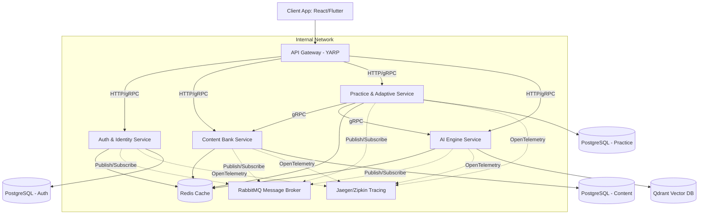

# Kế hoạch Thiết kế Kiến trúc Microservices & Clean Architecture cho V-Eval (Bản hoàn chỉnh: Multi-repo, gRPC, Redis, RabbitMQ, Audit Logging & CI/CD)

Tài liệu này đặc tả phương án phân chia dịch vụ, thiết kế giao tiếp gRPC, caching bằng Redis, RabbitMQ Event Bus và cấu trúc quản lý mã nguồn dạng **Multi-repo (GitHub Organization)** cùng các thành phần bổ trợ thiết yếu.

---

## 🗺️ Bản Đồ Đối Chiếu Nghiệp Vụ (Requirements Mapping Matrix)

Để đảm bảo hệ thống microservices phủ hết toàn bộ các luồng nghiệp vụ (Core Flows 1-6) và các vai trò (System Roles) trong đề cương Capstone, chúng ta thiết lập sơ đồ ánh xạ dưới đây:

| Nghiệp Vụ trong Đề Cương | Service Chịu Trách Nhiệm Chính | Cách Thức Triển Khai Kỹ Thuật |
| :--- | :--- | :--- |
| **Core Flow 1: Competency Diagnosis** | `Practice & Adaptive Service` | Sinh bài test chẩn đoán đầu vào. Đánh giá câu trả lời của học sinh và khởi tạo bảng hồ sơ năng lực (Learning Profile) với Mastery Score ($M = 0.5$). |
| **Core Flow 2: Personalized Path** | `Practice & Adaptive Service` | Lấy danh sách kỹ năng yếu ($M < 0.85$). Lấy cấu trúc cây năng lực từ `Content Service` (qua **gRPC**). Chạy thuật toán **Topological Sort** để sinh lộ trình ôn tập tối ưu. |
| **Core Flow 3: Adaptive Practice** | `Practice & Adaptive Service` | Chạy **Adaptive State Machine**: Học sinh làm bài -> Cập nhật Mastery Score ($M$) -> Đọc độ khó tiếp theo -> Gọi `Content Service` qua **gRPC** lấy câu hỏi tương ứng độ khó đó. |
| **Core Flow 4: AI-assisted Learning** | `AI Engine Service` (Python) | **Socratic AI Tutor**: Tích hợp LangChain/Semantic Kernel gọi API OpenAI GPT-4o-mini. Sử dụng **Qdrant Vector DB** chứa tài liệu lý thuyết (RAG Pipeline) để sinh gợi ý mở và truyền tải dạng stream qua **gRPC Server Streaming**. |
| **Core Flow 5: Learning Analytics** | `Practice & Adaptive Service` & `Auth Service` | Thu thập chỉ số (thời gian làm bài, độ đều đặn, tỷ lệ đúng). Dữ liệu analytics thường truy cập cao được cache trong **Redis** để giảm tải DB. Render biểu đồ bằng **Recharts** (React) và Flutter. |
| **Core Flow 6: Performance Prediction** | `AI Engine Service` (Train) & `Practice Service` (Run) | `AI Engine Service` huấn luyện mô hình Regression trên Python, xuất ra file `model.onnx`. `Practice Service` chạy file ONNX này để dự đoán điểm thi ĐGNL. Trạng thái và điểm dự đoán được lưu trữ tạm ở **Redis** trước khi ghi xuống PostgreSQL. |

---

## 🏗️ Phân Phối Chi Tiết Các Microservices & Công Nghệ



### 1. API Gateway (YARP)
*   **Nhiệm vụ:** Tiếp nhận HTTP/REST từ client, chuyển dịch thành gRPC/HTTP requests gửi đến các microservice bên trong.
*   **Redis Integration:** Sử dụng Redis cho Distributed Rate Limiting.
*   **Observability:** Tiêm Trace ID (X-Correlation-ID) vào tất cả incoming request đầu vào để theo vết luồng xử lý.

### 2. Auth & Identity Service (.NET Web API)
*   **Nhiệm vụ:** Đăng ký, đăng nhập (JWT, OAuth2), quản lý vai trò (RBAC) và thông tin liên kết **Parent - Student**.
*   **Redis Integration:** Lưu trữ Token Blacklist và session hoạt động của user.
*   **RabbitMQ Consumer:** Lắng nghe event `PerformanceAlertTriggeredEvent` hoặc `AttemptCompletedEvent` để gửi thông báo/email cảnh báo học tập cho phụ huynh.
*   **Audit Logging:** Log lại các hành động đổi mật khẩu, cấp quyền, liên kết phụ huynh.

### 3. Content Bank Service (.NET Web API)
*   **Nhiệm vụ:** Quản lý câu hỏi (LaTeX), cây năng lực (DAG), đề thi và tài nguyên ảnh mẫu.
*   **Redis Integration:** Cache toàn bộ cây năng lực và các câu hỏi phổ biến.
*   **RabbitMQ Publisher:** Khi Admin/Teacher thêm hoặc cập nhật câu hỏi/bài giảng lý thuyết, publish `ContentUpdatedEvent` để `AI Engine Service` tự động cập nhật Vector Database (Qdrant).

### 4. Practice & Adaptive Service (.NET Web API)
*   **Nhiệm vụ:** Quản lý bài làm (Attempts), tính điểm, cập nhật Mastery Score qua Adaptive State Machine, chạy Topological Sort sinh lộ trình, và dự đoán điểm thi bằng ONNX.
*   **Redis Integration:** Cache trạng thái làm bài tạm thời (Active Attempt State) để giảm tải ghi DB.
*   **RabbitMQ Publisher:**
    *   Khi học sinh hoàn thành bài thi thử, publish `AttemptCompletedEvent` để kích hoạt báo cáo phân tích cho phụ huynh và học sinh.
    *   Khi điểm số dự đoán của học sinh sút giảm liên tục dưới mục tiêu, publish `PerformanceAlertTriggeredEvent` gửi thông báo cho phụ huynh.

### 5. AI Engine Service (Python FastAPI)
*   **Nhiệm vụ:** RAG pipeline với Qdrant DB cho Socratic AI Tutor, huấn luyện mô hình ML và trích xuất PDF đề thi.
*   **gRPC Interface:** gRPC Server Streaming cung cấp từng token phản hồi Socratic Tutor về client.
*   **RabbitMQ Integration:**
    *   **Consumer:** Lắng nghe `ContentUpdatedEvent` để chạy script embedding nạp vào Qdrant Vector DB.
    *   **Consumer:** Lắng nghe `AttemptCompletedEvent` tích lũy dữ liệu huấn luyện để chạy huấn luyện lại mô hình dự đoán điểm số ML định kỳ.

---

## 🗄️ Kiến Trúc Mã Nguồn: Multi-repo (GitHub Organization)

Thay vì để chung code trong một Monorepo, toàn bộ dự án sẽ được tổ chức dưới dạng **GitHub Organization** với **mỗi microservice là một repository độc lập**. Điều này giúp tách biệt quyền quản lý code, đẩy nhanh quy trình build CI/CD và giảm thiểu xung đột git.

### 1. Danh sách các Repositories trên GitHub:

*   **`v-eval-gateway`**: Chứa code của API Gateway.
*   **`v-eval-identity-service`**: Chứa code của Auth & Identity Service.
*   **`v-eval-content-service`**: Chứa code của Content Bank Service.
*   **`v-eval-practice-service`**: Chứa code của Practice & Adaptive Service.
*   **`v-eval-ai-engine`**: Chứa code của AI Engine Service (Python).
*   **`v-eval-shared`**: Chứa các file định nghĩa `.proto` và DTO/Contract dùng chung (các service khác sẽ tham chiếu Repo này dưới dạng Git Submodule hoặc thông qua Private NuGet/Python Package).

### 2. Cấu trúc thư mục local khi Clone về máy phát triển:

Trên máy cục bộ, các repo được clone về chung một thư mục làm việc (ví dụ `d:\CapstoneAI`):

```text
d:\CapstoneAI\               # Thư mục gốc chứa các Repository độc lập
│
├── v-eval-gateway/          # Repository [v-eval-gateway]
│   ├── .github/workflows/   # CI/CD chạy riêng cho Gateway
│   └── src/                 # Code Gateway (YARP)
│
├── v-eval-identity-service/ # Repository [v-eval-identity-service] (Clean Architecture)
│   ├── .github/workflows/   # CI/CD chạy riêng cho Identity Service
│   └── src/
│       ├── Domain/
│       ├── Application/
│       ├── Infrastructure/
│       └── API/             # gRPC Endpoint handlers, /healthz
│
├── v-eval-content-service/  # Repository [v-eval-content-service] (Clean Architecture)
│   ├── .github/workflows/   # CI/CD chạy riêng cho Content Service
│   └── src/
│       ├── Domain/
│       ├── Application/
│       ├── Infrastructure/
│       └── API/
│
├── v-eval-practice-service/ # Repository [v-eval-practice-service] (Clean Architecture)
│   ├── .github/workflows/   # CI/CD chạy riêng cho Practice Service
│   └── src/
│       ├── Domain/
│       ├── Application/
│       ├── Infrastructure/
│       └── API/
│
├── v-eval-ai-engine/        # Repository [v-eval-ai-engine] (Python Clean Architecture)
│   ├── .github/workflows/   # CI/CD chạy riêng cho AI Engine
│   └── src/
│       ├── domain/
│       ├── application/
│       ├── infrastructure/
│       └── api/             # FastAPI / gRPC server entry point
│
└── v-eval-shared/           # Repository [v-eval-shared] (Chứa Protos & Contracts)
    └── Protos/              # Các file định nghĩa gRPC (.proto)
```

---

## 🚀 Thiết Kế CI/CD Pipelines Riêng Biệt cho Từng Repo

Vì mỗi service là một repository riêng, quy trình CI/CD sẽ nằm hoàn toàn bên trong repo đó. Chúng ta **không cần cấu hình path filtering** phức tạp nữa, vì hành động commit vào repo nào sẽ chỉ kích hoạt pipeline của repo đó.

### Luồng CI/CD trong mỗi Repo (Ví dụ: `v-eval-identity-service`):
1.  **Trigger:** Phát sinh push/pull request trên nhánh `main` của repo `v-eval-identity-service`.
2.  **Continuous Integration (CI) Workflow (`.github/workflows/ci.yml`):**
    *   Setup môi trường .NET SDK.
    *   Pull submodule `v-eval-shared` để lấy file `.proto`.
    *   Run Unit Tests & Integration Tests.
    *   Build Docker Image.
3.  **Continuous Deployment (CD) Workflow (`.github/workflows/cd.yml`):**
    *   Push Docker Image lên Azure Container Registry (ACR) với tag là commit SHA.
    *   Deploy image mới lên Azure Container Apps hoặc Kubernetes (AKS) bằng Helm/Azure CLI.

---

## 📡 Thiết Kế Giao Tiếp gRPC & Caching Redis

*   **gRPC**: Tham chiếu trực tiếp đến các file `.proto` trong repo `v-eval-shared` (được kéo về làm git submodule).
*   **Redis Caching**:
    *   *Cache-Aside*: Áp dụng tại `v-eval-content-service` (cache câu hỏi/học liệu).
    *   *Write-Behind*: Áp dụng tại `v-eval-practice-service` (cache trạng thái làm bài tạm thời của học sinh).

---

## ✉️ Hệ Thống Tin Nhắn Bất Đồng Bộ RabbitMQ (Event-Driven)

*   Sử dụng **MassTransit** trong C# và **Pika** trong Python.
*   Các Event (`AttemptCompletedEvent`, `PerformanceAlertTriggeredEvent`, `ContentUpdatedEvent`, `AuditLogCreatedEvent`) được xuất bản qua các exchange của RabbitMQ và định tuyến tới hàng đợi của các service liên quan.

---

## 🔒 Cơ Chế Audit Logging Cho Microservices

*   Khi phát sinh các hành động cần lưu vết (ghi đè đề thi, đổi mật khẩu...), service liên quan sẽ publish event `AuditLogCreatedEvent` lên RabbitMQ.
*   Một Background Worker chuyên biệt tiêu thụ event này và lưu vào DB (PostgreSQL hoặc Elasticsearch) một cách bất đồng bộ để tránh ảnh hưởng đến thời gian phản hồi API.

---

## 🩺 Microservices Essentials

1.  **Health Checks**: Endpoint `/healthz` giám sát DB, Redis, RabbitMQ.
2.  **Distributed Tracing (OpenTelemetry)**: Theo vết luồng xử lý qua Trace ID chuyển tiếp trong HTTP header, gRPC metadata và RabbitMQ message header.
3.  **Resilience**: Sử dụng **Polly** cấu hình Retry và Circuit Breaker cho gRPC client.

---

## 🛠️ Kế Hoạch Xác Minh (Verification Plan)

### Kiểm thử Tự động (Automated Tests)
1.  **GitHub Workflow Test**: Push code lên từng repo riêng biệt và kiểm tra xem chỉ workflow của repo đó chạy.
2.  **RabbitMQ Event Test**: Publish `AttemptCompletedEvent` trong môi trường Integration Test và kiểm tra các Consumer nhận được message.
3.  **Audit Logging Test**: Xác minh event log được đẩy lên RabbitMQ thành công.

### Xác minh Thủ công (Manual Verification)
*   Sử dụng **grpcurl** gọi trực tiếp các cổng gRPC để test.
*   Kiểm tra giao diện RabbitMQ Management Web Portal và Jaeger UI trong Docker Compose chạy local để xác nhận message rate và luồng trace.

---

## 📅 Trạng Thái Triển Khai Hệ Thống Thực Tế (Cập nhật 31/08/2026)

Dưới đây là bảng tổng hợp các cấu phần kiến trúc đã được triển khai, kết nối và chạy thực tế thành công:

### 1. Phân hệ Cơ sở dữ liệu (PostgreSQL & Supabase)
* **Cô lập Schema**: Đã thiết kế cấu trúc phân cấp schema `content` cô lập hoàn toàn để phục vụ lưu trữ ngân hàng câu hỏi.
* **Đồng bộ hóa Kết nối**: Thiết lập toàn bộ 3 microservice chạy database (`Content`, `Identity`, `Practice`) kết nối đồng nhất qua **Session Mode (Port 5432)** thay vì Transaction Mode để hỗ trợ quá trình chạy Migrations và Migration EF Core.
* **Migration Thành công**: Đã chạy migrations tạo thành công cấu trúc bảng gồm 7 thực thể trên cơ sở dữ liệu thực tế của Supabase.

### 2. Content Bank Service
* **Clean Architecture**: Tổ chức cấu trúc code phân lớp chuẩn chỉnh (Domain $\rightarrow$ Application $\rightarrow$ Infrastructure $\rightarrow$ API).
* **API Tích hợp**: Hoàn thành API `POST /api/content/exams/import` hỗ trợ phân loại tự động dạng bài (`suggested_skill_name`) động trên cơ sở dữ liệu.

### 3. AI Engine Service
* **API Cloud Ingestion**: Tích hợp gọi trực tiếp API Cloud với bản ổn định `gemini-2.5-flash` nhận dữ liệu raw PDF base64 trực tiếp (0 giây CPU delay cục bộ).
* **Quy trình dự phòng 3 cấp độ (Ollama Fallback)**:
  1. *Cấp 1*: Gemini 2.5 Flash Cloud (mặc định - miễn phí).
  2. *Cấp 2*: OpenAI GPT-4o-mini (dự phòng trả phí).
  3. *Cấp 3*: Local Regex PDF Parser (100% Offline fallback).
* **Progress logs**: Bổ sung in log tiến độ thời gian thực để nhà phát triển kiểm soát kết nối và thời gian phản hồi.
* **Bảo mật API Key**: Cấu hình tách biệt file `appsettings.Development.json` lưu key chạy cục bộ khỏi Git tracking, giữ `appsettings.json` nguyên bản an toàn.

### 4. Giao diện Người dùng (Frontend UI)
* **Frontend-Backend Integration**: Liên kết nút **"Lưu vào Database"** trên giao diện hiển thị đề thi của AI Engine (`view-exam.html`) gọi trực tiếp sang API của `Content Service` để hoàn tất luồng lưu trữ CSDL tự động 2 chiều.
* **Hỗ trợ LaTeX**: Render công thức toán học/khoa học sắc nét qua MathJax trên UI.
