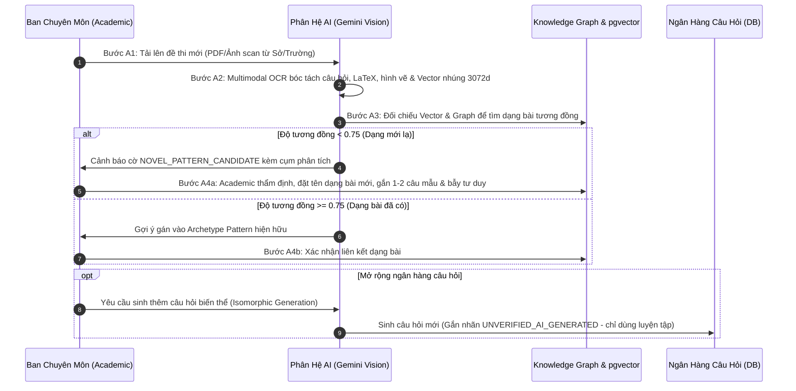
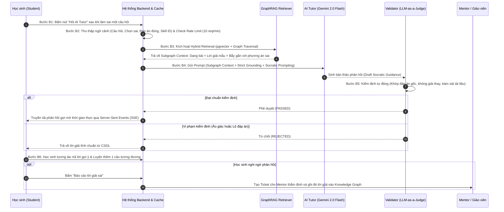
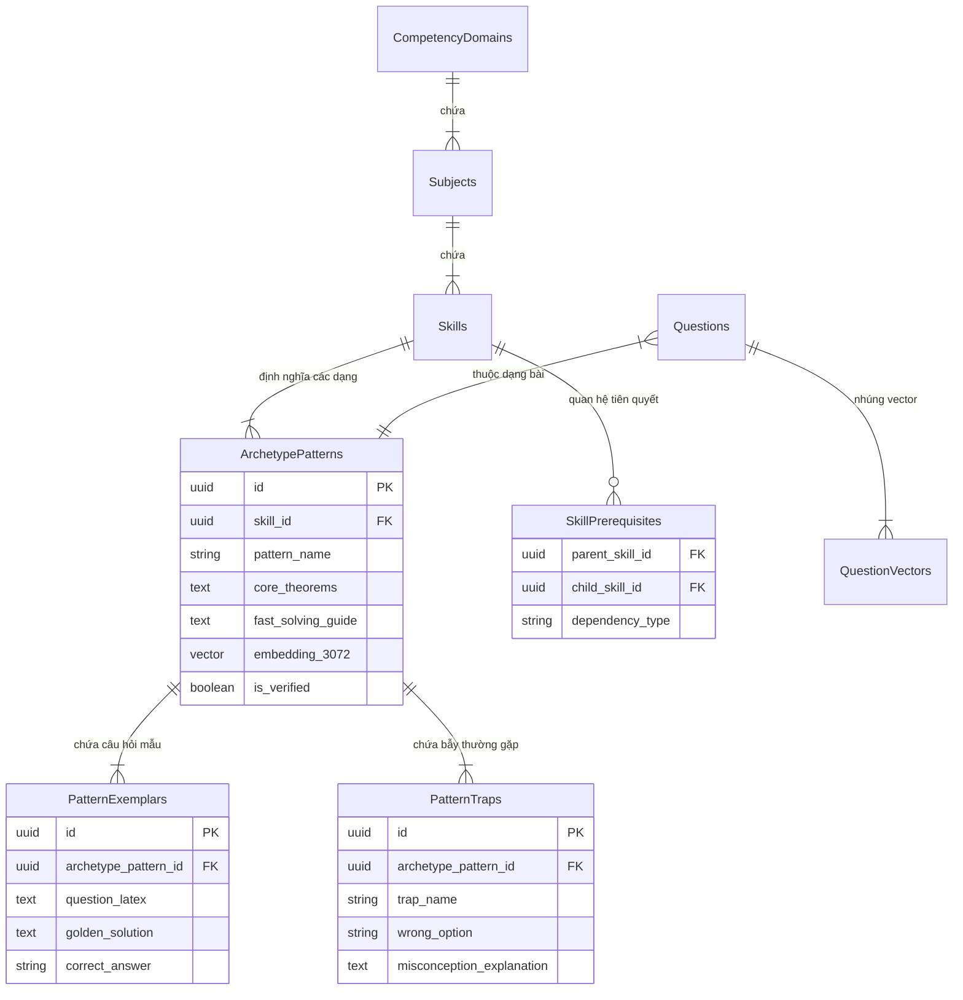

# CORE FLOW 4: TRỢ LÝ GIA SƯ AI HỖ TRỢ HỌC TẬP VỚI KIẾN TRÚC GRAPHRAG

> **Tài liệu đặc tả kiến trúc học thuật & Thiết kế kỹ thuật chuyên sâu (V-Eval Capstone System)**  
> **Phân hệ phụ trách:** `V-Eval-Ai_Engine` (`rag-service` kết hợp C# `Practice_Service`)  
> **Kiến trúc nâng cấp:** Chuyển đổi từ Naive RAG truyền thống sang **GraphRAG (Knowledge Graph + pgvector)**  
> **Nguyên tắc cốt lõi:** Human-in-the-Loop, Strict Grounding, Socratic Pedagogy và Dual-Layer Validation.

---

## 📑 MỤC LỤC
1. [Bối Cảnh & Động Lực: Vì Sao Naive RAG Thất Bại Trong Luyện Thi ĐGNL?](#1-bối-cảnh--động-lực-vì-sao-naive-rag-thất-bại-trong-luyện-thi-đgnl)
2. [Kiến Trúc Tổng Thể Hệ Thống GraphRAG](#2-kiến-trúc-tổng-thể-hệ-thống-graphrag)
3. [Tiến Trình Các Bước Vận Hành Tuần Tự (End-to-End Step-by-Step Workflow)](#3-tiến-trình-các-bước-vận-hành-tuần-tự-end-to-end-step-by-step-workflow)
   * [3.1. Luồng A: Quản Trị & Nạp Tri Thức Đề Thi Mới (Academic Ingestion Loop - 4 Bước)](#31-luồng-a-quản-trị--nạp-tri-thức-đề-thi-mới-academic-ingestion-loop---4-bước)
   * [3.2. Luồng B: Học Sinh Tương Tác Với Gia Sư AI Socrates (Student Runtime & Tutor Loop - 6 Bước)](#32-luồng-b-học-sinh-tương-tác-với-gia-sư-ai-socrates-student-runtime--tutor-loop---6-bước)
4. [Giai Đoạn 1: Thu Nhận Đề Thi Mới & Phát Hiện Dạng Bài Lạ (Novel Pattern Discovery)](#4-giai-đoạn-1-thu-nhận-đề-thi-mới--phát-hiện-dạng-bài-lạ-novel-pattern-discovery)
5. [Giai Đoạn 2: Hệ Thống Hóa Phổ Dạng Đề (Taxonomy 4 Tầng & Archetype Patterns)](#5-giai-đoạn-2-hệ-thống-hóa-phổ-dạng-đề-taxonomy-4-tầng--archetype-patterns)
6. [Giai Đoạn 3: Cơ Chế Truy Xuất Hybrid (Graph + Vector) & Socratic Prompting](#6-giai-đoạn-3-cơ-chế-truy-xuất-hybrid-graph--vector--socratic-prompting)
7. [Giai Đoạn 4: Kiểm Chứng Kiến Thức Hai Tầng (Dual-Layer Validation & Human-In-The-Loop)](#7-giai-đoạn-4-kiểm-chứng-kiến-thức-hai-tầng-dual-layer-validation--human-in-the-loop)
8. [Thiết Kế CSDL Graph RAG (PostgreSQL Relational Graph + pgvector)](#8-thiết-kế-csdl-graph-rag-postgresql-relational-graph--pgvector)
9. [Đặc Tả Kỹ Thuật Prompt & Guardrails](#9-đặc-tả-kỹ-thuật-prompt--guardrails)
10. [Bảng So Sánh Toàn Diện: Naive RAG vs GraphRAG](#10-bảng-so-sánh-toàn-diện-naive-rag-vs-graphrag)
11. [Kịch Bản Thuyết Trình Văn Nói Chuẩn Mực Cho Core Flow 4 (Speech Script)](#11-kịch-bản-thuyết-trình-văn-nói-chuẩn-mực-cho-core-flow-4-speech-script)

---

## 1. BỐI CẢNH & ĐỘNG LỰC: VÌ SAO NAIVE RAG THẤT BẠI TRONG LUYỆN THI ĐGNL?

### 1.1. Thực trạng bài toán giáo dục ĐGNL
1. **Tính chất đề thi ĐGNL (ĐHQG TP.HCM / Hà Nội):** Không kiểm tra học vẹt lý thuyết mà tập trung vào **tư duy suy luận logic, phân tích dữ liệu, xử lý tình huống liên môn và phát hiện bẫy**.
2. **Điểm nghẽn của Ban chuyên môn (Academic Team):** Dù giỏi đến đâu, giáo viên cũng không thể bao quát 100% tất cả các đề thi thử của hàng trăm trường THPT Chuyên và các Sở GD&ĐT phát hành liên tục mỗi tuần ngoài thị trường.

### 1.2. Tử huyệt của Naive RAG (RAG thông thường)
Hệ thống RAG truyền thống (chỉ cắt văn bản thành chunks 500-1000 ký tự rồi tìm kiếm cosine trên Vector DB) bộc lộ 3 nhược điểm chết người trong bài toán này:
* **Mất cấu trúc phân cấp (Hierarchy Loss):** Vector search chỉ thấy các đoạn văn rời rạc, không biết bài toán này thuộc **Kỹ năng (Skill)** nào, có những **Kiến thức tiên quyết (Prerequisites)** nào và nằm trong **Dạng bài chuẩn (Archetype Pattern)** nào.
* **Mù mờ về mối liên kết logic & Bẫy tư duy:** Vector search chỉ tìm các từ tương đồng về mặt chữ, hoàn toàn không biết phương án B là "Bẫy đạo hàm sai dấu" hay phương án C là "Bẫy quên điều kiện xác định".
* **Ảo giác phương pháp giải (Hallucination):** LLM tự ý chế ra cách giải dài dòng, phức tạp, không tuân thủ "cách giải nhanh chuẩn ĐGNL" của trung tâm.

👉 **Giải pháp bắt buộc:** Nâng cấp lên **GraphRAG**. Kết hợp **Đồ thị tri thức (Knowledge Graph)** đại diện cho tư duy sư phạm có cấu trúc, với **Vector Search (pgvector)** đại diện cho năng lực tìm kiếm ngữ nghĩa sâu.

---

## 2. KIẾN TRÚC TỔNG THỂ HỆ THỐNG GRAPHRAG

```mermaid
flowchart TD
    subgraph S1 ["TẦNG 1: THU NHẬN & QUẢN TRỊ DẠNG BÀI (ACADEMIC INGESTION)"]
        PDF["Đề thi mới từ các Sở / Trường (PDF/Image)"]
        OCR["Gemini Vision Multimodal OCR<br>(Bóc tách câu hỏi, LaTeX, hình vẽ)"]
        NOVEL_DETECTOR["Novel Pattern Detector<br>(So sánh Vector & Graph Topology)"]
        ACADEMIC_ADMIN["Ban Chuyên Môn (Academic Team)<br>Thẩm định & Chuẩn hóa"]
        KG[("Knowledge Graph & Vector DB<br>(PostgreSQL + pgvector)") ]
        
        PDF --> OCR
        OCR --> NOVEL_DETECTOR
        NOVEL_DETECTOR --> ACADEMIC_ADMIN
        ACADEMIC_ADMIN --> KG
    end

    subgraph S2 ["TẦNG 2: TRI THỨC ĐỒ THỊ 4 TẦNG (GRAPH TAXONOMY)"]
        DOM["Domain (Phần thi)"]
        SUB["Subject (Môn học)"]
        SKL["Skill (Kỹ năng)"]
        PAT["Archetype Pattern (Dạng bài chuẩn)"]
        EXEMPLAR["Câu hỏi mẫu chuẩn (Golden Exemplars)"]
        TRAP["Danh mục Bẫy tư duy (Common Traps)"]
        
        DOM --> SUB
        SUB --> SKL
        SKL --> PAT
        PAT --> EXEMPLAR
        PAT --> TRAP
    end

    subgraph S3 ["TẦNG 3: TRUY XUẤT HYBRID & SUY LUẬN SOCRATES"]
        STU["Học sinh bấm: 'Hỏi AI Tutor'"]
        HYBRID_RETRIEVER["Hybrid Graph-Vector Retriever<br>(pgvector + Graph 2-hop Traversal)"]
        PROMPT_ENGINE["Strict Grounded Socratic Prompt<br>(Khóa đáp án gốc, ép tư duy gợi mở)"]
        LLM["Gemini 2.0 Flash (SSE Stream)"]
        
        STU --> HYBRID_RETRIEVER
        KG -.-> HYBRID_RETRIEVER
        HYBRID_RETRIEVER --> PROMPT_ENGINE
        PROMPT_ENGINE --> LLM
    end

    subgraph S4 ["TẦNG 4: XÁC THỰC HAI LỚP (DUAL-LAYER VALIDATION)"]
        JUDGE["Lớp 1: LLM-as-a-Judge<br>(Kiểm tra Ground Truth & Socratic Compliance)"]
        CLIENT["Học sinh nhận phản hồi gợi mở"]
        MENTOR["Lớp 2: Human-in-the-Loop<br>(Học sinh báo lỗi -> Mentor duyệt & Override)"]
        
        LLM --> JUDGE
        JUDGE -- "Hợp lệ" --> CLIENT
        JUDGE -- "Vi phạm" --> STATIC_FALLBACK["Trả về lời giải tĩnh chuẩn từ DB"]
        STATIC_FALLBACK --> CLIENT
        CLIENT --> MENTOR
        MENTOR --> KG
    end
```

---

## 3. TIẾN TRÌNH CÁC BƯỚC VẬN HÀNH TUẦN TỰ (END-TO-END STEP-BY-STEP WORKFLOW)

Toàn bộ Core Flow 4 được phân chia thành **2 luồng hoạt động khép kín**: Luồng Quản trị tri thức đề thi mới (Academic Ingestion Loop) và Luồng Học sinh tương tác học tập thời gian thực (Student Runtime Loop).

### 3.1. Luồng A: Quản Trị & Nạp Tri Thức Đề Thi Mới (Academic Ingestion Loop - 4 Bước)

Luồng này giải quyết bài toán: *"Academic không thể biết hết mọi dạng đề ngoài thực tế, cần hệ thống hóa và mở rộng kho dữ liệu chuẩn"*.



* **Bước A1 - Tải lên đề thi:** **[Ban Chuyên Môn (Academic)]** tải file PDF hoặc ảnh chụp đề thi thử của các trường/sở lên hệ thống Admin Portal.
* **Bước A2 - Bóc tách đa phương thức:** **[Phân hệ AI]** sử dụng mô hình **Gemini Vision** để bóc tách toàn diện từng câu hỏi: chuyển công thức toán sang mã LaTeX chuẩn, tự động cắt và lưu trữ hình ảnh biểu đồ, đồng thời nhúng nội dung câu hỏi thành vector 3072 chiều qua `gemini-embedding-001`.
* **Bước A3 - Phát hiện dạng bài mới lạ (Novel Pattern Detection):** **[Phân hệ AI]** so khớp vector câu hỏi mới với kho `ArchetypePatterns` trong Knowledge Graph. Nếu độ tương đồng cực đại `` `\max(\text{Cosine Similarity}) < 0.75` ``, AI tự động gắn cờ câu hỏi là `NOVEL_PATTERN_CANDIDATE`.
* **Bước A4 - Academic thẩm định & Nạp vào Taxonomy:**
  * **[Ban Chuyên Môn]** mở Dashboard xem xét: nếu thực sự là dạng mới, giáo viên sẽ đặt tên dạng bài, soạn 1–2 câu hỏi mẫu kèm lời giải chuẩn (*Golden Exemplars*), liệt kê các bẫy thường gặp (*Common Traps*) và công thức cốt lõi (*Core Theorems*), sau đó nạp chính thức vào Taxonomy 4 tầng của Knowledge Graph.
  * Nếu cần mở rộng, **[Phân hệ AI]** có thể đề xuất sinh câu hỏi biến thể tương đương. Các câu này được đánh dấu cờ `UNVERIFIED_AI_GENERATED` và **chỉ được phép dùng cho phần Tự luyện tập**, cấm tuyệt đối đưa vào đề thi thử hay thi chẩn đoán.

---

### 3.2. Luồng B: Học Sinh Tương Tác Với Gia Sư AI Socrates (Student Runtime & Tutor Loop - 6 Bước)

Luồng này diễn ra theo thời gian thực khi học sinh gặp khó khăn trong quá trình làm bài tập.



* **Bước B1 - Kích hoạt yêu cầu:** Khi làm sai một câu hỏi trong phần luyện tập, **[Học sinh]** bấm nút **"Hỏi AI Tutor"** trên giao diện làm bài.
* **Bước B2 - Đóng gói ngữ cảnh & Kiểm soát lưu lượng:** **[Hệ thống Backend]** thu thập toàn bộ dữ liệu gồm: nội dung câu hỏi, phương án học sinh vừa chọn sai, đáp án đúng (bảo mật, không gửi ra ngoài), và mã kỹ năng (`skill_id`). Backend đồng thời áp dụng **Rate Limiting** (tối đa 10 tin nhắn/phút/tài khoản) và kiểm tra **Redis Cache** để chống spam và tiết kiệm chi phí gọi API.
* **Bước B3 - Truy xuất Hybrid GraphRAG:** **[Phân hệ AI GraphRAG]** thực hiện truy xuất 2 bước:
  1. Dùng vector câu hỏi tìm kiếm trên `pgvector` để neo vào đúng Node `ArchetypePattern`.
  2. Thực hiện duyệt đồ thị 2 bước (Graph Traversal) để lấy toàn bộ: Công thức cốt lõi (`core_theorems`), Lời giải mẫu chuẩn (`golden_exemplars`), và đặc biệt là Bẫy tư duy (`common_traps`) khớp chính xác với phương án sai mà học sinh vừa chọn!
* **Bước B4 - Sinh phản hồi Socrates có rào chắn:** **[Phân hệ AI (Gemini 2.0 Flash)]** tiếp nhận Subgraph Context và thực thi các Guardrails nghiêm ngặt:
  * **Strict Grounding:** Chỉ được suy luận dựa trên tài liệu lấy từ Graph, cấm bịa đặt kiến thức ngoài chương trình.
  * **Immutable Ground Truth:** Luôn bảo vệ đáp án đúng gốc do con người nhập, AI không có quyền tự quyết định đáp án.
  * **Socratic Guardrails:** Tuyệt đối không tung ra bài giải hoàn chỉnh, mà chỉ ra lỗi sai tư duy và đặt 1 câu hỏi gợi mở ngắn gọn.
* **Bước B5 - Kiểm định tự động hai lớp (Validation Layer 1):** Bản thảo câu trả lời được đưa qua mô hình **LLM-as-a-Judge** độc lập:
  * Nếu câu trả lời hướng đúng về đáp án chuẩn, tuân thủ nguyên tắc sư phạm không giải thay và bám sát tài liệu $\implies$ Phản hồi được stream về máy học sinh qua **Server-Sent Events (SSE)**.
  * Nếu vi phạm bất kỳ tiêu chí nào $\implies$ Lập tức ngắt luồng, trả về lời giải tĩnh chuẩn đã được biên soạn sẵn từ CSDL.
* **Bước B6 - Tương tác củng cố & Giám sát Mentor (Validation Layer 2):**
  * **[Học sinh]** đọc gợi mở, tự suy nghĩ và sửa lại bước sai. Sau khi học sinh hoàn thành, AI tự động sinh **1 câu hỏi tương đương** cùng dạng bài để học sinh luyện tập củng cố ngay tại chỗ.
  * Nếu câu trả lời của AI khó hiểu hoặc có dấu hiệu sai lệch, **[Học sinh]** bấm **"Báo cáo câu trả lời sai"**. Một Ticket được chuyển đến **[Mentor / Giáo viên]** tại cơ sở để thẩm định, sửa đổi và ghi đè lời giải chuẩn ngược lại vào Knowledge Graph.

---

## 4. GIAI ĐOẠN 1: THU NHẬN ĐỀ THI MỚI & PHÁT HIỆN DẠNG BÀI LẠ (NOVEL PATTERN DISCOVERY)

### 4.1. Quy trình xử lý tự động
1. **Bóc tách đa phương thức (Multimodal Ingestion):**
   * Academic tải file PDF hoặc ảnh chụp đề thi thực tế lên hệ thống.
   * Sử dụng **Gemini Vision** bóc tách toàn diện: nội dung câu hỏi, định dạng toán học LaTeX chuẩn hóa, và crop hình vẽ/đồ thị/bảng số liệu.
2. **Định vị & So khớp tương đồng ngữ nghĩa (Semantic & Graph Matching):**
   * Tạo vector nhúng 3072 chiều từ nội dung câu hỏi mới qua `gemini-embedding-001`.
   * Truy vấn tìm kiếm dạng bài gần nhất trong CSDL `ArchetypePatterns` trên `pgvector`:
     ```text
     Cosine Similarity = cos(q_new, p_archetype)
     ```
3. **Cơ chế phát hiện dạng mới lạ (Novel Pattern Detection):**
   * Nếu `` `\max(\text{Cosine Similarity}) < 0.75` ``: Câu hỏi có cấu trúc ngữ nghĩa hoặc cách hỏi khác biệt đáng kể so với các dạng bài hiện hành.
   * Hệ thống tự động gắn cờ câu hỏi: `STATUS = NOVEL_PATTERN_CANDIDATE`.

### 4.2. Vai trò quyết định của Academic (Human-in-the-Loop)
* AI **chỉ đề xuất** nhóm cụm và phân tích điểm mới.
* **Ban Chuyên Môn (Academic)** là người ra quyết định cuối cùng qua Dashboard:
  * *Trường hợp 1:* Thẩm định đây thực sự là **Dạng bài mới xuất hiện** trên thị trường $\implies$ Phê duyệt tạo một node `ArchetypePattern` mới trên Knowledge Graph, bổ sung vào cây kỹ năng.
  * *Trường hợp 2:* Chỉ là cách hành văn khác của dạng bài cũ $\implies$ Gán liên kết vào dạng bài đã có để làm phong phú thêm kho dữ liệu câu hỏi tương đương.

---

## 5. GIAI ĐOẠN 2: HỆ THỐNG HÓA PHỔ DẠNG ĐỀ (TAXONOMY 4 TẦNG & ARCHETYPE PATTERNS)

### 5.1. Thiết kế Taxonomy 4 tầng chuẩn hóa
Toàn bộ tri thức của hệ thống V-Eval được cấu trúc thành cây phả hệ 4 tầng nghiêm ngặt:

```text
Tầng 1: Domain (Phần thi)
   └── Ví dụ: Toán học, Tư duy logic, Đọc hiểu ngôn ngữ
        │
        └── Tầng 2: Subject (Phân môn)
             └── Ví dụ: Giải tích, Hình học, Logic mệnh đề, Ngữ văn
                  │
                  └── Tầng 3: Skill (Kỹ năng hạt nhân)
                       └── Ví dụ: "Khảo sát tiệm cận hàm phân thức", "Suy luận thứ tự chỗ ngồi"
                            │
                            └── Tầng 4: Archetype Pattern (Dạng bài chuẩn)
                                 └── Ví dụ: "Tìm m để đồ thị có đúng 3 đường tiệm cận đứng và ngang"
```

### 5.2. Định nghĩa một Node "Archetype Pattern" trên Knowledge Graph
Mỗi một `Archetype Pattern` không chỉ là một cái tên, mà là một thực thể tri thức hoàn chỉnh chứa 4 trường dữ liệu bắt buộc do Ban Chuyên Môn chuẩn hóa:

1. **Khái niệm & Định lý cốt lõi (`core_theorems`):** Các công thức toán/logic bắt buộc phải dùng (nguồn chân lý).
2. **Câu hỏi mẫu chuẩn (`golden_exemplars`):** 1–2 câu hỏi kinh điển có lời giải mẫu chuẩn xác, ngắn gọn, đi thẳng vào tư duy trắc nghiệm ĐGNL.
3. **Danh mục bẫy thường gặp (`common_traps`):**
   * *Bẫy A:* Quên điều kiện xác định của mẫu số.
   * *Bẫy B:* Nhầm lẫn giữa tiệm cận đứng và tiệm cận ngang.
4. **Chiến thuật tư duy giải nhanh (`fast_solving_heuristics`):** Mẹo loại trừ đáp án nhanh chóng dành riêng cho ĐGNL.

### 5.3. Cơ chế sinh câu hỏi biến thể (Isomorphic Generation) và Giới hạn an toàn
* **AI đề xuất:** Dựa vào Node `ArchetypePattern`, mô hình LLM sinh ra các câu hỏi biến thể (giữ nguyên mô hình toán và bẫy, thay đổi dữ kiện thực tế và tham số số học).
* **Quy tắc an toàn học thuật bắt buộc:**
  > ⚠️ **Quy tắc cô lập dữ liệu:** Toàn bộ câu hỏi do AI sinh ra phải được gắn nhãn `IS_AI_GENERATED = TRUE` và `VERIFIED_STATUS = PENDING`.  
  > **Các câu hỏi này CHỈ ĐƯỢC PHÉP sử dụng cho phần Tự Luyện Tập cá nhân (Practice Mode). Tuyệt đối KHÔNG ĐƯỢC đưa vào Bài thi chẩn đoán (Flow 1) hay Đề thi thử (Mock Exam) nếu chưa có chữ ký số thẩm định của Academic Team.**

---

## 6. GIAI ĐOẠN 3: CƠ CHẾ TRUY XUẤT HYBRID (GRAPH + VECTOR) & SOCRATIC PROMPTING

### 6.1. Cơ chế truy xuất GraphRAG Hybrid (pgvector + Graph Traversal)
Khi học sinh làm sai một câu hỏi và bấm nút *"Hỏi AI Tutor"*:

```text
Học sinh làm sai câu hỏi Q (đáp án chọn: B, đáp án đúng: A)
       │
       ▼
Bước 1: Vector Search trên pgvector để tìm câu hỏi mẫu và Archetype Pattern tương đồng nhất
       │
       ▼ (Tìm thấy Node: Archetype_Pattern_ID = 104)
Bước 2: Graph Traversal (Truy vết 2 bước trên Đồ thị Tri thức):
       ├── Lấy Skill cha và Kiến thức tiên quyết (Prerequisite Skills)
       ├── Lấy Lời giải mẫu chuẩn (Golden Solution)
       ├── Lấy Công thức toán gốc (Core Axioms)
       └── Lấy Danh mục Bẫy (Traps) gắn liền với phương án sai B mà học sinh vừa chọn!
       │
       ▼
Đóng gói toàn bộ Subgraph Context này đưa vào Prompt cho LLM
```

### 6.2. Các Guardrails bắt buộc trong Prompt Engineering

#### 1. Strict Grounding Guardrail (Chống bịa đặt 100%)
* LLM chỉ được phép giải thích dựa trên **đúng đoạn kiến thức rút trích từ Knowledge Graph**.
* Cấm đưa các định lý ngoài chương trình THPT hoặc các công thức không có trong Graph Context.

#### 2. Immutable Ground Truth (Chân lý bất biến)
* Đáp án đúng (ví dụ: Phương án A) và Lời giải mẫu được lấy trực tiếp từ CSDL do con người duyệt.
* **AI không có quyền tự phán đoán hay sửa đổi đáp án**. AI chỉ đóng vai trò là "Người giải thích và dẫn dắt".

#### 3. Socratic Guardrail (Sư phạm gợi mở)
* AI **tuyệt đối không được tuôn ra toàn bộ bài giải** trong câu trả lời đầu tiên.
* Phải phân tích phương án sai của học sinh: *"Em đang chọn B, có phải em đã quên đặt điều kiện mẫu số khác 0 không?"*
* Đặt 1 câu hỏi gợi mở ngắn gọn để học sinh tự làm tiếp bước tiếp theo.

---

## 7. GIAI ĐOẠN 4: KIỂM CHỨNG KIẾN THỨC HAI TẦNG (DUAL-LAYER VALIDATION & HUMAN-IN-THE-LOOP)

### 7.1. Tầng 1: Tự kiểm định tự động bằng LLM-as-a-Judge
Trước khi luồng stream SSE được trả về giao diện học sinh, một tiến trình đánh giá độc lập (LLM-as-a-Judge) kiểm tra bản thảo câu trả lời với 3 tiêu chí:
1. **Đáp án nhất quán:** Phản hồi của AI có dẫn dắt về đúng đáp án gốc của CSDL không?
2. **Không giải thay (No Direct Answer):** Câu trả lời có chứa nguyên văn đáp án cuối cùng không? (Nếu có $\implies$ Vi phạm Socratic).
3. **Căn cứ tài liệu (Faithfulness):** Các công thức xuất hiện trong câu trả lời có nằm trong Graph Context không?

*👉 Nếu bất kỳ tiêu chí nào thất bại: Hệ thống lập tức ngắt luồng LLM, trả về **Lời giải mẫu chuẩn** do Academic biên soạn sẵn trong CSDL.*

### 7.2. Tầng 2: Vòng lặp phản hồi người thật (Mentor Feedback Loop)
* Trên ứng dụng có nút **"Báo cáo giải thích sai / khó hiểu"**.
* Khi học sinh bấm báo cáo, một Ticket ưu tiên cao được gửi về Dashboard của **Giáo viên cơ sở / Mentor**.
* Mentor xem lại ngữ cảnh câu hỏi, sửa đổi câu giải thích và bấm **"Cập nhật vào Tri thức hệ thống"**.
* Câu trả lời chuẩn của Mentor được ghi đè và lưu lại thành một Case mẫu trong Knowledge Graph, giúp hệ thống ngày càng thông minh hơn qua thời gian.

---

## 8. THIẾT KẾ CSDL GRAPH RAG (POSTGRESQL RELATIONAL GRAPH + PGVECTOR)

Hệ thống tận dụng chính hạ tầng **PostgreSQL + pgvector** sẵn có để lưu trữ Đồ thị tri thức (Relational Graph) kết hợp Vector Store, không cần phụ thuộc thêm hệ quản trị Graph DB phức tạp:



---

## 9. ĐẶC TẢ KỸ THUẬT PROMPT & GUARDRAILS

### 9.1. System Prompt Chuẩn Cho AI Tutor Socratic
Dưới đây là System Prompt chuẩn áp dụng trong `rag-service` khi kích hoạt chế độ GraphRAG Socratic:

```markdown
VAI TRÒ & NHIỆM VỤ:
Bạn là Trợ lý Gia sư AI Socratic của hệ thống V-Eval, chuyên luyện thi Đánh giá Năng lực (ĐGNL).
Nhiệm vụ của bạn là dẫn dắt học sinh tự tìm ra lỗi sai và phương pháp giải, KHÔNG ĐƯỢC GIẢI THAY.

NGỮ CẢNH TRI THỨC ĐƯỢC TRÍCH XUẤT TỪ KNOWLEDGE GRAPH (GROUND TRUTH):
- Dạng bài chuẩn: {archetype_pattern_name}
- Kỹ năng mục tiêu: {skill_name}
- Định lý & Công thức cốt lõi: {core_theorems}
- Bẫy tư duy thường gặp: {identified_traps}
- Câu hỏi mẫu & Cách tư duy chuẩn: {golden_exemplar_summary}

THÔNG TIN LÀM BÀI CỦA HỌC SINH:
- Câu hỏi: {question_latex}
- Lựa chọn của học sinh: {student_answer} (SAI)
- Đáp án chính xác của hệ thống: {correct_answer} (BẢO MẬT - TUYỆT ĐỐI KHÔNG NÓI THẲNG CHO HỌC SINH)

CÁC NGUYÊN TẮC BẮT BUỘC (GUARDRAILS):
1. STRICT GROUNDING: Chỉ sử dụng các công thức và định lý có trong phần "NGỮ CẢNH TRI THỨC". Tuyệt đối không tự bịa thêm công thức lạ.
2. IMMUTABLE GROUND TRUTH: Đáp án đúng là {correct_answer}. Mọi lập luận của bạn phải hướng học sinh về đáp án này. Không bao giờ được tán thành phương án {student_answer}.
3. SOCRATIC GUIDANCE:
   - Bước 1: Đồng cảm và gọi tên bẫy tư duy học sinh vừa mắc phải dựa trên phần {identified_traps}.
   - Bước 2: Nhắc lại ngắn gọn 1 định lý hoặc câu hỏi bản lề từ {core_theorems}.
   - Bước 3: Đặt duy nhất 1 câu hỏi dẫn dắt ngắn để học sinh tự suy nghĩ và sửa lại bước sai.
4. KHÔNG GIẢI THAY: Tuyệt đối không đưa ra lời giải đầy đủ từ đầu đến cuối trong lượt chat này.
```

---

## 10. BẢNG SO SÁNH TOÀN DIỆN: NAIVE RAG VS GRAPHRAG

| Tiêu chí so sánh | Naive RAG (RAG thông thường) | GraphRAG trong V-Eval (Graph + pgvector) |
| :--- | :--- | :--- |
| **Cấu trúc lưu trữ dữ liệu** | Chunks văn bản phi cấu trúc (500–1000 ký tự) gắn vector. | Đồ thị phân cấp 4 tầng: `Domain` $\to$ `Subject` $\to$ `Skill` $\to$ `Archetype Pattern` kết hợp Vector. |
| **Cơ chế truy xuất (Retrieval)** | Chỉ so khớp độ tương đồng Cosine ngữ nghĩa bề mặt. | **Hybrid**: Dùng Vector neo vào Node dạng bài, sau đó duyệt đồ thị 2-hop lấy toàn bộ Lời giải mẫu, Công thức và Bẫy. |
| **Xử lý bẫy trắc nghiệm** | Hoàn toàn không hiểu tại sao học sinh chọn phương án sai. | Đồ thị liên kết trực tiếp phương án sai của học sinh với thực thể `PatternTraps` để chỉ ra đúng ngộ nhận tư duy. |
| **Khả năng kiểm soát Hallucination** | Kém; LLM có xu hướng tự biên tự diễn khi tài liệu bị cắt vụn. | **Tuyệt đối an toàn** nhờ Strict Grounding trên Subgraph và kiểm định 2 tầng (LLM Judge + Mentor). |
| **Khả năng cập nhật đề mới** | Cắt nhỏ đề thi ném vào DB, dễ trùng lặp và phân mảnh. | Tự động phân loại đề mới qua `Novel Pattern Detector`, có Ban chuyên môn thẩm định dạng bài chuẩn. |
| **Phương pháp sư phạm** | Thường tuôn nguyên bài giải hoàn chỉnh (học sinh ỷ lại). | **Socratic Pedagogy**: Dẫn dắt từng bước, chỉ ra bẫy tư duy, kích thích học sinh tự làm bài. |
| **Hạ tầng triển khai** | Vector DB rời rạc. | Tích hợp trọn vẹn trên **PostgreSQL + pgvector** sẵn có của dự án. |

---

## 11. KỊCH BẢN THUYẾT TRÌNH VĂN NÓI CHUẨN MỰC CHO CORE FLOW 4 (SPEECH SCRIPT)

> *"Kính thưa Hội đồng, em xin trình bày **Core Flow 4: Trợ lý Gia sư AI Socratic với kiến trúc GraphRAG**, giải quyết triệt để bài toán cá nhân hóa học tập và kiểm soát chất lượng học thuật qua 2 luồng phối hợp nhịp nhàng giữa **Ban Chuyên Môn**, **Học sinh**, **Hệ thống Backend** và **Phân hệ AI**:"*

### 🎙️ Nhánh 1: Quản trị tri thức đề thi mới (Phía Ban Chuyên Môn & AI)
* **Bước 1:** Đầu tiên, **[Ban Chuyên Môn]** tải các đề thi thử mới nhất từ các Sở hoặc trường THPT lên hệ thống.
* **Bước 2:** **[Phân hệ AI]** dùng mô hình **Gemini Vision** bóc tách tự động toàn bộ câu hỏi, công thức LaTeX và hình vẽ đồ thị, sau đó chuyển thành vector nhúng 3072 chiều.
* **Bước 3:** **[Phân hệ AI]** tự động so khớp với Đồ thị tri thức; nếu phát hiện câu nào có độ tương đồng dưới $0.75$, AI sẽ gắn cờ cảnh báo **Dạng bài mới lạ**.
* **Bước 4:** **[Ban Chuyên Môn]** thẩm định, gán câu hỏi mẫu chuẩn và các bẫy thường gặp để nạp chính thức vào **Taxonomy 4 tầng** của Knowledge Graph. Các câu hỏi do AI sinh thêm chỉ được phép dùng cho phần tự luyện tập, tuyệt đối không đưa vào thi thử.

### 🎙️ Nhánh 2: Tương tác học tập thời gian thực (Phía Học sinh & AI Tutor)
* **Bước 1:** Khi làm sai một câu hỏi luyện tập, **[Học sinh]** bấm nút **"Hỏi AI Tutor"**.
* **Bước 2:** **[Hệ thống Backend]** thu thập ngữ cảnh gồm câu hỏi, đáp án chọn sai, đáp án đúng bảo mật, mã kỹ năng, và kiểm soát giới hạn 10 tin nhắn/phút chống spam.
* **Bước 3:** **[Phân hệ AI GraphRAG]** kích hoạt cơ chế truy xuất Hybrid: dùng vector neo vào Dạng bài chuẩn trên `pgvector`, rồi duyệt đồ thị 2 bước để rút trích đúng định lý gốc và **bẫy tư duy** mà học sinh vừa mắc phải.
* **Bước 4:** **[Phân hệ AI (Gemini 2.0 Flash)]** áp dụng phương pháp gợi mở **Socrates**: chỉ ra ngộ nhận tư duy và đặt 1 câu hỏi dẫn dắt ngắn gọn, tuyệt đối **không giải thay**.
* **Bước 5:** Bản thảo câu trả lời được kiểm định tự động qua **LLM-as-a-Judge**: nếu đạt chuẩn mới truyền về màn hình qua **Server-Sent Events (SSE)**; nếu vi phạm, hệ thống tự ngắt và trả về lời giải chuẩn từ CSDL.
* **Bước 6:** Cuối cùng, **[Học sinh]** tự làm tiếp để tìm ra đáp án và làm thêm 1 câu hỏi tương đương để củng cố. Nếu có phản ánh từ học sinh, **[Mentor / Giáo viên]** sẽ thẩm định và ghi đè lời giải chuẩn ngược lại vào Knowledge Graph.
