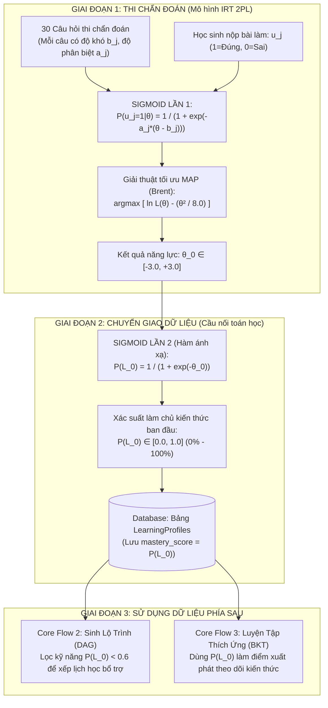

# VAI TRÒ VÀ SỰ KHÁC BIỆT CỦA HÀM SIGMOID TRONG MÔ HÌNH IRT VÀ BKT

> **Tài liệu học thuật & Bản chất toán học dành cho Dự án V-Eval**  
> **Áp dụng:** Core Flow 1 (Chẩn đoán năng lực ban đầu) kết nối Core Flow 2 & 3 (Lập lộ trình & Luyện tập thích ứng)  
> **Mục tiêu:** Làm sáng tỏ bản chất của 2 lần xuất hiện hàm Sigmoid, cơ chế chuyển tiếp dữ liệu giữa IRT và BKT.

---

## 📑 MỤC LỤC
1. [Đặt Vấn Đề: Nghịch Lý Hai Lần Xuất Hiện Chữ "Sigmoid"](#1-đặt-vấn-đề-nghịch-lý-hai-lần-xuất-hiện-chữ-sigmoid)
2. [Sigmoid Lần 1: Trái Tim Của Mô Hình IRT 2PL (Cấp Độ Từng Câu Hỏi)](#2-sigmoid-lần-1-trái-tim-của-mô-hình-irt-2pl-cấp-độ-từng-câu-hỏi)
3. [Sigmoid Lần 2: Cầu Nối Chuẩn Hóa Sang BKT (Cấp Độ Hồ Sơ Học Sinh)](#3-sigmoid-lần-2-cầu-nối-chuẩn-hóa-sang-bkt-cấp-độ-hồ-sơ-học-sinh)
4. [Sơ Đồ Dòng Chảy Chuyển Tiếp Dữ Liệu](#4-sơ-đồ-dòng-chảy-chuyển-tiếp-dữ-liệu)
5. [Bảng So Sánh Chi Tiết Hai Lần Dùng Sigmoid](#5-bảng-so-sánh-chi-tiết-hai-lần-dùng-sigmoid)
6. [Kịch Bản Trả Lời Phản Biện Hội Đồng / Giảng Viên](#6-kịch-bản-trả-lời-phản-biện-hội-đồng--giảng-viên)

---

## 1. ĐẶT VẤN ĐỀ: NGHỊCH LÝ HAI LẦN XUẤT HIỆN CHỮ "SIGMOID"

Trong tài liệu kiến trúc và kịch bản trình bày của **Core Flow 1**, nhiều người thường thắc mắc:

> *"Tại sao vừa nói IRT 2PL là một hàm Sigmoid, ngay sau đó lại nói: 'Lấy điểm `` `\theta_0` `` ép qua hàm Sigmoid để tạo giá trị tiên nghiệm `` `P(L_0)` `` cho mô hình BKT'? Phải chăng hệ thống đang dùng trùng lặp hay có sự nhầm lẫn?"*

Câu trả lời là: **Hoàn toàn KHÔNG nhầm lẫn**. Cùng mang tên toán học là hàm Sigmoid (dạng chữ S: `` `S(z) = \frac{1}{1 + e^{-z}}` ``), nhưng trong hệ thống V-Eval, hàm Sigmoid xuất hiện ở **2 giai đoạn độc lập**, phục vụ **2 bài toán hoàn toàn khác nhau** và nhận vào **2 tập tham số khác biệt**.

---

## 2. SIGMOID LẦN 1: TRÁI TIM CỦA MÔ HÌNH IRT 2PL (CẤP ĐỘ TỪNG CÂU HỎI)

### 2.1. Bối cảnh áp dụng
Diễn ra **TRONG SUỐT QUÁ TRÌNH THI VÀ CHẤM ĐIỂM CHẨN ĐOÁN**.  
Mô hình trắc nghiệm học IRT 2PL (Item Response Theory 2-Parameter Logistic) cần mô tả mối quan hệ giữa năng lực tiềm ẩn của học sinh với khả năng trả lời đúng của một câu hỏi cụ thể.

### 2.2. Công thức toán học
Đối với câu hỏi thứ `` `j` ``:
```text
                          1
P(u_j = 1 | θ) = ─────────────────────
                 1 + exp(-a_j * (θ - b_j))
```

Trong đó:
* `` `θ` ``: Năng lực tiềm ẩn của thí sinh (biến số cần tìm, thang đo `` `[-3.0, +3.0]` ``).
* `` `b_j` ``: Độ khó của câu hỏi thứ `` `j` `` (Item Difficulty).
* `` `a_j` ``: Độ phân biệt của câu hỏi thứ `` `j` `` (Item Discrimination) - đóng vai trò điều chỉnh độ dốc của đường cong cong Sigmoid.

### 2.3. Nhiệm vụ thực tế
* **Đối tượng tác động:** **Từng câu hỏi riêng lẻ** (Câu 1, Câu 2... Câu 30).
* **Nhiệm vụ:** Trả lời câu hỏi *"Nếu một học sinh có trình độ `` `\theta` ``, xác suất em ấy giải đúng câu hỏi `` `j` `` này là bao nhiêu phần trăm?"*
* **Kết quả cuối cùng:** Thuật toán tối ưu **MAP (Maximum A Posteriori)** kết hợp xác suất Sigmoid của 30 câu hỏi cùng phân phối tiên nghiệm Gauss để tìm ra con số năng lực tiềm ẩn tối ưu duy nhất: **`` `\theta_0` ``**.

> ⚠️ **Điểm then chốt:** Giá trị `` `\theta_0` `` tìm được sau bước này nằm trên trục số thực liên tục `` `[-3.0, +3.0]` ``. Nó có thể nhận giá trị âm (ví dụ: `` `\theta_0 = -1.5` `` đối với học sinh yếu).

---

## 3. SIGMOID LẦN 2: CẦU NỐI CHUẨN HÓA SANG BKT (CẤP ĐỘ HỒ SƠ HỌC SINH)

### 3.1. Bối cảnh áp dụng
Diễn ra **SAU KHI ĐÃ CÓ KẾT QUẢ `` `\theta_0` ``**, tại thời điểm lưu kết quả vào cơ sở dữ liệu (`LearningProfiles`).

### 3.2. Bản chất xung đột thang đo giữa IRT và BKT
* **Đầu ra của IRT (Flow 1):** Cho ra `` `\theta_0 \in [-3.0, +3.0]` `` (thang đo Logit).
* **Đầu vào của BKT (Flow 2 & 3):** Thuật toán theo dõi kiến thức BKT (Bayesian Knowledge Tracing) là mô hình Markov ẩn, nó quản lý trạng thái học tập dưới dạng **Xác suất đã làm chủ kiến thức**:
  ```text
  P(L) ∈ [0.0, 1.0]  (tương đương 0% đến 100%)
  ```
* **Mâu thuẫn:** Không thể đưa con số `` `\theta_0 = -1.5` `` vào mô hình BKT, vì trong lý thuyết xác suất không tồn tại "xác suất âm" (`` `P < 0` ``).

### 3.3. Công thức toán học chuyển đổi
Để "đổi đơn vị", hệ thống tái sử dụng hàm Sigmoid chuẩn (với `` `a = 1, b = 0` ``):
```text
                         1
P(L_0) = Sigmoid(θ_0) = ──────────────
                        1 + exp(-θ_0)
```

### 3.4. Nhiệm vụ thực tế
* **Đối tượng tác động:** **Hồ sơ năng lực của học sinh** (cho từng kỹ năng hoặc toàn bộ bài thi).
* **Nhiệm vụ:** Đóng vai trò là **"Hàm ánh xạ thang đo" (Scale Mapping Function)** để ép một con số bất kỳ trên trục số thực về khoảng xác suất hợp lệ `` `[0.0, 1.0]` ``.
* **Ý nghĩa giá trị `` `P(L_0)` ``:** 
  * Được gọi là **Tiên nghiệm khởi tạo (Prior Probability of Initial Mastery)**.
  * Thể hiện tỷ lệ học sinh đã làm chủ kỹ năng trước khi bước vào quá trình học tập.

#### Bảng quy đổi trực quan qua hàm Sigmoid lần 2:
| Điểm IRT `` `\theta_0` `` | Đánh giá năng lực | Qua Sigmoid lần 2 | Xác suất làm chủ ban đầu `` `P(L_0)` `` | Ý nghĩa thực tế trong hệ thống |
| :---: | :---: | :---: | :---: | :--- |
| **`` `-3.0` ``** | Cực kỳ yếu | `` `1 / (1 + e^3)` `` | **`` `0.047` `` (4.7%)** | Hổng kiến thức nghiêm trọng |
| **`` `-1.5` ``** | Yếu | `` `1 / (1 + e^1.5)` `` | **`` `0.182` `` (18.2%)** | Cần học lại toàn bộ từ nền tảng |
| **`` `0.0` ``** | Trung bình | `` `1 / (1 + e^0)` `` | **`` `0.500` `` (50.0%)** | Nắm được kiến thức cơ bản |
| **`` `+1.5` ``** | Khá giỏi | `` `1 / (1 + e^-1.5)` `` | **`` `0.817` `` (81.7%)** | Nắm chắc kiến thức, chuẩn bị bứt phá |
| **`` `+3.0` ``** | Xuất sắc | `` `1 / (1 + e^-3)` `` | **`` `0.953` `` (95.3%)** | Đã làm chủ hoàn toàn kỹ năng |

---

## 4. SƠ ĐỒ DÒNG CHẢY CHUYỂN TIẾP DỮ LIỆU



---

## 5. BẢNG SO SÁNH CHI TIẾT HAI LẦN DÙNG SIGMOID

| Tiêu chí so sánh | Sigmoid LẦN 1 (Trong ruột IRT 2PL) | Sigmoid LẦN 2 (Cầu nối sang BKT) |
| :--- | :--- | :--- |
| **Vị trí xuất hiện** | Nằm bên trong hàm xác suất của mô hình IRT 2PL. | Nằm ở bước hậu xử lý sau khi giải thuật MAP tìm ra `` `\theta_0` ``. |
| **Công thức cụ thể** | `` `P_j = \frac{1}{1 + e^{-a_j(\theta - b_j)}}` `` | `` `P(L_0) = \frac{1}{1 + e^{-\theta_0}}` `` |
| **Biến số đầu vào** | 3 tham số: Năng lực `` `\theta` ``, độ khó `` `b_j` ``, độ phân biệt `` `a_j` ``. | 1 tham số duy nhất: Giá trị năng lực chẩn đoán `` `\theta_0` ``. |
| **Đối tượng tác động** | Từng câu hỏi trắc nghiệm riêng lẻ (Item level). | Toàn bộ hồ sơ học sinh đối với một kỹ năng (Student/Skill level). |
| **Bản chất toán học** | Đường cong đặc trưng câu hỏi (Item Characteristic Curve - ICC). | Hàm kích hoạt / hàm ánh xạ không gian (Logit-to-Probability Mapping). |
| **Mục tiêu tối hậu** | Để máy tính tính xác suất đúng từng câu, phục vụ giải thuật MAP tìm `` `\theta_0` ``. | Đổi đơn vị từ thang điểm thực `` `[-3, +3]` `` sang thang xác suất `` `[0, 1]` `` cho BKT. |

---

## 6. KỊCH BẢN TRẢ LỜI PHẢN BIỆN HỘI ĐỒNG / GIẢNG VIÊN

> **Câu hỏi của Giảng viên:**  
> *"Tại sao trong báo cáo ở Flow 1 vừa nói dùng mô hình IRT dạng Sigmoid, xong lại bảo lấy điểm `` `\theta_0` `` ném qua hàm Sigmoid nữa? Có bị thừa hay nhầm lẫn không?"*

**Câu trả lời chuẩn mực & thuyết phục:**

> *"Dạ thưa Thầy/Cô, hệ thống hoàn toàn không nhầm lẫn mà áp dụng hàm Sigmoid ở 2 cấp độ hoàn toàn khác nhau ạ:  
> 
> 1. **Cấp độ câu hỏi (Trong lòng IRT 2PL):** Hàm Sigmoid được dùng làm đường cong đặc trưng (ICC) để mô hình hóa xác suất một học sinh giải đúng từng câu hỏi dựa theo độ khó `` `b_j` `` và độ phân biệt `` `a_j` ``. Kết quả của bài thi sau khi tối ưu hóa MAP là một con số năng lực tiềm ẩn duy nhất `` `\theta_0` `` nằm trên trục số thực từ `` `-3.0` `` đến `` `+3.0` ``.
> 
> 2. **Cấp độ hệ thống (Chuẩn hóa dữ liệu):** Con số `` `\theta_0` `` này có thể âm, trong khi mô hình theo dõi học tập BKT ở các flow sau bắt buộc đầu vào phải là một giá trị xác suất từ `` `0` `` đến `` `1` `` (tức 0% đến 100%). Do đó, hệ thống tái sử dụng hàm Sigmoid như một **hàm ánh xạ đổi đơn vị (Mapping Function)** để chuyển `` `\theta_0` `` thành xác suất làm chủ kiến thức ban đầu `` `P(L_0)` ``, lưu vào cơ sở dữ liệu làm điểm xuất phát cho lộ trình học tập ạ."*
