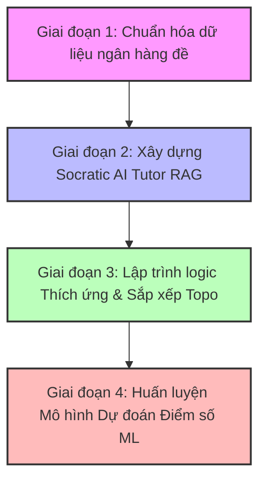
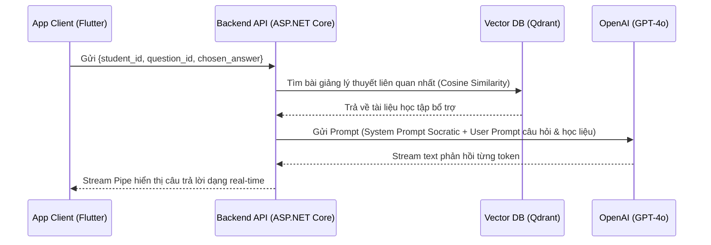

# LỘ TRÌNH PHÁT TRIỂN & HUẤN LUYỆN AI CHI TIẾT
## Dự án: Hệ thống cá nhân hóa lộ trình học và luyện thi Đánh giá năng lực tích hợp AI (V-ACT 2026)

Tài liệu này được biên soạn để định hướng phát triển phần **AI Engine & AI Tutor** cho dự án Capstone của bạn, bám sát các luồng nghiệp vụ trong [Phan_tich_nghiep_vu_chi_tiet.md](file:///d:/CapstoneAI/Phan_tich_nghiep_vu_chi_tiet.md).

---



---

## GIAI ĐOẠN 1: CHUẨN HÓA DỮ LIỆU ĐỀ THI & HỌC LIỆU (Móng nhà của AI)

Trước khi AI có thể gợi ý lộ trình hay giải thích bài tập, bạn phải chuyển đổi các tài liệu ôn tập dạng PDF hiện có trong thư mục `Tài Liệu Train AI` thành cấu trúc dữ liệu lưu trữ được trong PostgreSQL và Vector DB.

### 1. Xây dựng Khung Năng lực (Skills Tree)
* **Nhiệm vụ:** Định nghĩa cấu trúc phân cấp (Cha - Con) của các môn học theo đề thi V-ACT 2026.
* **Cách thực hiện:** Tạo file cấu trúc JSON/SQL mẫu cho cây năng lực:
  * *Tiếng Việt:* Sử dụng ngôn ngữ -> Phong cách ngôn ngữ, Biện pháp tu từ, Lỗi dùng từ...
  * *Toán học:* Toán học -> Đại số & Giải tích -> Tổ hợp - Xác suất.
  * *Tư duy khoa học:* Phân tích số liệu -> Logic -> Suy luận liên môn.

### 2. Trích xuất và cấu trúc hóa ngân hàng câu hỏi (PDF to JSON/SQL)
Các tệp đề thi thử và luyện dạng của bạn đang ở dạng PDF (`de-thi-minh-hoa-2026-dgnl.pdf`, `LUYỆN DẠNG - TIẾNG VIỆT - 1.pdf`,...). Bạn cần viết code Python (sử dụng thư viện `pypdf`, `pdfplumber` hoặc API OCR như Tesseract/GPT-4o Vision) để trích xuất thành tệp JSON có định dạng:
* **Câu hỏi đơn lập:**
  ```json
  {
    "question_id": "uuid",
    "skill_id": "uuid-của-kỹ-năng-liên-quan",
    "difficulty_level": 2,
    "content_latex": "Tìm giá trị lớn nhất của hàm số $f(x) = x^3 - 3x$ trên đoạn $[0, 2]$",
    "options": ["A. -2", "B. 2", "C. 0", "D. 4"],
    "correct_option": "B",
    "explanation": "Lời giải chi tiết..."
  }
  ```
* **Chùm câu hỏi (Passage-based):** Phải tách phần văn bản chung (`Passage`) và liên kết các câu hỏi con vào trường `passage_id`.

> [!IMPORTANT]
> Công thức Toán học và Ký hiệu Khoa học trong PDF cần được chuyển đổi sang chuẩn **LaTeX** (được bao quanh bởi dấu `$` hoặc `$$`) để Frontend (React/Flutter) hiển thị trực quan đẹp mắt.

---

## GIAI ĐOẠN 2: XÂY DỰNG SOCRATIC AI TUTOR (RAG Pipeline)

Gia sư ảo này giúp học sinh giải đáp các câu hỏi bị sai bằng cách gợi mở (Socratic Method) thay vì đưa ngay lời giải.



### 1. Chuẩn bị kho bài giảng lý thuyết (Knowledge Base)
* Thu thập tài liệu lý thuyết, công thức, tóm tắt bài giảng tương ứng với từng kỹ năng trong `Skills`.
* Viết script Python để chia nhỏ văn bản (Chunking), sử dụng mô hình embedding (ví dụ: `text-embedding-3-small` của OpenAI) để tạo Vector và nạp vào **Qdrant** hoặc **Pinecone**.

### 2. Thiết kế System Prompt Socratic
Đây là lõi của AI Tutor. Prompt cần được viết chặt chẽ nhằm ép buộc LLM không được cung cấp trực tiếp đáp án đúng.
* **Ví dụ System Prompt Socratic:**
  ```text
  Bạn là một Gia sư trí tuệ nhân tạo (AI Tutor) hỗ trợ học sinh ôn thi Đánh giá năng lực ĐHQG-HCM theo phương pháp gợi mở (Socratic Method).
  
  Nhiệm vụ của bạn:
  1. KHÔNG BAO GIỜ được cho học sinh biết đáp án đúng hay lời giải đầy đủ ngay lập tức.
  2. Hãy chỉ ra điểm chưa hợp lý trong cách tư duy hoặc phương án học sinh đưa ra.
  3. Giải thích ngắn gọn khái niệm lý thuyết cốt lõi cần dùng.
  4. Đặt 1-2 câu hỏi nhỏ dẫn dắt gợi ý để học sinh tự suy nghĩ và tự tìm ra câu trả lời đúng.
  5. Luôn phản hồi bằng tiếng Việt lịch sự, định dạng Markdown gọn gàng.
  ```

---

## GIAI ĐOẠN 3: LẬP TRÌNH LOGIC LỘ TRÌNH THÍCH ỨNG (Adaptive Engine)

Phần này được gọi là AI trong nghiệp vụ, nhưng thực chất là các thuật toán và máy trạng thái (State Machine) được cài đặt trực tiếp trên Backend (C# ASP.NET Core hoặc python microservice).

### 1. Sinh lộ trình (Personalized Path Generator)
* **Gap Analysis:** Lọc ra các kỹ năng có điểm năng lực hiện tại $M < 0.85$.
* **Topological Sort:** Xây dựng đồ thị có hướng không chu trình (DAG) biểu thị mối quan hệ tiên quyết giữa các kỹ năng (Ví dụ: phải học xong *Từ loại* mới học đến *Cú pháp câu*). Sử dụng thuật toán Sắp xếp topo để xác định thứ tự học tối ưu nhất.

### 2. Luyện tập thích ứng (Adaptive Practice Rule)
Cài đặt máy trạng thái quản lý Mastery Score ($M$) của học sinh:
* Trạng thái bắt đầu $M = 0.5$.
* Làm đúng: $+0.05$ (streak đúng $\ge 3 \rightarrow +0.07$).
* Làm sai: $-0.04$ (streak sai $\ge 2 \rightarrow -0.06$).
* Cập nhật độ khó câu hỏi tiếp theo dựa trên chuỗi đúng/sai liên tiếp (3 đúng nâng cấp độ khó, 2 sai hạ cấp độ khó).

---

## GIAI ĐOẠN 4: HUẤN LUYỆN MÔ HÌNH DỰ ĐOÁN ĐIỂM SỐ (Machine Learning)

Phân hệ dự đoán điểm số thi ĐGNL (V-ACT) dựa trên lịch sử luyện tập và gửi cảnh báo sớm cho phụ huynh (Luồng 6).

### 1. Tạo tập dữ liệu giả lập (Synthetic Data Generation)
* **Vấn đề:** Ban đầu bạn chưa có người dùng thật, lấy đâu ra dữ liệu để train mô hình ML?
* **Giải pháp:** Viết một script Python để giả lập hành vi làm bài của 200 - 500 học sinh ảo:
  * Học sinh giỏi: tỷ lệ làm đúng cao, thời gian làm bài nhanh, Mastery Score các kỹ năng tăng nhanh.
  * Học sinh trung bình: làm đúng/sai xen kẽ.
  * Học sinh yếu: làm sai nhiều, streak sai liên tiếp dài.
  * Xuất ra file dữ liệu lịch sử (`attempt_logs` và `learning_profiles`) và gắn điểm thi thật tương ứng (làm nhãn - Label).

### 2. Huấn luyện mô hình Machine Learning
Sử dụng thư viện `scikit-learn` trong Python:
* **Tính năng đầu vào (Features):** Mức độ làm chủ trung bình của các môn, tỷ lệ làm đúng tổng thể, tổng số câu hỏi đã luyện tập, thời gian ôn thi còn lại, streak ngày học liên tục,...
* **Mô hình:** Thử nghiệm với các thuật toán cơ bản và mạnh mẽ như `Random Forest Regressor` hoặc `XGBoost Regressor` để dự đoán điểm số từ 0 đến 1200.
* **Cảnh báo sớm:** Viết quy tắc: Nếu Điểm dự đoán $< S_{target} - 150$ hoặc Tốc độ hoàn thành lộ trình chậm hơn 20% so với tiến độ chuẩn $\rightarrow$ Kích hoạt cờ cảnh báo gửi thông báo / email.

### 3. Tích hợp mô hình vào Backend
* Xuất mô hình đã train ra định dạng **ONNX** (`model.onnx`).
* Sử dụng thư viện `Microsoft.ML.OnnxRuntime` trên ASP.NET Core để load và chạy mô hình trực tiếp trên Backend C#. Cách này giúp bạn không cần duy trì một server Python riêng biệt, giảm chi phí vận hành.

---

## 🛠️ CÁC BƯỚC KHỞI ĐỘNG NGAY HÔM NAY (QUYẾT ĐỊNH BẮT ĐẦU TỪ ĐÂU)

Bạn nên bắt đầu theo thứ tự ưu tiên từ dễ đến khó, từ dữ liệu đến mô hình:

1. **Bước 1 (Chuẩn bị dữ liệu):** Viết script Python trích xuất 1 file đề thi PDF (ví dụ: [De-thi-minh-hoa-2026-dgnl.pdf](file:///d:/CapstoneAI/Tài%20Liệu%20Train%20AI/HoChiMinh_City/2026/De-thi-minh-hoa-2026-dgnl.pdf)) thành định dạng JSON chứa các câu hỏi đã được định cấu trúc và công thức toán học định dạng LaTeX.
2. **Bước 2 (Kiểm thử Prompt Socratic):** Mở Playground của OpenAI (hoặc chạy một script Python gọi API) để thử nghiệm System Prompt Socratic với dữ liệu câu hỏi vừa trích xuất ở Bước 1. Điều chỉnh Prompt cho đến khi AI trả lời đúng giọng điệu của một gia sư gợi mở.
3. **Bước 3 (Thiết kế Schema CSDL):** Thiết lập cơ sở dữ liệu PostgreSQL cục bộ dựa trên thiết kế 8 bảng đã tối ưu trong tài liệu nghiệp vụ V-ACT 2026.
