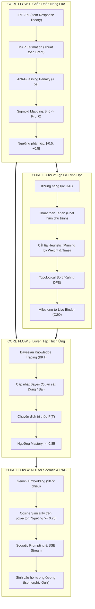

# TỔNG HỢP CÁC THUẬT TOÁN, CÔNG THỨC TOÁN & LÝ DO ÁP DỤNG TRONG HỆ THỐNG V-EVAL

> **Tài liệu tham chiếu chuẩn mực dành cho Dự án V-Eval**  
> **Phạm vi:** Tổng hợp toàn bộ các mô hình, thuật toán, công thức toán học từ Core Flow 1 đến Core Flow 4.  
> **Mục tiêu:** Cung cấp bức tranh toàn cảnh, luận giải chi tiết *"Công thức nào? Thuật toán gì? Vì sao phải dùng nó mà không dùng cách khác?"*.

---

## 📑 MỤC LỤC
1. [Bản Đồ Tổng Thể Các Thuật Toán Theo Từng Core Flow](#1-bản-đồ-tổng-thể-các-thuật-toán-theo-từng-core-flow)
2. [Core Flow 1: Chẩn Đoán Năng Lực & Hồ Sơ Học Tập](#2-core-flow-1-chẩn-đoán-năng-lực--hồ-sơ-học-tập)
   * [2.1. Mô hình trắc nghiệm học IRT 2PL](#21-mô-hình-trắc-nghiệm-học-irt-2pl)
   * [2.2. Giải thuật tối ưu hóa MAP (kết hợp phương pháp Brent)](#22-giải-thuật-tối-ưu-hóa-map-kết-hợp-phương-pháp-brent)
   * [2.3. Cơ chế phạt đoán mò siêu tốc (Anti-Guessing Penalty)](#23-cơ-chế-phạt-đoán-mò-siêu-tốc-anti-guessing-penalty)
   * [2.4. Hàm ánh xạ không gian Sigmoid sang BKT Prior](#24-hàm-ánh-xạ-không-gian-sigmoid-sang-bkt-prior)
   * [2.5. Thuật toán phân lớp học sinh theo ngưỡng năng lực](#25-thuật-toán-phân-lớp-học-sinh-theo-ngưỡng-năng-lực)
3. [Core Flow 2: Lập Lộ Trình Cá Nhân Hóa & Tích Hợp Lịch Live](#3-core-flow-2-lập-lộ-trình-cá-nhân-hóa--tích-hợp-lịch-live)
   * [3.1. Cấu trúc dữ liệu Đồ thị có hướng không chu trình (DAG)](#31-cấu-trúc-dữ-liệu-đồ-thị-có-hướng-không-chu-trình-dag)
   * [3.2. Thuật toán Tarjan (Phát hiện chu trình lỗi)](#32-thuật-toán-tarjan-phát-hiện-chu-trình-lỗi)
   * [3.3. Thuật toán Cắt tỉa Heuristic (Path Pruner)](#33-thuật-toán-cắt-tỉa-heuristic-path-pruner)
   * [3.4. Thuật toán Sắp xếp Tô-pô (Topological Sort)](#34-thuật-toán-sắp-xếp-tô-pô-topological-sort)
   * [3.5. Thuật toán Gắn kết Cột mốc với Lịch Live (Milestone-to-Live Binder)](#35-thuật-toán-gắn-kết-cột-mốc-với-lịch-live-milestone-to-live-binder)
4. [Core Flow 3: Luyện Tập Thích Ứng & Theo Dõi Tri Thức (BKT)](#4-core-flow-3-luyện-tập-thích-ứng--theo-dõi-tri-thức-bkt)
   * [4.1. Mô hình Bayesian Knowledge Tracing (BKT)](#41-mô-hình-bayesian-knowledge-tracing-bkt)
   * [4.2. Bộ tứ tham số học thuật BKT](#42-bộ-tứ-tham-số-học-thuật-bkt)
   * [4.3. Công thức cập nhật xác suất thành thạo qua từng câu hỏi](#43-công-thức-cập-nhật-xác-suất-thành-thạo-qua-từng-câu-hỏi)
5. [Core Flow 4: Trợ Lý AI Tutor Gợi Mở (RAG Pipeline)](#5-core-flow-4-trợ-lý-ai-tutor-gợi-mở-rag-pipeline)
   * [5.1. Mô hình nhúng ngữ nghĩa Semantic Embedding](#51-mô-hình-nhúng-ngữ-nghĩa-semantic-embedding)
   * [5.2. Công thức độ tương đồng Cosine Similarity trong pgvector](#52-công-thức-độ-tương-đồng-cosine-similarity-trong-pgvector)
   * [5.3. Kỹ thuật gợi mở Socrates (Socratic Prompting & Chain-of-Thought)](#53-kỹ-thuật-gợi-mở-socrates-socratic-prompting--chain-of-thought)
   * [5.4. Thuật toán sinh câu hỏi tương đương (Isomorphic Question Generation)](#54-thuật-toán-sinh-câu-hỏi-tương-đương-isomorphic-question-generation)
6. [Bảng Tra Cứu Toàn Diện: Thuật Toán - Công Thức - Vì Sao Dùng](#6-bảng-tra-cứu-toàn-diện-thuật-toán---công-thức---vì-sao-dùng)

---

## 1. BẢN ĐỒ TỔNG THỂ CÁC THUẬT TOÁN THEO TỪNG CORE FLOW



---

## 2. CORE FLOW 1: CHẨN ĐOÁN NĂNG LỰC & HỒ SƠ HỌC TẬP

### 2.1. Mô hình trắc nghiệm học IRT 2PL
* **Công thức xác suất trả lời đúng:**
  ```text
                               1
  P(u_j = 1 | θ) = ─────────────────────────
                   1 + exp(-a_j * (θ - b_j))
  ```
  * `` `θ \in [-3.0, +3.0]` ``: Năng lực tiềm ẩn của thí sinh.
  * `` `b_j` ``: Độ khó của câu hỏi thứ `` `j` `` (Item Difficulty).
  * `` `a_j` ``: Độ phân biệt của câu hỏi thứ `` `j` `` (Item Discrimination).
* **Vì sao dùng?**
  * **Khắc phục nhược điểm của CTT (Classical Test Theory - tính % câu đúng thông thường):** Một học sinh làm đúng 5 câu cực khó thể hiện năng lực hoàn toàn khác với một học sinh làm đúng 5 câu cực dễ.
  * IRT 2PL đo lường khách quan năng lực học sinh độc lập với độ khó của đề thi, cân đo chính xác cả độ phân biệt của từng câu hỏi.

---

### 2.2. Giải thuật tối ưu hóa MAP (kết hợp phương pháp Brent)
* **Công thức hàm mục tiêu:**
  ```text
  θ̂_MAP = argmax_θ [ ln L(θ)  +  ln P(θ) ]
        = argmax_θ [ ∑ (u_j * ln(P_j) + (1 - u_j) * ln(1 - P_j)) - (θ² / 8.0) ]
  ```
* **Vì sao dùng?**
  * **Giải quyết "điểm chết" của phương pháp MLE cổ điển:** Nếu học sinh làm đúng toàn bộ 30/30 câu hoặc sai 0/30 câu, phương pháp MLE cổ điển sẽ chia cho 0 và phán đoán năng lực là vô cực (`` `\theta \to \pm \infty` ``) làm sập hệ thống.
  * **Thành phần tiên nghiệm Gauss `` `-\frac{\theta^2}{8.0}` `` (với `` `\sigma = 2.0` ``):** Đóng vai trò như một "sợi dây thun" ghì điểm số về miền phân phối chuẩn của con người quanh mức 0, giữ cho điểm luôn hữu hạn và thực tế.
  * **Phương pháp Brent:** Tìm cực trị 1 chiều nhanh chóng, kết hợp giữa chia đôi (Bisection), tiếp tuyến (Secant) và nội suy parabol nghịch đảo mà không cần tính đạo hàm bậc 2.

---

### 2.3. Cơ chế phạt đoán mò siêu tốc (Anti-Guessing Penalty)
* **Quy tắc toán học:**
  ```text
  Nếu thời gian làm câu j: t_j < 5 giây
  ==> Giảm độ phân biệt a_j xuống mức tối thiểu (a_j = 0.1)
  ```
* **Vì sao dùng?**
  * Trắc nghiệm khách quan 4 lựa chọn luôn có xác suất đoán mò ăn may 25%.
  * Một câu hỏi khó cần ít nhất 30–60 giây để đọc đề và tính toán. Nếu học sinh bấm chọn chỉ sau 2–3 giây mà vô tình trúng đáp án, câu hỏi đó sẽ bị hạ trọng số thông tin Fisher xuống gần 0, ngăn chặn việc thổi phồng năng lực ảo của học sinh.

---

### 2.4. Hàm ánh xạ không gian Sigmoid sang BKT Prior
* **Công thức chuyển đổi:**
  ```text
                           1
  P(L_0) = Sigmoid(θ_0) = ──────────────
                          1 + exp(-θ_0)
  ```
* **Vì sao dùng?**
  * **Đổi đơn vị thang đo:** Giá trị năng lực `` `\theta_0` `` mang đơn vị thực từ `` `[-3.0, +3.0]` `` (có thể âm).
  * Mô hình BKT ở các flow sau đòi hỏi đầu vào phải là một xác suất hợp lệ `` `P(L_0) \in [0.0, 1.0]` `` (từ 0% đến 100%).
  * Hàm Sigmoid chuẩn ánh xạ mượt mà điểm năng lực thành tỷ lệ phần trăm làm chủ kiến thức ban đầu, phục vụ phân loại kỹ năng yếu ở Flow 2 và làm điểm xuất phát cho Flow 3.

---

### 2.5. Thuật toán phân lớp học sinh theo ngưỡng năng lực
* **Quy tắc phân cụm:**
  * **Lớp Nền tảng (Foundation):** `` `\theta_0 < -0.5` `` (năng lực dưới trung bình).
  * **Lớp Tăng tốc (Acceleration):** `` `-0.5 \le \theta_0 \le +0.5` `` (năng lực trung bình khá).
  * **Lớp Bứt phá (Breakthrough):** `` `\theta_0 > +0.5` `` (năng lực xuất sắc).
* **Vì sao dùng?**
  * Cho phép hệ thống tự động phân luồng học sinh vào các lớp học tại cơ sở offline ngay lập tức mà không cần giáo viên phải chấm tay hay phỏng vấn đầu vào.

---

## 3. CORE FLOW 2: LẬP LỘ TRÌNH CÁ NHÂN HÓA & TÍCH HỢP LỊCH LIVE

### 3.1. Cấu trúc dữ liệu Đồ thị có hướng không chu trình (DAG)
* **Mô tả:** Đồ thị gồm các đỉnh `` `V` `` là các kỹ năng (Skills) và các cạnh có hướng `` `E` `` là quan hệ tiên quyết (Prerequisite Dependencies: `` `A \to B` `` nghĩa là muốn học B phải biết A).
* **Vì sao dùng?**
  * Kiến thức giáo dục có tính lũy tiến tự nhiên (ví dụ: biết cộng trừ mới học nhân chia). DAG là cấu trúc dữ liệu chuẩn mực nhất để biểu diễn cây tri thức mà không bị mâu thuẫn phụ thuộc một chiều.

---

### 3.2. Thuật toán Tarjan (Phát hiện chu trình lỗi)
* **Độ phức tạp:** `` `O(|V| + |E|)` `` sử dụng cơ chế DFS và chỉ số độ sâu (Index / Lowlink).
* **Mục tiêu:** Phát hiện các thành phần liên thông mạnh (Strongly Connected Components - SCC) có kích thước lớn hơn 1, tức các chu trình phụ thuộc vòng kín (`` `A \to B \to C \to A` ``).
* **Vì sao dùng?**
  * Khi giáo viên hoặc chuyên gia soạn đề thiết lập quan hệ tiên quyết, lỗi do con người có thể tạo ra nghịch lý "con gà và quả trứng".
  * Nếu có chu trình, thuật toán sắp xếp lộ trình sẽ bị kẹt cứng (Deadlock). Thuật toán Tarjan phát hiện lỗi này chỉ trong 1 lần duyệt để thông báo bộ phận Đào tạo sửa ngay lập tức.

---

### 3.3. Thuật toán Cắt tỉa Heuristic (Path Pruner)
* **Hai quy tắc cắt tỉa then chốt:**
  1. **Tỉa kỹ năng đã vững:** Loại bỏ mọi kỹ năng có `` `P(L_0) \ge 0.85` `` (học sinh đã hiểu trên 85% thì không bắt học lại).
  2. **Tỉa kỹ năng phụ khi quỹ thời gian gấp:** Nếu số ngày ôn thi còn lại không đủ (`` `T_{còn lại} < T_{ngưỡng}` ``), hệ thống tự động loại bỏ các kỹ năng có trọng số đề thi dưới `` `5\%` `` (Exam Weight `` `< 0.05` ``).
* **Vì sao dùng?**
  * Tránh quá tải cho học sinh. Đảm bảo trong thời gian ngắn nhất, học sinh dồn toàn bộ tâm trí vào các chuyên đề then chốt chiếm nhiều điểm nhất trong kỳ thi ĐGNL.

---

### 3.4. Thuật toán Sắp xếp Tô-pô (Topological Sort)
* **Độ phức tạp:** `` `O(|V| + |E|)` `` sử dụng giải thuật Kahn (bậc vào `In-degree = 0`) kết hợp hàng đợi ưu tiên (Priority Queue).
* **Quy tắc ưu tiên (Tie-breaking):** Khi có nhiều kỹ năng cùng thỏa mãn điều kiện tiên quyết, kỹ năng nào có **Trọng số đề thi (Exam Weight)** cao hơn sẽ được xếp lên học trước.
* **Vì sao dùng?**
  * Trải phẳng đồ thị mạng lưới đa chiều thành một đường thẳng tuyến tính (Dòng thời gian học tập). Đảm bảo học sinh luôn được học bài dễ trước bài khó và nắm chắc chuyên đề trọng điểm trước ngày thi.

---

### 3.5. Thuật toán Gắn kết Cột mốc với Lịch Live (Milestone-to-Live Binder)
* **Cơ chế:** Ghép nối kỹ năng của từng Milestone với lịch phát sóng các lớp học trực tiếp (`LiveSession`) tại cơ sở theo mã lớp của học sinh.
* **Vì sao dùng?**
  * Hiện thực hóa mô hình đào tạo O2O (Online-to-Offline): Học sinh tự học video và làm quiz online, sau đó được gặp giáo viên giải đáp thắc mắc trực tiếp tại cơ sở đúng theo tiến độ bài học.

---

## 4. CORE FLOW 3: LUYỆN TẬP THÍCH ỨNG & THEO DÕI TRI THỨC (BKT)

### 4.1. Mô hình Bayesian Knowledge Tracing (BKT)
* **Bản chất:** Mô hình Markov ẩn (Hidden Markov Model - HMM) theo dõi trạng thái tâm lý ẩn của học sinh: đã làm chủ kỹ năng (State = 1) hay chưa làm chủ (State = 0).

---

### 4.2. Bộ tứ tham số học thuật BKT
Mỗi kỹ năng được định lượng bởi 4 tham số:
* `` `P(L_0)` ``: Xác suất làm chủ ban đầu (lấy từ hàm Sigmoid của Flow 1).
* `` `P(T)` ``: Xác suất chuyển dịch tri thức (Transition Probability - khả năng học sinh hiểu bài sau khi làm 1 câu luyện tập, thường từ `` `0.1 - 0.2` ``).
* `` `P(G)` ``: Xác suất đoán mò (Guess Probability - học sinh không biết nhưng chọn bừa trúng đáp án, thường `` `0.25` `` với trắc nghiệm 4 đáp án).
* `` `P(S)` ``: Xác suất sơ suất / trượt vỏ chuối (Slip Probability - học sinh hiểu bài nhưng tính nhầm hoặc đọc ẩu, thường `` `0.1` ``).

---

### 4.3. Công thức cập nhật xác suất thành thạo qua từng câu hỏi

#### Bước 1: Cập nhật niềm tin theo kết quả thực tế (Bayes Update)
* **Nếu học sinh làm ĐÚNG (`` `u_t = 1` ``):**
  ```text
                         P(L_{t-1}) * (1 - P(S))
  P(L_t | u_t = 1) = ─────────────────────────────────────────────
                     P(L_{t-1}) * (1 - P(S)) + (1 - P(L_{t-1})) * P(G)
  ```
* **Nếu học sinh làm SAI (`` `u_t = 0` ``):**
  ```text
                           P(L_{t-1}) * P(S)
  P(L_t | u_t = 0) = ─────────────────────────────────────────────
                     P(L_{t-1}) * P(S) + (1 - P(L_{t-1})) * (1 - P(G))
  ```

#### Bước 2: Tính thêm xác suất tiếp thu kiến thức mới (Knowledge Transition)
```text
P(L_t) = P(L_t | u_t) + [ 1 - P(L_t | u_t) ] * P(T)
```

* **Vì sao dùng?**
  * Giúp hệ thống không bị đánh lừa bởi một lần làm đúng do may mắn (nhờ trừ hao `` `P(G)` ``) hoặc một lần sơ suất làm sai câu dễ (nhờ bảo lưu `` `P(S)` ``).
  * Khi điểm tích lũy `` `P(L_t) \ge 0.85` ``, hệ thống tự động công nhận học sinh đã làm chủ kỹ năng và cho dừng luyện tập, chuyển sang bài mới.

---

## 5. CORE FLOW 4: TRỢ LÝ AI TUTOR GỢI MỞ (RAG PIPELINE)

### 5.1. Mô hình nhúng ngữ nghĩa Semantic Embedding
* **Mô hình triển khai:** `gemini-embedding-001` (Google Generative AI).
* **Số chiều vector:** **3072 chiều**.
* **Vì sao dùng?**
  * Chuyển hóa toàn bộ ngữ nghĩa câu hỏi, các khái niệm toán học, lý thuyết phức tạp thành tọa độ không gian.
  * Cho phép tìm kiếm tài liệu chuẩn xác dựa trên **bản chất ngữ nghĩa** chứ không bị giới hạn bởi việc tìm kiếm từ khóa trùng lặp thông thường.

---

### 5.2. Công thức độ tương đồng Cosine Similarity trong pgvector
* **Công thức toán học:**
  ```text
                                  A · B            ∑ (A_i * B_i)
  Cosine Similarity(A, B) = ───────────────── = ───────────────────
                            ||A|| * ||B||       √(∑ A_i²) * √(∑ B_i²)
  ```
* **Triển khai kỹ thuật:** Toán tử khoảng cách Cosine `<=>` trong extension `pgvector` trên PostgreSQL.
* **Ngưỡng an toàn học thuật:** `` `\text{Similarity} \ge 0.78` ``.
* **Vì sao dùng?**
  * Đo góc giữa 2 vector trong không gian nhiều chiều, triệt tiêu sự chênh lệch về độ dài ngắn của văn bản.
  * **Ngưỡng chặn 0.78:** Đảm bảo chỉ khi tìm thấy tài liệu trong giáo trình chuẩn mới đưa vào ngữ cảnh cho AI. Nếu độ tương đồng thấp hơn, hệ thống chặn tư duy tự do của LLM để triệt tiêu triệt để hiện tượng ảo giác (*Hallucination*).

---

### 5.3. Kỹ thuật gợi mở Socrates (Socratic Prompting & Chain-of-Thought)
* **Cơ chế:** Thiết lập System Prompt ràng buộc mô hình LLM (Gemini 2.0 Flash) không bao giờ trực tiếp cung cấp đáp án cuối cùng.
* **Quy trình phản hồi:**
  1. Chỉ ra điểm ngộ nhận tư duy (*Misconception*) trong đáp án sai của học sinh.
  2. Đưa ra 1 gợi ý lý thuyết liên quan rút trích từ giáo trình.
  3. Đặt câu hỏi phản biện ngắn để học sinh tự suy nghĩ và trả lời.
* **Vì sao dùng?**
  * Biến AI thành một gia sư sư phạm thực thụ. Tránh biến học sinh thành người ỷ lại, chỉ biết "copy-paste" bài giải của AI.

---

### 5.4. Thuật toán sinh câu hỏi tương đương (Isomorphic Question Generation)
* **Bản chất:** Sử dụng kỹ thuật Few-shot Prompting để sinh câu hỏi mới giữ nguyên:
  * Cùng dạng toán và mã kỹ năng (`skill_id`).
  * Cùng ma trận độ khó `` `b` `` và độ phân biệt `` `a` ``.
  * Chỉ thay đổi số liệu đầu vào, ngữ cảnh thực tế và thứ tự các đáp án nhiễu.
* **Vì sao dùng?**
  * Kiểm tra ngay lập tức xem học sinh đã thực sự hiểu bản chất bài toán hay chỉ làm đúng nhờ nhớ vẹt câu hỏi cũ.

---

## 6. BẢNG TRA CỨU TOÀN DIỆN: THUẬT TOÁN - CÔNG THỨC - VÌ SAO DÙNG

| Core Flow | Thuật toán / Mô hình | Công thức / Cấu trúc toán học chính | Vì sao bắt buộc phải dùng? (Ưu điểm vượt trội) |
| :---: | :--- | :--- | :--- |
| **Flow 1** | **IRT 2PL** | `` `P_j = \frac{1}{1 + e^{-a_j(\theta - b_j)}}` `` | Đo năng lực khách quan, tính đến độ khó `` `b_j` `` và độ phân biệt `` `a_j` ``, không phụ thuộc đề dễ hay khó. |
| **Flow 1** | **MAP (Brent)** | `` `\text{argmax}_\theta [\ln L(\theta) - \frac{\theta^2}{2\sigma^2}]` `` | Chặn lỗi phân kỳ vô cực của MLE khi đúng/sai 100%; tối ưu hóa 1 chiều siêu tốc không cần đạo hàm bậc 2. |
| **Flow 1** | **Anti-Guessing** | `` `t_j < 5\text{s} \implies a_j \leftarrow 0.1` `` | Triệt tiêu điểm ăn may của học sinh khi khoanh bừa trúng câu khó. |
| **Flow 1** | **Sigmoid Mapping** | `` `P(L_0) = \frac{1}{1 + e^{-\theta_0}}` `` | Đổi đơn vị từ điểm thực `` `[-3, +3]` `` sang xác suất `` `[0, 1]` `` làm tiên nghiệm chuẩn cho BKT. |
| **Flow 2** | **DAG** | `` `G = (V, E)` `` có hướng, không chu trình | Mô hình hóa chuẩn xác cây kiến thức tiên quyết theo logic một chiều của giáo dục. |
| **Flow 2** | **Tarjan** | Phân tích Lowlink bằng DFS, `` `O(V + E)` `` | Phát hiện lỗi phụ thuộc vòng tròn (`` `A \to B \to A` ``) để chặn treo hệ sinh lộ trình và báo lỗi Admin. |
| **Flow 2** | **Pruning Heuristics**| `` `P(L_0) \ge 0.85` `` hoặc `` `W_{exam} < 5\%` `` | Bỏ qua phần đã biết, cắt bỏ phần ít thi khi quỹ thời gian gấp; tối ưu hóa thời gian ôn tập. |
| **Flow 2** | **Topological Sort** | Giải thuật Kahn + Priority Queue | Trải phẳng đồ thị thành lộ trình tuyến tính: học nền tảng trước, học phần điểm cao sau. |
| **Flow 3** | **BKT Update** | Bayes Theorem cập nhật `` `P(L_t \mid u_t)` `` | Theo dõi động mức độ hiểu bài; loại trừ sai số do đoán mò `` `P(G)` `` và đọc ẩu sơ suất `` `P(S)` ``. |
| **Flow 3** | **Transition P(T)** | `` `P(L_t) = P(L_{t\mid u}) + (1-P)*P(T)` `` | Phản ánh sự tiến bộ và tiếp thu kiến thức mới của học sinh sau mỗi câu làm bài tập. |
| **Flow 4** | **Embedding 3072d** | `gemini-embedding-001` | Biến câu hỏi và giáo trình thành vector nhiều chiều để tìm kiếm theo bản chất ngữ nghĩa. |
| **Flow 4** | **Cosine Similarity**| `` `\cos(\theta) = \frac{A \cdot B}{\|A\| \|B\|} \ge 0.78` `` | So khớp độ liên quan tài liệu trong pgvector; chặn hiện tượng ảo giác (hallucination) của LLM. |
| **Flow 4** | **Socratic Method** | Prompting Chain-of-Thought + SSE | Dẫn dắt gợi mở từng bước, chỉ ra lỗi tư duy, không giải hộ để học sinh tự hiểu bản chất. |
| **Flow 4** | **Isomorphic Quiz** | Generator giữ nguyên `` `(a, b)` ``, đổi số liệu | Cung cấp câu hỏi tương đương ngay lập tức để học sinh kiểm chứng lại kiến thức vừa học. |
