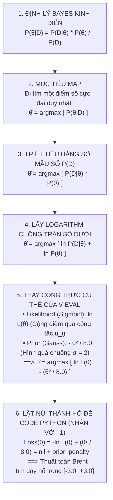

# TỪ ĐỊNH LÝ BAYES ĐẾN THUẬT TOÁN MAP (MAXIMUM A POSTERIORI)

> **Tài liệu lý thuyết & Bản chất toán học dành cho Dự án V-Eval**  
> **Áp dụng:** Core Flow 1 – Ước lượng năng lực học sinh `` `\theta_0` `` từ bài thi chẩn đoán  
> **Ngôn ngữ triển khai:** Python (`rag-service/diagnostic_engine.py`) kết hợp C# Practice Service

---

## 📑 MỤC LỤC
1. [Trực Giác Đời Thường: Vì Sao Phải Suy Nghĩ Theo Kiểu Bayes?](#1-trực-giác-đời-thường-vì-sao-phải-suy-nghĩ-theo-kiểu-bayes)
2. [Nền Móng Toán Học: Định Lý Bayes Kinh Điển](#2-nền-móng-toán-học-định-lý-bayes-kinh-điển)
3. [Bước 1: Từ "Xác Suất Hậu Nghiệm" Sang "Thuật Toán MAP"](#3-bước-1-từ-xác-suất-hậu-nghiệm-sang-thuật-toán-map)
4. [Bước 2: Triệt Tiêu Mẫu Số P(D)](#4-bước-2-triệt-tiêu-mẫu-số-pd)
5. [Bước 3: Phép Biến Đổi Logarithm (Biến Phép Nhân Thành Phép Cộng)](#5-bước-3-phép-biến-đổi-logarithm-biến-phép-nhân-thành-phép-cộng)
6. [GIẢI TỎA HIỂU LẦM: HÀM SIGMOID VS HÀM GAUSS KHÁC NHAU THẾ NÀO?](#6-giải-tỏa-hiểu-lầm-hàm-sigmoid-vs-hàm-gauss-khác-nhau-thế-nào)
   * [6.1. Hàm Sigmoid là gì và làm nhiệm vụ gì? (Dành cho CÂU HỎI)](#61-hàm-sigmoid-là-gì-và-làm-nhiệm-vụ-gì-dành-cho-câu-hỏi)
   * [6.2. Hàm Gauss là gì và làm nhiệm vụ gì? (Dành cho CON NGƯỜI)](#62-hàm-gauss-là-gì-và-làm-nhiệm-vụ-gì-dành-cho-con-người)
   * [6.3. Sự bắt tay giữa Sigmoid và Gauss trong MAP](#63-sự-bắt-tay-giữa-sigmoid-và-gauss-trong-map)
   * [6.4. Còn chỗ "Sigmoid" thứ hai trong tài liệu là ở đâu?](#64-còn-chỗ-sigmoid-thứ-hai-trong-tài-liệu-là-ở-đâu)
7. [Bước 4: Mổ Xẻ Chi Tiết Hai Thành Phần Trong Dự Án V-Eval](#7-bước-4-mổ-xẻ-chi-tiết-hai-thành-phần-trong-dự-án-v-eval)
   * [7.1. Thành phần 1: Cộng điểm bài thi bằng "Công tắc bật/tắt" u_i](#71-thành-phần-1-cộng-điểm-bài-thi-bằng-công-tắc-bậttắt-u_i)
   * [7.2. Thành phần 2: Con số 8.0 từ phân phối hình quả chuông ở đâu ra?](#72-thành-phần-2-con-số-80-từ-phân-phối-hình-quả-chuông-ở-đâu-ra)
   * [7.3. Ghép hai thành phần thành công thức toán học hoàn chỉnh](#73-ghép-hai-thành-phần-thành-công-thức-toán-học-hoàn-chỉnh)
8. [Bước 5: Từ Công Thức Toán Sang Code Python ("Lật Núi Thành Hố")](#8-bước-5-từ-công-thức-toán-sang-code-python-lật-núi-thành-hố)
9. [Sơ Đồ Dòng Chảy Toàn Cảnh & Bảng So Sánh Tổng Kết](#9-sơ-đồ-dòng-chảy-toàn-cảnh--bảng-so-sánh-tổng-kết)

---

## 1. TRỰC GIÁC ĐỜI THƯỜNG: VÌ SAO PHẢI SUY NGHĨ THEO KIỂU BAYES?

Hãy bắt đầu bằng một ví dụ rất gần gũi:

> Bạn cầm một đồng xu và tung **3 lần liên tiếp**, cả 3 lần đều ra **Mặt Ngửa**.  
> Nếu có người hỏi bạn: *"Xác suất ra mặt ngửa của đồng xu này là bao nhiêu?"*

* **Cách 1: Người KHÔNG dùng Bayes (phương pháp cổ điển MLE - Maximum Likelihood)**:
  * Họ chỉ nhìn chăm chăm vào kết quả vừa thấy: 3 lần tung trúng cả 3 $\implies$ Kết luận: **Xác suất ra mặt ngửa là 100%! Lần sau tung chắc chắn là ngửa!**
  * Đây là một kết luận ngây thơ và nguy hiểm, vì trên thực tế không có đồng xu bình thường nào lại có xác suất ngửa 100%.
* **Cách 2: Người DÙNG Bayes (phương pháp MAP - Maximum A Posteriori)**:
  * Họ tự nhủ: *"Trước khi tung, kinh nghiệm mách bảo tôi đồng xu bình thường có tỷ lệ ngửa là 50% (đây gọi là **Tiên nghiệm - Prior**). Việc tung 3 lần ra ngửa chỉ là bằng chứng mới (**Likelihood**). Tôi kết hợp niềm tin ban đầu với dữ liệu mới để ước lượng xác suất ngửa khoảng **65% - 70%**, chứ dứt khoát không thể là 100%!"*

### Áp dụng vào bài thi chẩn đoán của học sinh:
* Nếu một học sinh làm bài test 30 câu và **đúng cả 30/30 câu**:
  * **Nếu không dùng Bayes (MLE)**: Máy tính chia cho 0 và phán học sinh này có trình độ **vô cực (`` `\theta \to +\infty` ``)** $\implies$ Lỗi sập hệ thống!
  * **Nếu dùng Bayes (MAP)**: Hệ thống hiểu rằng học sinh trong tự nhiên có năng lực quanh mức trung bình 0 (phân phối chuẩn). Kết hợp với việc em làm đúng 30 câu, MAP ước lượng trình độ của em là **`` `\theta_0 \approx +2.8` ``** (rất giỏi, nhưng là một con số hữu hạn, có thật)!

---

## 2. NỀN MÓNG TOÁN HỌC: ĐỊNH LÝ BAYES KINH ĐIỂN

Từ lý thuyết xác suất có điều kiện, nhà toán học Thomas Bayes rút ra công thức:

```text
               P(D | θ)  ×  P(θ)
P(θ | D)  =  ─────────────────────
                     P(D)
```

Ý nghĩa từng ký hiệu trong bài toán thi cử của V-Eval:

| Ký hiệu | Tên chuyên ngành | Ý nghĩa thực tế |
| :--- | :--- | :--- |
| `` `D` `` *(Data)* | **Dữ liệu thực tế** | Toàn bộ kết quả bài thi của học sinh (đúng câu nào, sai câu nào trong 30 câu). |
| `` `θ` `` *(Theta)* | **Tham số cần tìm** | Điểm năng lực tiềm ẩn của học sinh trên thang đo chuẩn `[-3.0, +3.0]`. |
| `` `P(θ)` `` | **Tiên nghiệm (Prior)** | *"Trước khi học sinh thi, ta tin năng lực học sinh phân bổ thế nào?"* $\implies$ Đa phần học sinh ở mức trung bình quanh số 0 (Phân phối chuẩn Gauss). |
| `` `P(D \| θ)` `` | **Hàm Hợp lý (Likelihood)** | *"Nếu học sinh có trình độ `θ`, xác suất để em đó làm ra đúng kết quả bài thi `D` là bao nhiêu?"* (Tính bằng mô hình IRT 2PL). |
| `` `P(D)` `` | **Bằng chứng (Evidence)** | Xác suất tổng thể của bộ dữ liệu `D`. Đây là một con số cố định, không phụ thuộc vào `θ`. |
| `` `P(θ \| D)` `` | **Hậu nghiệm (Posterior)** | *"Sau khi đã nhìn thấy bài thi `D`, xác suất để học sinh thực sự có trình độ `θ` là bao nhiêu?"* |

---

## 3. BƯỚC 1: TỪ "XÁC SUẤT HẬU NGHIỆM" SANG "THUẬT TOÁN MAP"

Xác suất hậu nghiệm `` `P(\theta | D)` `` là một **đường cong phân phối liên tục** (chứa vô số điểm xác suất). 

Tuy nhiên, hệ thống máy tính và trung tâm luyện thi không thể in một đường cong lên bảng điểm của học sinh. Hệ thống cần **MỘT CON SỐ CỤ THỂ DUY NHẤT** (ví dụ: `` `\theta_0 = +1.5` ``) để lưu vào database và xếp lớp.

Vậy ta chọn con số `` `\theta` `` nào trong vô số điểm trên đường cong?
$\implies$ **Ta chọn điểm `` `\theta` `` mà tại đó xác suất xảy ra là CAO NHẤT (CỰC ĐẠI - MAXIMUM)!**

Đó chính là định nghĩa của **MAP (Maximum A Posteriori - Cực đại hóa xác suất hậu nghiệm)**:

```text
θ̂_MAP = argmax_θ [ P(θ | D) ]
```
*(Ký hiệu `argmax_θ` nghĩa là: Đi tìm giá trị `θ` làm cho biểu thức đạt giá trị lớn nhất).*

---

## 4. BƯỚC 2: TRIỆT TIÊU MẪU SỐ P(D)

Ta thay công thức Bayes vào biểu thức MAP:

```text
θ̂_MAP = argmax_θ [  P(D | θ) × P(θ)  ]
                    ─────────────────
                          P(D)
```

> [!IMPORTANT]
> **Vì sao bỏ được mẫu số `P(D)`?**
> * Mẫu số `` `P(D)` `` là một hằng số cố định, nó **hoàn toàn không thay đổi khi `θ` thay đổi**.
> * Ẩn dụ: Nếu bạn đi tìm đỉnh của một ngọn núi, dù bạn chia chiều cao của cả ngọn núi cho 10 hay cho 100 thì **tọa độ đỉnh núi vẫn nằm nguyên ở vị trí cũ**.
> 
> Do đó, khi lấy cực đại `argmax`, ta hoàn toàn có thể **bỏ qua mẫu số `P(D)`**!

Công thức được rút gọn lại thành:

```text
θ̂_MAP = argmax_θ [ P(D | θ) × P(θ) ]
```

---

## 5. BƯỚC 3: PHÉP BIẾN ĐỔI LOGARITHM (BIẾN PHÉP NHÂN THÀNH PHÉP CỘNG)

### Tại sao không nhân trực tiếp mà bắt buộc phải lấy Logarithm ($\ln$)?
Học sinh làm 30 câu hỏi. Xác suất của từng câu là các số thập phân nhỏ hơn 1 (ví dụ: $0.6 \times 0.4 \times 0.7 \dots$).
Nếu máy tính nhân liên tiếp 30 số thập phân nhỏ này:
`` `P = 0.6 \times 0.4 \times 0.7 \times \dots \times 0.3 \approx 0.0000000000000012` ``
Con số này sẽ vượt quá khả năng lưu trữ dấu phẩy động của CPU, dẫn đến lỗi **Tràn số dưới (Arithmetic Underflow)** và máy tính tự động coi kết quả bằng **0**!

### Phép màu của Logarithm tự nhiên ($\ln$):
1. Hàm $\ln(x)$ là hàm đồng biến tăng: Nếu $A > B$ thì $\ln(A) > \ln(B)$. Vì vậy, điểm làm cho biểu thức đạt cực đại thì cũng làm cho $\ln$ của nó đạt cực đại:
   `` `argmax [ f(θ) ]  ≡  argmax [ ln(f(θ)) ]` ``
2. Tính chất cốt lõi: $\ln$ biến phép nhân thành phép cộng: `` `\ln(A \times B) = \ln A + \ln B` ``.

Áp dụng $\ln$ vào công thức MAP:

```text
θ̂_MAP = argmax_θ [ ln( P(D | θ) × P(θ) ) ]
      = argmax_θ [ ln P(D | θ)  +  ln P(θ) ]
                   └──────────┘    └──────┘
                    Likelihood      Prior
```

---

## 6. GIẢI TỎA HIỂU LẦM: HÀM SIGMOID VS HÀM GAUSS KHÁC NHAU THẾ NÀO?

> [!NOTE]
> **Câu hỏi bạn đang thắc mắc:** *"Vì sao trong tài liệu dự án có chỗ ghi là hàm Sigmoid, mà trong bài toán MAP lại thấy xuất hiện hàm Gauss?"*

**Trả lời:** Cả hai đều có mặt trong hệ thống, nhưng mỗi hàm làm một nhiệm vụ hoàn toàn khác nhau ở hai vị trí khác nhau:

```
                            BÀI TOÁN ƯỚC LƯỢNG NĂNG LỰC MAP
                                          │
            ┌─────────────────────────────┴─────────────────────────────┐
            ▼                                                           ▼
     HÀM SIGMOID (Hình chữ S)                                   HÀM GAUSS (Hình quả chuông)
    ──────────────────────────                                 ────────────────────────────
     Dành cho: CÂU HỎI ĐỀ THI                                   Dành cho: CON NGƯỜI (HỌC SINH)
     Vị trí: Nằm ở phần LIKELIHOOD                              Vị trí: Nằm ở phần PRIOR
     
     Nhiệm vụ:                                                  Nhiệm vụ:
     Đổi điểm năng lực θ thành                                  Đóng vai trò "Mỏ neo" kéo điểm θ
     % Xác suất làm đúng câu hỏi                                về mức bình thường, không cho
     (từ 0% đến 100%).                                          bay lên điểm vô cực.
```

---

### 6.1. Hàm Sigmoid là gì và làm nhiệm vụ gì? (Dành cho CÂU HỎI)

Hàm Sigmoid là một công thức toán có dạng hình chữ **S**:
```text
Sigmoid(z) = 1 / (1 + exp(-z))
```

Đặc điểm kỳ diệu của Sigmoid: **Bạn ném bất kỳ số nào vào nó (dù là -100 hay +1000), kết quả chui ra luôn bị ép nằm gọn trong khoảng từ 0 đến 1 (tức từ 0% đến 100%)**.

Vì vậy, trong mô hình IRT 2PL, **Sigmoid được dùng để tính xác suất làm đúng của từng câu hỏi**:
* Học sinh giỏi (`` `\theta` `` cao) $\implies$ Sigmoid nhả ra xác suất làm đúng $90\%$.
* Học sinh trung bình (`` `\theta = 0` ``) $\implies$ Sigmoid nhả ra xác suất làm đúng $50\%$.
* Học sinh yếu (`` `\theta` `` thấp) $\implies$ Sigmoid nhả ra xác suất làm đúng $25\%$ (do đoán mò ngẫu nhiên).

> 👉 **Quy tắc nhớ:** Cứ nói đến **câu hỏi đề thi làm đúng hay sai** $\implies$ Dùng **Sigmoid**.

---

### 6.2. Hàm Gauss là gì và làm nhiệm vụ gì? (Dành cho CON NGƯỜI)

Nếu hệ thống chỉ dùng mỗi hàm Sigmoid ở trên thì sẽ gặp một lỗi cực nặng:
* Khi học sinh làm **đúng cả 30/30 câu**, máy tính sẽ tính ra: Năng lực của học sinh này là **Dương Vô Cực (`` `\theta = +\infty` ``)**.
* Điều này vô lý! Không ai trên đời có năng lực vô cực. Học sinh làm đúng 30 câu chỉ chứng minh em đó **rất giỏi**, chứ không phải thần thánh.

Để sửa lỗi này, ta cần đưa vào **Niềm tin ban đầu về quy luật con người (Prior)**:
* Trong tự nhiên, điểm số của con người (IQ, chiều cao, thi cử) luôn tuân theo **Quy luật hình quả chuông (Phân phối chuẩn Gauss)**:
  * Đa số học sinh nằm ở mức **trung bình** (ở giữa quả chuông, `` `\theta \approx 0` ``).
  * Rất ít người cực dốt (ở rìa trái quả chuông, `` `\theta \approx -3.0` ``).
  * Rất ít người là thiên tài (ở rìa phải quả chuông, `` `\theta \approx +3.0` ``).

> 👉 **Hàm Gauss đóng vai trò như một "sợi dây thun":** Nó ghì điểm số của học sinh lại, nhắc máy tính: *"Em này đúng 30 câu là giỏi đấy, nhưng em ấy là con người bình thường, hãy chấm em ấy khoảng +2.8 thôi, đừng cho điểm bay lên vô cực!"*

---

### 6.3. Sự bắt tay giữa Sigmoid và Gauss trong MAP

Công thức MAP chính là sự **kết hợp hài hòa giữa Sigmoid và Gauss**:

```text
Điểm MAP = [ Tổng điểm 30 câu thi (tính bằng hàm Sigmoid) ] + [ Sợi dây thun ghì điểm (tính bằng hàm Gauss) ]
```

* Phần 30 câu thi (Sigmoid) $\implies$ Viết thành `` `\ln L(\theta)` ``.
* Phần sợi dây thun (Gauss) $\implies$ Viết thành `` `-\frac{\theta^2}{8.0}` ``.

👉 Ghép lại:
```text
θ̂_MAP = argmax [ ln L(θ) - (θ² / 8.0) ]
```

---

### 6.4. Còn chỗ "Sigmoid" thứ hai trong tài liệu là ở đâu?

Trong tài liệu của dự án còn một chỗ nữa nhắc đến Sigmoid:
```text
P(L_0) = Sigmoid(θ_0) = 1 / (1 + exp(-θ_0))
```

Đây là bước diễn ra **SAU KHI ĐÃ TÌM RA ĐIỂM `` `\theta_0` ``**:
* Điểm `` `\theta_0` `` của học sinh nằm từ $-3.0$ đến $+3.0$ (ví dụ tìm ra `` `\theta_0 = +1.5` ``).
* Nhưng thuật toán sinh lộ trình học ở **Flow 2 (BKT)** lại không dùng thang điểm $-3$ đến $+3$. Nó đòi hỏi: *"Hãy cho tôi biết tỷ lệ làm chủ kỹ năng của học sinh là bao nhiêu phần trăm (từ 0% đến 100%)?"*
* Thế là hệ thống lại dùng **hàm Sigmoid một lần nữa** để đổi $+1.5$ thành **$81\%$**!

---

## 7. BƯỚC 4: MỔ XẺ CHI TIẾT HAI THÀNH PHẦN TRONG DỰ ÁN V-EVAL

Bây giờ ta quay lại công thức MAP:
```text
θ̂_MAP = argmax_θ [ ln P(D | θ)  +  ln P(θ) ]
```

Hãy nhìn vào cách tính toán chi tiết của từng thành phần:

### 7.1. Thành phần 1: Cộng điểm bài thi bằng "Công tắc bật/tắt" u_i

Học sinh làm 30 câu hỏi độc lập. Giả sử với câu thứ $i$:
* Xác suất học sinh làm **ĐÚNG** là `` `P_i` `` (tính từ mô hình IRT 2PL dùng hàm Sigmoid).
* Xác suất học sinh làm **SAI** là `` `1 - P_i` ``.

Để viết thành một công thức duy nhất cho máy tính tự chạy qua 30 câu, các kỹ sư dùng một **công tắc bật/tắt đặt tên là `` `u_i` ``**:
* Nếu câu đó học sinh làm **ĐÚNG**: gán `` `u_i = 1` ``
* Nếu câu đó học sinh làm **SAI**: gán `` `u_i = 0` ``

Và công thức cho câu thứ $i$ được viết là:
```text
u_i × ln(P_i)  +  (1 - u_i) × ln(1 - P_i)
```

Hãy nhìn xem công tắc này hoạt động thế nào:
* **Khi học sinh làm ĐÚNG (`` `u_i = 1` ``)**:
  `` `1 \times \ln(P_i) + (1 - 1) \times \ln(1 - P_i) = \ln(P_i) + 0 = \mathbf{\ln(P_i)}` ``  
  *(Tự động nhặt phần xác suất ĐÚNG, vứt bỏ phần sau).*
* **Khi học sinh làm SAI (`` `u_i = 0` ``)**:
  `` `0 \times \ln(P_i) + (1 - 0) \times \ln(1 - P_i) = 0 + \ln(1 - P_i) = \mathbf{\ln(1 - P_i)}` ``  
  *(Tự động nhặt phần xác suất SAI, vứt bỏ phần đầu).*

Cộng dồn cả 30 câu lại bằng dấu tổng $\sum$, ta được **Hàm Hợp Lý Likelihood**:
```text
ln L(θ) = ∑ [ u_i × ln(P_i(θ))  +  (1 - u_i) × ln(1 - P_i(θ)) ]
```

---

### 7.2. Thành phần 2: Con số 8.0 từ phân phối hình quả chuông ở đâu ra?

Công thức toán học của đường cong quả chuông Gauss:
```text
P(θ) = (Hằng số C) × exp( - ──── θ² ──── )
                             2 × σ²
```

Trong đó:
* `` `\theta` `` là năng lực của học sinh.
* `` `\sigma` `` (Sigma) là **độ xòe** của quả chuông. Dự án V-Eval thiết lập chuẩn `` `\sigma = 2.0` `` để quả chuông bao trọn khoảng năng lực `[-3.0, +3.0]`.

Thực hiện phép tính số học đơn giản:
```text
2 × σ² = 2 × (2.0)² = 2 × 4.0 = 8.0
```

Thay con số $8.0$ vào công thức quả chuông:
```text
P(θ) = (Hằng số C) × exp( - θ² / 8.0 )
```

Bây giờ ta lấy log tự nhiên $\ln$:
```text
ln P(θ) = ln(C) + ln [ exp(-θ² / 8.0) ]
        = ln(C) - (θ² / 8.0)
```

Vì `` `\ln(C)` `` là hằng số cố định không phụ thuộc vào `` `\theta` ``, khi tìm điểm cao nhất $\arg\max$, hằng số này bị **triệt tiêu hoàn toàn**.

Do đó:
```text
ln P(θ)  ≡  - (θ² / 8.0)
```

---

### 7.3. Ghép hai thành phần thành công thức toán học hoàn chỉnh

Thay hai thành phần vừa tính ở trên vào công thức MAP ở Bước 3:

```text
θ̂_MAP = argmax_θ [ ln P(D | θ)  +   ln P(θ)     ]
      = argmax_θ [ ln L(θ)      +  ( - θ² / 8.0 ) ]
      
      = argmax_θ [ ln L(θ)  -  (θ² / 8.0) ]
```

> [!TIP]
> **Giải đáp thắc mắc về dấu cộng và dấu trừ:**
> * Trong sách giáo khoa viết **dấu cộng** ($+$) vì viết ở dạng trừu tượng: `` `\ln(\text{Likelihood}) + \ln(\text{Prior})` ``.
> * Trong dự án của ta xuất hiện **dấu trừ** ($-$) vì phân phối chuẩn Gauss có số mũ âm (`` `-\frac{\theta^2}{8}` ``).
> * Hai cách viết là **hoàn toàn đồng nhất 100%**!

---

## 8. BƯỚC 5: TỪ CÔNG THỨC TOÁN SANG CODE PYTHON ("LẬT NÚI THÀNH HỐ")

Bài toán toán học yêu cầu:
```text
Tìm θ để [ ln L(θ) - (θ² / 8.0) ] đạt CỰC ĐẠI (LỚN NHẤT)
```
Nó giống như bài toán: **"Đi tìm đỉnh núi cao nhất"**.

```text
               TÌM ĐỈNH NÚI (MAX)                      TÌM ĐÁY HỐ (MIN)
                 (Toán lý thuyết)                       (Code máy tính)
                 
                      ĐỈNH NÚI                                ĐẤT BẰNG
                        ▲                                ────────────────
                       / \                                \            /
                      /   \       ──(Nhân với -1)──>       \          /
                     /     \                                \        /
                    /       \                                ▼      ▼
                ─────────────                                 ĐÁY HỐ
```

* **Vấn đề thực tế của máy tính:** Thư viện khoa học `scipy.optimize` của Python không có công cụ tìm đỉnh núi (Max), nó chỉ được thiết kế để **đi tìm đáy hố sâu nhất (Cực tiểu - Min)**.
* **Cách giải quyết:** Muốn biến bài toán tìm Đỉnh núi thành tìm Đáy hố, ta chỉ việc **lật ngược quả núi lại bằng cách nhân với dấu trừ ($-$)**:

```text
- [ ln L(θ) - (θ² / 8.0) ]  =  - ln L(θ)  +  (θ² / 8.0)
```

Bây giờ bạn hãy nhìn thẳng vào đoạn code Python thực tế trong file [`diagnostic_engine.py`](./All%20Services/V-Eval-Ai_Engine/rag-service/diagnostic_engine.py):

```python
def _neg_log_likelihood(theta: float, answers: list[AnswerItem]) -> float:
    # 1. Tính -ln L(θ) từ 30 câu hỏi (Negative Log-Likelihood)
    nll = 0.0
    for ans in answers:
        ...
        if ans.is_correct:
            nll -= math.log(p)       # Lấy dấu trừ của ln(p)
        else:
            nll -= math.log(1.0 - p) # Lấy dấu trừ của ln(1 - p)

    # 2. Tính thành phần phạt từ Tiên nghiệm Gauss (Prior Penalty)
    # 0.5 * (theta / 2.0)**2  chính là: θ² / (2 * 4.0) = θ² / 8.0
    prior_penalty = 0.5 * (theta / 2.0) ** 2

    # 3. Cộng hai cái lại để thuật toán Brent đi tìm Đáy Hố (Cực tiểu)!
    return nll + prior_penalty
```

---

## 9. SƠ ĐỒ DÒNG CHẢY TOÀN CẢNH & BẢNG SO SÁNH TỔNG KẾT

### Sơ đồ 6 bước chuyển hóa:



### Bảng so sánh tổng kết:

| Tiêu chí so sánh | Không dùng Bayes (MLE truyền thống) | Có dùng Bayes (Thuật toán MAP của V-Eval) |
| :--- | :--- | :--- |
| **Công thức giải** | Chỉ cực đại hóa `` `\ln L(\theta)` `` | Cực đại hóa `` `\left[ \ln L(\theta) - \frac{\theta^2}{8.0} \right]` `` |
| **Học sinh đúng 30/30 câu** | Bị chia cho 0, `` `\theta \to +\infty` `` (Lỗi sập app) | `` `\theta \approx +2.8` `` (Số thực tế, rất giỏi) |
| **Học sinh sai 0/30 câu** | Bị chia cho 0, `` `\theta \to -\infty` `` (Lỗi sập app) | `` `\theta \approx -2.8` `` (Số thực tế, mất gốc) |
| **Ý nghĩa trong Học máy (ML)**| Giống hồi quy tuyến tính không ràng buộc | Giống **L2 Regularization (Ridge Regression)**: Có sợi dây thun kéo lại để chống Overfitting |
