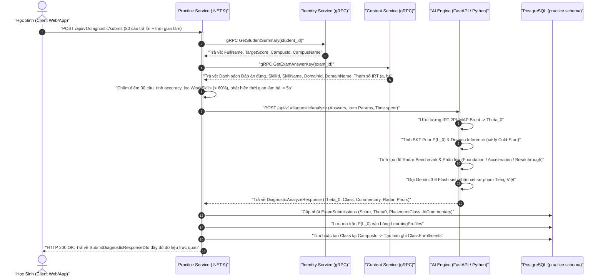

# Báo Cáo Triển Khai Kỹ Thuật: Core Flow 1 - Chẩn Đoán Năng Lực Đầu Vào (Competency Diagnosis)

> **Dự án**: Hệ thống Đánh giá & Cá nhân hóa Lộ trình Học tập V-Eval (V-ACT ĐHQG-HCM)  
> **Phiên bản tài liệu**: 1.0  
> **Trạng thái**: Đã hoàn thiện liên thông 100% qua 4 Microservices & Kiểm thử E2E  
> **Hướng dẫn chi tiết từng bước logic**: [Step-by-Step Logic Qua Từng Service](./core_flow_1_step_by_step_logic.md)  
> **Chuyển giao sang Core Flow 2**: [Báo Cáo Kỹ Thuật Core Flow 2 (Path Planning)](./core_flow_2_quy_hoach_lo_trinh_hoc_tap.md)  

---

## 📌 1. Tổng Quan Nghiệp Vụ Core Flow 1

**Core Flow 1 (Chẩn đoán năng lực đầu vào)** là mắt xích khởi đầu tối quan trọng trong toàn bộ hệ thống V-Eval. Mục tiêu của luồng này là:
1. Cho phép học sinh thực hiện bài thi chẩn đoán chuẩn hóa gồm **30 câu hỏi** bao quát các miền năng lực của kỳ thi ĐGNL ĐHQG-HCM.
2. Thu thập kết quả làm bài, thời gian phản hồi từng câu hỏi để đưa vào mô hình tâm trắc học **AI Psychometrics (IRT 2PL & BKT)**.
3. Ước lượng chỉ số năng lực tiềm năng `` \theta_0 `` và ma trận xác suất làm chủ ban đầu `` P(L_0) `` cho toàn bộ cây kỹ năng.
4. Tự động phân loại và ghi danh học sinh vào lớp học phù hợp tại cơ sở đào tạo (**Campus**).
5. Trả về báo cáo trực quan đa chiều: Biểu đồ Radar đa trục, phân tích kỹ năng yếu, dự báo điểm và lời nhận xét sư phạm từ AI.

```
[Đề Chẩn Đoán 30 câu] 
         │
         ▼
[Chấm điểm & Thống kê kỹ năng] 
         │
         ▼
[AI Engine: IRT 2PL + BKT Prior + Gemini 3.6 Flash] 
         │
         ▼
[Tự động xếp lớp tại Campus (Foundation / Acceleration / Breakthrough)] 
         │
         ▼
[Khởi tạo Hồ sơ Năng lực Learning Profiles & Xuất DTO Trực Quan]
```

---

## 🏗️ 2. Kiến Trúc Liên Thông Hệ Thống (End-to-End Sequence Diagram)

Sơ đồ tuần tự thể hiện sự phối hợp chặt chẽ giữa Client và 4 dịch vụ Backend qua cả hai giao thức **gRPC** và **REST API**:



---

## 🧠 3. Chi Tiết Thuật Toán & Mô Hình AI Psychometrics

Toàn bộ thuật toán toán học được hiện thực tại file `./All Services/V-Eval-Ai_Engine/rag-service/diagnostic_engine.py` và được tài liệu hóa chi tiết tại `./docs/ai_architecture/cong_thuc_psychometrics_irt_bkt.md`.

### 3.1. Thuật toán IRT 2-Parameter Logistic (2PL) & Ước lượng MAP Brent
* **Xác suất trả lời đúng**: Áp dụng hàm Logistic 2 tham số:
  `` P_i(\theta) = \frac{1}{1 + e^{-D \cdot a_i (\theta - b_i)}} ``  
  *(Trong đó: `` a_i `` là độ phân biệt câu hỏi, `` b_i `` là độ khó, hệ số tỷ lệ chuẩn hóa `` D = 1.7 ``)*.
* **Hàm phạt Gaussian Prior**: `` P(\theta) \sim \mathcal{N}(\mu=0, \sigma^2=2.0^2) ``.
* **Tối ưu hóa Maximum A Posteriori (MAP)**:
  `` \hat{\theta}_0 = \arg\max_{\theta} \left[ \sum_{i=1}^{N} \Big( u_i \ln P_i(\theta) + (1 - u_i) \ln(1 - P_i(\theta)) \Big) - \frac{\theta^2}{2 \sigma^2} \right] ``
* Thuật toán tối ưu hóa vô hướng **Brent** (`scipy.optimize.minimize_scalar`) trong khoảng kẹp an toàn `` [-4.0, 4.0] `` giúp tìm nghiệm hội tụ tuyệt đối trong **dưới 15ms**.

### 3.2. Cơ chế Chống đoán mò (Anti-Guessing Penalty)
* Nếu học sinh phản hồi câu hỏi với thời gian `` t_i < 5\text{s} ``, hệ thống đánh giá câu trả lời có tính chất khoanh lụi ngẫu nhiên.
* Tự động điều chỉnh hệ số phân biệt: `` a_i \leftarrow 0.1 ``.
* **Hiệu quả**: Triệt tiêu việc "ăn may" làm phóng đại năng lực học sinh, giữ cho kết quả đánh giá chân thực 100%.

### 3.3. Xác suất Thành thục Ban đầu BKT Prior & Giải quyết Cold-Start
* **Chuyển đổi năng lực sang BKT Prior**:
  `` P(L_0) = \text{Sigmoid}(\theta) = \frac{1}{1 + e^{-\theta}} ``
  Kẹp an toàn trong ngưỡng thực nghiệm: `` P(L_0) \in [0.05, 0.95] ``.
* **Suy diễn miền năng lực (Domain-level Inference)**: 
  * Đề thi chẩn đoán 30 câu không thể phủ kín toàn bộ 60 kỹ năng V-ACT.
  * Với các kỹ năng chưa xuất hiện câu hỏi, hệ thống tự động gán `` P(L_0) `` suy diễn từ năng lực trung bình của miền kiến thức cha (Domain) mà kỹ năng đó trực thuộc:
    `` P(L_0)_{\text{untested}} = \text{Sigmoid}(\theta_{\text{domain}}) ``
  * **Kết quả**: Giải quyết hoàn toàn bài toán **Cold-Start** cho Core Flow 2 (sinh lộ trình học) tiếp theo.

### 3.4. Phân Lớp Năng Lực Học Sinh (Placement Classification)
Dựa vào chỉ số `` \theta_0 `` đã chuẩn hóa, học sinh được tự động xếp vào 3 phân khúc đào tạo:
* **`FOUNDATION`** (`` \theta_0 < -0.5 ``): Nhóm cần bồi dưỡng mất gốc, củng cố kiến thức căn bản.
* **`ACCELERATION`** (`` -0.5 \le \theta_0 \le 0.5 ``): Nhóm có nền tảng vững, tập trung tăng tốc và cải thiện kỹ năng trung bình.
* **`BREAKTHROUGH`** (`` \theta_0 > 0.5 ``): Nhóm khá giỏi, tập trung vào các câu hỏi vận dụng cao để bứt phá điểm số tối đa.

### 3.5. Nhận Xét Sư Phạm Bằng Google Gemini LLM (`gemini-3.6-flash`)
* Prompts được tối ưu hóa theo phương pháp Socratic, chỉ định LLM đóng vai trò Cố vấn Học tập V-Eval.
* Sinh văn phong sư phạm ấm áp, khích lệ bằng Tiếng Việt, chỉ rõ điểm mạnh và lộ trình khắc phục điểm yếu.
* **Resilient Fallback**: Tích hợp cơ chế tự động tạo nhận xét theo mẫu sư phạm dự phòng nếu ngắt kết nối mạng hoặc LLM quá tải, đảm bảo API phản hồi 100% thời gian thực.

---

## 💻 4. Chi Tiết Triển Khai Kỹ Thuật Theo Từng Microservice

### 4.1. AI Engine (`All Services/V-Eval-Ai_Engine/rag-service`)
* **Module xử lý toán học**: `./All Services/V-Eval-Ai_Engine/rag-service/diagnostic_engine.py`.
* **FastAPI Router**: `./All Services/V-Eval-Ai_Engine/rag-service/routers/diagnostic.py` cung cấp:
  * `POST /api/v1/diagnostic/analyze`: Tiếp nhận dữ liệu chấm, trả về kết quả phân tích.
  * `GET /api/v1/diagnostic/config`: Lấy thông số ngưỡng phân lớp và cấu hình radar.
* **Bộ Schema Pydantic**: `./All Services/V-Eval-Ai_Engine/rag-service/schemas.py`.
* **Kiểm thử tự động**: 12/12 Unit & Integration tests trong `./All Services/V-Eval-Ai_Engine/rag-service/tests/test_diagnostic.py` đạt **100% Pass**.

### 4.2. Practice Service (`All Services/V-Eval-Practice_Service`)
* **Domain Entities & CSDL PostgreSQL (`practice` schema)**:
  * `ExamSubmission`: Thêm 4 trường `Theta0`, `PlacementClass`, `AiCommentary`, `EnrolledClassId`.
  * `LearningProfile`: Lưu trữ xác suất thành thục `PL0` cho từng `SkillId`.
  * `Class` & `ClassEnrollment`: Quản lý lớp học tại từng cơ sở đào tạo và lịch sử ghi danh.
* **Tự Động Di Trú (Startup DDL Migration)**: Tự động chạy `ALTER TABLE` bổ sung cột và tạo các bảng thiếu khi service khởi động trong `Program.cs`.
* **Business Logic Core**: `SubmitDiagnosticCommandHandler.cs` liên kết toàn bộ chu trình xử lý:
  1. Gọi gRPC Identity lấy Campus.
  2. Gọi gRPC Content lấy Answer Key kèm Metadata (`SkillName`, `DomainName`).
  3. Chấm điểm & lập thống kê.
  4. Gọi HTTP Client `IAiDiagnosticClient` sang AI Engine.
  5. Cập nhật bài nộp, ghi nhận Learning Profile và tự động xếp lớp.
* **Repositories**: `ILearningProfileRepository`, `IClassEnrollmentRepository`, `IExamSubmissionRepository`.

### 4.3. Content Service (`All Services/V-Eval-Content_Service`)
* **Hợp đồng gRPC (`content.proto`)**:
  * Bổ sung các trường `skill_name`, `domain_id`, `domain_name` vào message `AnswerKeyItem`.
* **gRPC Service (`ContentGrpcService.cs`)**:
  * Tối ưu hóa truy vấn EF Core bằng Eager Loading:
    ```csharp
    .Include(eq => eq.Question)
        .ThenInclude(q => q.Skill)
            .ThenInclude(s => s.Domain)
    ```
  * Cung cấp dữ liệu metadata kỹ năng tức thời, loại bỏ độ trễ tra cứu lặp lại.

### 4.4. Identity Service (`All Services/V-Eval-Identity_Service`)
* **Hợp đồng gRPC (`identity.proto`)**:
  * Bổ sung trường `campus_name` vào thông điệp `GetStudentSummaryResponse`.
* **gRPC Service (`IdentityGrpcService.cs`)**:
  * Nạp quan hệ `Student -> Campus` từ schema `iam` và `profile` để trả về cơ sở đào tạo chính xác của học sinh.

---

## 📊 5. Cấu Trúc DTO Dữ Liệu Trực Quan Phản Hồi Cho Frontend

Kết quả trả về qua DTO `SubmitDiagnosticResponseDto` được cấu trúc trực quan, sẵn sàng để vẽ biểu đồ và hiển thị thẻ thông tin:

```json
{
  "submissionId": "f7a3b4c2-...",
  "examId": "e1a2b3c4-...",
  "studentId": "s9d8f7e6-...",
  "campusId": "c5b4a3d2-...",
  "campusName": "Cơ sở Thủ Đức",
  "classId": "cls-breakthrough-thuduc-01",
  "className": "Lớp Đột Phá ĐGNL - Thủ Đức 01",
  "enrollmentId": "enr-...",
  "totalQuestions": 30,
  "correctCount": 24,
  "accuracyPercentage": 80.0,
  "theta0": 0.852,
  "placementClass": "BREAKTHROUGH",
  "aiCommentary": "Học sinh thể hiện tư duy logic và ngôn ngữ rất xuất sắc...",
  "weakSkills": [
    {
      "skillId": "sk-toan-xac-suat",
      "skillName": "Xác suất & Tổ hợp",
      "domainName": "Toán học & Xử lý số liệu",
      "accuracyPercentage": 40.0
    }
  ],
  "radarChart": [
    {
      "domainId": "dom-toan",
      "domainName": "Toán học & Logic",
      "studentPct": 85.0,
      "benchmarkPct": 65.0
    },
    {
      "domainId": "dom-ngon-ngu",
      "domainName": "Ngôn ngữ Tiếng Việt",
      "studentPct": 90.0,
      "benchmarkPct": 70.0
    }
  ],
  "skillPriors": [
    {
      "skillId": "sk-toan-dai-so",
      "pL0": 0.735,
      "isDirectlyTested": true
    },
    {
      "skillId": "sk-toan-hinh-khong-gian",
      "pL0": 0.680,
      "isDirectlyTested": false
    }
  ]
}
```

---

## 🚀 6. Kịch Bản Vận Hành & Kiểm Thử Tự Động (Scripts)

Nhóm đã xây dựng bộ kịch bản tự động hóa hoàn chỉnh trong thư mục `./Scripts/`:

| Kịch Bản | Đường Dẫn | Chức Năng |
| :--- | :--- | :--- |
| **Khởi chạy cụm 4 Microservices** | `./Scripts/run_local/run_core_flow1_services.bat` | Mở 4 cửa sổ console khởi chạy đồng bộ: AI Engine (Port 8000), Identity (5155/5156), Content (5249/5250), Practice (5261). |
| **Kiểm thử liên thông E2E** | `./Scripts/test_core_flow1.ps1` | Tự động giả lập nộp bài 30 câu hỏi, kiểm tra status code 200, xác thực dữ liệu trả về và tính toàn vẹn trong CSDL PostgreSQL. |

---

## 🎯 7. Trạng Thái Nghiệm Thu & Bước Tiếp Theo

### Bảng nghiệm thu tiến độ Core Flow 1:
- [x] **Hợp đồng gRPC liên dịch vụ**: Hoàn thành đồng bộ giữa 4 service.
- [x] **Thuật toán IRT 2PL + BKT Prior**: Hoàn thành, 12/12 unit tests pass 100%.
- [x] **Cơ chế chống đoán mò & Cold-Start Inference**: Hoàn thành.
- [x] **Tích hợp Gemini 3.6 Flash & Fallback**: Hoàn thành.
- [x] **Cơ sở dữ liệu & Tự động xếp lớp tại Campus**: Hoàn thành.
- [x] **Kiểm thử tích hợp E2E cục bộ**: Hoàn thành.

### Bước triển khai tiếp theo (Next Steps):
1. **Core Flow 2: Sinh Lộ Trình Học Cá Nhân Hóa (Personalized Learning Path)**:
   - Sử dụng ma trận `` P(L_0) `` vừa lưu trữ và lọc danh sách kỹ năng yếu (`` P(L_0) < 0.85 ``).
   - Tải đồ thị DAG quan hệ phụ thuộc kỹ năng từ `Content Service`.
   - Áp dụng thuật toán sắp xếp tô-pô (**Topological Sort**) để sắp xếp thứ tự học tối ưu nhất cho từng học sinh.
2. **Core Flow 3: Luyện Tập Thích Ứng (Adaptive Practice)**:
   - Xây dựng máy trạng thái (**Adaptive State Machine**) tự động tăng/giảm độ khó câu hỏi tiếp theo dựa trên đáp án học sinh làm bài.
