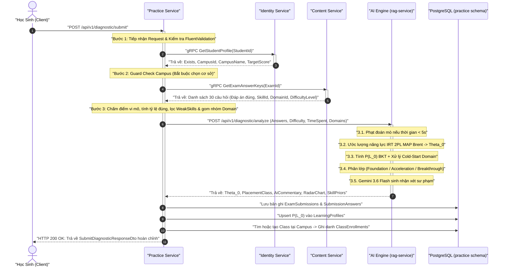

# Hướng Dẫn Chi Tiết: Step-by-Step Cách Hoạt Động Logic Core Flow 1 Qua Từng Service

> **Dự án**: Hệ thống Đánh giá & Cá nhân hóa Lộ trình Học tập V-Eval (V-ACT ĐHQG-HCM)  
> **Tài liệu liên quan**: [Báo Cáo Kỹ Thuật Core Flow 1](./core_flow_1_chan_doan_nang_luc.md) | [Định Tuyến API Gateway YARP](./api_gateway_yarp_dinh_tuyen.md)  
> **Trạng thái**: Hoàn thiện 100% qua 4 Microservices & Kiểm thử E2E  

---

## 📌 1. Bức Tranh Tổng Thể (Architectural Overview)

Trong hệ thống V-Eval, **Core Flow 1 (Chẩn đoán năng lực đầu vào)** được thiết kế theo kiến trúc hướng dịch vụ (Microservices), phối hợp giữa **gRPC** (giao tiếp nội bộ tốc độ cao giữa các service .NET) và **REST API** (giao tiếp với AI Engine bằng Python FastAPI):

```
[Client (Web / Mobile App)]
            │  (HTTP POST /api/v1/diagnostic/submit)
            ▼
┌────────────────────────────────────────────────────────────────────────┐
│                      PRACTICE SERVICE (.NET 9)                         │
│                    (Orchestrator trung tâm luồng)                      │
└─────┬───────────────────┬──────────────────────┬───────────────────────┘
      │ (1) gRPC          │ (2) gRPC             │ (3) HTTP REST
      ▼                   ▼                      ▼
┌──────────────┐   ┌──────────────┐      ┌───────────────────────────────┐
│   IDENTITY   │   │   CONTENT    │      │           AI ENGINE           │
│   SERVICE    │   │   SERVICE    │      │       (FastAPI / Python)      │
│  (Port 5156) │   │  (Port 5250) │      │          (Port 8000)          │
└──────────────┘   └──────────────┘      └───────────────────────────────┘
  • GetStudentProfile  • GetExamAnswerKeys   • IRT 2PL MAP Brent (Theta_0)
  • Campus & Target      + Metadata            • BKT Prior P(L_0) & Cold-Start
                         (Skills, Domains)   • Radar Benchmark & Classify
                                             • Gemini 3.6 Flash Commentary
```

---

## 🔄 2. Sơ Đồ Trình Tự Thực Thi Tuần Tự (Detailed Sequence Flow)



---

## 🔍 3. Chi Tiết Logic Thực Thi Step-by-Step Qua Từng Service

### Bước 1: Client gửi yêu cầu nộp bài chẩn đoán (Client -> Practice Service)
* **Giao thức**: `HTTP POST`
* **Endpoint**: `/api/v1/diagnostic/submit`
* **Dữ liệu gửi lên (`SubmitDiagnosticCommand`)**:
  ```json
  {
    "studentId": "3fa85f64-5717-4562-b3fc-2c963f66afa6",
    "examId": "e1a2b3c4-d5e6-4f7a-8b9c-0d1e2f3a4b5c",
    "startedAt": "2026-09-24T00:30:00Z",
    "answers": [
      {
        "questionId": "q01-guid...",
        "selectedOption": "A",
        "timeSpentSeconds": 45
      },
      ... (đủ 30 câu hỏi)
    ]
  }
  ```
* **Xử lý tại Practice Service**:
  - `SubmitDiagnosticCommandValidator` (FluentValidation) thẩm định:
    - `StudentId` và `ExamId` không được rỗng.
    - `Answers` không được rỗng và bắt buộc chứa đúng **30 câu trả lời**.
    - `TimeSpentSeconds` của mỗi câu phải không âm (`>= 0`).
  - Nếu dữ liệu không hợp lệ, trả về ngay HTTP 400 Bad Request kèm danh sách lỗi.

---

### Bước 2: Xác minh thông tin học sinh & Cơ sở đào tạo (Practice Service -> Identity Service)
* **Giao thức**: `gRPC` (Cổng 5156)
* **Hàm gọi**: `IIdentityGrpcClient.GetStudentProfileAsync(studentId)` -> `IdentityGrpcService.GetStudentSummary`
* **Logic xử lý tại Identity Service**:
  1. Truy vấn schema `iam` và `profile` (`Users`, `Students`, `Campuses`).
  2. Lấy thông tin họ tên, điểm số mục tiêu (`TargetScore`, mặc định 800 nếu chưa đặt), và cơ sở đào tạo (`CampusId`, `CampusName`).
* **Logic Guard tại Practice Service**:
  - **Trường hợp 1 (Học sinh không tồn tại)**: Trả về lỗi `Error.NotFound("Student.NotFound")`.
  - **Trường hợp 2 (Chưa chọn cơ sở đào tạo)**: Nếu `CampusId` rỗng/null, hệ thống chặn lại và trả về lỗi:
    > *"Học sinh cần chọn cơ sở đào tạo (Campus) trước khi thực hiện bài kiểm tra chẩn đoán năng lực."*  
    *(Quy tắc nghiệp vụ: Phục vụ cho việc tự động xếp lớp tại cơ sở ở Bước 5).*

---

### Bước 3: Lấy đáp án chuẩn & Metadata câu hỏi (Practice Service -> Content Service)
* **Giao thức**: `gRPC` (Cổng 5250)
* **Hàm gọi**: `IContentGrpcClient.GetExamAnswerKeysAsync(examId)` -> `ContentGrpcService.GetExamAnswerKey`
* **Logic xử lý tại Content Service**:
  1. Dùng EF Core truy vấn danh sách câu hỏi thuộc đề `examId`.
  2. Nạp dữ liệu đa cấp (Eager Loading) liên thông bảng:
     ```csharp
     .Include(eq => eq.Question)
         .ThenInclude(q => q.Skill)
             .ThenInclude(s => s.Domain)
     ```
  3. Trả về Dictionary 30 câu chứa: `QuestionId`, `CorrectOption`, `QuestionOrder`, `SkillId`, `SkillName`, `DomainId`, `DomainName`, `DifficultyLevel` (1: Dễ, 2: Trung bình, 3: Khó, 4: Rất khó).
* **Logic Guard tại Practice Service**:
  - Nếu đề thi không có câu hỏi hoặc không tìm thấy đề, trả về lỗi `Error.NotFound("Exam.NotFound")`.

---

### Bước 4: Chấm điểm vi mô & Phân tích thống kê (Nội bộ Practice Service)
Sau khi có cả câu trả lời của học sinh và bảng đáp án chuẩn từ Content Service, `SubmitDiagnosticCommandHandler` tiến hành phân tích cục bộ:
1. **Chấm điểm từng câu**:
   - So khớp `SelectedOption` và `CorrectOption` (không phân biệt chữ hoa/thường).
   - Đếm tổng số câu đúng `totalCorrect` (thang điểm 0 - 30).
   - Tính tổng thời gian làm bài `totalTimeSpent`.
   - Tạo danh sách `SubmissionAnswer` chi tiết.
2. **Phân tích kỹ năng (Skill Breakdown & Weak Skills)**:
   - Gom nhóm 30 câu hỏi theo `SkillId`.
   - Tính tỷ lệ chính xác từng kỹ năng: `` \text{Accuracy} = \frac{\text{Số câu đúng}}{\text{Tổng câu kỹ năng}} \times 100\% ``.
   - **Xác định kỹ năng yếu (`WeakSkills`)**: Mọi kỹ năng có tỷ lệ chính xác **dưới 60%** được đánh dấu `IsWeak = true` để làm đầu vào cho Core Flow 2 (sinh lộ trình học).
3. **Phân tích độ khó (Difficulty Breakdown)**:
   - Gom nhóm theo 4 mức độ: *Nhận biết (1)*, *Thông hiểu (2)*, *Vận dụng (3)*, *Vận dụng cao (4)*.
   - Thống kê tỷ lệ làm đúng trên từng cấp độ nhận thức.
4. **Chuẩn bị Payload gửi sang AI Engine**:
   - Trích xuất danh sách các miền kiến thức (`DomainNames`) xuất hiện trong bài làm.
   - Đóng gói dữ liệu câu hỏi, đáp án đúng/sai, độ khó và thời gian làm từng câu sang `DiagnosticAnalyzeRequestPayload`.

---

### Bước 5: Phân tích tâm trắc học AI Psychometrics & LLM (Practice Service -> AI Engine)
* **Giao thức**: `HTTP REST POST`
* **Endpoint**: `http://localhost:8000/api/v1/diagnostic/analyze`
* **Được xử lý tại**: `./All Services/V-Eval-Ai_Engine/rag-service/routers/diagnostic.py` và `./diagnostic_engine.py`

Quá trình phân tích trong AI Engine diễn ra qua 5 tiểu bước:

```
[30 Câu hỏi + Thời gian làm bài]
              │
              ▼
   (1) Lọc Anti-Guessing (< 5s -> a = 0.1)
              │
              ▼
   (2) Ước lượng IRT 2PL MAP Brent -> Theta_0
              │
              ▼
   (3) Tính BKT Prior P(L_0) & Suy diễn Domain Cold-Start
              │
              ▼
   (4) Tính tọa độ Radar Benchmark & Phân lớp Placement
              │
              ▼
   (5) Gemini 3.6 Flash sinh nhận xét sư phạm (hoặc Rule-based fallback)
              │
              ▼
[Trả kết quả phân tích về Practice Service]
```

#### 5.1. Cơ chế Chống đoán mò (Anti-Guessing Penalty)
* Với mỗi câu hỏi, kiểm tra thời gian học sinh suy nghĩ:
  - Nếu `TimeSpentSeconds < 5s`, hệ thống đánh giá đây là hành vi khoanh bừa/đoán mò ngẫu nhiên.
  - Tham số phân biệt của câu hỏi lập tức bị hạ xuống: `` a_i \leftarrow 0.1 `` (thay vì 1.2).
  - Giúp loại trừ yếu tố "ăn may", ngăn chặn việc học sinh khoanh lụi đúng làm sai lệch năng lực thực tế.

#### 5.2. Ước lượng năng lực IRT 2-Parameter Logistic (2PL)
* Áp dụng mô hình toán học IRT 2PL:
  `` P_i(\theta) = \frac{1}{1 + e^{-1.7 \cdot a_i (\theta - b_i)}} ``
  *(Trong đó: `` b_i `` được ánh xạ từ `DifficultyLevel` sang thang `` [-1.2, +1.6] ``)*.
* Tối ưu hóa hàm hợp lý cực đại kết hợp tiên nghiệm chuẩn (MAP):
  `` \mathcal{N}(0, 2^2) ``
* Dùng thuật toán **Brent scalar minimization** (`scipy.optimize.minimize_scalar`) trong biên `[-4.0, +4.0]` để tìm ra chỉ số năng lực tổng quát `` \theta_0 `` với tốc độ siêu tốc (< 15ms).

#### 5.3. Xác suất thành thục ban đầu BKT Prior & Giải quyết bài toán Cold-Start
* **Kỹ năng xuất hiện trong bài thi**:
  `` P(L_0) = \text{Sigmoid}(\theta_{\text{skill}}) = \frac{1}{1 + e^{-\theta_{\text{skill}}}} ``  
  *(Kẹp an toàn trong đoạn `[0.05, 0.95]`)*.
* **Kỹ năng chưa xuất hiện trong đề (Cold-Start)**:
  - Bài thi chẩn đoán 30 câu không thể hỏi hết 60+ kỹ năng trong chương trình V-ACT.
  - Các kỹ năng chưa thi sẽ tự động nhận giá trị tiên nghiệm suy diễn từ năng lực trung bình của Miền kiến thức cha (`Domain-level Inference`):
    `` P(L_0)_{\text{untested}} = \text{Sigmoid}(\theta_{\text{domain}}) ``
  - Nhờ đó, hồ sơ học tập (`LearningProfile`) có đủ 100% dữ liệu kỹ năng ngay từ ngày đầu.

#### 5.4. Phân khúc lớp học (Placement Classification)
Dựa trên giá trị `` \theta_0 ``:
* `` \theta_0 < -0.5 ``: Xếp lớp **`FOUNDATION`** (Lớp Nền tảng, củng cố mất gốc).
* `` -0.5 \le \theta_0 \le 0.5 ``: Xếp lớp **`ACCELERATION`** (Lớp Tăng tốc).
* `` \theta_0 > 0.5 ``: Xếp lớp **`BREAKTHROUGH`** (Lớp Bứt phá mục tiêu 900+).

#### 5.5. Dữ liệu Radar đa trục & Nhận xét sư phạm Gemini
* Tính toán tỷ lệ phần trăm năng lực của học sinh trên từng miền kiến thức so với điểm chuẩn kỳ vọng (`BenchmarkPct` dựa trên `TargetScore`).
* Gọi **Google Gemini 3.6 Flash** (`gemini-3.6-flash`) với prompt sư phạm đóng vai Cố vấn học tập V-Eval để sinh lời nhận xét động viên bằng Tiếng Việt.
* Nếu không có API Key hoặc mạng chập chờn, tự động kích hoạt **Rule-based Fallback** tạo nhận xét sư phạm tức thì, đảm bảo 0% lỗi gián đoạn.

---

### Bước 6: Lưu trữ dữ liệu & Tự động xếp lớp tại Campus (Nội bộ Practice Service)

Sau khi nhận kết quả từ AI Engine, Practice Service thực hiện lưu trữ giao dịch toàn vẹn:

1. **Lưu bài làm học sinh vào bảng `ExamSubmissions`**:
   - Lưu `TotalScore`, `TotalCorrect`, `TotalQuestions`, `TotalTimeSpentSeconds`.
   - Lưu các chỉ số do AI tính toán: `Theta0`, `PlacementClass`, `AiCommentary`.
   - Lưu danh sách 30 câu làm bài vào bảng con `SubmissionAnswers`.
2. **Khởi tạo Hồ sơ Năng lực vào bảng `LearningProfiles`**:
   - Lưu trữ cặp giá trị `(SkillId, MasteryScore = P(L_0))` cho học sinh.
   - Đây là cơ sở cốt lõi để Core Flow 2 lấy làm dữ liệu đầu vào sinh lộ trình.
3. **Tự động xếp học sinh vào lớp học tại Campus (`ClassEnrollmentRepository`)**:
   - Sử dụng `CampusId` đã lấy ở Bước 2 và `PlacementClass` từ AI.
   - Tìm kiếm lớp học tại cơ sở đang mở và còn chỗ cho phân khúc tương ứng.
   - Nếu cơ sở chưa có lớp cho phân khúc này, hệ thống **tự động tạo mới một lớp học** (Ví dụ: *"Lớp Bứt phá ĐGNL - Cơ sở Thủ Đức 01"*).
   - Thêm bản ghi vào bảng `ClassEnrollments` đánh dấu học sinh đã vào lớp chính thức.
   - Cập nhật mã lớp `EnrolledClassId` ngược lại vào bản ghi `ExamSubmissions`.

---

### Bước 7: Đóng gói DTO & Trả kết quả trực quan về Client (Practice Service -> Client)
* **Giao thức**: `HTTP 200 OK`
* **Dữ liệu trả về (`SubmitDiagnosticResponseDto`)**:
  - **Thông tin tổng quan**: `SubmissionId`, `CampusName`, `ClassName`, `PlacementClass`, `Theta0`.
  - **Thống kê làm bài**: `TotalScore` (ví dụ: 24/30), `AccuracyPercentage` (80.0%), `TotalTimeSpentSeconds`.
  - **Lời nhận xét AI**: `AiCommentary` ("Học sinh thể hiện tư duy ngôn ngữ rất sắc bén...").
  - **Danh sách kỹ năng yếu**: `WeakSkills` (Tên kỹ năng, miền kiến thức, tỷ lệ đúng để học sinh biết cần ôn tập phần nào).
  - **Dữ liệu vẽ biểu đồ Radar**: `RadarChart` (Danh sách miền kiến thức, điểm học sinh `StudentPct` và điểm chuẩn `BenchmarkPct`).
  - **Chi tiết từng câu hỏi**: Danh sách 30 câu kèm đáp án đã chọn, đáp án đúng, độ khó, kỹ năng để học sinh xem lại bài thi.

---

## 📋 4. Bảng Tổng Hợp Vai Trò Các Microservices Trong Core Flow 1

| Microservice | Giao thức kết nối | Công nghệ chính | Trách nhiệm chính trong Core Flow 1 |
| :--- | :--- | :--- | :--- |
| **Practice Service** | REST API & gRPC Client | .NET 9, MediatR, EF Core, PostgreSQL | Nhận nộp bài từ Client, điều phối liên dịch vụ, chấm điểm, lưu bài thi, cập nhật Learning Profile và xếp lớp tại Campus. |
| **Identity Service** | gRPC Server | .NET 9, EF Core, PostgreSQL | Cung cấp thông tin hồ sơ học sinh, điểm số mục tiêu và cơ sở đào tạo (Campus). |
| **Content Service** | gRPC Server | .NET 9, EF Core, PostgreSQL | Cung cấp bảng đáp án chuẩn kèm đầy đủ cây phân cấp kiến thức (`Question -> Skill -> Domain`) và độ khó. |
| **AI Engine (`rag-service`)** | HTTP REST Server | Python, FastAPI, NumPy, SciPy, Gemini LLM | Tính toán tâm trắc học IRT 2PL, BKT Prior, xử lý Cold-Start, phân lớp đào tạo và sinh nhận xét sư phạm. |

---

## 🔗 5. Liên Kết Tích Hợp Đến Các Core Flow Tiếp Theo

1. **Chuyển tiếp sang Core Flow 2 (Sinh lộ trình học cá nhân hóa)**:
   - Dữ liệu `LearningProfiles` chứa các giá trị `` P(L_0) `` vừa lưu sẽ được `Path Engine` đọc lên.
   - Các kỹ năng có `` P(L_0) < 0.85 `` hoặc nằm trong danh sách `WeakSkillIds` sẽ được đưa vào thuật toán **Topological Sort** theo đồ thị DAG kỹ năng để tạo lộ trình các bài học tối ưu.
2. **Chuyển tiếp sang Core Flow 3 (Luyện tập thích ứng Adaptive Practice)**:
   - Chỉ số năng lực `` \theta_0 `` ước lượng được tại Core Flow 1 sẽ đóng vai trò là điểm xuất phát năng lực ban đầu của học sinh khi bước vào phòng luyện thi thích ứng.
