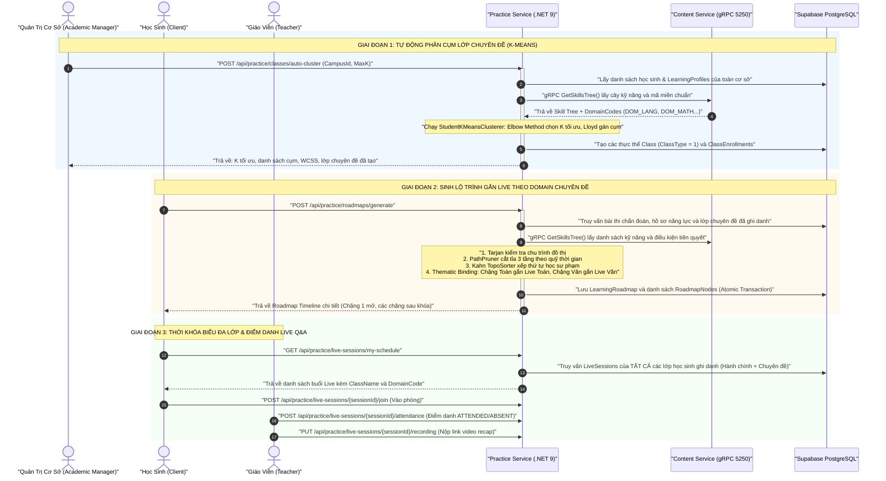
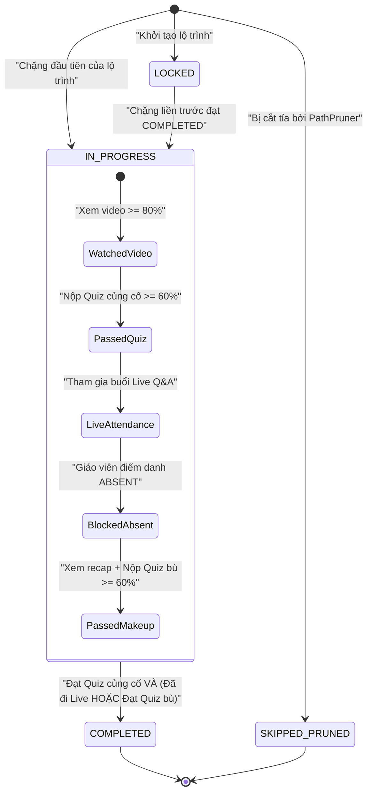

# Báo Cáo Triển Khai Kỹ Thuật & Kiến Trúc Toàn Diện Core Flow 2: Quy Hoạch Lộ Trình Học Tập Thích Ứng & Phân Cụm Lớp Chuyên Đề (Thematic Cohorts)

> **Dự án**: Nền tảng Đánh giá & Học tập Thích ứng V-Eval (Chuẩn cấu trúc ĐGNL ĐHQG-HCM)\
****Kiến trúc**: Microservices (.NET 9, Clean Architecture 4 tầng, MediatR, FluentValidation, EF Core 9, Supabase PostgreSQL schema: `v_eval_practice`, gRPC Port 5250)\
****Trạng thái**: 🟢 **ĐÃ HOÀN THIỆN TOÀN DIỆN 100%** (Toàn bộ 15 APIs cốt lõi + Phân hệ Lớp chuyên đề K-Means Clustering & Adaptive Elbow Method)\
****Liên thông với Core Flow 1**: [Báo Cáo Kỹ Thuật Core Flow 1](./core_flow_1_chan_doan_nang_luc.md)

---

## 📌 1. Bối Cảnh Và Sự Đổi Mới Cốt Lõi (Context & Key Paradigm Shift)

### 1.1 Vấn Đề Của Mô Hình Cũ (Before)

Trước đây, sau bài thi chẩn đoán (Core Flow 1), toàn bộ học sinh tại một cơ sở đào tạo chỉ được chia vào 3 lớp hành chính đơn thuần dựa trên năng lực tổng thể `` `\theta_0` `` (Nền tảng, Tăng tốc, Bứt phá):

- **Hạn chế sư phạm**: Học sinh yếu môn Toán phải ngồi chung lớp bổ trợ với học sinh yếu môn Ngữ văn hoặc KHTN. Giáo viên không thể dạy sâu chuyên đề vì trình độ và lỗ hổng của học sinh trong lớp quá phân tán.
- **Hạn chế lộ trình**: Mọi chặng học trong lộ trình (dù là chặng Toán hay chặng Văn) đều bị gán vào duy nhất một buổi Live Q&A hành chính chung.

### 1.2 Đột Phá Kiến Trúc Mới: Lớp Chuyên Đề Phân Cụm K-Means (After)

Hệ thống nâng cấp quy trình thành mô hình **Đa ghi danh (Multi-Class Cohort System)** kết hợp trí tuệ nhân tạo phân cụm:

1. **Lớp Hành Chính Cơ Sở (**`ClassType = 0`**)**: Duy trì quản lý hành chính, điểm danh và các buổi sinh hoạt chung theo tier năng lực tổng thể `` `\theta_0` ``.
2. **Lớp Chuyên Đề Kiến Thức (**`ClassType = 1`**)**: Academic Manager bấm 1 nút $\\to$ Động cơ **K-Means Clustering + Adaptive Elbow Method** tự động quét vector độ thành thạo 4 miền năng lực $\[\\text{DOM_LANG}, \\text{DOM_MATH}, \\text{DOM_NAT_SCI}, \\text{DOM_SOC_SCI}\]$ của toàn bộ học sinh tại cơ sở, tìm ra số lượng cụm $K$ tối ưu, sinh ra các lớp chuyên đề riêng biệt (Ví dụ: *"Chuyên đề: Trọng điểm Toán - Logic"*, *"Chuyên đề: Trọng điểm Ngôn ngữ"*) và tự động ghi danh học sinh vào lớp tương ứng với lỗ hổng của mình.
3. **Gắn Kết LiveSession Chuyên Biệt**: Khi học sinh tạo lộ trình học tập, chặng học Toán sẽ tự động được gắn với buổi Live Q&A của lớp chuyên đề Toán; chặng học Ngôn ngữ gắn với Live Q&A của lớp chuyên đề Ngôn ngữ!
4. **Thời Khóa Biểu Tổng Hợp Đa Lớp**: API xem lịch học tự động tổng hợp toàn bộ các buổi Live từ tất cả các lớp (cả lớp hành chính và các lớp chuyên đề) mà học sinh đang theo học.

---

## 🗺️ 2. Sơ Đồ Kiến Trúc & Luồng Vận Hành Toàn Tuyến (End-to-End Flowchart)

```mermaid
flowchart TD
    subgraph STAGE1 ["1. ĐẦU VÀO TỪ CORE FLOW 1 (CHẨN ĐOÁN NĂNG LỰC)"]
        CF1["Học sinh hoàn thành bài thi chẩn đoán (30 câu)"]
        --> Vector["AI Engine tính toán: theta_0 + Vector P(L0) 4 miền"]
        --> AdminClass["Tự động xếp vào Lớp Hành Chính (ClassType = 0)"]
    end

    subgraph STAGE2 ["2. GOM CỤM LỚP CHUYÊN ĐỀ K-MEANS (ACADEMIC MANAGER)"]
        AdminClass --> AutoCluster["API: POST /api/practice/classes/auto-cluster"]
        AutoCluster --> Elbow["Adaptive Elbow Method (Quét K = 2..Kmax, tính WCSS)"]
        Elbow --> KMeans["K-Means++ & Lloyd Algorithm gom N học sinh vào K cụm"]
        KMeans --> CreateThematic["Tạo K Lớp Chuyên Đề (ClassType = 1, DomainCode)"]
        CreateThematic --> MultiEnroll["Ghi danh học sinh vào Lớp Chuyên Đề (ClassEnrollments)"]
    end

    subgraph STAGE3 ["3. QUY HOẠCH LỘ TRÌNH HỌC TẬP THÍCH ỨNG (STUDENT)"]
        MultiEnroll --> GenRoadmap["API 1: POST /api/practice/roadmaps/generate"]
        GenRoadmap --> Pruning["Path Pruning Engine (Cắt tỉa 3 tầng theo quỹ thời gian)"]
        Pruning --> Tarjan["Tarjan Cycle Detector (Kiểm tra chu trình DAG)"]
        Tarjan --> TopoSort["Topological Sorter (Kahn + PriorityQueue Sư phạm)"]
        TopoSort --> DomainBinding["Thematic LiveSession Binding (Gắn Live theo đúng DomainCode)"]
        DomainBinding --> InitFSM["Khởi tạo FSM: Chặng 1 IN_PROGRESS, các chặng sau LOCKED"]
    end

    subgraph STAGE4 ["4. HỌC TẬP TỪNG CHẶNG 3 THÀNH PHẦN (MILESTONE TRIO)"]
        InitFSM --> API2["API 2: GET /roadmaps/my-roadmap (Xem Timeline, % tiến độ, Stages)"]
        API2 --> API3["API 3: GET /roadmaps/nodes/{nodeId} (Chi tiết chặng học)"]
        API3 --> StepVideo["Thành phần 1: Xem Video lý thuyết (API 4)"]
        StepVideo -- "Xem >= 80%" --> StepQuiz["Thành phần 2: Làm Quiz củng cố chặng (API 5 & 6)"]
        StepQuiz -- "Đạt >= 60%" --> UnlockNext["FSM mở khóa Chặng học kế tiếp"]
    end

    subgraph STAGE5 ["5. TƯƠNG TÁC LIVE Q&A CHUYÊN ĐỀ & XỬ LÝ NGOẠI LỆ"]
        UnlockNext --> Schedule["API 10: GET /live-sessions/my-schedule (Lịch Live đa lớp)"]
        Schedule --> JoinLive["API 11: POST /live-sessions/{sessionId}/join (Vào phòng & Ghi vết)"]
        JoinLive --> Attendance["API 12: Giáo viên điểm danh (ATTENDED hoặc ABSENT)"]
        Attendance -- "Nếu ABSENT (Vắng mặt)" --> Blocked["Chặng học bị phong tỏa tạm thời"]
        Attendance -- "Nếu ATTENDED" --> Passed["Chặng học hoàn thành xuất sắc"]
        Blocked --> MakeupQuiz["API 7: Xem video ghi hình (API 14) + Nộp Quiz bù >= 60%"]
        MakeupQuiz --> Resolved["Giải phóng phong tỏa -> Chuyển chặng COMPLETED"]
    end
```



---

## 🏗️ 3. Sơ Đồ Tuần Tự Liên Microservices (Sequence Diagram)



---

## 📊 4. Ma Trận Dữ Liệu 4 Miền Năng Lực & 12 Kỹ Năng Chuẩn ĐGNL

Đề thi Đánh giá năng lực ĐHQG-HCM được chuẩn hóa thành **4 miền năng lực cốt lõi**:

| Mã Miền (`domain_code`) | Tên Miền Năng Lực | Điểm Tối Đa | Danh Sách Kỹ Năng Thành Phần Chuẩn |
| --- | --- | --- | --- |
| `DOM_LANG` | **Sử dụng Ngôn ngữ** | 450 điểm | • `sk_viet_doc_hieu`: Đọc hiểu văn bản Tiếng Việt (15%)<br>• `sk_viet_ngu_phap`: Ngữ pháp & Logic câu Tiếng Việt (10%)<br>• `sk_eng_reading`: Đọc hiểu văn bản Tiếng Anh (10%)<br>• `sk_eng_grammar`: Ngữ pháp & Từ vựng Tiếng Anh (10%) |
| `DOM_MATH` | **Toán học & Tư duy logic** | 400 điểm | • `sk_math_algebra`: Đại số, Hàm số & Giải tích (12%)<br>• `sk_math_geometry`: Hình học & Lượng giác không gian (8%)<br>• `sk_logic_deduction`: Suy luận Logic & Mệnh đề (10%)<br>• `sk_data_analysis`: Phân tích số liệu & Bảng biểu (10%) |
| `DOM_NAT_SCI` | **Khoa học tự nhiên** | 200 điểm | • `sk_phys_mechanics`: Vật lý đại cương & Cơ nhiệt (5%)<br>• `sk_chem_reactions`: Hóa học vô cơ & Hữu cơ (4%)<br>• `sk_bio_genetics`: Sinh học di truyền & Sinh thái (3%) |
| `DOM_SOC_SCI` | **Khoa học xã hội** | 150 điểm | • `sk_soc_history_geo`: Tổng hợp Lịch sử & Địa lý VN (3%) |

---

## ⚙️ 5. Đặc Tả Thuật Toán & Động Cơ Xử Lý (Algorithmic Engines)

### 5.1 Động Cơ Phân Cụm Lỗ Hổng Kiến Thức (`StudentKMeansClusterer`)

- **Không gian vector**: Mỗi học sinh được đại diện bởi vector 4 chiều $V_i = \[p\_{\\text{lang}}, p\_{\\text{math}}, p\_{\\text{nat}}, p\_{\\text{soc}}\]$ tính bằng trung bình trọng số điểm thành thạo `` `P(L_0)` `` của các kỹ năng thuộc từng miền.
- **K-Means++ Initialization**: Thay vì khởi tạo ngẫu nhiên dễ rơi vào cực tiểu cục bộ (local minima), thuật toán chọn tâm cụm đầu tiên ngẫu nhiên, các tâm cụm tiếp theo được lấy mẫu theo phân phối xác suất tỉ lệ với bình phương khoảng cách Euclidean $D(x)^2$ đến tâm gần nhất.
- **Lloyd's Iteration**: Lặp gán học sinh vào tâm cụm gần nhất và cập nhật vector tọa độ tâm cụm trung bình cho đến khi hội tụ (độ dịch chuyển centroid $&lt; 10^{-4}$ hoặc tối đa 100 vòng lặp). Tự động phục hồi cụm rỗng bằng cách gán điểm có khoảng cách lớn nhất.
- **Adaptive Elbow Method (Geometric Chord Distance)**:
  - Tự động quét dải số cụm $K \\in \[2, K\_{\\max}\]$ với $K\_{\\max} = \\min(8, \\max(2, \\lfloor N / 3 \\rfloor))$ thích ứng với sĩ số $N$ linh hoạt.
  - Tính tổng phương sai trong cụm (Within-Cluster Sum of Squares - WCSS) cho từng $K$: $$\\text{WCSS}(K) = \\sum\_{k=1}^K \\sum\_{x \\in C_k} |x - \\mu_k|^2$$
  - Xác định điểm gập khuỷu tay hình học tối ưu $K^\*$ dựa trên khoảng cách vuông góc cực đại từ điểm $(K, \\text{WCSS}(K))$ đến đường dây cung nối điểm đầu $(2, \\text{WCSS}(2))$ và điểm cuối $(K\_{\\max}, \\text{WCSS}(K\_{\\max}))$.
- **Phân tích sư phạm Centroid**:
  - Tự động quét toạ độ của tâm cụm $\\mu_k$: Bất kỳ miền năng lực nào có điểm $&lt; 0.60$ đều được xác định là **Lỗ hổng nổi trội (**`DominantWeakDomains`**)**.
  - Đặt tên lớp chuyên đề gợi ý sư phạm chuẩn xác: Ví dụ *"Chuyên đề: Trọng điểm Toán - Logic"*, *"Chuyên đề: Tăng cường Ngôn ngữ & KHTN"*.

### 5.2 Động Cơ Cắt Tỉa Lộ Trình Thông Minh (`PathPruner`)

- **Định mức thời gian**: Mỗi chặng học tiêu chuẩn cần 4.0 giờ tự học (1.5h video lý thuyết + 1.5h giải Quiz + 1.0h Live Q&A).
- **Điều kiện kích hoạt**: Khi tổng quỹ thời gian tự học của học sinh đến ngày thi $\\text{AvailableHours} &lt; \\text{RequiredHours}$ hoặc thời gian còn lại $&lt; 30$ ngày và mục tiêu điểm cao ($\\ge 800$).
- **Chiến lược 3 tầng**:
  1. *Tầng 1*: Cắt tỉa các kỹ năng phụ có trọng số đề thi $&lt; 5%$ (Hóa 4%, Sinh 3%, Sử-Địa 3%).
  2. *Tầng 2*: Cắt tỉa các kỹ năng học sinh đã thành thạo vượt trội từ bài chẩn đoán (`` `P(L_0) \ge 0.85` ``).
  3. *Tầng 3*: Bảo vệ tuyệt đối các kỹ năng cốt lõi (Đại số, Logic, Đọc hiểu Tiếng Việt).
  4. Các chặng bị cắt tỉa được đánh dấu `SKIPPED_PRUNED` và lưu vết minh bạch `PrunedReason`.

### 5.3 Động Cơ Kiểm Tra Chu Trình (`TarjanCycleDetector`)

- Dựa trên thuật toán Tìm thành phần liên thông mạnh (Strongly Connected Components - SCC) của Robert Tarjan với độ phức tạp tuyến tính $\\mathcal{O}(V + E)$.
- Phát hiện triệt để các chu trình lặp kín trong quan hệ tiên quyết (Ví dụ: $A \\to B \\to C \\to A$) hoặc self-loop ($A \\to A$), lập tức ngăn chặn lỗi lặp vô hạn và bảo vệ tính toán vẹn của đồ thị DAG.

### 5.4 Động Cơ Sắp Xếp Thứ Tự Sư Phạm (`TopologicalSorter`)

- Kết hợp thuật toán Kahn với hàng đợi ưu tiên (PriorityQueue) dựa trên công thức tính điểm sư phạm: $$\\text{PriorityScore} = (1.0 - P(L_0)) \\times 0.5 + \\text{Weight} \\times 0.3 + \\text{WeakBonus (0.2 nếu IsWeak)}$$
- Đảm bảo kỹ năng tiên quyết bắt buộc phải học trước; giữa các kỹ năng cùng bậc tự do, kỹ năng học sinh đang bị hổng nặng nhất và chiếm tỷ trọng điểm cao nhất trong đề thi ĐGNL sẽ được ưu tiên học trước.

### 5.5 Động Cơ Liên Kết Tài Nguyên Đa Miền (`Thematic MilestoneBinder`)

- Nạp danh sách các buổi LiveSession sắp tới của học sinh theo cơ chế 3 tầng:
  1. *Tầng Cá Nhân Chuyên Đề*: Lấy buổi Live của lớp chuyên đề học sinh đã ghi danh theo `DomainCode`.
  2. *Tầng Cơ Sở (Campus)*: Bổ khuyết buổi Live chuyên đề của cơ sở nếu học sinh chưa ghi danh đủ miền.
  3. *Tầng Hành Chính (Fallback)*: Dùng buổi Live của lớp hành chính nếu chưa có lớp chuyên đề tương ứng.
- Mỗi chặng học được đóng gói tự động với đúng `LiveSessionId` của môn học đó (Chặng Toán $\\to$ Live Toán, Chặng Văn $\\to$ Live Văn).

---

## 📑 6. Danh Mục 16 APIs Hoàn Chỉnh Thuộc Core Flow 2 (API Matrix)

Toàn bộ các endpoint đều tuân thủ chuẩn RESTful, tích hợp YARP API Gateway với prefix chuẩn `/api/practice/...`:

| STT | Endpoint | Method | Phân Quyền (Actor) | Mô Tả & Ý Nghĩa Nghiệp Vụ | Trạng Thái |
| --- | --- | --- | --- | --- | --- |
| **1** | `/api/practice/classes/auto-cluster` | `POST` | Academic Manager | **Tự động gom cụm K-Means** $N$ học sinh tại cơ sở, chạy Elbow Method tìm $K$ tối ưu, sinh các lớp chuyên đề (`ClassType = 1`) và ghi danh học sinh. | 🟢 Hoàn thành |
| **2** | `/api/practice/roadmaps/generate` | `POST` | Student | **Sinh lộ trình học tập thích ứng**: Tích hợp 4 thuật toán đồ thị, phân nhóm Stages theo miền, gắn LiveSession chuyên đề theo `DomainCode`. | 🟢 Hoàn thành |
| **3** | `/api/practice/roadmaps/my-roadmap` | `GET` | Student | **Xem tiến độ lộ trình cá nhân hóa**: Lấy % hoàn thành, danh sách Stages theo môn và trạng thái từng chặng học. | 🟢 Hoàn thành |
| **4** | `/api/practice/roadmaps/nodes/{nodeId}` | `GET` | Student | **Chi tiết chặng học 3 thành phần**: Thông tin bài giảng Video, đề Quiz củng cố và lịch Live Q&A của lớp chuyên đề. | 🟢 Hoàn thành |
| **5** | `/api/practice/roadmaps/nodes/{nodeId}/track-video` | `POST` | Student | **Theo dõi tiến độ xem video**: Tính % thời lượng đã xem, mở khóa điều kiện làm bài Quiz củng cố khi đạt $\\ge 80%$. | 🟢 Hoàn thành |
| **6** | `/api/practice/roadmaps/nodes/{nodeId}/quiz` | `GET` | Student | **Lấy đề thi Quiz củng cố**: Nạp 5-10 câu hỏi từ Content Service gRPC (bảo mật tuyệt đối đáp án đúng). | 🟢 Hoàn thành |
| **7** | `/api/practice/roadmaps/nodes/{nodeId}/submit-quiz` | `POST` | Student | **Nộp bài Quiz & Kích hoạt FSM**: Chấm điểm gRPC, đạt $\\ge 60%$ chuyển chặng sang `COMPLETED` và mở khóa chặng kế tiếp `IN_PROGRESS`. | 🟢 Hoàn thành |
| **8** | `/api/practice/roadmaps/nodes/{nodeId}/submit-makeup-quiz` | `POST` | Student | **Nộp bài Quiz bù (Absenteeism Fallback)**: Giải phóng phong tỏa chặng học cho học sinh vắng mặt buổi Live khi đạt $\\ge 60%$. | 🟢 Hoàn thành |
| **9** | `/api/practice/live-sessions` | `POST` | Academic Manager | **Tạo lịch buổi học Live Q&A**: Lên lịch học trực tuyến cho lớp hành chính hoặc lớp chuyên đề, tự động gắn giáo viên phụ trách. | 🟢 Hoàn thành |
| **10** | `/api/practice/classes/{classId}/assign-teacher` | `PUT` | Academic Manager | **Phân công/điều chuyển giáo viên**: Cập nhật giáo viên phụ trách lớp học cơ sở hoặc lớp chuyên đề. | 🟢 Hoàn thành |
| **11** | `/api/practice/live-sessions/my-schedule` | `GET` | Student | **Thời khóa biểu trực tuyến đa lớp**: Tra cứu toàn bộ các buổi Live từ TẤT CẢ các lớp học sinh ghi danh kèm `ClassName` và `DomainCode`. | 🟢 Hoàn thành |
| **12** | `/api/practice/live-sessions/{sessionId}/join` | `POST` | Student | **Tham gia phòng học Live**: Nhận link phòng học trực tuyến và lưu vết thời điểm vào lớp `JoinedAt`. | 🟢 Hoàn thành |
| **13** | `/api/practice/live-sessions/{sessionId}/attendance` | `POST` | Teacher | **Điểm danh chuyên cần**: Giáo viên đánh giá chuyên cần cho danh sách học sinh (`ATTENDED` hoặc `ABSENT`). | 🟢 Hoàn thành |
| **14** | `/api/practice/live-sessions/teacher-schedule` | `GET` | Teacher | **Lịch giảng dạy của giáo viên**: Tra cứu các buổi Live được phân công, thống kê sĩ số lớp, số tham gia và số vắng mặt. | 🟢 Hoàn thành |
| **15** | `/api/practice/live-sessions/{sessionId}/recording` | `PUT` | Teacher | **Cập nhật video ghi hình**: Đăng tải link video recap buổi Live và chuyển trạng thái buổi học sang `COMPLETED`. | 🟢 Hoàn thành |
| **16** | `/api/practice/live-sessions/{sessionId}/cancel` | `PUT` | Manager / Teacher | **Hủy buổi học khi bận đột xuất**: Chuyển trạng thái `CANCELLED` kèm lý do hủy (bảo lưu lịch sử đào tạo, chống xóa vật lý). | 🟢 Hoàn thành |

---

## 🔒 7. Máy Trạng Thái Hữu Hạn Của Chặng Học (Milestone State Machine - FSM)

Mỗi chặng học (`RoadmapNode`) được quản lý nghiêm ngặt bởi một Finite State Machine với 4 trạng thái bất biến:



### Bảng Chuyển Trạng Thái (Transition Table):

| Trạng Thái Hiện Tại | Sự Kiện Kích Hoạt | Điều Kiện Kiểm Tra (Guards) | Trạng Thái Tiếp Theo | Hành Động Kèm Theo |
| --- | --- | --- | --- | --- |
| `LOCKED` | Chặng trước hoàn thành | `previousNode.Status == COMPLETED` | `IN_PROGRESS` | Cập nhật `UnlockedAt = UtcNow`, gửi thông báo cho học sinh |
| `IN_PROGRESS` | Học sinh xem video | `WatchedSeconds / TotalSeconds >= 0.8` | `IN_PROGRESS` | Cập nhật `IsVideoCompleted = true`, cho phép làm bài Quiz |
| `IN_PROGRESS` | Học sinh nộp bài Quiz | `Score >= 0.6` VÀ không bị điểm danh vắng | `COMPLETED` | Cập nhật `CompletedAt = UtcNow`, tìm node `LOCKED` kế tiếp mở khóa |
| `IN_PROGRESS` | Giáo viên điểm danh vắng | `AttendanceStatus == "ABSENT"` | `IN_PROGRESS (Blocked)` | Khóa điều kiện hoàn thành chặng, yêu cầu làm bài Quiz bù |
| `IN_PROGRESS (Blocked)` | Học sinh nộp Quiz bù | `Score >= 0.6` VÀ `node.IsQuizPassed == true` | `COMPLETED` | Cập nhật `IsMakeupQuizPassed = true`, gỡ phong tỏa và mở khóa chặng kế tiếp |

---

## 🛡️ 8. Ma Trận Xử Lý Các Kịch Bản Ngoại Lệ (Unhappy Cases & Resilience)

| Mã Ngoại Lệ | Tình Huống Kỹ Thuật | Cơ Chế Xử Lý Tự Động Trong Hệ Thống |
| --- | --- | --- |
| **Unhappy Case 1** | **Vòng lặp kín trong Cây kỹ năng** (Ví dụ: $A \\to B \\to C \\to A$). | `TarjanCycleDetector` phát hiện SCC $&gt; 1$ đỉnh hoặc self-loop, lập tức chặn quy trình tạo lộ trình, trả về lỗi `SkillGraph.CycleDetected`, không ghi dữ liệu rác vào CSDL. |
| **Unhappy Case 2** | **Quỹ thời gian tự học quá gấp gáp** so với ngày thi thực tế. | `PathPruner` kích hoạt cắt tỉa 3 tầng: loại bỏ chuyên đề trọng số $&lt; 5%$, loại bỏ chuyên đề đã thành thạo (`` `P(L_0) \ge 0.85` ``), bảo vệ chuyên đề cốt lõi, lưu minh bạch `IsPruned = true` và `PrunedReason`. |
| **Unhappy Case 3** | **Học sinh vắng mặt tại buổi Live Q&A** (`AttendanceStatus = "ABSENT"`). | Chặng học bị phong tỏa tạm thời không cho hoàn thành. Học sinh phải xem video ghi hình (`RecordingUrl`) và làm bài Quiz bù (`MakeupQuizId`). Đạt $\\ge 60%$ mới giải phóng phong tỏa chặng học. |
| **Unhappy Case 4** | **Học sinh làm bài Quiz củng cố trượt** (dưới 60% điểm). | Chặng học giữ nguyên `IN_PROGRESS`, các chặng sau tiếp tục `LOCKED`. Hệ thống trả về nhận xét sư phạm yêu cầu ôn tập lại video và làm lại bài kiểm tra tương đương. |
| **Unhappy Case 5** | **Cơ sở đào tạo có ít hơn 2 học sinh** khi chạy gom cụm K-Means. | `AutoClusterThematicClassesCommandValidator` và Handler chặn lại với lỗi `Campus.NotEnoughStudents` ("Cần tối thiểu 2 học sinh để phân cụm"), ngăn chặn thuật toán sinh cụm vô nghĩa. |
| **Unhappy Case 6** | **Giáo viên hủy buổi học trực tuyến đột xuất**. | Endpoint `PUT /api/practice/live-sessions/{sessionId}/cancel` chuyển trạng thái sang `CANCELLED` kèm lý do. Hệ thống lập tức chặn học sinh vào phòng (API 11) và chặn điểm danh (API 12). |

---

## 🚀 9. Hướng Dẫn Kiểm Thử Thực Tế Cho Team (Developer Quickstart)

Tất cả các thành viên trong team có thể kiểm thử toàn bộ luồng trực tiếp trên Swagger UI tại:\
👉 `http://localhost:5261/swagger`

### Kịch Bản 1: Thử Nghiệm Phân Cụm Lớp Chuyên Đề K-Means

1. Mở endpoint `POST /api/practice/classes/auto-cluster`.
2. Truyền Body:

   ```json
   {
     "campusId": "e1f11111-1111-1111-1111-111111111111",
     "maxK": 5
   }
   ```
3. Kết quả: Hệ thống chạy Elbow Method, nhận diện $K = 3$ tối ưu và tạo 3 lớp chuyên đề (Toán, Ngôn ngữ, KHTN) kèm danh sách học sinh được ghi danh tự động.

### Kịch Bản 2: Thử Nghiệm Sinh Lộ Trình Gắn Live Chuyên Đề

1. Mở endpoint `POST /api/practice/roadmaps/generate`.
2. Truyền Body:

   ```json
   {
     "studentId": "11110000-0000-0000-0000-000000000001",
     "diagnosticSubmissionId": "c1111111-1111-1111-1111-111111111111",
     "examDate": "2026-12-31T00:00:00.000Z",
     "studyHoursPerDay": 3.0
   }
   ```
3. Kết quả: Toàn bộ chặng Toán học (`DOM_MATH`) sẽ được tự động gắn với buổi Live của Lớp Chuyên Đề Toán; chặng Ngôn ngữ (`DOM_LANG`) gắn với Live của Lớp Chuyên Đề Ngôn ngữ.

### Kịch Bản 3: Thử Nghiệm Xem Thời Khóa Biểu Đa Lớp

1. Mở endpoint `GET /api/practice/live-sessions/my-schedule`.
2. Truyền query parameter: `StudentId = 11110000-0000-0000-0000-000000000001`.
3. Kết quả: Trả về danh sách buổi Live tổng hợp từ tất cả các lớp học sinh tham gia kèm thông tin rõ ràng: `ClassName` (*"Chuyên đề: Trọng điểm Toán - Logic"*), `DomainCode` (*"DOM_MATH"*) và trạng thái điểm danh cá nhân.