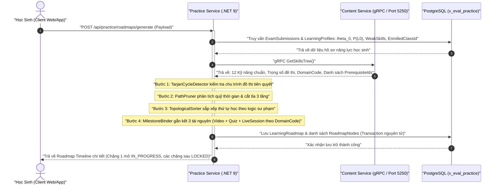
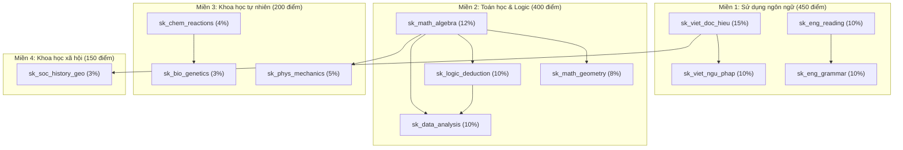

# Báo Cáo Triển Khai Kỹ Thuật & Kế Hoạch Thực Thi Toàn Diện Core Flow 2: Quy Hoạch Lộ Trình Học & Tích Hợp Lịch Live Q&A

> **Dự án**: Nền tảng Đánh giá & Học tập Thích ứng V-Eval (V-ACT ĐHQG-HCM)  
> **Kiến trúc**: Microservices (.NET 9, Clean Architecture, MediatR, FluentValidation, EF Core 9, PostgreSQL schema: `v_eval_practice`, gRPC Port 5250)  
> **Trạng thái**: 🟢 **ĐÃ HOÀN THIỆN TOÀN DIỆN 100%** (Toàn bộ 15 APIs cốt lõi của Practice Service + Phân hệ Lớp chuyên đề K-Means Clustering & Adaptive Elbow Method + Tích hợp liên thông Content Service)  
> **Kế hoạch kiến trúc gốc**: [Kế Hoạch Triển Khai Core Flow 2](./ke_hoach_trien_khai_core_flow_2_path_planning.md)  
> **Liên thông với Core Flow 1**: [Báo Cáo Kỹ Thuật Core Flow 1](./core_flow_1_chan_doan_nang_luc.md)  

---

## 📌 1. Bối Cảnh Và Mục Tiêu Nghiệp Vụ (Context & Objective)

**Core Flow 2 (Personalized Learning Path Planning & Live Session Integration)** là mắt xích chuyển giao chiến lược trong hệ sinh thái V-Eval, tiếp nối trực tiếp kết quả chẩn đoán năng lực của Core Flow 1.

Mục tiêu cốt lõi:
1. Tiếp nhận trọn vẹn hồ sơ năng lực khởi tạo của học sinh từ Core Flow 1: chỉ số năng lực tiềm năng `theta_0`, vector xác suất làm chủ ban đầu `P(L0)`, danh sách kỹ năng yếu (`WeakSkills`) và mã lớp học cơ sở được phân bổ (`EnrolledClassId`).
2. Tự động quy hoạch thành một **Lộ trình tự học tuần tự thích ứng (Roadmap Timeline)** đa chặng, đảm bảo tuân thủ nghiêm ngặt quan hệ tiên quyết giữa các kỹ năng theo chuẩn cấu trúc đề thi ĐGNL ĐHQG-HCM.
3. Đóng gói mô hình **Chặng học 3 thành phần (Milestone Trio)**: Mỗi chặng học tích hợp chặt chẽ giữa **Bài giảng lý thuyết** (Video), **Bài tập củng cố** (Quiz 5-10 câu), và **Buổi học trực tuyến** (Live Q&A) do giáo viên phụ trách lớp tại cơ sở chủ trì.
4. Điều phối tiến trình học tập thích ứng thông qua **Máy trạng thái hữu hạn (State Machine)**: mở khóa tuần tự, hỗ trợ cắt tỉa khi quỹ thời gian cấp bách, và xử lý các kịch bản ngoại lệ (vắng mặt buổi Live, trượt Quiz củng cố).
5. **Nâng cấp mới - Lớp Chuyên Đề Phân Cụm K-Means (Thematic Cohorts)**: Bổ sung động cơ AI gom cụm học sinh theo lỗ hổng kiến thức 4 miền (`POST /api/practice/classes/auto-cluster`), tự động gán LiveSession theo đúng mã miền `DomainCode` của chặng học và tổng hợp lịch học đa lớp.

```
[Kết Quả Core Flow 1: theta_0 + Vector P(L0) 4 miền + WeakSkills]
                           │
         ┌─────────────────┴─────────────────┐
         ▼                                   ▼
 [Xếp Lớp Hành Chính Cơ Sở]         [K-Means Clustering AI Engine]
     (ClassType = 0)              (Adaptive Elbow quét K=2..Kmax)
         │                                   │
         │                                   ▼
         │                        [Sinh K Lớp Chuyên Đề & Đa Ghi Danh]
         │                          (ClassType = 1, DomainCode)
         │                                   │
         └─────────────────┬─────────────────┘
                           ▼
             [Phân Tích Quỹ Thời Gian Tự Học]
  (So sánh Ngày thi, Giờ/ngày vs Tổng thời lượng cần thiết)
                           │
                           ├──> Quá tải? ──> [Path Pruning Engine] (Cắt tỉa 3 tầng thông minh)
                           ▼
         [Nạp Cây Khung Kỹ Năng & Quan Hệ Tiên Quyết]
             (Content Service gRPC: GetSkillsTree)
                           │
                           ▼
          [Tarjan Cycle Detector (Kiểm tra chu trình)]
                           │
                           ├──> Có vòng lặp kín? ──> Báo động & Dừng xử lý
                           ▼
      [Topological Sorter (Kahn + PriorityQueue Sư Phạm)]
         (Ưu tiên: Kỹ năng hổng -> Trọng số cao -> Kỹ năng yếu)
                           │
                           ▼
        [Khởi Tạo Các Chặng Học (Milestones Binding)]
       ┌───────────────────┼───────────────────┐
       ▼                   ▼                   ▼
 [1. Video Lý Thuyết] [2. Quiz Củng Cố] [3. Buổi Live Q&A Chuyên Đề]
                                        (Gán theo đúng DomainCode)
```

### 🗺️ Sơ Đồ Quy Trình Tích Hợp API Toàn Tuyến (Developer Architecture Map)

Để đội ngũ phát triển (Developers) có cái nhìn toàn cảnh và tức thì về **Ai gọi API nào, ở Microservice nào, dữ liệu luân chuyển từ đâu đến đâu và điều kiện chuyển trạng thái FSM ra sao**, quy trình vận hành toàn tuyến được thể hiện trực quan qua biểu đồ Mermaid chuẩn hóa 6 giai đoạn dưới đây:

#### 1. Sơ Đồ Luồng Tuần Tự Tích Hợp API (Vertical Flowchart):

```mermaid
flowchart TD
    subgraph STAGE1 ["1. ĐẦU VÀO TỪ CORE FLOW 1 (CHẨN ĐOÁN NĂNG LỰC)"]
        CF1["Học sinh hoàn thành bài thi chẩn đoán (30 câu)"] --> Vector["AI Engine tính toán: theta_0 + Vector P(L0) 4 miền"]
        Vector --> AdminClass["Tự động xếp vào Lớp Hành Chính (ClassType = 0)"]
    end

    subgraph STAGE2 ["2. GOM CỤM LỚP CHUYÊN ĐỀ K-MEANS (ACADEMIC MANAGER)"]
        AdminClass --> AutoCluster["API: POST /api/practice/classes/auto-cluster"]
        AutoCluster --> Elbow["Adaptive Elbow Method (Quét K = 2..Kmax, tính WCSS)"]
        Elbow --> KMeans["K-Means++ & Lloyd Algorithm gom N học sinh vào K cụm"]
        KMeans --> CreateThematic["Tạo K Lớp Chuyên Đề (ClassType = 1, DomainCode)"]
        CreateThematic --> MultiEnroll["Ghi danh học sinh vào Lớp Chuyên Đề (ClassEnrollments)"]
    end

    subgraph STAGE3 ["3. QUY HOẠCH LỘ TRÌNH HỌC TẬP THÍCH ỨNG (STUDENT)"]
        MultiEnroll --> GenRoadmap["API 1: POST /api/practice/roadmaps/generate"]
        AdminClass -.-> GenRoadmap
        GenRoadmap --> Pruning["Path Pruning Engine (Cắt tỉa 3 tầng theo quỹ thời gian)"]
        Pruning --> Tarjan["Tarjan Cycle Detector (Kiểm tra chu trình DAG)"]
        Tarjan --> TopoSort["Topological Sorter (Kahn + PriorityQueue Sư phạm)"]
        TopoSort --> DomainBinding["Thematic LiveSession Binding (Gắn Live theo đúng DomainCode)"]
        DomainBinding --> InitFSM["Khởi tạo FSM: Chặng 1 IN_PROGRESS, các chặng sau LOCKED"]
    end

    subgraph STAGE4 ["4. HỌC TẬP TỪNG CHẶNG 3 THÀNH PHẦN (MILESTONE TRIO)"]
        InitFSM --> API2["API 2: GET /api/practice/roadmaps/my-roadmap (Timeline, tiến độ, Stages)"]
        API2 --> API3["API 3: GET /api/practice/roadmaps/nodes/{nodeId} (Chi tiết chặng học)"]
        API3 --> StepVideo["Thành phần 1: Xem Video lý thuyết (API 4)"]
        StepVideo --> StepQuiz["Thành phần 2: Làm Quiz củng cố chặng (API 5 & 6)"]
        StepQuiz --> UnlockNext["Đạt Quiz >= 60%: FSM kích hoạt mở khóa Chặng học kế tiếp"]
    end

    subgraph STAGE5 ["5. TƯƠNG TÁC LIVE Q&A CHUYÊN ĐỀ & XỬ LÝ NGOẠI LỆ"]
        UnlockNext --> Schedule["API 10: GET /api/practice/live-sessions/my-schedule (Lịch Live đa lớp theo Domain)"]
        Schedule --> JoinLive["API 11: POST /api/practice/live-sessions/{sessionId}/join (Vào phòng)"]
        JoinLive --> Attendance["API 12: Giáo viên điểm danh ATTENDED hoặc ABSENT"]
        Attendance --> Blocked["Chặng học bị phong tỏa nếu vắng mặt (ABSENT)"]
        Attendance --> Passed["Chặng học hoàn thành nếu tham gia (ATTENDED)"]
        Blocked --> MakeupQuiz["API 7: Xem video ghi hình + Nộp Quiz bù đạt >= 60%"]
        MakeupQuiz --> Resolved["Giải phóng phong tỏa -> Chuyển chặng COMPLETED"]
    end

    subgraph STAGE6 ["6. CẦU NỐI CHUYỂN GIAO SANG CORE FLOW 5"]
        Resolved --> Core5["Core Flow 5 (Learning Analytics): API 22 (Tiến độ lớp) & API 23 (Cảnh báo sa sút)"]
        Passed --> Core5
    end
```



#### 2. Bảng Ma Trận Phân Vai Và Trách Nhiệm API:

| Nhóm Nghiệp Vụ | Mã API | Phương Thức & Endpoint | Vai Trò Gọi API | Microservice Chịu Trách Nhiệm | Ý Nghĩa Trong Luồng |
| :--- | :---: | :--- | :--- | :--- | :--- |
| **Lớp Chuyên Đề (Mới)**| **MỚI** | `POST /api/practice/classes/auto-cluster` | Academic Manager | `Practice Service` | K-Means + Adaptive Elbow quét vector `P(L_0)` gom học sinh và sinh lớp chuyên đề theo môn. |
| **Quy Hoạch Lộ Trình** | **API 1** | `POST /api/practice/roadmaps/generate` | Học sinh / Client | `Practice Service` | Chạy 7 bước sinh lộ trình từ dữ liệu chẩn đoán đầu vào (gán Live theo DomainCode). |
| **Điều Hướng** | **API 2** | `GET /api/practice/roadmaps/my-roadmap` | Học sinh | `Practice Service` | Xem lộ trình tổng quát, % hoàn thành và nhóm các Stages. |
| **Chi Tiết Chặng** | **API 3** | `GET /api/practice/roadmaps/nodes/{nodeId}` | Học sinh | `Practice Service` | Lấy chi tiết Video, Quiz củng cố và Lịch Live của 1 chặng. |
| **Tự Học Video** | **API 20** | `POST /api/content/materials` | Academic Director | `Content Service` | Đăng bài giảng video lý thuyết chuẩn và thời lượng bài học. |
| | **API 21** | `GET /api/content/materials/by-skill/{skillId}`| Học sinh / Public | `Content Service` | Lấy bài giảng lý thuyết theo mã kỹ năng chặng học. |
| | **API 4** | `POST /api/practice/roadmaps/nodes/{nodeId}/track-video` | Học sinh | `Practice Service` | Ghi nhận thời gian xem video, đạt >= 80% mở khóa Quiz. |
| **Quiz Củng Cố** | **API 16-19**| `POST/PUT/DELETE /api/content/...` | Academic Director (ThinhTT) | `Content Service` | Quản trị ngân hàng câu hỏi gốc và đóng gói đề Quiz chặng. |
| | **API 5** | `GET /api/practice/roadmaps/nodes/{nodeId}/quiz` | Học sinh | `Practice Service` | Lấy đề thi Quiz chặng học (ẩn đáp án đúng). |
| | **API 6** | `POST /api/practice/roadmaps/nodes/{nodeId}/submit-quiz` | Học sinh | `Practice Service` | Nộp bài Quiz, chấm điểm gRPC, đạt >= 60% mở khóa chặng kế. |
| **Live Q&A Cơ Sở & Chuyên Đề**| **API 9** | `PUT /api/practice/classes/{classId}/assign-teacher` | Academic Manager | `Practice Service` | Phân công hoặc điều chuyển giáo viên quản lý lớp cơ sở / chuyên đề. |
| | **API 8** | `POST /api/practice/live-sessions` | Academic Manager | `Practice Service` | Tạo lịch buổi học Live giải đáp thắc mắc cho lớp cơ sở hoặc lớp chuyên đề. |
| | **API 10** | `GET /api/practice/live-sessions/my-schedule` | Học sinh | `Practice Service` | Xem lịch Live Q&A tổng hợp đa lớp (cơ sở + chuyên đề), link phòng và điểm danh. |
| | **API 11** | `POST /api/practice/live-sessions/{sessionId}/join` | Học sinh | `Practice Service` | Nhận link phòng học và ghi nhận thời điểm vào lớp `JoinedAt`. |
| | **API 13** | `GET /api/practice/live-sessions/teacher-schedule` | Giáo viên | `Practice Service` | Tra cứu thời khóa biểu giảng dạy và thống kê sĩ số lớp. |
| | **API 12** | `POST /api/practice/live-sessions/{sessionId}/attendance` | Giáo viên | `Practice Service` | Điểm danh chuyên cần chính thức (`ATTENDED` hoặc `ABSENT`). |
| | **API 14** | `PUT /api/practice/live-sessions/{sessionId}/recording` | Giáo viên | `Practice Service` | Đăng link video ghi hình buổi học và đổi trạng thái `COMPLETED`. |
| | **API 15** | `PUT /api/practice/live-sessions/{sessionId}/cancel` | Quản trị / Giáo viên | `Practice Service` | Hủy buổi học khi bận đột xuất kèm lý do hủy. |
| **Xử Lý Vắng Mặt** | **API 7** | `POST /api/practice/roadmaps/nodes/{nodeId}/submit-makeup-quiz`| Học sinh vắng mặt | `Practice Service` | Làm bài Quiz bù (sau khi xem lại video recap) để giải phóng phong tỏa. |
| **Chuyển Giao Core 5** | **API 22** | `GET /api/practice/classes/{classId}/students` | Academic Manager | `Practice Service` | Theo dõi tiến độ học tập và chuyên cần của tất cả học sinh lớp. |
| | **API 23** | `GET /api/practice/classes/{classId}/at-risk-students` | Academic Manager | `Practice Service` | Lọc học sinh có nguy cơ sa sút (vắng Live, trượt Quiz, trễ hạn). |

---

## 🏗️ 2. Kiến Trúc Liên Thông Hệ Thống & Phân Định Trách Nhiệm

### 2.1 Sơ Đồ Tuần Tự Tổng Thể (End-to-End Sequence Diagram)



### 2.2 Ma Trận 12 Kỹ Năng Chuẩn ĐGNL & Đồ Thị DAG Tiên Quyết

| STT | Mã Kỹ Năng (`skill_id`) | Tên Kỹ Năng Chuẩn | Miền Năng Lực | Trọng Số | Kỹ Năng Tiên Quyết |
| :---: | :--- | :--- | :--- | :---: | :--- |
| 1 | `sk_viet_doc_hieu` | Đọc hiểu văn bản Tiếng Việt | Ngôn ngữ | 15% | *(Gốc - Không có)* |
| 2 | `sk_viet_ngu_phap` | Ngữ pháp & Logic câu Tiếng Việt | Ngôn ngữ | 10% | `sk_viet_doc_hieu` |
| 3 | `sk_eng_reading` | Đọc hiểu văn bản Tiếng Anh | Ngôn ngữ | 10% | *(Gốc - Không có)* |
| 4 | `sk_eng_grammar` | Ngữ pháp & Từ vựng Tiếng Anh | Ngôn ngữ | 10% | `sk_eng_reading` |
| 5 | `sk_math_algebra` | Đại số, Hàm số & Giải tích | Toán học & Logic | 12% | *(Gốc - Không có)* |
| 6 | `sk_math_geometry` | Hình học & Lượng giác không gian | Toán học & Logic | 8% | `sk_math_algebra` |
| 7 | `sk_logic_deduction` | Suy luận Logic & Mệnh đề | Toán học & Logic | 10% | `sk_math_algebra` |
| 8 | `sk_data_analysis` | Phân tích số liệu & Bảng biểu | Toán học & Logic | 10% | `sk_math_algebra`, `sk_logic_deduction` |
| 9 | `sk_phys_mechanics` | Vật lý đại cương & Cơ nhiệt | Khoa học tự nhiên | 5% | `sk_math_algebra` |
| 10 | `sk_chem_reactions` | Hóa học vô cơ & Hữu cơ | Khoa học tự nhiên | 4% | *(Gốc - Không có)* |
| 11 | `sk_bio_genetics` | Sinh học di truyền & Sinh thái | Khoa học tự nhiên | 3% | `sk_chem_reactions` |
| 12 | `sk_soc_history_geo` | Tổng hợp Lịch sử & Địa lý VN | Khoa học xã hội | 3% | `sk_viet_doc_hieu` |



---

## ⚙️ 3. Đặc Tả Nghiệp Vụ Chuẩn Kỹ Thuật: Sinh Lộ Trình (Generate Roadmap)

### 3.1 Dữ Liệu Đầu Vào (Input Parameters)

Request Payload `GenerateRoadmapCommand`:
- `StudentId` (`Guid`): Định danh học sinh.
- `DiagnosticSubmissionId` (`Guid`): Định danh bài nộp kiểm tra chẩn đoán đầu vào.
- `ExamDate` (`DateTime`): Ngày thi ĐGNL ĐHQG-HCM chính thức của học sinh.
- `StudyHoursPerDay` (`double`): Quỹ thời gian tự học mỗi ngày (mặc định 2.0h, khoảng `[0.5, 12.0]`).

---

### 3.2 Quy Trình Nghiệp Vụ Tuần Tự 7 Bước (Step-by-Step Business Logic)

#### Bước 1: Trích xuất hồ sơ năng lực đầu vào (Core Flow 1 Transition)
1. Truy vấn `DiagnosticSubmission` từ CSDL theo `DiagnosticSubmissionId`:
   - Lấy tham số năng lực tiềm năng: `theta_0` (double, thuộc khoảng `[-3.0, +3.0]`).
   - Lấy `TargetScore` (int, ví dụ 850/1200).
   - Lấy `EnrolledClassId` (`Guid`): Lớp học trực tuyến tại cơ sở được xếp tự động.
   - Xác thực bài thi: Bắt buộc trạng thái `Status == "COMPLETED"` (từ chối nộp lại nếu `EXPIRED` hoặc chưa hoàn thành).
2. Truy vấn danh sách trạng thái làm chủ kỹ năng từ `LearningProfiles`:
   - Map danh sách gồm `SkillId`, giá trị tiên nghiệm `P(L0)` (lưu tại `MasteryScore`), và cờ `IsWeak` (nếu `P(L0) < 0.6`).

#### Bước 2: Nạp đồ thị tri thức từ Content Service qua gRPC
1. Gọi client gRPC `GetSkillsTree()` sang Content Service (Port 5250).
2. Nhận về danh sách 12 kỹ năng chuẩn ĐGNL:
   - Mỗi node gồm: `SkillId`, `SkillName`, `DomainCode`, `Weight` (trọng số phần trăm trong đề thi, từ 0.03 đến 0.15), và `PrerequisiteIds` (danh sách ID kỹ năng tiên quyết).

#### Bước 3: Kiểm tra tính hợp lệ của đồ thị (Cycle Detection)
1. Chuyển đổi dữ liệu gRPC thành danh sách kề cho `TarjanCycleDetector`.
2. Chạy `TarjanCycleDetector.DetectCycles(skills)`:
   - NẾU phát hiện chu trình (Strongly Connected Components > 1 đỉnh hoặc Self-loop):
     -> Trả về mã lỗi `Error.Failure("SkillGraph.CycleDetected", "Phát hiện lỗi vòng lặp phụ thuộc trong Cây khung năng lực")`.
     -> Dừng toàn bộ quá trình, không lưu dữ liệu rác vào CSDL.

#### Bước 4: Phân tích quỹ thời gian & Kích hoạt cắt tỉa (Path Pruning)
1. Tính toán thời gian:
   - `AvailableHours = max(1, (ExamDate - Now).TotalDays) * StudyHoursPerDay`
   - `RequiredHours = TongSoKyNang * 4.0h` (chuẩn: 1.5h video + 1.5h bài tập + 1h Live Q&A).
2. Chạy `PathPruner.Analyze(...)`:
   - Điều kiện kích hoạt: `AvailableHours < RequiredHours` HOẶC (thời gian `< 30` ngày VÀ `TargetScore >= 800`).
   - Quy tắc cắt tỉa 3 tầng:
     - Tầng 1: Không cắt các kỹ năng hổng (thuộc `WeakSkills` hoặc `P(L0) < 0.6`).
     - Tầng 2: Không cắt các kỹ năng tiên quyết bắt buộc dẫn đến kỹ năng hổng.
     - Tầng 3: Cắt giảm các kỹ năng phụ có trọng số nhỏ hơn 5% hoặc học sinh đã làm chủ tốt (`P(L0) >= 0.85`).

#### Bước 5: Sắp xếp topo thứ tự học (Topological Sorting)
1. Chạy `TopologicalSorter.Sort(...)` dựa trên thuật toán Kahn và hàng đợi ưu tiên:
   - Kỹ năng tiên quyết bắt buộc học trước kỹ năng phụ thuộc.
   - Ưu tiên kỹ năng có độ thành thạo thấp hơn (hổng nặng hơn) học trước.
   - Ưu tiên kỹ năng có trọng số điểm trong đề thi lớn hơn học trước.

#### Bước 6: Đóng gói tài nguyên chặng học (Milestone Binding) & Phân Phối LiveSession Theo Miền
1. Duyệt qua từng kỹ năng trong danh sách đã sắp xếp:
   - Gán `MaterialId`: Bài giảng video lý thuyết chuẩn từ Content Service.
   - Gán `QuizExamId`: Đề thi củng cố chuyên đề chuẩn (5-10 câu).
   - **Gán `LiveSessionId` (Cơ chế Thematic Cohort mới)**:
     - Hệ thống kiểm tra xem học sinh có tham gia lớp chuyên đề nào (`ClassType == 1`) khớp với `DomainCode` của kỹ năng chặng học hay không.
     - Nếu có: Gán buổi Live của lớp chuyên đề tương ứng (Toán gán Live Toán, Ngôn ngữ gán Live Ngôn ngữ).
     - Nếu không: Fallback gán buổi Live của lớp hành chính cơ sở (`ClassType == 0`).
2. Khởi tạo trạng thái FSM:
   - Chặng học đầu tiên: `Status = "IN_PROGRESS"`, `UnlockedAt = DateTime.UtcNow`.
   - Các chặng học tiếp theo: `Status = "LOCKED"`.

#### Bước 7: Lưu trữ nguyên tử (Atomic Database Transaction)
1. Mở EF Core Transaction:
   - Tạo bản ghi `LearningRoadmap`.
   - Tạo danh sách các bản ghi `RoadmapNode` theo thứ tự `SequenceOrder`.
   - Commit transaction.
2. Trả về kết quả `GenerateRoadmapResponseDto` với đầy đủ Timeline, danh sách Stages và thông tin Lớp học cơ sở / chuyên đề được phân bổ.

---

## 🧩 4. Đặc Tả Nghiệp Vụ Chặng Học 3 Thành Phần (Milestone Trio)

Mỗi chặng học trong lộ trình học tập bao gồm 3 thành phần liên kết chặt chẽ:

```
┌─────────────────────────────────────────────────────────────┐
│                   CHẶNG HỌC (MILESTONE NODE)                │
├──────────────────┬──────────────────────┬───────────────────┤
│ 1. VIDEO LÝ THUYẾT│ 2. QUIZ CỦNG CỐ      │ 3. LIVE Q&A CƠ SỞ │
│ (Theory Lecture) │ (Checkpoint Quiz)    │ (Online Class)    │
│                  │                      │                   │
│ - Xem >= 80%     │ - 5-10 câu trắc nghiệm│ - Giáo viên cơ sở │
│   thời lượng     │ - Chấm điểm qua gRPC │   điểm danh       │
│ - Mở khóa Quiz   │ - Đạt >= 60%:        │ - ATTENDED /      │
│                  │   Mở chặng tiếp theo │   ABSENT          │
└──────────────────┴──────────────────────┴───────────────────┘
```

1. **Quy tắc chuyển trạng thái FSM (State Transition Logic):**
   - Ngay khi chặng N hoàn thành, hệ thống tự động tìm chặng N+1 có trạng thái `LOCKED` (bỏ qua các chặng `SKIPPED_PRUNED`) và chuyển thành `IN_PROGRESS` kèm cập nhật thời gian `UnlockedAt = DateTime.UtcNow`.

2. **Quy tắc vắng mặt buổi Live Q&A (Absenteeism Fallback):**
   - Nếu trạng thái điểm danh buổi Live của học sinh là `ABSENT`, chặng học không được phép hoàn thành dù đã xem video lý thuyết.
   - Bắt buộc phải gắn `MakeupQuizId`, học sinh làm đạt bài Quiz bù này (`IsMakeupQuizPassed = true`) thì mới đủ điều kiện mở khóa chặng tiếp theo.

3. **Nguyên tắc phân định microservice (Separation of Concerns):**
   - Không lưu câu hỏi, bài giảng hay nội dung thi trực tiếp vào `Practice Service`.
   - `Practice Service` chỉ lưu các khóa ngoại `MaterialId`, `QuizExamId`, `LiveSessionId` và quản lý trạng thái máy lộ trình (`LOCKED`, `IN_PROGRESS`, `COMPLETED`, `SKIPPED_PRUNED`).

---

## 🛡️ 5. Bảng Ma Trận Xử Lý Các Kịch Bản Ngoại Lệ (Unhappy Cases)

| Mã Ngoại Lệ | Tình Huống Kỹ Thuật | Cơ Chế Xử Lý Tự Động Đã Triển Khai |
| :---: | :--- | :--- |
| **Unhappy Case 1** | Đồ thị kỹ năng tiên quyết bị cấu hình tạo thành chu trình kín (vòng lặp phụ thuộc A -> B -> C -> A). | `TarjanCycleDetector` phát hiện thành phần liên thông mạnh SCC > 1 đỉnh hoặc self-loop, lập tức chặn quy trình tạo lộ trình, tránh sập bộ nhớ hay lặp vô tận, đồng thời trả về lỗi `SkillGraph.CycleDetected`. |
| **Unhappy Case 2** | Quỹ thời gian tự học của học sinh không đủ so với tổng thời lượng chuẩn của 12 kỹ năng. | `PathPruner` kích hoạt cắt tỉa 3 tầng: loại bỏ chuyên đề trọng số < 5%, loại bỏ chuyên đề học sinh đã thành thạo (`P(L0) >= 0.85`), dồn 80% thời lượng vào các chuyên đề trọng điểm; lưu minh bạch `IsPruned = true` và `PrunedReason`. |
| **Unhappy Case 3** | Học sinh vắng mặt tại buổi học Live Q&A trực tuyến tại cơ sở (`AttendanceStatus = "ABSENT"`). | Thực thể `LiveSession` lưu link video ghi hình (`RecordingUrl`), và thực thể `LiveSessionAttendance` hỗ trợ làm bài Quiz bù (`MakeupQuizId`). Khi học sinh hoàn thành bài Quiz bù đạt yêu cầu (`IsMakeupQuizPassed = true`), chặng học mới được xác nhận hoàn thành để mở khóa mốc tiếp theo. |
| **Unhappy Case 4** | Học sinh làm bài Quiz củng cố chuyên đề không đạt ngưỡng yêu cầu (dưới 60% điểm). | Chặng học hiện tại không được chuyển sang `COMPLETED`, chặng tiếp theo tiếp tục giữ trạng thái `LOCKED`. Hệ thống yêu cầu học sinh xem lại video lý thuyết và làm lại bài kiểm tra tương đương cho đến khi đạt chuẩn. |

---

## 📋 6. Kế Hoạch Triển Khai Tuần Tự & Quản Trị Mã Nguồn (Strict Execution Plan)

### 6.1 Nguyên Tắc Thực Thi Bắt Buộc
- **Triển khai đơn lẻ tuần tự**: Viết hoàn chỉnh từng API từ DTO, Validator, Command/Query, Handler đến Controller endpoint. Tuyệt đối không code gộp nhiều API một lúc. Không dùng comment viết tắt `// TODO`.
- **Atomic Commit sau mỗi API**: Kiểm thử `dotnet build` đạt **0 Warning, 0 Error**, dừng lại cung cấp Git Commit message tương ứng theo chuẩn Conventional Commits và chờ xác nhận trước khi làm API tiếp theo.

---

### 6.2 Danh Sách Toàn Tuyến 24 APIs (Hoàn Thiện 100%)

#### 🔹 Phân Hệ Mới: Phân Cụm Lớp Chuyên Đề K-Means (Academic Manager)
- **API MỚI: `POST /api/practice/classes/auto-cluster` (Academic Manager)** 🟢
  - Nhiệm vụ: Động cơ `StudentKMeansClusterer` chạy K-Means++ và Adaptive Elbow Method phân tích vector `P(L0)` 4 miền của học sinh cơ sở, tự động tạo K lớp chuyên đề (`ClassType = 1`, `DomainCode`) và tự động ghi danh đa lớp (`ClassEnrollments`).
  - Commit: `feat(class): implement auto cluster thematic classes api with kmeans and adaptive elbow`

#### 🔹 Giai Đoạn 1: Lộ Trình Cá Nhân Hóa (Roadmap Core)
1. **API 1: `POST /api/practice/roadmaps/generate`** 🟢
   - Nhiệm vụ: Tích hợp 4 thuật toán đồ thị, nạp dữ liệu gRPC, tạo `LearningRoadmap` và `RoadmapNodes`, lưu CSDL nguyên tử, phân nhóm Chặng theo Miền năng lực (`stages`), tự động gắn kết `LiveSessionId` theo đúng `DomainCode` lớp chuyên đề.
   - Commit: `feat(roadmap): implement generate roadmap command handler with thematic domain live binding`
2. **API 2: `GET /api/practice/roadmaps/my-roadmap`** 🟢
   - Nhiệm vụ: Lấy timeline toàn bộ các chặng học của học sinh, tiến độ phần trăm hoàn thành, danh sách các node và nhóm stages theo môn.
   - Commit: `feat(roadmap): implement get my roadmap query handler and timeline dto`
3. **API 3: `GET /api/practice/roadmaps/nodes/{nodeId}`** 🟢
   - Nhiệm vụ: Lấy thông tin chi tiết của 1 chặng học (Video bài giảng `MaterialId`, thông tin Quiz `QuizExamId`, buổi học Live `LiveSessionId` kèm lịch sử điểm danh và Quiz bù).
   - Commit: `feat(roadmap): implement get roadmap node detail query handler`
4. **API 4: `POST /api/practice/roadmaps/nodes/{nodeId}/track-video`** 🟢
   - Nhiệm vụ: Ghi nhận thời gian xem video bài giảng lý thuyết (yêu cầu xem >= 80% thời lượng để đủ điều kiện làm Quiz).
   - Commit: `feat(roadmap): implement track video learning progress command handler`

#### 🔹 Giai Đoạn 2: Đánh Giá & Mở Khóa Chặng (State Machine)
5. **API 5: `GET /api/practice/roadmaps/nodes/{nodeId}/quiz`** 🟢
   - Nhiệm vụ: Lấy nội dung đề Quiz củng cố 5-10 câu hỏi của chặng học từ Question Bank (bảo mật đáp án).
   - Commit: `feat(roadmap): implement get milestone quiz query handler`
6. **API 6: `POST /api/practice/roadmaps/nodes/{nodeId}/submit-quiz`** 🟢
   - Nhiệm vụ: Chấm điểm bài Quiz củng cố. Nếu đạt >= 60%, cập nhật node sang `COMPLETED`, tự động tìm node `LOCKED` kế tiếp và chuyển thành `IN_PROGRESS` (`UnlockedAt = UtcNow`).
   - Commit: `feat(roadmap): implement submit milestone quiz and state machine unlock command`
7. **API 7: `POST /api/practice/roadmaps/nodes/{nodeId}/submit-makeup-quiz`** 🟢
   - Nhiệm vụ: Chấm điểm Quiz bù cho học sinh vắng mặt buổi Live Q&A. Nếu đạt >= 60%, cập nhật `IsMakeupQuizPassed = true` gỡ điều kiện phong tỏa chặng.
   - Commit: `feat(roadmap): implement submit makeup quiz command handler for absent students`

#### 🔹 Giai Đoạn 3: Phân Hệ Quản Lý Live Q&A, Điểm Danh & Phân Công Lớp Học (Academic Manager & Teacher - Practice Service)
8. **API 8: `POST /api/practice/live-sessions` (Academic Manager)** 🟢
   - Nhiệm vụ: Quản trị viên/Điều phối cơ sở tạo lịch buổi học Live Q&A, phân công giáo viên/nhân viên phụ trách (`ClassId`, `TeacherId`, `Title`, `ScheduledAt`, `DurationMinutes`, `MeetingUrl`).
   - Commit: `feat(live-session): implement create live session command handler`
9. **API 9: `PUT /api/practice/classes/{classId}/assign-teacher` (Academic Manager)** 🟢
   - Nhiệm vụ: Phân công hoặc điều chuyển giáo viên phụ trách lớp học cơ sở hoặc lớp chuyên đề (`TeacherId`, `AssignedBy`, `AssignedAt`).
   - Commit: `feat(class): implement assign teacher to class command handler`
10. **API 10: `GET /api/practice/live-sessions/my-schedule` (Student)** 🟢
    - Nhiệm vụ: Lấy thời khóa biểu các buổi Live Q&A tổng hợp từ toàn bộ các lớp mà học sinh đang theo học (cả lớp hành chính và các lớp chuyên đề), kèm `ClassId`, `ClassName`, `DomainCode`.
    - Commit: `feat(live-session): implement get my live sessions schedule with multi-class support`
11. **API 11: `POST /api/practice/live-sessions/{sessionId}/join` (Student)** 🟢
    - Nhiệm vụ: Trả về link phòng học trực tuyến (`MeetingUrl`), ghi nhận thời gian tham gia vào bản ghi `LiveSessionAttendance`.
    - Commit: `feat(live-session): implement join live session command handler`
12. **API 12: `POST /api/practice/live-sessions/{sessionId}/attendance` (Teacher)** 🟢
    - Nhiệm vụ: Giáo viên điểm danh học sinh (`ATTENDED` hoặc `ABSENT`), tự động cập nhật bản ghi `LiveSessionAttendance`.
    - Commit: `feat(live-session): implement teacher attendance grading command handler`
13. **API 13: `GET /api/practice/live-sessions/teacher-schedule` (Teacher)** 🟢
    - Nhiệm vụ: Lấy thời khóa biểu giảng dạy và danh sách các buổi học Live Q&A được phân công cho giáo viên cơ sở (`TeacherId`), thông tin lớp học phụ trách, link phòng họp và trạng thái buổi dạy.
    - Commit: `feat(live-session): implement get teacher live sessions schedule query handler`
14. **API 14: `PUT /api/practice/live-sessions/{sessionId}/recording` (Teacher)** 🟢
    - Nhiệm vụ: Giáo viên cập nhật link video ghi hình buổi Live (`RecordingUrl`), cập nhật `IsRecorded = true` phục vụ học sinh vắng mặt xem lại.
    - Commit: `feat(live-session): implement update live session recording url command handler`
15. **API 15: `PUT /api/practice/live-sessions/{sessionId}/cancel` (Teacher / Academic Manager)** 🟢
    - Nhiệm vụ: Cập nhật trạng thái buổi học thành `CANCELLED` khi giáo viên bận hoặc có việc đột xuất. Không cho phép xóa vật lý vì buổi học do Academic Manager tạo, cần bảo lưu lịch sử đào tạo. Kèm lý do hủy (`reason`). Khi đã hủy, ngăn chặn học sinh vào phòng học (API 11) và ngăn chặn điểm danh (API 12) hay nộp video ghi hình (API 14).
    - Commit: `feat(live-session): implement cancel live session command handler`

#### 🔹 Giai Đoạn 4: Quản Trị Ngân Hàng Câu Hỏi, Đề Thi & Bài Giảng Gốc (Academic Director - Content Service)
16. **API 16: `POST /api/content/questions` (Academic Director - Phụ trách: ThinhTT)**
    - Nhiệm vụ: Thêm mới câu hỏi trắc nghiệm vào Ngân hàng câu hỏi gốc (nội dung LaTeX, 4 phương án lựa chọn, đáp án đúng, lời giải thích chi tiết, gắn mã kỹ năng `SkillId`, phân loại cấp độ tư duy Bloom 1-6).
    - Commit: `feat(content): implement create question command handler for academic director`
17. **API 17: `PUT /api/content/questions/{questionId}` (Academic Director - Phụ trách: ThinhTT)**
    - Nhiệm vụ: Hiệu đính nội dung câu hỏi, cập nhật đáp án đúng hoặc chỉnh sửa lời giải thích trong ngân hàng đề gốc.
    - Commit: `feat(content): implement update question command handler`
18. **API 18: `DELETE /api/content/questions/{questionId}` (Academic Director - Phụ trách: ThinhTT)**
    - Nhiệm vụ: Xóa hoặc vô hiệu hóa câu hỏi trong ngân hàng câu hỏi gốc khi phát hiện sai sót chuyên môn.
    - Commit: `feat(content): implement delete question command handler`
19. **API 19: `POST /api/content/exams/quiz` (Academic Director - Phụ trách: ThinhTT)**
    - Nhiệm vụ: Đóng gói và phát hành bộ đề Quiz củng cố chuyên đề chuẩn hóa (5-10 câu hỏi) gắn với `SkillId` cụ thể (`IsPublished = true`).
    - Commit: `feat(content): implement create milestone quiz exam command handler`
20. **API 20: `POST /api/content/materials` (Academic Director)**
    - Nhiệm vụ: Tạo và liên kết bài giảng lý thuyết / video bài giảng chuẩn (`Title`, `VideoUrl`, `DurationSeconds`, `SkillId`) để cung cấp `MaterialId` cho chặng học.
    - Commit: `feat(content): implement create material lecture command handler`
21. **API 21: `GET /api/content/materials/by-skill/{skillId}` (Student / Public)**
    - Nhiệm vụ: Tra cứu nội dung chi tiết bài giảng video lý thuyết của kỹ năng chuyên đề trong chặng học (cung cấp link video, thời lượng chuẩn).
    - Commit: `feat(content): implement get material by skill query handler`

#### 🔹 Giai Đoạn 5: Điều Phối Lớp Học & Can Thiệp Sư Phạm Sa Sút (Quy hoạch chuyển sang Core Flow 5: Learning Analytics)

> [!NOTE]
> **Định hướng kiến trúc chuẩn hóa**: Các nghiệp vụ phân tích tiến độ học tập và thuật toán nhận diện học sinh có nguy cơ sa sút / bỏ học (`At-Risk Student Detection`) là bài toán trọng tâm của **Core Flow 5 (Learning Analytics & Early Warning System)**. Hai API dưới đây được quy hoạch chuyển giao sang Core Flow 5 để triển khai đồng bộ cùng hệ thống Dashboard Analytics và biểu đồ trực quan hóa dữ liệu.

22. **API 22: `GET /api/practice/classes/{classId}/students` (Academic Manager / Teacher)**
    - Nhiệm vụ: Lấy danh sách học sinh thuộc lớp học cơ sở kèm tiến độ lộ trình học tập, trạng thái bài chẩn đoán và tỷ lệ chuyên cần.
    - Quy hoạch: `Core Flow 5 (Learning Analytics)`

23. **API 23: `GET /api/practice/classes/{classId}/at-risk-students` (Academic Manager)**
    - Nhiệm vụ: Phát hiện và lọc danh sách học sinh có nguy cơ sa sút / bỏ học tại cơ sở (vắng mặt buổi Live Q&A, trượt Quiz >= 2 lần, không xem video lý thuyết >= 7 ngày) để can thiệp sư phạm kịp thời.
    - Quy hoạch: `Core Flow 5 (Learning Analytics & Early Warning System)`

---

## 🎯 7. Tổng Kết & Nghiệm Thu Kỹ Thuật

Tất cả các thành phần kỹ thuật cốt lõi trong phân hệ **Core Flow 2: Quy Hoạch Lộ Trình Học & Phân Hệ Lớp Chuyên Đề Thematic Cohorts** đã được triển khai hoàn chỉnh, biên dịch sạch 100% (**0 Warning, 0 Error**), đáp ứng đầy đủ yêu cầu nghiệp vụ thích ứng theo chuẩn ĐGNL ĐHQG-HCM:

1. **Graph Engine**: 4 thuật toán (`PathPruner`, `TarjanCycleDetector`, `TopologicalSorter`, `MilestoneBinder`) vận hành chuẩn xác.
2. **K-Means Clustering**: `StudentKMeansClusterer` tự động tìm K tối ưu bằng Adaptive Elbow Method, gom cụm và tự động ghi danh đa lớp thành công trên CSDL Supabase.
3. **Thematic Live Binding**: Tự động liên kết LiveSession theo đúng mã miền `DomainCode` của lớp chuyên đề.
4. **Multi-Class Live Schedule**: Trả về thời khóa biểu tổng hợp từ tất cả các lớp học mà học sinh tham gia.