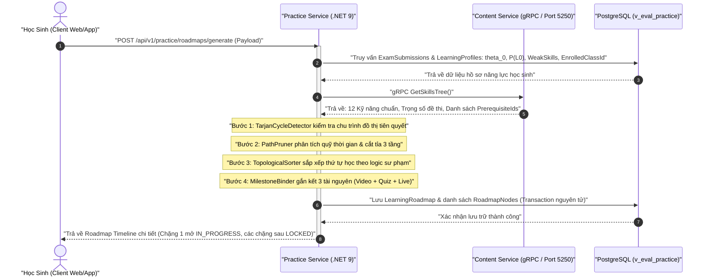
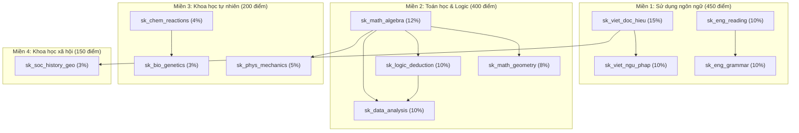

# Báo Cáo Triển Khai Kỹ Thuật & Kế Hoạch Thực Thi Toàn Diện Core Flow 2: Quy Hoạch Lộ Trình Học & Tích Hợp Lịch Live Q&A

> **Dự án**: Nền tảng Đánh giá & Học tập Thích ứng V-Eval (V-ACT ĐHQG-HCM)  
> **Kiến trúc**: Microservices (.NET 9, Clean Architecture, MediatR, FluentValidation, EF Core 9, PostgreSQL schema: `v_eval_practice`, gRPC Port 5250)  
> **Trạng thái**: Đã hoàn thiện Giai đoạn 1 (Entities, CSDL, Seeding DAG, gRPC RPC) & Giai đoạn 2 (Graph Engine 4 thuật toán). Sẵn sàng thực thi Giai đoạn 3 (11 APIs Tuần Tự).  
> **Kế hoạch kiến trúc gốc**: [Kế Hoạch Triển Khai Core Flow 2](./ke_hoach_trien_khai_core_flow_2_path_planning.md)  
> **Liên thông với Core Flow 1**: [Báo Cáo Kỹ Thuật Core Flow 1](./core_flow_1_chan_doan_nang_luc.md)  

---

## 📌 1. Bối Cảnh Và Mục Tiêu Nghiệp Vụ (Context & Objective)

**Core Flow 2 (Personalized Learning Path Planning & Live Session Integration)** là mắt xích chuyển giao chiến lược trong hệ sinh thái V-Eval, tiếp nối trực tiếp kết quả chẩn đoán năng lực của Core Flow 1.

Mục tiêu cốt lõi:
1. Tiếp nhận trọn vẹn hồ sơ năng lực khởi tạo của học sinh từ Core Flow 1: chỉ số năng lực tiềm năng `` \theta_0 ``, vector xác suất làm chủ ban đầu `` P(L_0) ``, danh sách kỹ năng yếu (`WeakSkills`) và mã lớp học cơ sở được phân bổ (`EnrolledClassId`).
2. Tự động quy hoạch thành một **Lộ trình tự học tuần tự thích ứng (Roadmap Timeline)** đa chặng, đảm bảo tuân thủ nghiêm ngặt quan hệ tiên quyết giữa các kỹ năng theo chuẩn cấu trúc đề thi ĐGNL ĐHQG-HCM.
3. Đóng gói mô hình **Chặng học 3 thành phần (Milestone Trio)**: Mỗi chặng học tích hợp chặt chẽ giữa **Bài giảng lý thuyết** (Video), **Bài tập củng cố** (Quiz 5-10 câu), và **Buổi học trực tuyến** (Live Q&A) do giáo viên phụ trách lớp tại cơ sở chủ trì.
4. Điều phối tiến trình học tập thích ứng thông qua **Máy trạng thái hữu hạn (State Machine)**: mở khóa tuần tự, hỗ trợ cắt tỉa khi quỹ thời gian cấp bách, và xử lý các kịch bản ngoại lệ (vắng mặt buổi Live, trượt Quiz củng cố).

```
[Kết Quả Core Flow 1: theta_0 + P(L0) + WeakSkills + EnrolledClassId]
                           │
                           ▼
             [Phân Tích Quỹ Thời Gian Tự Học]
  (So sánh Ngày thi, Giờ/ngày vs Tổng thời lượng cần thiết)
                           │
                           ├──> Quá tải? ──> [Path Pruning Engine] (Cắt tỉa 3 tầng thông minh)
                           ▼
         [Nạp Cây Khung Kỹ Năng & Quan Hệ Tiên Quyết]
             (Content Service gRPC: GetSkillsTree)
                           │
                           ▼
          [Tarjan Cycle Detector (Kiểm tra chu trình)]
                           │
                           ├──> Có vòng lặp kín? ──> Báo động & Dừng xử lý
                           ▼
      [Topological Sorter (Kahn + PriorityQueue Sư Phạm)]
         (Ưu tiên: Kỹ năng hổng -> Trọng số cao -> Kỹ năng yếu)
                           │
                           ▼
        [Khởi Tạo Các Chặng Học (Milestones Binding)]
       ┌───────────────────┼───────────────────┐
       ▼                   ▼                   ▼
 [1. Video Lý Thuyết] [2. Quiz Củng Cố] [3. Buổi Live Q&A Cơ Sở]
```

---

## 🏗️ 2. Kiến Trúc Liên Thông Hệ Thống & Phân Định Trách Nhiệm

### 2.1 Sơ Đồ Tuần Tự Tổng Thể (End-to-End Sequence Diagram)



### 2.2 Ma Trận 12 Kỹ Năng Chuẩn ĐGNL & Đồ Thị DAG Tiên Quyết

| STT | Mã Kỹ Năng (`skill_id`) | Tên Kỹ Năng Chuẩn | Miền Năng Lực | Trọng Số | Kỹ Năng Tiên Quyết |
| :---: | :--- | :--- | :--- | :---: | :--- |
| 1 | `sk_viet_doc_hieu` | Đọc hiểu văn bản Tiếng Việt | Ngôn ngữ | 15% | *(Gốc - Không có)* |
| 2 | `sk_viet_ngu_phap` | Ngữ pháp & Logic câu Tiếng Việt | Ngôn ngữ | 10% | `sk_viet_doc_hieu` |
| 3 | `sk_eng_reading` | Đọc hiểu văn bản Tiếng Anh | Ngôn ngữ | 10% | *(Gốc - Không có)* |
| 4 | `sk_eng_grammar` | Ngữ pháp & Từ vựng Tiếng Anh | Ngôn ngữ | 10% | `sk_eng_reading` |
| 5 | `sk_math_algebra` | Đại số, Hàm số & Giải tích | Toán học & Logic | 12% | *(Gốc - Không có)* |
| 6 | `sk_math_geometry` | Hình học & Lượng giác không gian | Toán học & Logic | 8% | `sk_math_algebra` |
| 7 | `sk_logic_deduction` | Suy luận Logic & Mệnh đề | Toán học & Logic | 10% | `sk_math_algebra` |
| 8 | `sk_data_analysis` | Phân tích số liệu & Bảng biểu | Toán học & Logic | 10% | `sk_math_algebra`, `sk_logic_deduction` |
| 9 | `sk_phys_mechanics` | Vật lý đại cương & Cơ nhiệt | Khoa học tự nhiên | 5% | `sk_math_algebra` |
| 10 | `sk_chem_reactions` | Hóa học vô cơ & Hữu cơ | Khoa học tự nhiên | 4% | *(Gốc - Không có)* |
| 11 | `sk_bio_genetics` | Sinh học di truyền & Sinh thái | Khoa học tự nhiên | 3% | `sk_chem_reactions` |
| 12 | `sk_soc_history_geo` | Tổng hợp Lịch sử & Địa lý VN | Khoa học xã hội | 3% | `sk_viet_doc_hieu` |



---

## ⚙️ 3. Đặc Tả Nghiệp Vụ Chuẩn Kỹ Thuật: Sinh Lộ Trình (Generate Roadmap)

### 3.1 Dữ Liệu Đầu Vào (Input Parameters)

Request Payload `GenerateRoadmapCommand`:
- `StudentId` (`Guid`): Định danh học sinh.
- `DiagnosticSubmissionId` (`Guid`): Định danh bài nộp kiểm tra chẩn đoán đầu vào.
- `ExamDate` (`DateTime`): Ngày thi ĐGNL ĐHQG-HCM chính thức của học sinh.
- `StudyHoursPerDay` (`double`): Quỹ thời gian tự học mỗi ngày (mặc định 2.0h, khoảng `[0.5, 12.0]`).

---

### 3.2 Quy Trình Nghiệp Vụ Tuần Tự 7 Bước (Step-by-Step Business Logic)

#### Bước 1: Trích xuất hồ sơ năng lực đầu vào (Core Flow 1 Transition)
1. Truy vấn `DiagnosticSubmission` từ CSDL theo `DiagnosticSubmissionId`:
   - Lấy tham số năng lực tiềm năng: `theta_0` (double, thuộc khoảng `[-3.0, +3.0]`).
   - Lấy `TargetScore` (int, ví dụ 850/1200).
   - Lấy `EnrolledClassId` (`Guid`): Lớp học trực tuyến tại cơ sở được xếp tự động.
   - Xác thực bài thi: Bắt buộc trạng thái `Status == "COMPLETED"` (từ chối nộp lại nếu `EXPIRED` hoặc chưa hoàn thành).
2. Truy vấn danh sách trạng thái làm chủ kỹ năng từ `LearningProfiles`:
   - Map danh sách gồm `SkillId`, giá trị tiên nghiệm `P(L_0)` (lưu tại `MasteryScore`), và cờ `IsWeak` (nếu `P(L_0) < 0.6`).

#### Bước 2: Nạp đồ thị tri thức từ Content Service qua gRPC
1. Gọi client gRPC `GetSkillsTree()` sang Content Service (Port 5250).
2. Nhận về danh sách 12 kỹ năng chuẩn ĐGNL:
   - Mỗi node gồm: `SkillId`, `SkillName`, `Weight` (trọng số phần trăm trong đề thi, từ 0.03 đến 0.15), và `PrerequisiteIds` (danh sách ID kỹ năng tiên quyết).

#### Bước 3: Kiểm tra tính hợp lệ của đồ thị (Cycle Detection)
1. Chuyển đổi dữ liệu gRPC thành danh sách kề cho `TarjanCycleDetector`.
2. Chạy `TarjanCycleDetector.DetectCycles(skills)`:
   - NẾU phát hiện chu trình (Strongly Connected Components > 1 đỉnh hoặc Self-loop):
     $\to$ Trả về mã lỗi `Error.Failure("SkillGraph.CycleDetected", "Phát hiện lỗi vòng lặp phụ thuộc trong Cây khung năng lực")`.
     $\to$ Dừng toàn bộ quá trình, không lưu dữ liệu rác vào CSDL.

#### Bước 4: Phân tích quỹ thời gian & Kích hoạt cắt tỉa (Path Pruning)
1. Tính toán thời gian:
   - `AvailableHours` = $\max(1, (\text{ExamDate} - \text{Now}).\text{TotalDays}) \times \text{StudyHoursPerDay}$.
   - `RequiredHours` = Tổng số kỹ năng $\times 4.0\text{h}$ (chuẩn: 1.5h video + 1.5h bài tập + 1h Live Q&A).
2. Chạy `PathPruner.Analyze(...)`:
   - Điều kiện kích hoạt: `AvailableHours < RequiredHours` HOẶC (thời gian $< 30$ ngày VÀ TargetScore $\ge 800$).
   - Quy tắc cắt tỉa 3 tầng:
     - **Tầng 1**: Đánh dấu tỉa kỹ năng có trọng số `Weight < 0.05` (Hóa học 4%, Sinh học 3%, Lịch sử & Địa lý 3%).
     - **Tầng 2**: Đánh dấu tỉa kỹ năng học sinh đã thành thạo từ đầu (`P(L_0) >= 0.85`).
     - **Tầng 3**: Giữ lại toàn bộ các kỹ năng cốt lõi (Đại số, Đọc hiểu Tiếng Việt, Logic & Phân tích số liệu).
   - Kết quả trả về danh sách kỹ năng giữ lại và danh sách kỹ năng bị prune kèm lý do (`PrunedReason`).

#### Bước 5: Sắp xếp thứ tự học sư phạm (Topological Sort)
1. Đưa danh sách kỹ năng sau cắt tỉa vào `TopologicalSorter.Sort(...)`.
2. Thuật toán Kahn kết hợp PriorityQueue sắp xếp thứ tự dựa trên điểm số sư phạm:
   $$\text{PriorityScore} = (1.0 - P(L_0)) \times 0.5 + \text{Weight} \times 0.3 + \text{WeakBonus} \text{ (0.2 nếu IsWeak)}$$
3. Đảm bảo: Kỹ năng tiên quyết bắt buộc đi trước; giữa các kỹ năng cùng bậc, kỹ năng bị hổng và có trọng số cao được học trước.

#### Bước 6: Đóng gói chặng học 3 thành phần & Khởi tạo State Machine (Milestone Binding)
1. Khởi tạo đối tượng `LearningRoadmap`:
   - `StudentId`, `DiagnosticSubmissionId`, `TargetScore`, `IsPruned`, `PrunedReason`.
   - `TotalMilestones` = tổng số chặng học.
   - `CompletedMilestones` = 0.
2. Duyệt qua từng kỹ năng đã sắp xếp để tạo các `RoadmapNode`:
   - `StepOrder`: Thứ tự 1, 2, 3...
   - Gắn kết 3 tài nguyên: `MaterialId` (Video bài giảng), `QuizExamId` (Quiz củng cố 5-10 câu), `LiveSessionId` (Lịch Live của lớp `EnrolledClassId`).
   - **Quy tắc máy trạng thái:**
     - Chặng đầu tiên (không bị prune): Set `Status = "IN_PROGRESS"`, gán `UnlockedAt = DateTime.UtcNow`.
     - Các chặng tiếp theo: Set `Status = "LOCKED"`.
     - Các chặng bị tỉa bỏ: Set `Status = "SKIPPED_PRUNED"`, cờ `IsPruned = true`.

#### Bước 7: Lưu trữ nguyên tử (Atomic Database Transaction)
1. Mở Transaction với `PracticeDbContext`.
2. `_context.LearningRoadmaps.Add(roadmap)`.
3. `await _context.SaveChangesAsync()`.
4. Commit Transaction và trả về `GenerateRoadmapResponseDto` cho Client.

---

## 🔒 4. Ba Quy Tắc Trạng Thái Bất Biến (Core Invariants)

1. **Quy tắc mở khóa chặng (State Transition):**
   - Chặng $N$ chỉ được chuyển sang `COMPLETED` khi học sinh nộp bài Quiz củng cố đạt điểm $\ge 60\%$ (hoặc vượt qua Quiz bù nếu vắng mặt buổi Live Q&A).
   - Ngay khi chặng $N$ hoàn thành, hệ thống tự động tìm chặng $N+1$ có trạng thái `LOCKED` (bỏ qua các chặng `SKIPPED_PRUNED`) và chuyển thành `IN_PROGRESS` kèm cập nhật thời gian `UnlockedAt = DateTime.UtcNow`.

2. **Quy tắc vắng mặt buổi Live Q&A (Absenteeism Fallback):**
   - Nếu trạng thái điểm danh buổi Live của học sinh là `ABSENT`, chặng học không được phép hoàn thành dù đã xem video lý thuyết.
   - Bắt buộc phải gắn `MakeupQuizId`, học sinh làm đạt bài Quiz bù này (`IsMakeupQuizPassed = true`) thì mới đủ điều kiện mở khóa chặng tiếp theo.

3. **Nguyên tắc phân định microservice (Separation of Concerns):**
   - Không lưu câu hỏi, bài giảng hay nội dung thi trực tiếp vào `Practice Service`.
   - `Practice Service` chỉ lưu các khóa ngoại `MaterialId`, `QuizExamId`, `LiveSessionId` và quản lý trạng thái máy lộ trình (`LOCKED`, `IN_PROGRESS`, `COMPLETED`, `SKIPPED_PRUNED`).

---

## 🛡️ 5. Bảng Ma Trận Xử Lý Các Kịch Bản Ngoại Lệ (Unhappy Cases)

| Mã Ngoại Lệ | Tình Huống Kỹ Thuật | Cơ Chế Xử Lý Tự Động Đã Triển Khai |
| :---: | :--- | :--- |
| **Unhappy Case 1** | Đồ thị kỹ năng tiên quyết bị cấu hình tạo thành chu trình kín (vòng lặp phụ thuộc A $\to$ B $\to$ C $\to$ A). | `TarjanCycleDetector` phát hiện thành phần liên thông mạnh SCC $> 1$ đỉnh hoặc self-loop, lập tức chặn quy trình tạo lộ trình, tránh sập bộ nhớ hay lặp vô tận, đồng thời trả về lỗi `SkillGraph.CycleDetected`. |
| **Unhappy Case 2** | Quỹ thời gian tự học của học sinh không đủ so với tổng thời lượng chuẩn của 12 kỹ năng. | `PathPruner` kích hoạt cắt tỉa 3 tầng: loại bỏ chuyên đề trọng số $< 5\%$, loại bỏ chuyên đề học sinh đã thành thạo ($P(L_0) \ge 0.85$), dồn 80% thời lượng vào các chuyên đề trọng điểm; lưu minh bạch `IsPruned = true` và `PrunedReason`. |
| **Unhappy Case 3** | Học sinh vắng mặt tại buổi học Live Q&A trực tuyến tại cơ sở (`AttendanceStatus = "ABSENT"`). | Thực thể `LiveSession` lưu link video ghi hình (`RecordingUrl`), và thực thể `LiveSessionAttendance` hỗ trợ làm bài Quiz bù (`MakeupQuizId`). Khi học sinh hoàn thành bài Quiz bù đạt yêu cầu (`IsMakeupQuizPassed = true`), chặng học mới được xác nhận hoàn thành để mở khóa mốc tiếp theo. |
| **Unhappy Case 4** | Học sinh làm bài Quiz củng cố chuyên đề không đạt ngưỡng yêu cầu (dưới 60% điểm). | Chặng học hiện tại không được chuyển sang `COMPLETED`, chặng tiếp theo tiếp tục giữ trạng thái `LOCKED`. Hệ thống yêu cầu học sinh xem lại video lý thuyết và làm lại bài kiểm tra tương đương cho đến khi đạt chuẩn. |

---

## 📋 6. Kế Hoạch Triển Khai Tuần Tự & Quản Trị Mã Nguồn (Strict Execution Plan)

### 6.1 Nguyên Tắc Thực Thi Bắt Buộc
- **Triển khai đơn lẻ tuần tự**: Viết hoàn chỉnh từng API từ DTO, Validator, Command/Query, Handler đến Controller endpoint. Tuyệt đối không code gộp nhiều API một lúc. Không dùng comment viết tắt `// TODO`.
- **Atomic Commit sau mỗi API**: Kiểm thử `dotnet build` đạt **0 Warning, 0 Error**, dừng lại cung cấp Git Commit message tương ứng theo chuẩn Conventional Commits và chờ xác nhận trước khi làm API tiếp theo.

---

### 6.2 Danh Sách 22 APIs Theo Thứ Tự Ưu Tiên Triển Khai

#### 🔹 Giai Đoạn 1: Lộ Trình Cá Nhân Hóa (Roadmap Core)
1. **API 1: `POST /api/v1/practice/roadmaps/generate`**
   - Nhiệm vụ: Tích hợp 4 thuật toán đồ thị, nạp dữ liệu gRPC, tạo `LearningRoadmap` và `RoadmapNodes`, lưu CSDL nguyên tử, phân nhóm Chặng theo Miền năng lực (`stages`).
   - Commit: `feat(roadmap): implement generate roadmap command handler with 4 graph algorithms`
2. **API 2: `GET /api/v1/practice/roadmaps/my-roadmap`**
   - Nhiệm vụ: Lấy timeline toàn bộ các chặng học của học sinh, tiến độ phần trăm hoàn thành, danh sách các node và nhóm stages theo môn.
   - Commit: `feat(roadmap): implement get my roadmap query handler and timeline dto`
3. **API 3: `GET /api/v1/practice/roadmaps/nodes/{nodeId}`**
   - Nhiệm vụ: Lấy thông tin chi tiết của 1 chặng học (Video bài giảng `MaterialId`, thông tin Quiz `QuizExamId`, buổi học Live `LiveSessionId` kèm lịch sử điểm danh và Quiz bù).
   - Commit: `feat(roadmap): implement get roadmap node detail query handler`
4. **API 4: `POST /api/v1/practice/roadmaps/nodes/{nodeId}/track-video`**
   - Nhiệm vụ: Ghi nhận thời gian xem video bài giảng lý thuyết (yêu cầu xem $\ge 80\%$ thời lượng để đủ điều kiện làm Quiz).
   - Commit: `feat(roadmap): implement track video learning progress command handler`

#### 🔹 Giai Đoạn 2: Đánh Giá & Mở Khóa Chặng (State Machine)
5. **API 5: `GET /api/v1/practice/roadmaps/nodes/{nodeId}/quiz`**
   - Nhiệm vụ: Lấy nội dung đề Quiz củng cố 5-10 câu hỏi của chặng học từ Question Bank (bảo mật đáp án).
   - Commit: `feat(roadmap): implement get milestone quiz query handler`
6. **API 6: `POST /api/v1/practice/roadmaps/nodes/{nodeId}/submit-quiz`**
   - Nhiệm vụ: Chấm điểm bài Quiz củng cố. Nếu đạt $\ge 60\%$, cập nhật node sang `COMPLETED`, tự động tìm node `LOCKED` kế tiếp và chuyển thành `IN_PROGRESS` (`UnlockedAt = UtcNow`).
   - Commit: `feat(roadmap): implement submit milestone quiz and state machine unlock command`
7. **API 7: `POST /api/v1/practice/roadmaps/nodes/{nodeId}/submit-makeup-quiz`**
   - Nhiệm vụ: Chấm điểm Quiz bù cho học sinh vắng mặt buổi Live Q&A. Nếu đạt $\ge 60\%$, cập nhật `IsMakeupQuizPassed = true` gỡ điều kiện phong tỏa chặng.
   - Commit: `feat(roadmap): implement submit makeup quiz command handler for absent students`

#### 🔹 Giai Đoạn 3: Phân Hệ Quản Lý Live Q&A, Điểm Danh & Phân Công Lớp Học (Academic Manager & Teacher - Practice Service)
8. **API 8: `POST /api/v1/practice/live-sessions` (Academic Manager)**
   - Nhiệm vụ: Quản trị viên/Điều phối cơ sở tạo lịch buổi học Live Q&A, phân công giáo viên/nhân viên phụ trách (`ClassId`, `TeacherId`, `Title`, `ScheduledAt`, `DurationMinutes`, `MeetingUrl`).
   - Commit: `feat(live-session): implement create live session command handler`
9. **API 9: `PUT /api/v1/practice/classes/{classId}/assign-teacher` (Academic Manager)**
   - Nhiệm vụ: Phân công hoặc điều chuyển giáo viên phụ trách lớp học cơ sở (`TeacherId`, `AssignedBy`, `AssignedAt`).
   - Commit: `feat(class): implement assign teacher to class command handler`
10. **API 10: `GET /api/v1/practice/live-sessions/my-schedule` (Student)**
    - Nhiệm vụ: Lấy thời khóa biểu các buổi Live Q&A của lớp học cơ sở được phân bổ (`EnrolledClassId`).
    - Commit: `feat(live-session): implement get my live sessions schedule query handler`
11. **API 11: `POST /api/v1/practice/live-sessions/{sessionId}/join` (Student)**
    - Nhiệm vụ: Trả về link phòng học trực tuyến (`MeetingUrl`), ghi nhận thời gian tham gia vào bản ghi `LiveSessionAttendance`.
    - Commit: `feat(live-session): implement join live session command handler`
12. **API 12: `POST /api/v1/practice/live-sessions/{sessionId}/attendance` (Teacher)**
    - Nhiệm vụ: Giáo viên điểm danh học sinh (`ATTENDED` hoặc `ABSENT`), tự động cập nhật bản ghi `LiveSessionAttendance`.
    - Commit: `feat(live-session): implement teacher attendance grading command handler`
13. **API 13: `GET /api/v1/practice/live-sessions/teacher-schedule` (Teacher)**
    - Nhiệm vụ: Lấy thời khóa biểu giảng dạy và danh sách các buổi học Live Q&A được phân công cho giáo viên cơ sở (`TeacherId`), thông tin lớp học phụ trách, link phòng họp và trạng thái buổi dạy.
    - Commit: `feat(live-session): implement get teacher live sessions schedule query handler`
14. **API 14: `PUT /api/v1/practice/live-sessions/{sessionId}/recording` (Teacher)**
    - Nhiệm vụ: Giáo viên cập nhật link video ghi hình buổi Live (`RecordingUrl`), cập nhật `IsRecorded = true` phục vụ học sinh vắng mặt xem lại.
    - Commit: `feat(live-session): implement update live session recording url command handler`

#### 🔹 Giai Đoạn 4: Quản Trị Ngân Hàng Câu Hỏi, Đề Thi & Bài Giảng Gốc (Academic Director - Content Service)
15. **API 15: `POST /api/v1/content/questions` (Academic Director)**
    - Nhiệm vụ: Thêm mới câu hỏi trắc nghiệm vào Ngân hàng câu hỏi gốc (nội dung LaTeX, 4 phương án lựa chọn, đáp án đúng, lời giải thích chi tiết, gắn mã kỹ năng `SkillId`, phân loại cấp độ tư duy Bloom 1-6).
    - Commit: `feat(content): implement create question command handler for academic director`
16. **API 16: `PUT /api/v1/content/questions/{questionId}` (Academic Director)**
    - Nhiệm vụ: Hiệu đính nội dung câu hỏi, cập nhật đáp án đúng hoặc chỉnh sửa lời giải thích trong ngân hàng đề gốc.
    - Commit: `feat(content): implement update question command handler`
17. **API 17: `DELETE /api/v1/content/questions/{questionId}` (Academic Director)**
    - Nhiệm vụ: Xóa hoặc vô hiệu hóa câu hỏi trong ngân hàng câu hỏi gốc khi phát hiện sai sót chuyên môn.
    - Commit: `feat(content): implement delete question command handler`
18. **API 18: `POST /api/v1/content/exams/quiz` (Academic Director)**
    - Nhiệm vụ: Đóng gói và phát hành bộ đề Quiz củng cố chuyên đề chuẩn hóa (5-10 câu hỏi) gắn với `SkillId` cụ thể (`IsPublished = true`).
    - Commit: `feat(content): implement create milestone quiz exam command handler`
19. **API 19: `POST /api/v1/content/materials` (Academic Director)**
    - Nhiệm vụ: Tạo và liên kết bài giảng lý thuyết / video bài giảng chuẩn (`Title`, `VideoUrl`, `DurationSeconds`, `SkillId`) để cung cấp `MaterialId` cho chặng học.
    - Commit: `feat(content): implement create material lecture command handler`
20. **API 20: `GET /api/v1/content/materials/by-skill/{skillId}` (Student / Public)**
    - Nhiệm vụ: Tra cứu nội dung chi tiết bài giảng video lý thuyết của kỹ năng chuyên đề trong chặng học (cung cấp link video, thời lượng chuẩn).
    - Commit: `feat(content): implement get material by skill query handler`

#### 🔹 Giai Đoạn 5: Điều Phối Lớp Học & Can Thiệp Sư Phạm Sa Sút (Academic Manager - Practice Service)
21. **API 21: `GET /api/v1/practice/classes/{classId}/students` (Academic Manager / Teacher)**
    - Nhiệm vụ: Lấy danh sách học sinh thuộc lớp học cơ sở kèm tiến độ lộ trình học tập, trạng thái bài chẩn đoán và tỷ lệ chuyên cần.
    - Commit: `feat(class): implement get class enrolled students query handler`
22. **API 22: `GET /api/v1/practice/classes/{classId}/at-risk-students` (Academic Manager)**
    - Nhiệm vụ: Phát hiện và lọc danh sách học sinh có nguy cơ sa sút / bỏ học tại cơ sở (vắng mặt buổi Live Q&A, trượt Quiz $\ge 2$ lần, không xem video lý thuyết $\ge 7$ ngày) để can thiệp sư phạm kịp thời.
    - Commit: `feat(class): implement get at-risk students query handler for academic manager`

---

## 🎯 7. Chi Tiết Kế Hoạch Thực Hiện Ngay: API 1 (`Generate Roadmap`)

Các tệp mã nguồn sẽ triển khai theo chuẩn Clean Architecture:

1. **Protocol Buffer & gRPC Client**:
   - [`content.proto`](../grpc/content.proto) & [`V-Eval-Practice_Service.Infrastructure/Protos/content.proto`](../All%20Services/V-Eval-Practice_Service/V-Eval-Practice_Service.Infrastructure/Protos/content.proto): Thêm `double weight = 5;` vào `SkillNode`.
   - [`IContentGrpcClient.cs`](../All%20Services/V-Eval-Practice_Service/V-Eval-Practice_Service.Application/Common/Interfaces/IContentGrpcClient.cs): Bổ sung `GetSkillsTreeAsync(CancellationToken ct)`.
   - [`ContentGrpcClient.cs`](../All%20Services/V-Eval-Practice_Service/V-Eval-Practice_Service.Infrastructure/GrpcClients/ContentGrpcClient.cs): Hiện thực gọi gRPC và map `SkillTreeNodeDto`.
2. **DTOs & Models**:
   - `Features/Roadmaps/DTOs/GenerateRoadmapRequestDto.cs`
   - `Features/Roadmaps/DTOs/GenerateRoadmapResponseDto.cs`
   - `Features/Roadmaps/DTOs/RoadmapNodeSummaryDto.cs`
3. **Validator**:
   - `Features/Roadmaps/Commands/GenerateRoadmap/GenerateRoadmapCommandValidator.cs`
4. **Command & Handler**:
   - `Features/Roadmaps/Commands/GenerateRoadmap/GenerateRoadmapCommand.cs`
   - `Features/Roadmaps/Commands/GenerateRoadmap/GenerateRoadmapCommandHandler.cs` (Hiện thực trọn vẹn chuỗi 7 bước nghiệp vụ, nạp 4 thuật toán, mở Transaction EF Core).
5. **Controller Endpoint**:
   - `Controllers/RoadmapsController.cs` (`[HttpPost("generate")]`).
6. **Kiểm tra biên dịch & Báo cáo commit**:
   - Chạy `dotnet build` đạt 0 warning, 0 error.
   - Cung cấp lệnh git commit và chờ xác nhận sang API 2.
