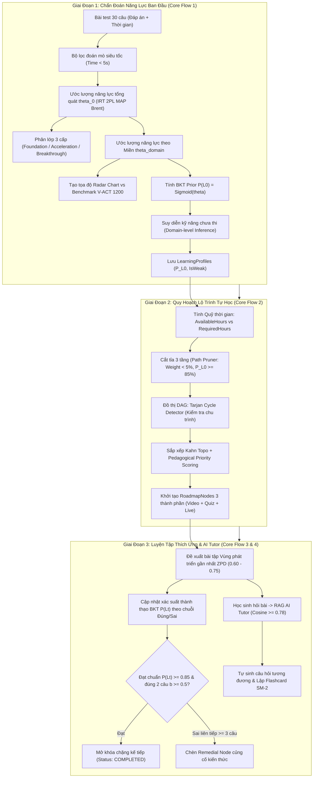

# HỆ THỐNG HÓA TOÀN BỘ CÔNG THỨC TOÁN HỌC, TÂM TRẮC HỌC & GIẢI THUẬT AI (V-EVAL UNIFIED MATHEMATICAL & AI SPECIFICATION)

> [!IMPORTANT]
> **Dự án:** V-Eval - Hệ thống cá nhân hóa lộ trình học & luyện thi Đánh giá năng lực (ĐGNL) tích hợp AI  
> **Mã đề tài:** FA26SE090  
> **Phiên bản:** 1.0 (Chính thức)  
> **Ngày ban hành:** 30/09/2026  
> **Chuẩn tương thích:** MD Editor Plus / Mermaid 11.15.0+  
> **Tài liệu liên kết:** [Báo cáo BRS/SRS](./FA26SE090_AI_POWERED_PERSONALIZED_LEARNING_PATH_PL_taint.docx) | [Core Flow 1](./core_flow_1_chan_doan_nang_luc.md) | [Core Flow 2](./core_flow_2_quy_hoach_lo_trinh_hoc_tap.md) | [Phân tích AbilityGroups](./SQL/Phan_Tich_Gom_Nhom_AbilityGroups.md)

---

## 📑 MỤC LỤC HỆ THỐNG

1. [Tổng Quan Kiến Trúc Luồng Toán Học & AI Toàn Hệ Thống](#1-tổng-quan-kiến-trúc-luồng-toán-học--ai-toàn-hệ-thống)
2. [Module I: Khảo Thí Thích Ứng & Chẩn Đoán Năng Lực Đầu Vào (Core Flow 1)](#2-module-i-khảo-thí-thích-ứng--chẩn-đoán-năng-lực-đầu-vào-core-flow-1)
   * 2.1. Mô hình IRT 2-Parameter Logistic (2PL) Có Đoán Mò
   * 2.2. Cơ chế Phạt Đoán Mò Siêu Tốc (Anti-Guessing Penalty)
   * 2.3. Ước Lượng Năng Lực Tiềm Ẩn Maximum A Posteriori (MAP) Với Gaussian Prior & Tối Ưu Brent
   * 2.4. Hàm Thông Tin Fisher & Sai Số Chuẩn Của Ước Lượng (SEM)
   * 2.5. Cầu Nối Khảo Thí - Tiếp Nhận Tri Thức: BKT Prior & Kẹp Biên An Toàn (Safety Clamping)
   * 2.6. Heuristic Năng Lực Cho Kỹ Năng Đơn Lẻ (Single-Item Skill)
   * 2.7. Cơ Chế Suy Diễn Cấp Miền Cho Kỹ Năng Chưa Thi (Domain-Level Cold-Start Inference)
   * 2.8. Quy Tắc Phân Lớp Năng Lực Học Sinh 3 Cấp (Placement Classification)
   * 2.9. Tọa Độ Biểu Đồ Mạng Nhện (Radar Chart) Đối Chiếu Benchmark V-ACT 1200
   * 2.10. Quy Tắc Nhận Diện Kỹ Năng Yếu (Weak Skills Identification)
3. [Module II: Quy Hoạch Lộ Trình Cá Nhân Hóa & Lý Thuyết Đồ Thị (Core Flow 2)](#3-module-ii-quy-hoạch-lộ-trình-cá-nhân-hóa--lý-thuyết-đồ-thị-core-flow-2)
   * 3.1. Định Lượng Quỹ Thời Gian Tự Học Khả Dụng vs Thời Gian Cần Thiết
   * 3.2. Thuật Toán Cắt Tỉa Lộ Trình 3 Tầng (Path Pruning Engine)
   * 3.3. Hàm Ưu Tiên Sư Phạm Trong Sắp Xếp Topo (Kahn's Topological Priority Scoring)
   * 3.4. Máy Trạng Thái Hữu Hạn Điều Phối Mở Khóa Chặng (Milestone FSM Unlocking)
4. [Module III: Luyện Tập Thích Ứng, BKT & Cơ Chế Can Thiệp (Core Flow 3)](#4-module-iii-luyện-tập-thích-ứng-bkt--cơ-chế-can-thiệp-core-flow-3)
   * 4.1. Đề Xuất Câu Hỏi Thích Ứng Theo Vùng Phát Triển Gần Nhất (ZPD Item Recommender)
   * 4.2. Mô Hình Tiếp Nhận Tri Thức Bayesian Knowledge Tracing (BKT Transitions)
   * 4.3. Ngưỡng Làm Chủ Tri Thức Kiểm Chứng (Mastery Verification Gate)
   * 4.4. Tự Động Rẽ Nhánh & Chèn Chặng Củng Cố (Remedial Node Insertion)
   * 4.5. Kích Hoạt Hệ Thống Cảnh Báo Sớm Sa Sút (Early Warning Trigger)
5. [Module IV: Trợ Lý AI Tutor RAG, Phân Cụm Máy Học & Ôn Tập Ngắt Quãng](#5-module-iv-trợ-lý-ai-tutor-rag-phân-cụm-máy-học--ôn-tập-ngắt-quãng)
   * 5.1. Ngưỡng Tương Đồng Ngữ Nghĩa Chống Ảo Giác RAG (Cosine Similarity on 768d Vector)
   * 5.2. Phân Cụm Năng Lực Giảm Chiều Cấp Miền K-Means (Domain-Based Clustering for Ability Groups)
   * 5.3. Thuật Toán Lặp Lại Ngắt Quãng Thẻ Ghi Nhớ (SuperMemo SM-2 Flashcards)
6. [Bảng Tra Cứu Siêu Tham Số Hệ Thống Toàn Diện (Hyperparameters Master Table)](#6-bảng-tra-cứu-siêu-tham-số-hệ-thống-toàn-diện-hyperparameters-master-table)
7. [Ma Trận Liên Thông Dữ Liệu & Giao Thức Giữa Các Microservices](#7-ma-trận-liên-thông-dữ-liệu--giao-thức-giữa-các-microservices)
8. [Danh Mục Tài Liệu Tham Khảo Khoa Học Chuẩn Quốc Tế](#8-danh-mục-tài-liệu-tham-khảo-khoa-học-chuẩn-quốc-tế)

---

## 1. TỔNG QUAN KIẾN TRÚC LUỒNG TOÁN HỌC & AI TOÀN HỆ THỐNG

Hệ sinh thái V-Eval kết hợp chặt chẽ giữa **Lý thuyết Khảo thí Hiện đại (Item Response Theory - IRT 2PL)**, **Mô hình Chuỗi Markov Tiếp nhận Tri thức (Bayesian Knowledge Tracing - BKT)**, **Giải thuật Đồ thị Có hướng Không chu trình (DAG Graph Engine)** và **Trí tuệ Nhân tạo Tạo sinh Tăng cường Truy xuất (RAG LLM)**:



---

## 2. MODULE I: KHẢO THÍ THÍCH ỨNG & CHẨN ĐOÁN NĂNG LỰC ĐẦU VÀO (CORE FLOW 1)

### 2.1. Mô hình IRT 2-Parameter Logistic (2PL) Có Đoán Mò
* **Công thức toán học:**
  ```text
  P(X_i = 1 | theta) = c + (1 - c) / (1 + exp(-a_i * (theta - b_i)))
  ```
  *(Khi tính toán xấp xỉ phân phối chuẩn, hệ số tỷ lệ hóa `` D = 1.7 `` được nhân vào số mũ: `` -D \cdot a_i (\theta - b_i) ``)*.
* **Ký hiệu & Thành phần:**
  * `` \theta `` (Theta): Năng lực tiềm ẩn của học sinh (Latent Ability Trait), chạy trong khoảng `` [-3.0, +3.0] `` (chuẩn hóa trung bình `` \mu = 0.0 ``).
  * `` b_i ``: Tham số độ khó của câu hỏi thứ `i`. Ánh xạ từ 6 cấp độ tư duy chuẩn Bloom trong hệ thống:
    * Cấp 1 (Nhận biết): `` b = -1.8 ``
    * Cấp 2 (Thông hiểu): `` b = -1.0 ``
    * Cấp 3 (Vận dụng): `` b = -0.2 ``
    * Cấp 4 (Phân tích): `` b = +0.6 ``
    * Cấp 5 (Đánh giá): `` b = +1.4 ``
    * Cấp 6 (Sáng tạo): `` b = +2.2 ``
  * `` a_i ``: Tham số độ phân biệt câu hỏi (mặc định chuẩn toàn hệ sinh thái `` a = 1.2 ``).
  * `` c ``: Xác suất đoán mò ngẫu nhiên (Pseudo-Guessing). Đề trắc nghiệm 4 lựa chọn (A, B, C, D) có `` c = 0.25 ``.
* **Ngữ nghĩa nghiệp vụ:**
  Đo lường xác suất một học sinh có năng lực `` \theta `` giải đúng câu hỏi có độ khó `` b_i ``. Khắc phục sự cào bằng của thang điểm cổ điển (làm đúng 1 câu Vận dụng cao mang lại lượng thông tin vượt trội so với 1 câu Nhận biết). Tham số `` c = 0.25 `` đảm bảo học sinh hoàn toàn mất gốc (`` \theta \to -\infty ``) vẫn có 25% xác suất chọn trúng đáp án, tránh việc hạ điểm năng lực về mức âm vô cùng.

---

### 2.2. Cơ chế Phạt Đoán Mò Siêu Tốc (Anti-Guessing Penalty)
* **Công thức logic & tham số:**
  ```text
  Nếu TimeSpent_i < 5 giây  ==>  Gán a_i = 0.1 (thay vì a_i = 1.2)
  ```
* **Ký hiệu & Thành phần:**
  * `` TimeSpent_i ``: Thời gian học sinh dừng lại đọc đề và chọn đáp án câu thứ `i` (giây).
* **Ngữ nghĩa nghiệp vụ:**
  Khi học sinh "đánh lụi" quá nhanh (dưới 5 giây), việc gán độ phân biệt về `` a_i = 0.1 `` làm phẳng hoàn toàn đường cong xác suất. Đạo hàm bậc nhất triệt tiêu kéo theo lượng thông tin Fisher của câu hỏi đó tiến về 0:
  ```text
  I_i(theta) ≈ 0
  ```
  Nhờ đó, một câu hỏi vận dụng cao vô tình được đánh lụi trúng đáp án hoàn toàn không thể làm sai lệch hoặc phóng đại năng lực thực tế của học sinh.

---

### 2.3. Ước Lượng Năng Lực Tiềm Ẩn Maximum A Posteriori (MAP) Với Gaussian Prior & Tối Ưu Brent
* **Công thức toán học:**
  ```text
  theta_hat_MAP = argmax_{theta ∈ [-3.0, 3.0]} [ ln L(theta) - (theta^2 / (2 * sigma^2)) ]
  ```
  Với độ lệch chuẩn tiên nghiệm `` \sigma = 2.0 ``, hàm mất mát cần cực tiểu hóa (Negative Log-Posterior):
  ```text
  Loss(theta) = - ln L(theta) + (theta^2 / 8.0)
  ```
  Trong đó, hàm Log-Likelihood thực nghiệm từ 30 câu trả lời:
  ```text
  ln L(theta) = ∑_{i=1}^{30} [ u_i * ln(P_i(theta)) + (1 - u_i) * ln(1 - P_i(theta)) ]
  ```
  *(với `` u_i = 1 `` nếu trả lời đúng, `` u_i = 0 `` nếu trả lời sai)*.
* **Ngữ nghĩa nghiệp vụ:**
  * Khắc phục hiện tượng vô nghiệm của Maximum Likelihood Estimation (MLE) thuần túy khi học sinh trả lời **đúng 100%** (30/30 câu $\to +\infty$) hoặc **sai 100%** (0/30 câu $\to -\infty$).
  * Phân phối Gaussian Prior `` \mathcal{N}(0, 2.0^2) `` đóng vai trò như thành phần điều chuẩn L2 (Shrinkage Regularization), kéo điểm năng lực về trung tâm phân phối khi dữ liệu biên quá ít.
  * Thuật toán tối ưu hóa vô hướng **Brent** (`scipy.optimize.minimize_scalar`) đảm bảo tìm ra nghiệm tối ưu toàn cục chỉ trong **dưới 15ms**.

---

### 2.4. Hàm Thông Tin Fisher & Sai Số Chuẩn Của Ước Lượng (SEM)
* **Công thức toán học:**
  ```text
  SE(theta_hat) = 1 / sqrt( I(theta_hat) + (1 / sigma^2) ) = 1 / sqrt( I(theta_hat) + 0.25 )
  ```
  Hàm thông tin Fisher trên toàn bài khảo sát:
  ```text
  I(theta) = ∑_{i=1}^{30} [ (P'_i(theta))^2 / (P_i(theta) * (1 - P_i(theta))) ]
  ```
  Đạo hàm bậc nhất của hàm IRT 2PL:
  ```text
  P'_i(theta) = (1 - c) * a_i * [ exp(-a_i * (theta - b_i)) / (1 + exp(-a_i * (theta - b_i)))^2 ]
  ```
* **Ngữ nghĩa nghiệp vụ:**
  Cung cấp biên độ tin cậy của phép đo năng lực. Khoảng tin cậy 95% của năng lực học sinh được xác định bởi `` [\hat{\theta} - 1.96 \cdot SE, \hat{\theta} + 1.96 \cdot SE] ``. Bài thi càng bám sát năng lực học sinh thì hàm thông tin càng lớn và sai số chuẩn càng nhỏ.

---

### 2.5. Cầu Nối Khảo Thí - Tiếp Nhận Tri Thức: BKT Prior & Kẹp Biên An Toàn (Safety Clamping)
* **Công thức toán học:**
  ```text
  P(L_0) = Sigmoid(theta_skill) = 1 / (1 + exp(-theta_skill))
  P(L_0)_clamped = max(0.05, min(0.95, P(L_0)))
  ```
* **Bảng quy đổi tương đương:**
  * `` \theta = -2.0 `` (Yếu mất gốc) $\implies$ `` P(L_0) \approx 0.1192 ``
  * `` \theta = 0.0 `` (Năng lực trung bình) $\implies$ `` P(L_0) = 0.5000 ``
  * `` \theta = +2.0 `` (Khá giỏi) $\implies$ `` P(L_0) \approx 0.8808 ``
* **Ngữ nghĩa nghiệp vụ:**
  Chuyển đổi thang đo logit trừu tượng của IRT (từ âm vô cùng đến dương vô cùng) sang không gian xác suất tiên nghiệm chuẩn tắc `` [0.0, 1.0] `` cho mô hình Bayesian Knowledge Tracing. Cơ chế kẹp biên an toàn trong ngưỡng `` [0.05, 0.95] `` ngăn chặn hiện tượng triệt tiêu mẫu số trong chuỗi Markov ẩn (tránh làm đóng băng vĩnh viễn điểm năng lực của học sinh).

---

### 2.6. Heuristic Năng Lực Cho Kỹ Năng Đơn Lẻ (Single-Item Skill)
* **Công thức toán học:**
  ```text
  theta_skill = theta_domain + 0.3  (Nếu trả lời ĐÚNG)
  theta_skill = theta_domain - 0.3  (Nếu trả lời SAI)
  ```
* **Ngữ nghĩa nghiệp vụ:**
  Áp dụng cho kỹ năng chỉ xuất hiện đúng 1 câu hỏi trong bài kiểm tra chẩn đoán. Khi không đủ điểm dữ liệu để giải bài toán tối ưu IRT, công thức này neo năng lực kỹ năng con vào năng lực chung của cả Miền cha (`\theta_{domain}`), sau đó điều chỉnh tăng/giảm 0.3 độ lệch chuẩn.

---

### 2.7. Cơ Chế Suy Diễn Cấp Miền Cho Kỹ Năng Chưa Thi (Domain-Level Cold-Start Inference)
* **Công thức toán học:**
  ```text
  Với kỹ năng s chưa có câu hỏi nào trong đề thi:
  theta_s = theta_domain_d
  P(L_0)_s = Sigmoid(theta_domain_d)
  Source = "inferred_from_domain"
  ```
* **Ngữ nghĩa nghiệp vụ:**
  Giải quyết triệt để bài toán **Khởi động lạnh (Cold-Start)**. Đề thi rút gọn 30 câu chỉ đo lường được 12 kỹ năng đại diện trong khi toàn bộ khung năng lực có 60 kỹ năng. Cơ chế suy diễn gán giá trị năng lực trung bình của miền cha cho các kỹ năng con chưa thi, đảm bảo toàn bộ cây kỹ năng có giá trị khởi tạo đầy đủ để thuật toán sinh lộ trình học hoạt động trơn tru.

---

### 2.8. Quy Tắc Phân Lớp Năng Lực Học Sinh 3 Cấp (Placement Classification)
* **Quy tắc phân loại:**
  ```text
  - Nếu theta_0 < -0.5       ==>  Xếp vào Lớp Nền tảng (FOUNDATION)
  - Nếu -0.5 ≤ theta_0 ≤ 0.5 ==>  Xếp vào Lớp Tăng tốc (ACCELERATION)
  - Nếu theta_0 > 0.5        ==>  Xếp vào Lớp Bứt phá (BREAKTHROUGH)
  ```
* **Ngữ nghĩa nghiệp vụ:**
  Dựa trên phân phối chuẩn tắc Gauss `` \mathcal{N}(0, 1) ``:
  * Khoảng `` [-0.5, +0.5] `` chiếm **38.30%** học sinh (năng lực trung bình khá) $\implies$ Lớp Tăng tốc tập trung vào luyện giải đề và tăng tốc độ làm bài.
  * Khoảng `` \theta < -0.5 `` chiếm **30.85%** học sinh (bị hổng kiến thức) $\implies$ Lớp Nền tảng tập trung củng cố lý thuyết căn bản.
  * Khoảng `` \theta > 0.5 `` chiếm **30.85%** học sinh (khá giỏi) $\implies$ Lớp Bứt phá tập trung rèn luyện các dạng bài vận dụng cao.

---

### 2.9. Tọa Độ Biểu Đồ Mạng Nhện (Radar Chart) Đối Chiếu Benchmark V-ACT 1200
* **Công thức toán học:**
  ```text
  StudentPct_d = (Tong_cau_dung_mien_d / Tong_so_cau_mien_d) * 100%
  BenchmarkPct = (TargetScore / 1200) * 100%
  ```
* **Ngữ nghĩa nghiệp vụ:**
  Đề thi ĐGNL ĐHQG-HCM có thang điểm tối đa cố định là **1200 điểm**. Điểm mục tiêu cá nhân (ví dụ: 850/1200 tương đương 70.83%) tạo thành một đa giác chuẩn mực tiêu. Khi biểu diễn trên biểu đồ mạng nhện đa trục, người học và phụ huynh nhận diện ngay lập tức phân môn nào đã vượt chuẩn mục tiêu và phân môn nào đang hổng cần ưu tiên bù đắp.

---

### 2.10. Quy Tắc Nhận Diện Kỹ Năng Yếu (Weak Skills Identification)
* **Công thức logic:**
  ```text
  IsWeak = True  <==>  AccuracyPct_skill < 60.0%  (hoặc P(L_0) < 0.60)
  ```
* **Ngữ nghĩa nghiệp vụ:**
  Ngưỡng 60% là chuẩn mực sư phạm để phân định năng lực chưa đạt yêu cầu. Kỹ năng bị gắn cờ `IsWeak = true` sẽ nhận thêm điểm ưu tiên sư phạm để đưa lên đầu danh sách học trong lộ trình và nhận tài liệu ôn tập củng cố.

---

## 3. MODULE II: QUY HOẠCH LỘ TRÌNH CÁ NHÂN HÓA & LÝ THUYẾT ĐỒ THỊ (CORE FLOW 2)

### 3.1. Định Lượng Quỹ Thời Gian Tự Học Khả Dụng vs Thời Gian Cần Thiết
* **Công thức toán học:**
  ```text
  AvailableHours = max(1, (ExamDate - Now).TotalDays) * StudyHoursPerDay
  RequiredHours = Tong_so_ky_nang * EstimatedHoursPerSkill
  ```
  *(Định mức chuẩn V-Eval: `` EstimatedHoursPerSkill = 4.0 `` giờ gồm 1.5h video lý thuyết + 1.5h bài tập thực hành + 1.0h Live Q&A)*.
* **Ngữ nghĩa nghiệp vụ:**
  Đo lường tính khả thi của tiến trình tự học. Nếu quỹ thời gian khả dụng nhỏ hơn thời gian cần thiết để hoàn thành toàn bộ các kỹ năng, hệ thống kích hoạt thuật toán cắt tỉa thông minh.

---

### 3.2. Thuật Toán Cắt Tỉa Lộ Trình 3 Tầng (Path Pruning Engine)
* **Điều kiện kích hoạt cắt tỉa (OR một trong hai):**
  ```text
  (AvailableHours < RequiredHours)  HOẶC  (DaysRemaining < 30 VÀ TargetScore >= 800)
  ```
* **Chiến lược cắt tỉa 3 tầng:**
  * **Tầng 1 (Cắt tỉa trọng số thấp):** Tỉa bỏ các kỹ năng có trọng số cấu trúc đề thi `Weight < 0.05` (Sinh học 3%, Lịch sử & Địa lý 3%, Hóa học 4%).
  * **Tầng 2 (Cắt tỉa kỹ năng đã đạt chuẩn):** Tỉa bỏ các kỹ năng học sinh đã thành thạo từ đầu với `P(L_0) \ge 0.85`.
  * **Tầng 3 (Dồn lực trọng tâm):** Dồn 80% thời gian ôn tập vào các kỹ năng cốt lõi chiếm tỷ trọng điểm cao nhất (Toán đại số, Đọc hiểu Tiếng Việt, Logic & Phân tích số liệu).
* **Ngữ nghĩa nghiệp vụ:**
  Đảm bảo học sinh không bị rơi vào tình trạng quá tải hoặc bỏ dở lộ trình khi thời gian đến ngày thi quá gấp rút, tối ưu hóa xác suất đạt điểm số mục tiêu cao nhất trong quỹ thời gian hạn hẹp.

---

### 3.3. Hàm Ưu Tiên Sư Phạm Trong Sắp Xếp Topo (Kahn's Topological Priority Scoring)
* **Công thức toán học:**
  ```text
  PriorityScore(u) = (1.0 - P(L_0)_u) * 0.5 + Weight_u * 0.3 + WeakBonus_u
  ```
  *(trong đó `` WeakBonus_u = 0.2 `` nếu `IsWeak = true`, ngược lại bằng `0.0`)*.
* **Ngữ nghĩa nghiệp vụ:**
  Được cài đặt trong class `TopologicalSorter` sử dụng thuật toán Kahn kết hợp hàng đợi ưu tiên `PriorityQueue`:
  1. Bảo đảm tuyệt đối quan hệ tiên quyết: Kỹ năng nền tảng (bậc vào `in_degree = 0`) luôn luôn được học trước kỹ năng nâng cao.
  2. Giữa các kỹ năng có thể học song song, kỹ năng có điểm số hổng kiến thức nặng nhất (`1.0 - P(L_0)`), chiếm trọng số đề thi lớn nhất (`Weight`) và đã bị cảnh báo yếu (`WeakBonus`) sẽ được ưu tiên xếp học trước.

---

### 3.4. Máy Trạng Thái Hữu Hạn Điều Phối Mở Khóa Chặng (Milestone FSM Unlocking)
* **Điều kiện tiên quyết để hoàn thành Chặng học N:**
  ```text
  1. Tỷ lệ xem Video bài giảng: WatchedDuration / VideoDuration >= 0.80 (80%)
  2. Điểm số bài Quiz củng cố: QuizScore >= 60.0%
  3. Xử lý vắng mặt Live Q&A: IsMakeupQuizPassed == true (Điểm Quiz bù >= 60.0%)
  ```
* **Chuyển dịch trạng thái (State Transition):**
  ```text
  Node_N.Status = "COMPLETED"  ===>  Node_{N+1}.Status = "IN_PROGRESS" (UnlockedAt = UtcNow)
  ```
* **Ngữ nghĩa nghiệp vụ:**
  Đảm bảo tính nghiêm túc và thực chất của quá trình học tập thích ứng, ngăn ngừa việc học sinh gian lận nhảy cóc qua các chặng mà chưa thực sự tiếp thu kiến thức.

---

## 4. MODULE III: LUYỆN TẬP THÍCH ỨNG, BKT & CƠ CHẾ CAN THIỆP (CORE FLOW 3)

### 4.1. Đề Xuất Câu Hỏi Thích Ứng Theo Vùng Phát Triển Gần Nhất (ZPD Item Recommender)
* **Công thức xác suất làm đúng (IRT 2PL):**
  ```text
  P(Correct) = 1 / (1 + exp(-a * (theta - b)))
  ```
* **Dải lọc câu hỏi tối ưu (Vygotsky ZPD & 85% Rule):**
  ```text
  0.60 <= P(Correct) <= 0.75
  ```
* **Ngữ nghĩa nghiệp vụ:**
  Theo công trình của Wilson et al. (Nature Communications 2019) và lý thuyết ZPD của Vygotsky:
  * Nếu chọn câu hỏi `P > 0.80`: Câu hỏi quá dễ, tạo cảm giác thỏa mãn ảo nhưng không mở rộng tri thức mới.
  * Nếu chọn câu hỏi `P < 0.50`: Quá khó, kích thích hành vi đoán mò và dẫn tới nản lòng từ bỏ học tập (Dropout).
  * Khoảng xác suất `[0.60, 0.75]` là điểm rơi sư phạm lý tưởng kích thích sự tập trung và tiếp thu kiến thức sâu sắc nhất.

---

### 4.2. Mô Hình Tiếp Nhận Tri Thức Bayesian Knowledge Tracing (BKT Transitions)
* **Công thức cập nhật xác suất thành thạo (Corbett & Anderson 1994):**
  * **Trường hợp học sinh trả lời ĐÚNG:**
    ```text
    P(L_t | Dung) = [ P(L_{t-1}) * (1 - Slip) ] / [ P(L_{t-1}) * (1 - Slip) + (1 - P(L_{t-1})) * Guess ]
    ```
  * **Trường hợp học sinh trả lời SAI:**
    ```text
    P(L_t | Sai) = [ P(L_{t-1}) * Slip ] / [ P(L_{t-1}) * Slip + (1 - P(L_{t-1})) * (1 - Guess) ]
    ```
  * **Bước chuyển dịch tri thức (Learning Transition):**
    ```text
    P(L_t) = P(L_t | Quan_sat) + (1 - P(L_t | Quan_sat)) * P(Transit)
    ```
* **Tham số định chuẩn thực nghiệm:**
  * `P(Transit) = 0.15`: Xác suất học sinh lĩnh hội được kỹ năng sau khi giải 1 câu bài tập.
  * `Slip = 0.10`: Xác suất đã làm chủ kỹ năng nhưng sơ suất tính toán sai.
  * `Guess = 0.25`: Xác suất không hiểu bài nhưng chọn bừa trúng đáp án 4 phương án.
* **Ngữ nghĩa nghiệp vụ:**
  Mô hình hóa biến thiên nhận thức theo thời gian thực. Điểm số thành thạo kỹ năng tự động điều chỉnh mượt mà theo từng lượt tương tác đúng hoặc sai.

---

### 4.3. Ngưỡng Làm Chủ Tri Thức Kiểm Chứng (Mastery Verification Gate - BR-01)
* **Điều kiện thỏa mãn đồng thời (AND):**
  ```text
  1. Xác suất làm chủ BKT: P(L_t) >= 0.85 (tương đương 85%)
  2. Kiểm chứng độ khó: Trả lời đúng liên tiếp tối thiểu 2 câu hỏi có độ khó IRT b >= 0.50
  ```
* **Ngữ nghĩa nghiệp vụ:**
  Ngăn ngừa hiện tượng tích lũy điểm ảo khi chỉ giải các câu nhận biết đơn giản. Ràng buộc giải đúng 2 câu Vận dụng (`b \ge 0.50`) đóng vai trò như một chốt chặn kiểm duyệt chất lượng trước khi hệ thống xác nhận học sinh đã làm chủ hoàn toàn kỹ năng.

---

### 4.4. Tự Động Rẽ Nhánh & Chèn Chặng Củng Cố (Remedial Node Insertion - BR-03)
* **Điều kiện kích hoạt:**
  ```text
  Consecutive_Incorrect_Count >= 3  (trên cùng một mã kỹ năng KC)
  ```
* **Hành động hệ thống:**
  1. Tạm dừng lộ trình chính hiện tại.
  2. Tạo và chèn ngay **01 Remedial Node** (Gồm: Tóm tắt lý thuyết cốt lõi kèm 3 câu hỏi cơ bản mức độ Nhận biết `b < 0.0`) vào ngay trước bài học tiếp theo.
  3. Tái phân bổ lại thời khóa biểu ôn tập các ngày còn lại để giữ nguyên mốc ngày thi mục tiêu.
* **Ngữ nghĩa nghiệp vụ:**
  Ngăn chặn nguy cơ hổng kiến thức dây chuyền ngay khi phát hiện người học rơi vào bế tắc nhận thức.

---

### 4.5. Kích Hoạt Hệ Thống Cảnh Báo Sớm Sa Sút (Early Warning Trigger - BR-04)
* **Điều kiện kích hoạt (OR một trong hai):**
  ```text
  1. Xác suất đạt điểm mục tiêu: P(Target) < 0.60 (dưới 60%)
  2. Số ngày gián đoạn học tập: Inactive_Days >= 3 ngày liên tiếp
  ```
* **Hành động hệ thống:**
  Khởi tạo bản ghi trong bảng `SystemAlerts`, tự động gửi Push Notification về ứng dụng học sinh và gửi Email/Web Notification cảnh báo tới Phụ huynh để kịp thời đồng hành đôn đốc.

---

## 5. MODULE IV: TRỢ LÝ AI TUTOR RAG, PHÂN CỤM MÁY HỌC & ÔN TẬP NGẮT QUÃNG

### 5.1. Ngưỡng Tương Đồng Ngữ Nghĩa Chống Ảo Giác RAG (Cosine Similarity on 768d Vector - BR-05)
* **Công thức độ tương đồng Cosine:**
  ```text
  CosineSimilarity(u, v) = (u · v) / (||u||_2 * ||v||_2) = (∑_{k=1}^{768} u_k * v_k) / (sqrt(∑ u_k^2) * sqrt(∑ v_k^2))
  ```
* **Ngưỡng chấp thuận:**
  ```text
  CosineSimilarity >= 0.78  (sử dụng Gemini text-embedding-004 vector 768 chiều)
  ```
* **Xử lý ngoại lệ an toàn (Safety Fallback):**
  Nếu `CosineSimilarity < 0.78`, hệ thống **nghiêm cấm LLM tự suy diễn tự do**; lập tức trả về lời giải tĩnh đã được kiểm duyệt trong cơ sở dữ liệu và gắn cờ câu hỏi sang hàng đợi rà soát của Giáo viên.

---

### 5.2. Phân Cụm Năng Lực Giảm Chiều Cấp Miền K-Means (Domain-Based Clustering for Ability Groups)
* **Giải quyết bài toán nổ tổ hợp (Combinatorial Explosion):**
  * Naive Clustering trên toàn bộ 60 kỹ năng: Không gian trạng thái `3^{60} \approx 4.23 \times 10^{28}` tổ hợp $\implies$ Lời nguyền số chiều (Curse of Dimensionality), mỗi học sinh trở thành một cụm riêng biệt.
  * **Giải pháp chia để trị theo Miền (Domain-based Clustering):** Tách thành 5 bài toán gom nhóm độc lập tương ứng với 5 Domains (mỗi domain chỉ có 10-15 chiều).
* **Quy mô số nhóm:**
  ```text
  Tong_so_Groups_toan_he_thong = 5 domains * K_cum = 5 * 5 = 25 ability groups
  ```
* **Hiệu quả kinh tế:**
  Thay vì sinh lộ trình riêng cho 10.000 học sinh (`10.000 calls * $0.02 = $200 / đợt thi`), hệ thống chỉ cần gọi AI tạo 25 lộ trình chuẩn cho 25 nhóm (`25 calls * $0.02 = $0.50`), **tiết kiệm 99.75% chi phí API** và thuật toán K-Means hội tụ trong **dưới 1 giây**.

---

### 5.3. Thuật Toán Lặp Lại Ngắt Quãng Thẻ Ghi Nhớ (SuperMemo SM-2 Flashcards - FR-22)
* **Công thức cập nhật hệ số dễ dàng (Easiness Factor - EF):**
  ```text
  EF' = EF + (0.1 - (5 - q) * (0.08 + (5 - q) * 0.02))
  EF = max(1.3, EF')
  ```
* **Khoảng thời gian giãn cách ôn tập `I(n)`:**
  ```text
  - Lần 1: I(1) = 1 ngày
  - Lần 2: I(2) = 6 ngày
  - Lần n (n > 2): I(n) = I(n - 1) * EF
  ```
  *(với `q \in [0, 5]` là điểm số tự đánh giá mức độ ghi nhớ: 5 - Hoàn hảo, 4 - Nhớ sau ngập ngừng, 3 - Rất vất vả mới nhớ, 0-2 - Hoàn toàn quên)*.
* **Ngữ nghĩa nghiệp vụ:**
  Tự động tổng hợp các câu hỏi làm sai trong quá trình luyện tập thành bộ Flashcard thông minh. Thuật toán phân bổ lịch ôn tập bám sát đường cong quên lãng Ebbinghaus giúp khắc sâu tri thức dài hạn.

---

## 6. BẢNG TRA CỨU SIÊU THAM SỐ HỆ THỐNG TOÀN DIỆN (HYPERPARAMETERS MASTER TABLE)

| Tên Siêu Tham Số | Ký Hiệu Mã Nguồn | Giá Trị Cố Định / Chuẩn | Miền Giá Trị Hợp Lệ | Nguồn Gốc / Căn Cứ Khoa Học |
| :--- | :--- | :---: | :---: | :--- |
| Biên năng lực IRT | `THETA_BOUNDS` | `[-3.0, +3.0]` | `[-4.0, +4.0]` | Frank B. Baker (2001) |
| Tham số đoán mò | `GUESSING_PARAM` | `0.25` | `0.25` | Trắc nghiệm 4 lựa chọn (A, B, C, D) |
| Độ phân biệt chuẩn | `DEFAULT_DISCRIMINATION` | `1.2` | `[0.5, 2.5]` | Chuẩn khảo thí IRT 2PL |
| Ngưỡng phạt đoán mò | `RAPID_GUESS_THRESHOLD_SECONDS` | `< 5` giây | `[3, 7]` giây | Anti-guessing penalty (`a \to 0.1`) |
| Độ lệch chuẩn Gaussian Prior | `GAUSSIAN_PRIOR_SIGMA` | `2.0` | `[1.5, 3.0]` | MAP Brent Regularization (`\theta^2 / 8.0`) |
| Kẹp biên an toàn BKT | `BKT_CLAMP` | `[0.05, 0.95]` | `[0.01, 0.99]` | Chống đóng băng HMM (Pelánek 2017) |
| Ngưỡng lớp Nền tảng | `PLACEMENT_THRESHOLD_FOUNDATION` | `< -0.5` | `\theta < -0.5` | Phân vị 30.85% phân phối chuẩn |
| Ngưỡng lớp Bứt phá | `PLACEMENT_THRESHOLD_BREAKTHROUGH` | `> 0.5` | `\theta > 0.5` | Phân vị 30.85% phân phối chuẩn |
| Ngưỡng kỹ năng yếu | `WEAK_SKILL_THRESHOLD` | `< 60.0%` | `[50%, 65%]` | Quy chuẩn sư phạm V-Eval |
| Định mức giờ học / kỹ năng | `EstimatedHoursPerSkill` | `4.0` giờ | `[3.0, 5.0]` giờ | 1.5h video + 1.5h quiz + 1.0h live |
| Ngưỡng cắt tỉa trọng số | `WeightPruneThreshold` | `< 0.05` (5%) | `[0.03, 0.06]` | Cắt tỉa chuyên đề chiếm ít điểm |
| Ngưỡng cắt tỉa kỹ năng vững | `MasteryPruneThreshold` | `\ge 0.85` (85%) | `[0.80, 0.90]` | Cắt tỉa chuyên đề đã thành thạo |
| Ngưỡng ngày gấp rút | `UrgentDaysThreshold` | `< 30` ngày | `[20, 45]` ngày | Kích hoạt cắt tỉa dồn sức nước rút |
| Vùng phát triển gần nhất | `ZPD_RANGE` | `[0.60, 0.75]` | `[0.55, 0.80]` | Wilson et al. (Nature 2019) & Vygotsky |
| Ngưỡng hoàn thành chặng | `MasteryThreshold` | `P(L_t) \ge 0.85` | `\ge 0.85` | Corbett & Anderson (1994) |
| Độ khó kiểm chứng | `MasteryVerifyDifficulty` | `b \ge 0.50` | `b \ge 0.50` | Kiểm tra năng lực Vận dụng cao |
| Số câu sai chèn Remedial | `REMEDIAL_FAIL_COUNT` | `\ge 3` câu liên tiếp | `[3, 5]` câu | Tự động chèn chặng củng cố |
| Ngưỡng tương đồng RAG | `RAG_COSINE_THRESHOLD` | `\ge 0.78` | `[0.75, 0.82]` | Chống ảo giác LLM (Lewis et al. 2020) |
| Chiều không gian Vector | `EMBEDDING_DIM` | `768` | Cố định `768` | Gemini text-embedding-004 |
| Số ngày nghỉ cảnh báo | `INACTIVE_ALERT_DAYS` | `\ge 3` ngày | `[2, 5]` ngày | Early Warning Trigger |

---

## 7. MA TRẬN LIÊN THÔNG DỮ LIỆU & GIAO THỨC GIỮA CÁC MICROSERVICES

| Tên Dữ Liệu / Tham Số | Dịch Vụ Khởi Tạo | Giao Thức Truyền Tải | Dịch Vụ Tiếp Nhận | Bảng CSDL Lưu Trữ |
| :--- | :--- | :--- | :--- | :--- |
| `Answers` & `TimeSpent` | Mobile / Web Client | HTTP REST | `Practice Service` | `practice.submission_answers` |
| `ItemParams (a, b)` & `SkillId` | `Content Service` | gRPC (Port 5250) | `Practice Service` | `content.Questions` |
| `CampusId` & `TargetScore` | `Identity Service` | gRPC (Port 5156) | `Practice Service` | `iam.Users` & `profile.Students` |
| `Theta_0`, `P(L_0)`, `Radar` | `AI Engine` | HTTP REST (Port 8000) | `Practice Service` | `practice.exam_submissions` |
| `MasteryScore P(L_0)` | `Practice Service` | EF Core PostgreSQL | `Practice Service` | `practice.learning_profiles` |
| `Graph DAG & Weights` | `Content Service` | gRPC (Port 5250) | `Practice Service` | `content.Skills` |
| `PriorityScore & Pruning` | `Practice Service` | C# In-Memory Graph | `Practice Service` | `practice.LearningRoadmaps` |
| `Vector Embeddings (768d)` | `AI Engine` | HNSW Index | PostgreSQL (`pgvector`)| `public.KnowledgeVectorChunks` |

---

## 8. DANH MỤC TÀI LIỆU THAM KHẢO KHOA HỌC CHUẨN QUỐC TẾ

1. **Baker, F. B. (2001)**. *The Basics of Item Response Theory (2nd ed.)*. ERIC Clearinghouse on Assessment and Evaluation.
   * *Ứng dụng trong dự án:* Cơ sở toán học của mô hình IRT 2PL, thang đo độ khó `b` và độ phân biệt `a`.
2. **Corbett, A. T., & Anderson, J. R. (1994)**. *Knowledge tracing: Modeling the acquisition of procedural knowledge*. User Modeling and User-Adapted Interaction, 4(4), 253-278.
   * *Ứng dụng trong dự án:* Chuỗi Markov ẩn BKT cập nhật xác suất làm chủ kỹ năng sau từng câu trả lời.
3. **Wilson, R. C., Shenhav, A., Straccia, M., & Cohen, J. D. (2019)**. *The Eighty Five Percent Rule for optimal learning*. Nature Communications, 10(1), Article 4646.
   * *Ứng dụng trong dự án:* Chứng minh tỷ lệ làm đúng tối ưu (~85%) làm cơ sở định chuẩn ngưỡng làm chủ `P(L_t) \ge 0.85` và dải chọn câu hỏi ZPD `[0.60, 0.75]`.
4. **Pelánek, R. (2017)**. *Bayesian knowledge tracing, logistic models, and beyond: An overview of learner modeling techniques*. User Modeling and User-Adapted Interaction, 27(3-5), 313-350.
   * *Ứng dụng trong dự án:* Công thức ánh xạ Sigmoid kết nối IRT với BKT Prior và cơ chế kẹp biên an toàn `[0.05, 0.95]`.
5. **Lewis, P., et al. (2020)**. *Retrieval-Augmented Generation for Knowledge-Intensive NLP Tasks*. Advances in Neural Information Processing Systems (NeurIPS 2020), 33, 9459-9474.
   * *Ứng dụng trong dự án:* Kiến trúc RAG và ngưỡng tương đồng ngữ nghĩa Cosine Similarity $\ge 0.78$ triệt tiêu ảo giác của AI Tutor.
6. **Kahn, A. B. (1962)**. *Topological sorting of large networks*. Communications of the ACM, 5(11), 558-562.
   * *Ứng dụng trong dự án:* Thuật toán sắp xếp Topo kết hợp hàng đợi ưu tiên sư phạm để sinh lộ trình học thích ứng.
