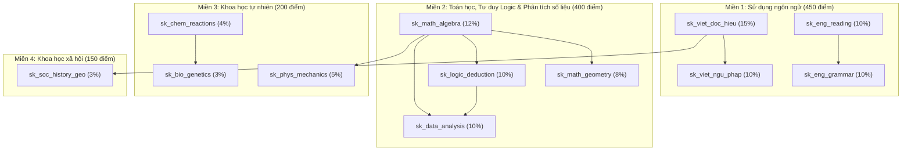

# BẢN KẾ HOẠCH KỸ THUẬT VÀ ĐẶC TẢ TRIỂN KHAI TOÀN DIỆN CORE FLOW 2: QUY HOẠCH LỘ TRÌNH HỌC & TÍCH HỢP LỊCH LIVE

> **Tên tiếng Anh**: Personalized Learning Path Planning & Live Session Integration  
> **Tài liệu**: Bản kế hoạch kiến trúc & hướng dẫn triển khai mã nguồn chi tiết (Engineering Implementation Blueprint)  
> **Dự án**: Nền tảng Đánh giá & Học tập Thích ứng V-Eval (V-ACT Platform)  
> **Ngày ban hành**: 28/09/2026 — Phiên bản 2.0 (Deep Technical Specification)

---

## 1. TỔNG QUAN NGHIỆP VỤ & BÀI TOÁN KHOA HỌC MÁY TÍNH

### 1.1 Mục Tiêu Hệ Thống
Core Flow 2 tiếp nối trực tiếp kết quả của Core Flow 1 (Đánh giá năng lực chẩn đoán đầu vào). Mục tiêu là chuyển hóa vector năng lực khởi tạo của học sinh thành một **Lộ trình tự học tuần tự thích ứng (Roadmap Timeline)** kết hợp mật thiết với **Lịch học Live Q&A trực tuyến do Giáo viên cơ sở phụ trách lớp chủ trì**.

```
[Dữ Liệu Flow 1: theta_0 + P(L0) + WeakSkills + EnrolledClassId]
                           │
                           ▼
             [Phân Tích Quỹ Thời Gian Tự Học]
  (So sánh Ngày thi, Giờ/ngày vs Tổng thời lượng kỹ năng)
                           │
                           ├──> Quá tải? ──> [Path Pruning Engine] (Cắt tỉa kỹ năng phụ < 5%)
                           ▼
         [Nạp Đồ Thị Tiên Quyết SkillPrerequisites]
                           │
                           ▼
          [Tarjan Cycle Detector (Kiểm tra chu trình)]
                           │
                           ├──> Có vòng lặp kín? ──> [SystemAlerts] (Báo động Academic Manager)
                           ▼
      [Topological Sorter (Sắp xếp thứ tự học tối ưu)]
         (Ưu tiên: Kỹ năng hổng -> Nền tảng -> Trọng số cao)
                           │
                           ▼
        [Khởi Tạo Các Chặng Học (Milestones Binding)]
       ┌───────────────────┼───────────────────┐
       ▼                   ▼                   ▼
 [1. Video Lý Thuyết] [2. Quiz Củng Cố] [3. Lịch Live Q&A Cơ Sở]
```

### 1.2 Phân Định Trách Nhiệm 4 Actors

| Actor | Vai trò kỹ thuật & Tương tác giao diện |
| :--- | :--- |
| **Học sinh (`Student`)** | Tiếp nhận lộ trình học dạng Timeline đa chặng. Mốc đầu tiên được mở (`IN_PROGRESS`), các mốc sau khóa (`LOCKED`). Học sinh xem video lý thuyết, hoàn thành Quiz củng cố $\ge 60\%$ điểm, tham gia buổi Live Q&A hoặc xem lại video ghi hình để mở khóa chặng tiếp theo. |
| **Giáo viên cơ sở (`Teacher`)** | Chủ trì các buổi Live Q&A trực tuyến giải đáp thắc mắc theo lớp học (`Class`) được phân bổ ở Flow 1, gắn link phòng học (`meeting_url`), điểm danh học sinh (`LiveSessionAttendance`) và đính kèm video ghi hình (`recording_url`). |
| **Điều phối viên học vụ (`Academic Manager`)** | Tiếp nhận các cảnh báo dữ liệu (`SystemAlerts`) khi thuật toán Tarjan phát hiện lỗi nhập liệu vòng lặp kín giữa các kỹ năng để can thiệp chuẩn hóa Cây khung năng lực. |
| **Hệ thống Thuật toán (`Graph Engine`)** | Thực thi tuần tự chuỗi 4 thuật toán: `PathPruner` $\to$ `TarjanCycleDetector` $\to$ `TopologicalSorter` $\to$ `MilestoneBinder`. |

---

## 2. MA TRẬN KHUNG NĂNG LỰC 12 KỸ NĂNG ĐGNL ĐHQG-HCM & ĐỒ THỊ DAG TIÊN QUYẾT

Cây khung năng lực ĐGNL ĐHQG-HCM bao gồm 12 kỹ năng chuẩn phân bổ trên 4 miền năng lực. Để tạo thành đồ thị có hướng không chu trình (DAG), các quan hệ tiên quyết được định nghĩa chính xác như sau:

| STT | Mã Kỹ Năng (`skill_id`) | Tên Kỹ Năng | Miền Năng Lực (`Domain`) | Trọng Số Đề Thi (`Weight`) | Kỹ Năng Tiên Quyết Bắt Buộc (`Prerequisites`) |
| :---: | :--- | :--- | :--- | :---: | :--- |
| 1 | `sk_viet_doc_hieu` | Đọc hiểu văn bản Tiếng Việt | Sử dụng ngôn ngữ | 15% | *(Không có — Kỹ năng gốc)* |
| 2 | `sk_viet_ngu_phap` | Ngữ pháp & Logic câu Tiếng Việt | Sử dụng ngôn ngữ | 10% | `sk_viet_doc_hieu` |
| 3 | `sk_eng_reading` | Đọc hiểu văn bản Tiếng Anh | Sử dụng ngôn ngữ | 10% | *(Không có — Kỹ năng gốc)* |
| 4 | `sk_eng_grammar` | Ngữ pháp & Từ vựng Tiếng Anh | Sử dụng ngôn ngữ | 10% | `sk_eng_reading` |
| 5 | `sk_math_algebra` | Đại số, Hàm số & Giải tích | Toán học & Logic | 12% | *(Không có — Kỹ năng gốc)* |
| 6 | `sk_math_geometry` | Hình học & Lượng giác không gian | Toán học & Logic | 8% | `sk_math_algebra` |
| 7 | `sk_logic_deduction` | Suy luận Logic & Mệnh đề | Toán học & Logic | 10% | `sk_math_algebra` |
| 8 | `sk_data_analysis` | Phân tích số liệu & Bảng biểu | Toán học & Logic | 10% | `sk_math_algebra`, `sk_logic_deduction` |
| 9 | `sk_phys_mechanics` | Vật lý đại cương & Cơ nhiệt | Khoa học tự nhiên | 5% | `sk_math_algebra` |
| 10 | `sk_chem_reactions` | Hóa học vô cơ & Hữu cơ | Khoa học tự nhiên | 4% | *(Không có — Kỹ năng gốc)* |
| 11 | `sk_bio_genetics` | Sinh học di truyền & Sinh thái | Khoa học tự nhiên | 3% | `sk_chem_reactions` |
| 12 | `sk_soc_history_geo` | Tổng hợp Lịch sử & Địa lý VN | Khoa học xã hội | 3% | `sk_viet_doc_hieu` |

### Sơ Đồ Đồ Thị Tiên Quyết DAG Chuẩn (Không Chu Trình)



---

## 3. THIẾT KẾ CƠ SỞ DỮ LIỆU & ENTITY FRAMEWORK CORE 9

### 3.1 Kịch Bản SQL DDL Chuẩn (Supabase PostgreSQL)

```sql
-- =====================================================================
-- SCHEMA: content
-- =====================================================================

-- 1. Bảng quan hệ tiên quyết giữa các kỹ năng (Đồ thị có hướng DAG)
CREATE TABLE IF NOT EXISTS "content"."SkillPrerequisites" (
    "skill_id" uuid NOT NULL REFERENCES "content"."Skills"("skill_id") ON DELETE CASCADE,
    "prerequisite_id" uuid NOT NULL REFERENCES "content"."Skills"("skill_id") ON DELETE CASCADE,
    PRIMARY KEY ("skill_id", "prerequisite_id")
);

CREATE INDEX IF NOT EXISTS "idx_skill_prereq_skill" ON "content"."SkillPrerequisites"("skill_id");
CREATE INDEX IF NOT EXISTS "idx_skill_prereq_prereq" ON "content"."SkillPrerequisites"("prerequisite_id");

-- =====================================================================
-- SCHEMA: practice
-- =====================================================================

-- 2. Bảng quản lý lộ trình học tập cá nhân hóa
CREATE TABLE IF NOT EXISTS "practice"."LearningRoadmaps" (
    "roadmap_id" uuid PRIMARY KEY,
    "student_id" uuid NOT NULL,
    "diagnostic_submission_id" uuid REFERENCES "practice"."ExamSubmissions"("submission_id"),
    "target_score" int NOT NULL DEFAULT 800,
    "total_milestones" int NOT NULL DEFAULT 0,
    "completed_milestones" int NOT NULL DEFAULT 0,
    "is_pruned" boolean NOT NULL DEFAULT false,
    "pruned_reason" text,
    "status" varchar(50) NOT NULL DEFAULT 'ACTIVE', -- ACTIVE, COMPLETED, ARCHIVED
    "created_at" timestamp NOT NULL DEFAULT (now()),
    "updated_at" timestamp NOT NULL DEFAULT (now())
);

CREATE INDEX IF NOT EXISTS "idx_roadmaps_student" ON "practice"."LearningRoadmaps"("student_id", "status");

-- 3. Bảng chặng học (Milestones / RoadmapNodes)
CREATE TABLE IF NOT EXISTS "practice"."RoadmapNodes" (
    "node_id" uuid PRIMARY KEY,
    "roadmap_id" uuid NOT NULL REFERENCES "practice"."LearningRoadmaps"("roadmap_id") ON DELETE CASCADE,
    "skill_id" uuid NOT NULL,
    "step_order" int NOT NULL,
    "material_id" uuid,          -- Thành phần 1: Video lý thuyết từ content.Materials
    "quiz_exam_id" uuid,         -- Thành phần 2: Bài Quiz kiểm tra củng cố 5-10 câu
    "live_session_id" uuid,      -- Thành phần 3: Buổi Live Q&A tương ứng của lớp cơ sở
    "status" varchar(50) NOT NULL DEFAULT 'LOCKED', -- LOCKED, IN_PROGRESS, COMPLETED, SKIPPED_PRUNED
    "is_pruned" boolean NOT NULL DEFAULT false,
    "unlocked_at" timestamp,
    "completed_at" timestamp
);

CREATE INDEX IF NOT EXISTS "idx_roadmap_nodes_step" ON "practice"."RoadmapNodes"("roadmap_id", "step_order");

-- 4. Bổ sung trường video ghi hình cho LiveSessions phục vụ Unhappy Case 3
ALTER TABLE "practice"."LiveSessions"
    ADD COLUMN IF NOT EXISTS "recording_url" varchar,
    ADD COLUMN IF NOT EXISTS "is_recorded" boolean DEFAULT false;

-- 5. Bổ sung trạng thái hoàn thành bài Quiz bù khi vắng mặt
ALTER TABLE "practice"."LiveSessionAttendance"
    ADD COLUMN IF NOT EXISTS "attendance_status" varchar(20) DEFAULT 'ATTENDED', -- ATTENDED, ABSENT
    ADD COLUMN IF NOT EXISTS "makeup_quiz_id" uuid,
    ADD COLUMN IF NOT EXISTS "is_makeup_quiz_passed" boolean DEFAULT false;
```

---

## 4. CHI TIẾT 4 THUẬT TOÁN ĐỒ THỊ & TOÁN HỌC CỐT LÕI

### 4.1 Thuật Toán 1: Phân Tích Quỹ Thời Gian & Cắt Tỉa (Path Pruning Engine)

#### 1. Công thức toán học
- **Quỹ thời gian tự học còn lại đến kỳ thi (giờ)**:
  `` `T_{\text{avail}} = \max\left(1, (\text{ExamDate} - \text{Now})_{\text{days}}\right) \times \text{StudyHoursDay}` ``
- **Tổng thời lượng cần thiết để hoàn thành toàn bộ kỹ năng yếu (giờ)**:
  `` `T_{\text{need}} = \sum_{s \in \text{TargetSkills}} \text{EstimatedHours}(s)` ``
  *(Quy chuẩn hệ thống V-Eval: Mỗi kỹ năng cần trung bình 4 giờ: 1.5h xem bài giảng, 1.5h làm bài tập, 1h thảo luận Live Q&A).*
- **Điều kiện kích hoạt cắt tỉa (Pruning Trigger)**:
  `` `\text{IsOverloaded} = \left( T_{\text{avail}} < T_{\text{need}} \right) \quad \text{HOẶC} \quad \left( (\text{ExamDate} - \text{Now})_{\text{days}} < 30 \ \text{và} \ \text{TargetScore} \ge 800 \right)` ``

#### 2. Chiến lược cắt tỉa 3 tầng (3-Tier Pruning Strategy)
1. **Tầng 1 (Lọc trọng số thấp)**: Loại bỏ các kỹ năng có trọng số câu hỏi dưới 5% trong cấu trúc đề thi ĐGNL (Vật lý 5%, Hóa học 4%, Sinh học 3%, Sử-Địa 3%).
2. **Tầng 2 (Lọc kỹ năng đã đạt chuẩn)**: Nếu học sinh có xác suất làm chủ ban đầu `` `P(L_0) \ge 0.85` `` từ Flow 1, kỹ năng đó được đánh dấu `SKIPPED_PRUNED` để không lãng phí thời gian ôn lại.
3. **Tầng 3 (Dồn trọng tâm điểm rơi)**: Dồn 80% thời gian tự học vào hai chuyên đề then chốt có tỷ trọng điểm áp đảo:
   - **Toán học, Tư duy logic & Phân tích số liệu** (chiếm 30 câu / 120 câu).
   - **Sử dụng ngôn ngữ (Đọc hiểu Tiếng Việt & Tiếng Anh)** (chiếm 40 câu / 120 câu).

---

### 4.2 Thuật Toán 2: Kiểm Tra Chu Trình Kín Bằng Thuật Toán Tarjan (Tarjan SCC)

#### 1. Nguyên lý hoạt động
Cho đồ thị có hướng `` `G = (V, E)` `` với các đỉnh $V$ là danh sách kỹ năng, cạnh có hướng `` `(u, v) \in E` `` thể hiện kỹ năng $u$ là tiên quyết của kỹ năng $v$. Thuật toán Tarjan thực hiện tìm kiếm theo chiều sâu (DFS) và duy trì 2 mảng chỉ số:
- `dfn[u]`: Thứ tự thăm của đỉnh `u` khi DFS duyệt qua.
- `low[u]`: Giá trị `dfn` nhỏ nhất mà đỉnh `u` (hoặc con cháu của `u`) có thể với tới thông qua các cạnh ngược (Back edges).

#### 2. Điều kiện phát hiện chu trình
Một tập các đỉnh tạo thành một chu trình kín (vòng lặp phụ thuộc bất hợp lệ) khi và chỉ khi:
- Thành phần liên thông mạnh (SCC) có số lượng đỉnh `` `|V_{\text{SCC}}| > 1` ``, hoặc:
- Đỉnh `u` có cạnh khuyên tự trỏ vào chính nó: `` `u \to u` ``.

#### 3. Cài đặt C# hoàn chỉnh (`TarjanCycleDetector.cs`)
```csharp
namespace V_Eval_Practice_Service.Application.Common.Graph;

public class TarjanCycleDetector
{
    private int _index;
    private readonly Stack<Guid> _stack = new();
    private readonly Dictionary<Guid, int> _dfn = new();
    private readonly Dictionary<Guid, int> _low = new();
    private readonly HashSet<Guid> _inStack = new();
    private readonly List<List<Guid>> _cycles = new();

    public List<List<Guid>> DetectCycles(Dictionary<Guid, List<Guid>> adjacencyList)
    {
        _index = 0;
        _stack.Clear();
        _dfn.Clear();
        _low.Clear();
        _inStack.Clear();
        _cycles.Clear();

        foreach (var node in adjacencyList.Keys)
        {
            if (!_dfn.ContainsKey(node))
            {
                DFS(node, adjacencyList);
            }
        }

        return _cycles;
    }

    private void DFS(Guid u, Dictionary<Guid, List<Guid>> graph)
    {
        _dfn[u] = _low[u] = ++_index;
        _stack.Push(u);
        _inStack.Add(u);

        if (graph.TryGetValue(u, out var neighbors))
        {
            foreach (var v in neighbors)
            {
                if (!_dfn.ContainsKey(v))
                {
                    DFS(v, graph);
                    _low[u] = Math.Min(_low[u], _low[v]);
                }
                else if (_inStack.Contains(v))
                {
                    _low[u] = Math.Min(_low[u], _dfn[v]);
                }
            }
        }

        if (_dfn[u] == _low[u])
        {
            var scc = new List<Guid>();
            Guid w;
            do
            {
                w = _stack.Pop();
                _inStack.Remove(w);
                scc.Add(w);
            } while (w != u);

            // Nếu SCC có nhiều hơn 1 đỉnh, chắc chắn có chu trình kín lặp
            if (scc.Count > 1)
            {
                _cycles.Add(scc);
            }
            // Hoặc nếu 1 đỉnh tự trỏ vào chính nó
            else if (scc.Count == 1 && graph.TryGetValue(u, out var selfNeighbors) && selfNeighbors.Contains(u))
            {
                _cycles.Add(scc);
            }
        }
    }
}
```

---

### 4.3 Thuật Toán 3: Sắp Xếp Thứ Tự Học (Topological Sort Đa Tiêu Chí)

#### 1. Hàm tính điểm ưu tiên sư phạm (Pedagogical Priority Scoring)
Khi một kỹ năng `u` đã sẵn sàng học (tức toàn bộ kỹ năng tiên quyết của nó đã hoàn thành, bán bậc vào `in_degree[u] == 0`), thuật toán đưa `u` vào **Hàng đợi ưu tiên (Priority Queue)** với hàm điểm ưu tiên:

`` `\text{PriorityScore}(u) = \left( 1.0 - P(L_0)_u \right) \times 0.5 + \text{Weight}_u \times 0.3 + \text{IsWeak}_u \times 0.2` ``

- Kỹ năng nào học sinh bị hổng nặng hơn (`` `P(L_0)` `` thấp) $\to$ Điểm ưu tiên cao hơn.
- Kỹ năng nào chiếm tỷ lệ điểm cao hơn trong cấu trúc đề thi $\to$ Điểm ưu tiên cao hơn.
- Thuật toán luôn đảm bảo: **Kỹ năng nền tảng (In-degree = 0) học trước, kỹ năng nâng cao học sau**.

#### 2. Cài đặt C# Topological Sort (`TopologicalSorter.cs`)
```csharp
namespace V_Eval_Practice_Service.Application.Common.Graph;

public record SkillSortMetadata(
    Guid SkillId,
    double PL0,
    double Weight,
    bool IsWeak
);

public class TopologicalSorter
{
    public List<Guid> Sort(
        List<Guid> candidateSkills,
        Dictionary<Guid, List<Guid>> prerequisitesMap, // skill_id -> list of prereqs
        Dictionary<Guid, SkillSortMetadata> metadataMap)
    {
        var skillSet = new HashSet<Guid>(candidateSkills);
        var inDegree = new Dictionary<Guid, int>();
        var dependentsGraph = new Dictionary<Guid, List<Guid>>(); // prereq -> dependent skills

        foreach (var skill in skillSet)
        {
            inDegree[skill] = 0;
            dependentsGraph[skill] = new List<Guid>();
        }

        // Xây dựng in-degree và đồ thị phụ thuộc
        foreach (var skill in skillSet)
        {
            if (prerequisitesMap.TryGetValue(skill, out var prereqs))
            {
                foreach (var prereq in prereqs.Where(p => skillSet.Contains(p)))
                {
                    inDegree[skill]++;
                    dependentsGraph[prereq].Add(skill);
                }
            }
        }

        // Sử dụng PriorityQueue để chọn node có PriorityScore cao nhất
        var priorityQueue = new PriorityQueue<Guid, double>(Comparer<double>.Create((a, b) => b.CompareTo(a)));

        foreach (var skill in skillSet)
        {
            if (inDegree[skill] == 0)
            {
                double score = CalculateScore(skill, metadataMap);
                priorityQueue.Enqueue(skill, score);
            }
        }

        var sortedResult = new List<Guid>();

        while (priorityQueue.Count > 0)
        {
            var currentSkill = priorityQueue.Dequeue();
            sortedResult.Add(currentSkill);

            foreach (var dependent in dependentsGraph[currentSkill])
            {
                inDegree[dependent]--;
                if (inDegree[dependent] == 0)
                {
                    double score = CalculateScore(dependent, metadataMap);
                    priorityQueue.Enqueue(dependent, score);
                }
            }
        }

        return sortedResult;
    }

    private static double CalculateScore(Guid skillId, Dictionary<Guid, SkillSortMetadata> metadataMap)
    {
        if (!metadataMap.TryGetValue(skillId, out var meta)) return 0.5;
        double weakBonus = meta.IsWeak ? 0.2 : 0.0;
        return (1.0 - meta.PL0) * 0.5 + meta.Weight * 0.3 + weakBonus;
    }
}
```

---

### 4.4 Thuật Toán 4: Khởi Tạo Chặng Học Tích Hợp 3 Thành Phần (Milestone Binder)

Mỗi node sau khi sắp xếp Topological Sort (`step_order = 1..N`) được ánh xạ thành 1 Chặng học (`RoadmapNode`) kết nối đồng thời 3 dịch vụ:

1. **Thành phần 1: Video lý thuyết ngắn (Content Service)**:
   - Truy vấn `content.Materials` lấy bài giảng có video (`video_url != null`), thời lượng 5–15 phút kèm tài liệu tóm tắt công thức trọng tâm.
2. **Thành phần 2: Quiz củng cố 5–10 câu (Practice Service)**:
   - Tự động lấy 5–10 câu hỏi trắc nghiệm từ `content.Questions` đúng kỹ năng `skill_id`.
   - Độ khó được cân chỉnh tự động theo Placement Class ở Flow 1:
     - Lớp Nền tảng (`FOUNDATION`): 70% mức 1 (Dễ), 30% mức 2 (Trung bình).
     - Lớp Tăng tốc (`ACCELERATION`): 30% mức 1, 50% mức 2, 20% mức 3 (Khó).
     - Lớp Bứt phá (`BREAKTHROUGH`): 40% mức 2, 40% mức 3, 20% mức 4 (Rất khó).
3. **Thành phần 3: Lịch Live Q&A lớp cơ sở (Live Integration)**:
   - Truy vấn bảng `practice.LiveSessions` theo `class_id = EnrolledClassId` (lớp học tại cơ sở học sinh đã đăng ký).
   - Ghép lịch buổi học Live gần nhất có giáo viên phụ trách chủ trì.

---

## 5. VÒNG ĐỜI CHẶNG HỌC & CƠ CHẾ STATE MACHINE (GATEKEEPER)

Mỗi Chặng học (`RoadmapNode`) tuân theo State Machine nghiêm ngặt:

```
┌──────────┐   Hoàn thành chặng trước   ┌─────────────┐   Đạt Quiz >= 60% & Live/Record   ┌───────────┐
│  LOCKED  │ ─────────────────────────> │ IN_PROGRESS │ ────────────────────────────────> │ COMPLETED │
└──────────┘                            └─────────────┘                                   └───────────┘
     │                                                                                          ▲
     │                                     Path Pruning kích hoạt                               │
     └──────────────────────────────────────────────────────────────────────────────────────────┘
                                        (Status = SKIPPED_PRUNED)
```

### Quy Tắc Chặn Cổng (Gatekeeper Validation Rules)
- **Quy tắc 1 (Mở khóa khởi đầu)**: Khi Roadmap vừa được tạo, duy nhất **Chặng 1** có trạng thái `IN_PROGRESS` (`unlocked_at = now()`). Toàn bộ các chặng từ 2 đến $N$ ở trạng thái `LOCKED`.
- **Quy tắc 2 (Điều kiện vượt chặng)**: Để hoàn thành Chặng $k$ và mở khóa Chặng $k+1$, học sinh phải thỏa mãn:
  1. Đã xem video lý thuyết (`is_video_watched = true`).
  2. Hoàn thành bài Quiz củng cố với điểm số đạt $\ge 60\%$.
  3. Tham gia buổi Live Q&A cơ sở, **HOẶC** nếu vắng mặt: Phải xem video ghi hình phát lại (`recording_url`) và vượt qua bài Quiz bù 5 câu đạt $\ge 60\%$ điểm.

---

## 6. CHI TIẾT CÁC API CONTRACTS & DTOs

### 6.1 `POST /api/v1/practice/roadmaps/generate` (Tạo lộ trình học)

- **Request Payload**:
```json
{
  "studentId": "3fa85f64-5717-4562-b3fc-2c963f66afa6",
  "diagnosticSubmissionId": "7ca91f22-1234-4562-b3fc-2c963f66bbb1"
}
```

- **Response Payload (HTTP 200 OK - Happy Case)**:
```json
{
  "isSuccess": true,
  "data": {
    "roadmapId": "8fa85f64-5717-4562-b3fc-2c963f66cccc",
    "studentId": "3fa85f64-5717-4562-b3fc-2c963f66afa6",
    "targetScore": 850,
    "examDate": "2026-11-15",
    "daysRemaining": 48,
    "totalMilestones": 10,
    "completedMilestones": 0,
    "isPruned": true,
    "prunedReason": "Quỹ thời gian còn lại 48 ngày. Hệ thống đã tối ưu cắt tỉa 2 chuyên đề trọng số thấp (<5%) để dồn thời gian cho Toán logic và Đọc hiểu.",
    "milestones": [
      {
        "nodeId": "11111111-aaaa-bbbb-cccc-111111111111",
        "stepOrder": 1,
        "skillId": "sk_viet_doc_hieu",
        "skillName": "Đọc hiểu văn bản Tiếng Việt",
        "domainName": "Sử dụng ngôn ngữ",
        "status": "IN_PROGRESS",
        "isPruned": false,
        "theoryVideo": {
          "materialId": "22222222-aaaa-bbbb-cccc-222222222222",
          "title": "Chiến thuật xử lý văn bản đọc hiểu ĐGNL",
          "videoUrl": "https://video.veval.edu.vn/materials/viet_doc_hieu.mp4",
          "durationMinutes": 12
        },
        "practiceQuiz": {
          "quizExamId": "33333333-aaaa-bbbb-cccc-333333333333",
          "totalQuestions": 5,
          "passPercentage": 60.0
        },
        "liveSession": {
          "sessionId": "44444444-aaaa-bbbb-cccc-444444444444",
          "title": "Live Q&A: Giải đáp thắc mắc Đọc hiểu - Lớp Nền tảng Cơ sở Thủ Đức",
          "teacherName": "ThS. Nguyễn Văn A",
          "scheduledAt": "2026-10-02T19:30:00Z",
          "meetingUrl": "https://meet.veval.edu.vn/class-td-foundation",
          "isRecorded": false,
          "recordingUrl": null
        }
      }
    ]
  }
}
```

- **Response Payload (HTTP 422 Unprocessable Entity - Unhappy Case 2 Phát hiện Chu trình)**:
```json
{
  "type": "https://tools.ietf.org/html/rfc7231#section-6.5.1",
  "title": "Roadmap.CycleDetected",
  "status": 422,
  "detail": "Cây khung năng lực đang bị lỗi vòng lặp phụ thuộc (Cyclic Dependency giữa các kỹ năng: sk_math_algebra -> sk_math_geometry -> sk_math_algebra). Hệ thống đã chặn tiến trình và gửi cảnh báo tới Academic Manager để hiệu chỉnh.",
  "errors": {
    "CycleNodes": [
      "sk_math_algebra",
      "sk_math_geometry"
    ]
  }
}
```

---

## 7. CẤU TRÚC MÃ NGUỒN CẦN TRIỂN KHAI THEO MICROSERVICES

### 7.1 Trong `All Services/V-Eval-Content_Service`

```
V-Eval-Content_Service.Domain/
  └── Entities/
      ├── Skill.cs (Bổ sung navigation collection Prerequisites & Dependents)
      └── SkillPrerequisite.cs (Entity mới cho bảng nối N-N)

V-Eval-Content_Service.Infrastructure/
  ├── Persistence/
  │   ├── ContentDbContext.cs (Fluent API cấu hình composite key cho SkillPrerequisite)
  │   └── Seeds/
  │       └── SkillPrerequisiteSeeder.cs (Seed 12 kỹ năng chuẩn và quan hệ DAG)
  └── Services/
      └── ContentGrpcService.cs (Triển khai RPC GetSkillsTree trả về danh sách kèm prereq_ids)
```

### 7.2 Trong `All Services/V-Eval-Practice_Service`

```
V-Eval-Practice_Service.Domain/
  └── Entities/
      ├── LearningRoadmap.cs (Entity quản lý lộ trình học tập)
      ├── RoadmapNode.cs (Entity quản lý từng chặng học 3 thành phần)
      ├── LiveSession.cs (Cập nhật recording_url, is_recorded)
      └── LiveSessionAttendance.cs (Cập nhật attendance_status, is_makeup_quiz_passed)

V-Eval-Practice_Service.Application/
  ├── Common/
  │   └── Graph/ (Module Engine Thuật Toán Đồ Thị)
  │       ├── TarjanCycleDetector.cs (Thuật toán Tarjan SCC)
  │       ├── PathPruner.cs (Thuật toán cắt tỉa quỹ thời gian)
  │       ├── TopologicalSorter.cs (Thuật toán Kahn Topo Sort đa tiêu chí)
  │       └── MilestoneBinder.cs (Bộ tích hợp 3 thành phần Video + Quiz + Live)
  └── Features/Roadmaps/
      ├── Commands/
      │   ├── GenerateRoadmap/ (Command, Handler, Validator)
      │   └── CompleteMilestone/ (Đánh dấu hoàn thành, mở khóa chặng sau)
      ├── Queries/
      │   ├── GetRoadmapByStudent/ (Lấy timeline học sinh)
      │   └── GetMilestoneDetail/ (Lấy chi tiết chặng học)
      └── DTOs/
          └── RoadmapDtos.cs (Các DTOs phản hồi)

V-Eval-Practice_Service.Infrastructure/
  ├── Persistence/
  │   ├── PracticeDbContext.cs (Đăng ký DbSet LearningRoadmaps, RoadmapNodes)
  │   └── Repositories/
  │       ├── LearningRoadmapRepository.cs
  │       └── LiveSessionRepository.cs
  └── HttpClients/
      └── ContentServiceClient.cs (Gọi lấy Video Materials và Question Bank)

V-Eval-Practice_Service.API/
  └── Controllers/
      └── RoadmapsController.cs (REST API endpoints)
```

---

## 8. MA TRẬN KỊCH BẢN KIỂM THỬ (TEST CASES MATRIX)

| Mã Test | Loại Kiểm Thử | Tình Huống Kiểm Thử (Test Scenario) | Kết Quả Mong Đợi (Expected Outcome) |
| :---: | :--- | :--- | :--- |
| **TC-01** | Unit Test (Tarjan) | Đồ thị 12 kỹ năng chuẩn ĐGNL ĐHQG-HCM (DAG thuần túy). | Trả về `cycles.Count == 0`, cho phép tiếp tục luồng Topo Sort. |
| **TC-02** | Unit Test (Tarjan) | Đồ thị cố tình chứa vòng lặp $A \to B \to A$. | Trả về chu trình gồm $\{A, B\}$, kích hoạt chặn lỗi Unhappy Case 2. |
| **TC-03** | Unit Test (Tarjan) | Đồ thị có 1 node tự trỏ $A \to A$. | Trả về chu trình $\{A\}$, chặn tạo lộ trình. |
| **TC-04** | Unit Test (Topo) | Sắp xếp đồ thị DAG gồm các node có độ ưu tiên khác nhau. | Kỹ năng hổng (`WeakSkill`) và In-degree = 0 luôn đứng trước kỹ năng phụ thuộc. |
| **TC-05** | Unit Test (Pruning) | Quỹ thời gian thoải mái ($> 120$ ngày). | Không cắt tỉa (`isPruned = false`), giữ trọn vẹn 100% kỹ năng. |
| **TC-06** | Unit Test (Pruning) | Quỹ thời gian gấp rút ($< 25$ ngày, mục tiêu 850 điểm). | Cắt tỉa kỹ năng trọng số $< 5\%$, dồn 80% thời gian cho Toán logic và Đọc hiểu. |
| **TC-07** | Integration Test | Nộp bài Flow 1 thành công $\to$ Gọi sinh lộ trình Flow 2. | Sinh ra Roadmap 10 chặng, Chặng 1 `IN_PROGRESS`, Chặng 2–10 `LOCKED`. |
| **TC-08** | E2E Gatekeeper | Học sinh vắng mặt buổi Live $\to$ Cố tình truy cập Chặng kế tiếp. | Bị từ chối truy cập (HTTP 403), bắt buộc xem `recording_url` và làm Quiz bù. |

---

## 9. LỘ TRÌNH THỰC HIỆN TỪNG BƯỚC (IMPLEMENTATION CHECKLIST)

### Giai đoạn 1: Schema CSDL & Entity Framework Core (Day 1)
- [x] Tạo bảng `content.SkillPrerequisites` và cập nhật EF Core `ContentDbContext.cs`.
- [x] Seeding đồ thị DAG 12 kỹ năng chuẩn của ĐGNL ĐHQG-HCM và 9 cung quan hệ tiên quyết.
- [x] Thêm các thực thể `LearningRoadmap`, `RoadmapNode` và cập nhật `LiveSession`, `LiveSessionAttendance` trong `PracticeDbContext.cs`.
- [x] Chạy migration cập nhật CSDL trên Supabase PostgreSQL.

### Giai đoạn 2: Graph Engine Thuật Toán (Day 2)
- [ ] Cài đặt `TarjanCycleDetector.cs` và viết Unit Tests chứng minh không có chu trình.
- [ ] Cài đặt `PathPruner.cs` tính toán quỹ thời gian và chính sách cắt tỉa.
- [ ] Cài đặt `TopologicalSorter.cs` theo thuật toán Kahn kết hợp Priority Queue.
- [ ] Cài đặt `MilestoneBinder.cs` kết nối 3 thành phần Video, Quiz, Live Q&A.

### Giai đoạn 3: CQRS Commands & Queries trong Practice Service (Day 3)
- [ ] Xây dựng `GenerateRoadmapCommand` và `GenerateRoadmapCommandHandler`.
- [ ] Xây dựng `GetRoadmapByStudentQuery` và `GetMilestoneDetailQuery`.
- [ ] Xây dựng `CompleteMilestoneCommand` kèm logic mở khóa chặng kế tiếp.
- [ ] Cung cấp REST Controller `RoadmapsController.cs`.

### Giai đoạn 4: Tích Hợp Lịch Live & Xử Lý Vắng Mặt (Day 4)
- [ ] Tích hợp truy vấn `LiveSessions` theo lớp cơ sở `EnrolledClassId`.
- [ ] Triển khai Unhappy Case 3: Kiểm tra vắng mặt, gán `recording_url` và bắt buộc làm Quiz bù 5 câu.

### Giai đoạn 5: Kiểm Thử Toàn Diện & Nghiệm Thu Tài Liệu (Day 5)
- [ ] Chạy kịch bản kiểm thử tích hợp E2E qua Swagger UI.
- [ ] Cập nhật đồng bộ bộ 3 tài liệu `daily.md`, `process.md`, `architecture_acceptance.md` và `UPDATE.md`.
