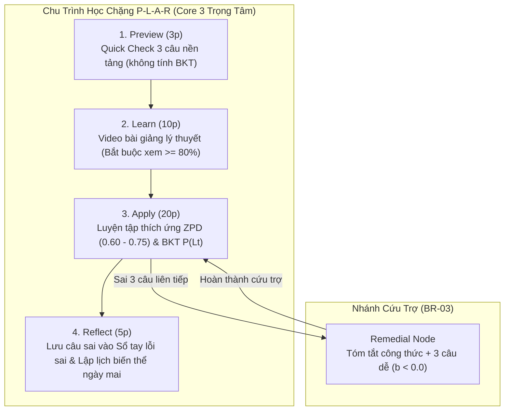
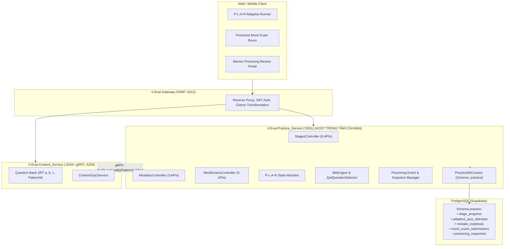

# BẢN KẾ HOẠCH KỸ THUẬT VÀ ĐẶC TẢ TRIỂN KHAI TOÀN DIỆN CORE FLOW 3: LUYỆN TẬP THÍCH ỨNG (ZPD & BKT) & THI THỬ MÔ PHỎNG

> **Tên tiếng Anh**: Adaptive Practice (ZPD & BKT Engine) & Proctored Mock Exam  
> **Tài liệu**: Bản kế hoạch kiến trúc & hướng dẫn triển khai mã nguồn chi tiết (Engineering Implementation Blueprint)  
> **Dự án**: Nền tảng Đánh giá & Học tập Thích ứng V-Eval (V-ACT Platform)  
> **Ngày ban hành**: 08/10/2026 — Phiên bản 1.1 (Cập nhật phân định phạm vi trách nhiệm Core 3)  
> **Tương thích Markdown**: Chuẩn hóa 100% cho MD Editor Plus (Backtick LaTeX, Relative Links, Mermaid 11.15.0+)

---

## 1. PHÂN ĐỊNH PHẠM VI TRÁCH NHIỆM (SCOPE BOUNDARIES)

> [!IMPORTANT]
> **Ranh giới phân công công việc trong nhóm**:
> * **Thuộc về Core 1 & Core 2 (Đồng đội phụ trách)**: 
>   * Thuật toán phân cụm xếp lớp lớn theo năng lực `` `\theta_0` `` (Foundation / Acceleration / Breakthrough).
>   * Thuật toán K-Means gom cụm vi mô 1–3 em theo ma trận lỗ hổng dạng bài trên lớp.
> * **Thuộc về Core 3 (BẠN PHỤ TRÁCH 100%)**:
>   * **Chu trình tự học thích ứng tại nhà P-L-A-R**: Khởi tạo tiến trình, xem video `` `\ge 80\%` ``, làm bài thích ứng từng câu theo ZPD IRT 2PL + BKT `` `P(L_t)` ``, phạt đoán mò `` `t < 5s` ``, quy tắc BR-01 (mở khóa chặng), BR-03 (rẽ nhánh Remedial cứu trợ).
>   * **Sổ tay lỗi sai & Ôn tập ngắt quãng (Spaced Repetition)**: Lưu câu sai, xếp lịch biến thể (Isomorphic) cho ngày hôm sau.
>   * **Tiêu thụ dữ liệu phân cụm giả định trước**: Cung cấp API lấy gói bài tập nâng cao (`` `b \ge 1.0` ``) và bài tập biến thể củng cố cho học sinh dựa trên nhóm đã được phân sẵn ở Core 1/Core 2.
>   * **Phòng thi thử mô phỏng có giám sát (Proctored Mock Exam)**: Đề thi chuẩn 120 câu / 150 phút, ép toàn màn hình, đếm số lần rời tab (quá 3 lần cắm cờ), lưu ảnh webcam ngẫu nhiên, biên bản thi và giao diện thẩm định của Mentor.

---

## 2. TỔNG QUAN NGHIỆP VỤ & NGỮ CẢNH VẬN HÀNH THỰC TẾ

### 2.1 Bối Cảnh Lớp Học & Mô Hình Đào Tạo
* **Mô hình kết hợp (Blended Learning)**: 
  * Học sinh tự học Online tại nhà qua chu trình **P-L-A-R** (38 – 45 phút/ngày).
  * Học trực tiếp tại trung tâm 2 buổi/tuần, mỗi buổi 90 phút (lớp quy mô 12 đến 16 học sinh).
* **Cơ chế phối hợp với Cụm vi mô (Được giả định trước từ Core 1 & Core 2)**:
  * Trong 40 phút sau của buổi học trực tiếp:
    * Học sinh khá/giỏi được hệ thống cấp gói câu hỏi tư duy nâng cao (độ khó `` `b \ge 1.0` ``) để tự giải.
    * Các nhóm vi mô 1–3 em bị hổng kiến thức được giáo viên kèm riêng 10–13 phút theo gói câu hỏi biến thể mà Core 3 cung cấp sẵn.

---

### 2.2 Chu Trình Tự Học Thích Ứng P-L-A-R (38 - 45 Phút)



---

### 2.3 Quy Tắc Nghiệp Vụ Bắt Buộc (Business Rules)
* **BR-01 (Mở khóa hoàn thành chặng)**: Chặng học chỉ đạt chuẩn (`COMPLETED`) khi xác suất thành thạo kiến thức `` `P(L_t) \ge 0.85` `` **VÀ** làm đúng liên tiếp tối thiểu 2 câu vận dụng có độ khó `` `b \ge 0.50` ``.
* **BR-03 (Rẽ nhánh củng cố - Remedial Node)**: Nếu học sinh làm sai liên tiếp 3 câu cùng kỹ năng `` `\to` `` Tạm dừng chặng chính, chuyển trạng thái sang `REMEDIAL_REQUIRED`, cấp ngay 1 gói cứu trợ gồm công thức tóm tắt và 3 câu hỏi cơ bản (độ khó `` `b < 0.0` ``).
* **BR-08 (Phạt đoán mò - Lucky Guessing Penalty)**: Học sinh làm đúng câu khó (`` `b \ge 0.50` ``) nhưng thời gian suy nghĩ `` `t < 5` `` giây `` `\to` `` Tăng tham số đoán mò `` `P(G) = 0.60` `` (thay vì mặc định 0.25) để kiềm chế điểm ảo `` `P(L_t)` ``.
* **BR-15 (Sổ tay lỗi sai & Spaced Repetition)**: Mọi câu trả lời sai đều được ghi vào `mistake_notebook` và lên lịch gửi 1 câu hỏi biến thể (Isomorphic) cùng dạng bài vào ngày hôm sau (+24h).
* **BR-20 (Phòng thi thử Proctored Mock Exam)**: Đề thi chuẩn 120 câu / 150 phút, ép toàn màn hình Fullscreen; nếu học sinh chuyển tab quá 3 lần sẽ bị đánh cờ gian lận (`FLAGGED_FOR_REVIEW`). Webcam chụp ảnh ngẫu nhiên định kỳ lưu về máy chủ; Mentor là người ra phán quyết cuối cùng công nhận (`APPROVED`) hay hủy bài thi (`DISQUALIFIED`).

---

## 3. KIẾN TRÚC KỸ THUẬT & PHÂN BỔ MICROSERVICES CHO CORE 3



---

## 4. THIẾT KẾ CƠ SỞ DỮ LIỆU (POSTGRESQL SCHEMA `PRACTICE`)

Bạn sẽ tạo 5 bảng CSDL độc lập thuộc schema `practice`:

```sql
-- ============================================================================
-- SCHEMA: practice (Phụ trách bởi Core Flow 3)
-- ============================================================================

-- 1. Tiến trình từng chặng học P-L-A-R của học sinh
CREATE TABLE practice.stage_progress (
    id UUID PRIMARY KEY DEFAULT gen_random_uuid(),
    student_id UUID NOT NULL,
    roadmap_node_id UUID NOT NULL,
    current_step VARCHAR(20) NOT NULL DEFAULT 'PREVIEW', -- PREVIEW, LEARN, APPLY, REFLECT
    video_watch_percentage NUMERIC(5,2) DEFAULT 0.00,
    bkt_mastery_plt NUMERIC(5,4) DEFAULT 0.1000,
    consecutive_advanced_correct INT DEFAULT 0, -- Số câu đúng liên tiếp với b >= 0.50 (Yêu cầu >= 2 cho BR-01)
    consecutive_incorrect INT DEFAULT 0,        -- Số câu sai liên tiếp (Đạt 3 -> kích hoạt BR-03)
    status VARCHAR(20) NOT NULL DEFAULT 'IN_PROGRESS', -- IN_PROGRESS, REMEDIAL_REQUIRED, COMPLETED
    created_at TIMESTAMPTZ DEFAULT CURRENT_TIMESTAMP,
    updated_at TIMESTAMPTZ DEFAULT CURRENT_TIMESTAMP
);

CREATE INDEX idx_stage_progress_student_node ON practice.stage_progress (student_id, roadmap_node_id);

-- 2. Nhật ký làm bài thích ứng từng câu (Adaptive Quiz Logs)
CREATE TABLE practice.adaptive_quiz_attempts (
    id UUID PRIMARY KEY DEFAULT gen_random_uuid(),
    stage_progress_id UUID REFERENCES practice.stage_progress(id) ON DELETE CASCADE,
    student_id UUID NOT NULL,
    question_id UUID NOT NULL,
    pattern_id UUID NOT NULL,
    selected_option CHAR(1) NOT NULL,
    is_correct BOOLEAN NOT NULL,
    time_spent_seconds INT NOT NULL,
    item_difficulty_b NUMERIC(5,3) NOT NULL,
    item_discrimination_a NUMERIC(5,3) NOT NULL,
    is_lucky_guess BOOLEAN DEFAULT FALSE,
    prior_plt NUMERIC(5,4) NOT NULL,
    posterior_plt NUMERIC(5,4) NOT NULL,
    created_at TIMESTAMPTZ DEFAULT CURRENT_TIMESTAMP
);

CREATE INDEX idx_adaptive_attempts_progress ON practice.adaptive_quiz_attempts (stage_progress_id);

-- 3. Sổ tay lỗi sai & Lặp lại ngắt quãng (Mistake Notebook)
CREATE TABLE practice.mistake_notebook (
    id UUID PRIMARY KEY DEFAULT gen_random_uuid(),
    student_id UUID NOT NULL,
    question_id UUID NOT NULL,
    pattern_id UUID NOT NULL,
    cognitive_error_tag VARCHAR(50), -- CARELESS, MISREAD_QUESTION, MISSING_CONCEPT
    next_review_date DATE NOT NULL,  -- Lên lịch Spaced Repetition hôm sau (+1 ngày)
    review_count INT DEFAULT 0,
    is_mastered BOOLEAN DEFAULT FALSE,
    created_at TIMESTAMPTZ DEFAULT CURRENT_TIMESTAMP
);

CREATE INDEX idx_mistake_notebook_review ON practice.mistake_notebook (student_id, next_review_date, is_mastered);

-- 4. Nhật ký bài thi thử và giám sát gian lận (Mock Exam & Proctoring)
CREATE TABLE practice.mock_exam_submissions (
    id UUID PRIMARY KEY DEFAULT gen_random_uuid(),
    exam_id UUID NOT NULL,
    student_id UUID NOT NULL,
    total_score INT NOT NULL,
    duration_seconds INT NOT NULL,
    tab_departure_count INT DEFAULT 0,
    integrity_status VARCHAR(20) DEFAULT 'NORMAL', -- NORMAL, FLAGGED_FOR_REVIEW
    mentor_verdict VARCHAR(20) DEFAULT 'PENDING',  -- PENDING, APPROVED, DISQUALIFIED
    mentor_notes TEXT,
    created_at TIMESTAMPTZ DEFAULT CURRENT_TIMESTAMP
);

CREATE INDEX idx_mock_submissions_student ON practice.mock_exam_submissions (student_id, exam_id);

-- 5. Lưu log ảnh chụp ngẫu nhiên từ camera
CREATE TABLE practice.proctoring_snapshots (
    id UUID PRIMARY KEY DEFAULT gen_random_uuid(),
    submission_id UUID REFERENCES practice.mock_exam_submissions(id) ON DELETE CASCADE,
    snapshot_url TEXT NOT NULL,
    captured_at TIMESTAMPTZ DEFAULT CURRENT_TIMESTAMP,
    face_detected BOOLEAN DEFAULT TRUE
);

CREATE INDEX idx_proctoring_snapshots_submission ON practice.proctoring_snapshots (submission_id);
```

---

## 5. ĐẶC TẢ THUẬT TOÁN CỐT LÕI (CORE ALGORITHMS LOGIC)

### 5.1 Lọc Câu Hỏi Theo Vùng Phát Triển Gần Nhất (ZPD Selection via IRT 2PL)
Khi học sinh bước vào câu hỏi tiếp theo trong bước **Apply**:
1. Lấy năng lực hiện tại của học sinh `` `\theta` `` (từ hồ sơ chẩn đoán Core 1).
2. Quét kho câu hỏi thuộc `pattern_id` đang học chưa được làm trong phiên.
3. Tính xác suất làm đúng dự đoán:
   `` `P(\text{Correct} | \theta, a, b) = \frac{1}{1 + e^{-a \cdot (\theta - b)}}` ``
4. Lọc danh sách câu hỏi trong dải Vàng ZPD:
   `` `0.60 \le P(\text{Correct}) \le 0.75` ``
5. **Cơ chế Fallback**: Nếu không còn câu nào trong dải hẹp, tự động mở rộng dải ra `` `[0.50, 0.85]` ``. Lấy ngẫu nhiên 1 câu trả về cho học sinh.

---

### 5.2 Cập Nhật Bayesian Knowledge Tracing (BKT Updater) & Phạt Đoán Mò
* **Bộ tham số chuẩn**:
  * `` `P(T) = 0.15` ``: Xác suất học được sau 1 câu hỏi.
  * `` `P(S) = 0.10` ``: Xác suất trượt (biết làm nhưng tính nhầm).
  * `` `P(G) = 0.25` ``: Xác suất đoán mò cơ sở (trắc nghiệm 4 đáp án).
* **Công thức xử lý**:
  ```csharp
  public (double posteriorPlt, bool isLuckyGuess) UpdateBkt(
      double priorPlt, 
      bool isCorrect, 
      double difficultyB, 
      int timeSpentSeconds)
  {
      // Nhận diện đoán mò: làm câu khó b >= 0.5 trong dưới 5 giây
      bool isLuckyGuess = isCorrect && (difficultyB >= 0.5) && (timeSpentSeconds < 5);
      
      // Nếu đoán mò, tăng pG lên 0.60 để kiềm chế tăng ảo P(Lt)
      double pG = isLuckyGuess ? 0.60 : 0.25;
      double pS = 0.10;
      double pT = 0.15;

      double pObservation;
      if (isCorrect)
      {
          pObservation = (priorPlt * (1 - pS)) / ((priorPlt * (1 - pS)) + ((1 - priorPlt) * pG));
      }
      else
      {
          pObservation = (priorPlt * pS) / ((priorPlt * pS) + ((1 - priorPlt) * (1 - pG)));
      }

      // Xác suất chuyển dịch tri thức sang trạng thái tiếp theo
      double posteriorPlt = pObservation + (1 - pObservation) * pT;
      return (Math.Round(posteriorPlt, 4), isLuckyGuess);
  }
  ```

---

### 5.3 Kiểm Tra Quy Tắc Chuyển Chặng (FSM Verification)
Sau mỗi câu nộp:
* **Quy tắc hoàn thành chặng (BR-01)**:
  * Nếu `` `bkt_mastery_plt \ge 0.85` `` **VÀ** `` `consecutive_advanced_correct \ge 2` `` (với `` `b \ge 0.50` ``) `` `\to` `` Đổi `status = 'COMPLETED'`, mở khóa bước **Reflect**.
* **Quy tắc rẽ nhánh củng cố (BR-03)**:
  * Nếu `is_correct == false` `` `\to` `` Tăng `consecutive_incorrect += 1`, reset `consecutive_advanced_correct = 0`.
  * Nếu `consecutive_incorrect >= 3` `` `\to` `` Đổi `status = 'REMEDIAL_REQUIRED'`, trả về payload gồm tóm tắt lý thuyết và 3 câu hỏi cơ bản (`` `b < 0.0` ``).

---

## 6. DANH SÁCH 14 API ENDPOINTS CẦN LẬP TRÌNH (BẠN PHỤ TRÁCH)

### Module 1: Quản Lý Chặng Học P-L-A-R (`StagesController.cs`)
1. `POST /api/v1/practice/stages/{roadmapNodeId}/start`: Khởi tạo tiến trình chặng học, trả về trạng thái bước đầu tiên (`PREVIEW`) kèm 3 câu hỏi nền tảng.
2. `POST /api/v1/practice/stages/{stageProgressId}/preview-submit`: Nộp bài 3 câu khởi động (không tính BKT), chuyển bước sang `LEARN`.
3. `POST /api/v1/practice/stages/{stageProgressId}/track-video`: Gửi thời lượng xem video; nếu `percentage >= 80%` `` `\to` `` mở khóa bước `APPLY`.
4. `GET /api/v1/practice/stages/{stageProgressId}/next-question`: Gọi thuật toán IRT 2PL lọc câu hỏi ZPD trong dải `[0.60, 0.75]`, ẩn đáp án đúng.
5. `POST /api/v1/practice/stages/{stageProgressId}/submit-answer`: Gửi đáp án từng câu, cập nhật BKT, kiểm tra BR-01 và BR-03, trả về kết quả và trạng thái mới.
6. `POST /api/v1/practice/stages/{stageProgressId}/reflect-complete`: Kết thúc chặng học, lưu phản tư, đồng bộ trạng thái `RoadmapNode` sang `COMPLETED`.

### Module 2: Sổ Tay Lỗi Sai & Ôn Tập Ngắt Quãng (`MistakesController.cs`)
7. `GET /api/v1/practice/mistake-notebook`: Lấy danh sách câu sai của học sinh kèm bộ lọc theo Dạng bài/Môn học.
8. `GET /api/v1/practice/daily-review`: Lấy các câu hỏi biến thể (Isomorphic) được lên lịch ôn tập cho ngày hôm nay (+1 ngày).
9. `POST /api/v1/practice/mistake-notebook/{id}/tag-error`: Gắn nhãn nguyên nhân sai sư phạm (`CARELESS`, `MISREAD_QUESTION`, `MISSING_CONCEPT`).

### Module 3: Phòng Thi Thử Mô Phỏng & Giám Sát (`MockExamsController.cs`)
10. `POST /api/v1/practice/mock-exams/{examId}/start`: Khởi tạo phiên thi thử 120 câu, kích hoạt đồng hồ đếm ngược 150 phút.
11. `POST /api/v1/practice/mock-exams/{submissionId}/log-tab-departure`: Bắt sự kiện rời tab từ Client; nếu vượt quá 3 lần `` `\to` `` gắn cờ `FLAGGED_FOR_REVIEW`.
12. `POST /api/v1/practice/mock-exams/{submissionId}/upload-snapshot`: Upload ảnh chụp định kỳ từ webcam lên MinIO/S3 và lưu log.
13. `POST /api/v1/practice/mock-exams/{submissionId}/submit`: Thu bài và chấm điểm 120 câu, cập nhật năng lực toàn diện `\theta`.
14. `PATCH /api/v1/practice/mock-exams/{submissionId}/mentor-review`: Mentor xác nhận biên bản hợp lệ (`APPROVED`) hoặc hủy bài (`DISQUALIFIED`).

---

## 7. CẤU TRÚC TỆP SẼ LẬP TRÌNH TRONG PROJECT `V-Eval-Practice_Service`

```
V-Eval-Practice_Service/
├── Domain/Entities/
│   ├── StageProgress.cs                     <-- [Mới] Tiến trình chặng P-L-A-R
│   ├── AdaptiveQuizAttempt.cs               <-- [Mới] Log từng câu thích ứng & BKT
│   ├── MistakeNotebook.cs                   <-- [Mới] Sổ tay lỗi sai & Spaced Repetition
│   ├── MockExamSubmission.cs                <-- [Mới] Phiên thi thử & Giám sát
│   └── ProctoringSnapshot.cs                <-- [Mới] Ảnh chụp webcam định kỳ
│
├── Application/
│   ├── Common/Psychometrics/
│   │   ├── IBktEngine.cs                    <-- [Mới] Interface thuật toán BKT
│   │   ├── BktEngine.cs                     <-- [Mới] Cài đặt BKT & Lucky Guessing
│   │   ├── IZpdQuestionSelector.cs          <-- [Mới] Interface lọc IRT ZPD [0.60, 0.75]
│   │   └── ZpdQuestionSelector.cs           <-- [Mới] Triển khai lọc IRT 2PL
│   │
│   └── Features/
│       ├── Stages/                          <-- [Mới] 6 APIs chu trình P-L-A-R
│       │   ├── Commands/StartStage/
│       │   ├── Commands/SubmitPreview/
│       │   ├── Commands/TrackVideo/
│       │   ├── Commands/SubmitAnswer/
│       │   ├── Commands/CompleteReflect/
│       │   ├── Queries/GetNextZpdQuestion/
│       │   └── DTOs/
│       │
│       ├── Mistakes/                        <-- [Mới] 3 APIs Sổ tay lỗi sai & Review
│       │   ├── Commands/TagCognitiveError/
│       │   ├── Queries/GetMistakeNotebook/
│       │   └── Queries/GetDailyReviewQuestions/
│       │
│       └── MockExams/                       <-- [Mới] 5 APIs Phòng thi thử & Proctoring
│           ├── Commands/StartMockExamSession/
│           ├── Commands/LogTabDeparture/
│           ├── Commands/UploadProctoringSnapshot/
│           ├── Commands/SubmitMockExam/
│           ├── Commands/ReviewMockExamDecision/
│           └── Queries/GetMockExamDetail/
│
├── Infrastructure/
│   ├── Persistence/
│   │   ├── PracticeDbContext.cs             <-- [Cập nhật] Đăng ký 5 DbSets mới
│   │   └── Repositories/                    <-- [Mới] Các Repositories tương ứng
│   └── Migrations/                          <-- [Mới] Migration tạo 5 bảng CSDL
│
└── API/Controllers/
    ├── StagesController.cs                  <-- [Mới] 6 Endpoints chu trình P-L-A-R
    ├── MistakesController.cs                <-- [Mới] 3 Endpoints Sổ tay lỗi sai
    └── MockExamsController.cs               <-- [Mới] 5 Endpoints Thi thử & Proctoring
```

---

## 8. LỘ TRÌNH THỰC HIỆN CỦA BẠN (STEP-BY-STEP ROADMAP)

* **Bước 1 (Database & Entities)**: Tạo 5 Entities Domain (`StageProgress`, `AdaptiveQuizAttempt`, `MistakeNotebook`, `MockExamSubmission`, `ProctoringSnapshot`), cập nhật `PracticeDbContext` và tạo Migration cho schema `practice`.
* **Bước 2 (Psychometrics Engine)**: Viết `BktEngine` (tính $P(L_t)$, phạt đoán mò $< 5$s) và `ZpdQuestionSelector` (lọc IRT 2PL trong dải $[0.60, 0.75]$).
* **Bước 3 (P-L-A-R Chu Trình Thích Ứng)**: Viết 6 Commands/Queries và Controller `StagesController` bám sát BR-01 (hoàn thành chặng) và BR-03 (Remedial Node).
* **Bước 4 (Sổ Tay Lỗi Sai & Spaced Repetition)**: Viết các API cho `MistakesController` gom câu sai và sinh đề ôn tập biến thể ngày hôm sau.
* **Bước 5 (Phòng Thi Thử Proctored Mock Exam)**: Viết 5 API cho `MockExamsController` đếm lần rời tab, upload ảnh webcam, nộp bài 120 câu và cổng duyệt của Mentor.
