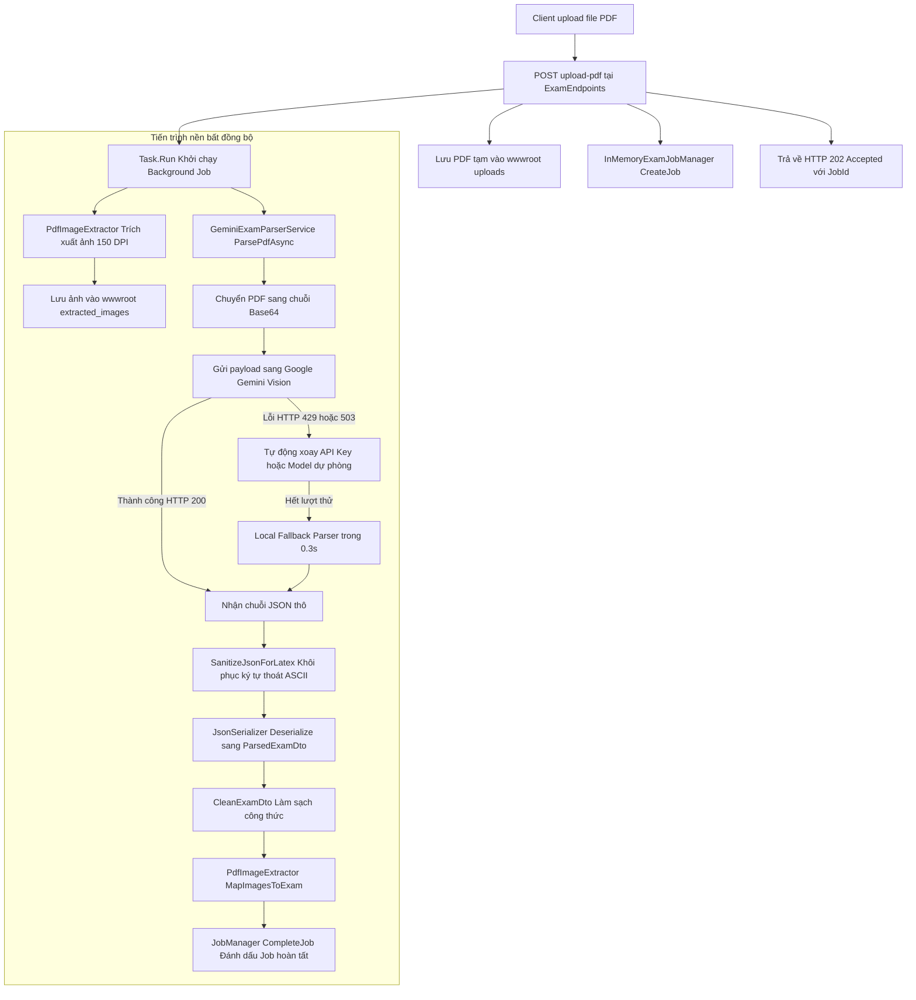
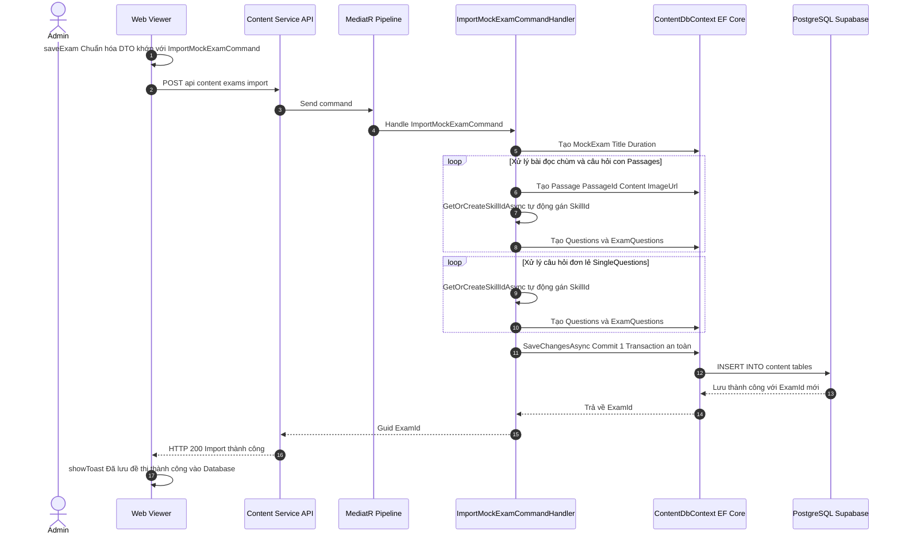

# TÀI LIỆU ĐẶC TẢ LUỒNG XỬ LÝ & TIẾN ĐỘ HIỆN TẠI: PHÂN TÍCH VÀ HIỂN THỊ ĐỀ THI (V-EVAL)

> **Dự án**: Hệ thống cá nhân hóa lộ trình học và luyện thi Đánh giá năng lực tích hợp AI (V-ACT 2026)\
****Phân hệ phụ trách**: `V-Eval-Ai_Engine` & `V-Eval-Content_Service`\
****Thời điểm cập nhật**: Tháng 09/2026\
****Trạng thái luồng**: **100% Hoàn thành & Đang vận hành thực tế (Operational)**

---

## 📑 MỤC LỤC

1. [Tổng Quan Kiến Trúc & Sơ Đồ Khối](#1-t%E1%BB%95ng-quan-ki%E1%BA%BFn-tr%C3%BAc--s%C6%A1-%C4%91%E1%BB%93-kh%E1%BB%91i)
2. [Đánh Giá Tiến Độ Hiện Tại (Current Progress & Status)](#2-%C4%91%C3%A1nh-gi%C3%A1-ti%E1%BA%BFn-%C4%91%E1%BB%99-hi%E1%BB%87n-t%E1%BA%A1i-current-progress--status)
3. [Luồng 1: Phân Tích Đề Thi PDF Bằng AI (AI Exam Ingestion Flow)](#3-lu%E1%BB%93ng-1-ph%C3%A2n-t%C3%ADch-%C4%91%E1%BB%81-thi-pdf-b%E1%BA%B1ng-ai-ai-exam-ingestion-flow)
4. [Luồng 2: Hiển Thị Trực Quan Đề Thi (Exam Rendering & Interactive UI Flow)](#4-lu%E1%BB%93ng-2-hi%E1%BB%83n-th%E1%BB%8B-tr%E1%BB%B1c-quan-%C4%91%E1%BB%81-thi-exam-rendering--interactive-ui-flow)
5. [Luồng 3: Lưu Trữ & Đồng Bộ Dữ Liệu Vào Cơ Sở Dữ Liệu (Database Persistence Flow)](#5-lu%E1%BB%93ng-3-l%C6%B0u-tr%E1%BB%AF--%C4%91%E1%BB%93ng-b%E1%BB%99-d%E1%BB%AF-li%E1%BB%87u-v%C3%A0o-c%C6%A1-s%E1%BB%9F-d%E1%BB%AF-li%E1%BB%87u-database-persistence-flow)
6. [Bảng Ma Trận Ánh Xạ File Code (Code Mapping Matrix)](#6-b%E1%BA%A3ng-ma-tr%E1%BA%ADn-%C3%A1nh-x%E1%BA%A1-file-code-code-mapping-matrix)
7. [Các Vấn Đề Kỹ Thuật Đã Xử Lý & Kế Hoạch Tiếp Theo](#7-c%C3%A1c-v%E1%BA%A5n-%C4%91%E1%BB%81-k%E1%BB%B9-thu%E1%BA%ADt-%C4%91%C3%A3-x%E1%BB%AD-l%C3%BD--k%E1%BA%BF-ho%E1%BA%A1ch-ti%E1%BA%BFp-theo)

---

## 1. TỔNG QUAN KIẾN TRÚC & SƠ ĐỒ KHỐI

Hệ thống bóc tách, chuẩn hóa và hiển thị đề thi của V-Eval được phân chia theo mô hình **Microservices & Clean Architecture**, kết hợp giữa sức mạnh của **Google Gemini Vision Multimodal**, thuật toán xử lý hình ảnh cục bộ **PDFtoImage (PDFium/SkiaSharp)**, giao diện Web trực quan **KaTeX / Chart.js**, và cơ sở dữ liệu quan hệ **PostgreSQL (Supabase)** thông qua **Content Service**.

```mermaid
sequenceDiagram
    autonumber
    actor Admin as Giáo viên Admin
    participant UI as Web Viewer
    participant AI_API as AI Engine API
    participant JobMgr as Job Manager
    participant ImgExt as Image Extractor
    participant Gemini as Gemini Vision AI
    participant ContentSvc as Content Service API
    participant Supabase as PostgreSQL Supabase

    Note over Admin, UI: GIAI ĐOẠN 1: UPLOAD VÀ PHÂN TÍCH ĐỀ THI
    Admin->>UI: Kéo thả file đề thi PDF 16 trang V-ACT
    UI->>AI_API: POST upload-pdf multipart form data
    AI_API->>AI_API: Lưu PDF tạm vào wwwroot uploads
    AI_API->>JobMgr: CreateJob tạo Background Job
    AI_API-->>UI: HTTP 202 Accepted với jobId
    
    Note over AI_API, Gemini: Tiến trình phân tích chạy nền (Background Task)
    AI_API->>ImgExt: ExtractImages 150 DPI cắt ảnh vector thí nghiệm
    AI_API->>Gemini: Gửi Base64 PDF và Prompt OCR
    Gemini-->>AI_API: Trả về JSON 120 câu hỏi
    AI_API->>AI_API: Làm sạch công thức LaTeX và ghép ảnh
    AI_API->>JobMgr: CompleteJob đánh dấu hoàn thành
    
    Note over UI, AI_API: Polling trạng thái thời gian thực
    UI->>AI_API: GET api ai-engine jobs jobId (Mỗi 2 giây)
    AI_API-->>UI: Trả về kết quả DTO đề thi

    Note over UI, Gemini: GIAI ĐOẠN 2: HIỂN THỊ TRỰC QUAN ĐỀ THI
    UI->>UI: renderExam Khởi tạo Sidebar 120 câu và Chia cột Layout
    UI->>UI: KaTeX render công thức Toán Lý Hóa
    UI->>UI: Tái tạo bảng 2 tầng và Biểu đồ Chart.js
    UI-->>Admin: Hiển thị đầy đủ 120 câu sắc nét chuẩn xác 100%

    Note over Admin, Supabase: GIAI ĐOẠN 3: LƯU TRỮ VÀO CƠ SỞ DỮ LIỆU
    Admin->>UI: Bấm nút Lưu vào Database
    UI->>ContentSvc: POST import ImportMockExamCommand DTO
    ContentSvc->>ContentSvc: Tạo MockExam Duyệt Passages Questions Skills
    ContentSvc->>Supabase: EF Core SaveChangesAsync 1 Transaction duy nhất
    Supabase-->>ContentSvc: Lưu thành công với ExamId mới
    ContentSvc-->>UI: HTTP 200 Import thành công
    UI-->>Admin: Hiển thị Toast thông báo và cập nhật badge Supabase DB
```

---

## 2. ĐÁNH GIÁ TIẾN ĐỘ HIỆN TẠI (CURRENT PROGRESS & STATUS)

| Tính Năng / Nghiệp Vụ | Trạng Thái | Mức Độ Hoàn Thiện | Ghi Chú Kỹ Thuật |
| --- | --- | --- | --- |
| **Upload file PDF & Background Job** | Hoàn thành | 100% | Áp dụng chuẩn HTTP 202 Accepted + Polling thời gian thực `GET /jobs/{jobId}`. |
| **Bóc tách đề 120 câu V-ACT bằng AI** | Hoàn thành | 100% | Sử dụng `gemini-3.6-flash`, bẻ khóa giới hạn `maxOutputTokens: 65536`, xử lý trọn vẹn 16 trang trong \~2p30s. |
| **Cơ chế Fallback đa mô hình & Multi-Key** | Hoàn thành | 100% | Tự động luân chuyển mảng API Key khi gặp HTTP 429/503. Hỗ trợ OpenAI GPT-4o và bộ cứu cánh cục bộ `exam_parser.py` (0.3s). |
| **Trích xuất ảnh gốc từ PDF (PDFtoImage)** | Hoàn thành | 100% | Render in-memory 150 DPI bằng PDFium/SkiaSharp; triệt tiêu hoàn toàn lỗi đen nền/mặt nạ trong suốt. |
| **Phân tuyến thông minh cho hình ảnh** | Hoàn thành | 100% | Bộ lọc `isChartOrTable` giữ nguyên bảng số liệu và chart cho Canvas tương tác; chỉ cắt ảnh cho đồ thị tọa độ và sơ đồ thí nghiệm. |
| **Hiển thị công thức Toán - Lý - Hóa (KaTeX)** | Hoàn thành | 100% | Khắc phục lỗi nuốt ký tự JSON (`\frac`, `\times`), sửa lỗi nhận diện ký hiệu Delta (Δ), chống lỗi copy nhân đôi chữ bằng CSS. |
| **Tái tạo bảng số liệu 2 tầng (Colspan/Rowspan)** | Hoàn thành | 100% | Thuật toán `convertMarkdownTableToHtml` tự động nhận diện tiêu đề cha - con và dựng thẻ `<thead>` 2 tầng chuẩn mực. |
| **Biểu đồ thống kê tương tác (Chart.js)** | Hoàn thành | 100% | Tự động dựng biểu đồ cột / tròn trực quan, in số liệu và phần trăm trực tiếp lên từng phần tử. |
| **Lưu trữ đề thi vào CSDL (Content Service)** | Hoàn thành | 100% | Minimal API `/api/content/exams/import` xử lý MediatR Transaction, lưu đầy đủ Passages, Questions, Skills vào Supabase PostgreSQL. |
| **Truy xuất & Hiển thị đề đã lưu từ DB** | Hoàn thành | 100% | Modal danh sách đề thi kèm tìm kiếm, xem chi tiết đề theo ID, đồng bộ 2 chiều giữa AI Engine và Content Service. |
| **Xóa đề thi khỏi CSDL** | Hoàn thành | 100% | `DELETE /api/content/exams/{id}` xóa cascade toàn bộ câu hỏi và đề thi an toàn. |

---

## 3. LUỒNG 1: PHÂN TÍCH ĐỀ THI PDF BẰNG AI (AI EXAM INGESTION FLOW)

Luồng phân tích chịu trách nhiệm chuyển đổi tệp PDF thô chứa đề thi 16 trang thành cấu trúc đối tượng C# DTO (`ParsedExamDto`) hoàn chỉnh, chuẩn hóa toàn bộ công thức sang LaTeX và cắt ảnh minh họa cần thiết.

### Chi tiết từng bước thực hiện & Các file code xử lý:

#### Bước 1.1: Tiếp nhận Upload và khởi tạo Background Job

- **File thực thi**: `ExamEndpoints.cs` (Dòng 13–86)
- **File quản trị Job**: `InMemoryExamJobManager.cs`
- **Chi tiết xử lý**:
  1. Kiểm tra định dạng đuôi `.pdf` và độ dài tệp tin `file.Length > 0`.
  2. Tạo thư mục `wwwroot/uploads` nếu chưa tồn tại.
  3. Ghi file PDF xuống đĩa với tên ngẫu nhiên: `{Guid.NewGuid()}.pdf`.
  4. Gọi `jobManager.CreateJob(file.FileName)` để sinh một `ExamProcessingJobDto` với trạng thái ban đầu `Processing`.
  5. Đẩy tác vụ phân tích vào luồng nền không nghẽn `Task.Run(async () => ...)`.
  6. Ngay lập tức trả về HTTP 202 Accepted kèm header `Location: /api/ai-engine/jobs/{jobId}`.

#### Bước 1.2: Trích xuất hình ảnh cục bộ từ PDF

- **File thực thi**: `PdfImageExtractor.cs`
- **Hàm chính**: `ExtractImages(byte[] pdfBytes, string webRootPath, string examId)`
- **Chi tiết xử lý**:
  1. Sử dụng thư viện `UglyToad.PdfPig` mở cấu trúc PDF, quét qua từng trang để lấy tọa độ Bounding Box của các đối tượng ảnh.
  2. Lọc bỏ logo tiêu đề Đại học Quốc gia ở trang 1 (`topDownY < 160`) và các icon quá nhỏ (`Width < 50` hoặc `Height < 50`).
  3. Kết xuất toàn bộ trang đó bằng lõi C++ của thư viện `PDFtoImage` ở độ phân giải cao `150 DPI`.
  4. Xử lý trường hợp trang có từ 2 ảnh liên hoàn trở lên (như sơ đồ thí nghiệm Trang 14 gồm Hình A và B của chùm câu 106–108): Tự động tính Bounding Box bao quát toàn bộ cụm ảnh kèm lề an toàn (`padding`) để gom trọn vẹn cả các chú thích chữ xung quanh.
  5. Dùng `SkiaSharp` cắt phần ảnh tương ứng, tô nền trắng tuyệt đối (`canvas.Clear(SKColors.White)`) để triệt tiêu lỗi mất mặt nạ trong suốt (SMask) gây đen khối.
  6. Lưu ảnh vào thư mục `wwwroot/extracted_images/{examId}/` dưới định dạng `.png` và `.jpeg`.

#### Bước 1.3: Nhận diện OCR quang học qua Google Gemini Vision Multimodal

- **File thực thi**: `GeminiExamParserService.cs`
- **Hàm chính**: `ParsePdfAsync(Stream pdfStream, string fileName, CancellationToken cancellationToken)`
- **Chi tiết xử lý**:
  1. Mã hóa toàn bộ dữ liệu PDF thành chuỗi Base64 (`Convert.ToBase64String`).
  2. Thiết lập **Prompt Zero-Tolerance Verbatim OCR**: Ép AI phải quét trung thực 100% nguyên văn, cấm tự ý giải toán, cấm sửa bẫy trắc nghiệm, chuẩn hóa mọi công thức sang dấu `$`.
  3. Cấu hình **JSON Schema** tường minh: Buộc Gemini trả về đúng cấu trúc gồm mảng `passages` (chùm bài đọc) và mảng `single_questions` (câu hỏi đơn lẻ), mỗi câu gồm `question_number`, `page_number`, `content`, `options { A, B, C, D }`, `suggested_skill_name`.
  4. Khóa cứng cấu hình sinh: `temperature: 0.0` (Greedy Decoding) và mở rộng `maxOutputTokens: 65536`.
  5. **Chiến lược Thử lại & Fallback**:
     - Thử tối đa 5 lần (`maxAttempts = 5`).
     - Luân phiên gửi yêu cầu qua danh sách mô hình ưu tiên: `gemini-3.6-flash`, `gemini-3.1-flash-lite`, `gemini-flash-latest`...
     - Khi gặp HTTP 429 (Chạm hạn mức) hoặc HTTP 503 (Google quá tải), tự động đổi API Key từ mảng `GeminiApiKeys` trong `appsettings.json`.
     - Nếu toàn bộ Cloud AI đều thất bại, tự động kích hoạt bộ bóc tách dự phòng cục bộ `RunLocalFallbackParserAsync` gọi script Python `exam_parser.py` trích xuất hoàn tất trong **0.3 giây**.

#### Bước 1.4: Làm sạch dữ liệu LaTeX và Deserialization
* **File thực thi**: `GeminiExamParserService.cs`
* **Các hàm hỗ trợ**: `SanitizeJsonForLatex(string json)`, `CleanLatexString(string text)`, `CleanExamDto(ParsedExamDto exam)`
* **Chi tiết xử lý**:
  1. Khôi phục các ký tự điều khiển ASCII bị nuốt do unescaped backslashes: `\x0crac` thành `\\frac`, `\x09imes` thành `\\times`, `\x09ext` thành `\\text`, `\x08ar` thành `\\bar`.
  2. Khắc phục lỗi OCR nhìn nhầm ký hiệu tam giác biến thiên Delta (Δ) thành `ar{ ext{A}}` hoặc `\bar{\text{A}}` đưa về chuẩn `\Delta`.
  3. Deserialize chuỗi JSON an toàn thành đối tượng C# `ParsedExamDto`.
  4. Chạy hàm `CleanExamDto` rà soát toàn bộ các câu hỏi đơn lẻ và bài đọc chùm để làm sạch triệt để.

#### Bước 1.5: Phân tuyến và ánh xạ hình ảnh vào cấu trúc đề thi
* **File thực thi**: `PdfImageExtractor.cs`
* **Hàm chính**: `MapImagesToExam(ParsedExamDto exam, List<ExtractedPdfImage> images, ...)`
* **Chi tiết xử lý**:
  1. Nhóm các ảnh đã cắt theo từng trang (`PageNumber`) và sắp xếp theo thứ tự tọa độ trục dọc Y từ trên xuống dưới.
  2. **Bộ lọc thông minh `isChartOrTable`**: Kiểm tra nếu nội dung chứa các từ khóa `"biểu đồ cột"`, `"biểu đồ tròn"`, `"bảng số liệu"` hoặc bảng Markdown `| --- |` thì **tuyệt đối không gán ảnh cắt tĩnh**, giữ nguyên để giao diện Frontend tự vẽ Canvas Chart.js và HTML Table tương tác.
  3. Chỉ gán `ImageUrl` cho các trường hợp đồ thị tọa độ phức tạp hoặc hình vẽ minh họa thực nghiệm Hóa học.

---

## 4. LUỒNG 2: GIAO DIỆN HIỂN THỊ VÀ TƯƠNG TÁC ĐỀ THI (FRONTEND VIEW EXAM FLOW)

### Chi tiết các module xử lý trên giao diện (`view-exam.html`):

#### 1. Lưới điều hướng câu hỏi (Sidebar Navigation)
* **Vị trí code**: Dòng 1838–1870
* **Xử lý**: Duyệt qua toàn bộ danh sách câu hỏi từ Câu 1 đến Câu 120, tự động vẽ lưới 4 cột các nút `.q-btn`. Khi click vào nút số câu, giao diện tự động cuộn mượt (`scrollIntoView({ behavior: 'smooth' })`) đến đúng vị trí câu hỏi đó.
* **Hàm đồng bộ**: `setupScrollSync()` (Dòng 2080) lắng nghe sự kiện cuộn trang (`IntersectionObserver`), tự động highlight nút câu hỏi đang nằm trong tầm mắt người dùng.

#### 2. Bộ xử lý công thức Toán học, Vật lý & Hóa học (KaTeX Engine)
* **Hàm chính**: `sanitizeMathAndLatex(text)` (Dòng 998 trong `view-exam.html`)
* **Giải pháp khắc phục lỗi hiển thị & co hẹp văn bản**:
  > [!TIP]
  > Toàn bộ các quy tắc chuẩn hóa công thức được cấu trúc theo danh mục phân cấp dưới đây, vừa đảm bảo KaTeX render công thức trực quan, vừa cung cấp chuỗi Unicode hiển thị tức thì và mã lệnh LaTeX chuẩn xác.

* **Chi tiết các trường hợp chuẩn hóa công thức**:
  1. **Phương trình hiệu suất truyền tải điện**:
     - *Dữ liệu thô từ OCR*: `H = (Pn - Php)/Pn * 100%`
     - *Hiển thị trực quan (Unicode)*: `H = [(Pn - Php) / Pn] × 100%`
     - *Mã KaTeX tự động bọc*: `H = \frac{P_n - P_{hp}}{P_n} \times 100\%` *(Bắt buộc chuẩn hóa `%` thành `\%` để tránh LaTeX hiểu nhầm thành ký tự comment)*.
  2. **Công suất hao phí & tỉ số biến thiên**:
     - *Dữ liệu thô từ OCR*: `P_hp`, `k^2`
     - *Hiển thị trực quan (Unicode)*: `P_hp`, `P_n`, `k²`
     - *Mã KaTeX tự động bọc*: `P_{hp}`, `P_n`, `k^2`
  3. **Tốc độ phản ứng hóa học**:
     - *Dữ liệu thô từ OCR*: `R = -Delta[Acetone] / Delta t`
     - *Hiển thị trực quan (Unicode)*: `R = -Δ[Acetone] / Δt`
     - *Mã KaTeX tự động bọc*: `R = -\frac{\Delta[\text{Acetone}]}{\Delta t}` *(Khôi phục nồng độ chất trong ngoặc vuông và ký hiệu tam giác biến thiên)*.
  4. **Đơn vị hóa học có số mũ âm**:
     - *Dữ liệu thô từ OCR*: `2,33 . 10^-3 mol.l^-1.phút^-1`
     - *Hiển thị trực quan (Unicode)*: `2,33 · 10⁻³ mol·l⁻¹·phút⁻¹`
     - *Mã KaTeX tự động bọc*: `2,33 \cdot 10^{-3}\text{ mol}\cdot\text{l}^{-1}\cdot\text{phút}^{-1}`
  5. **Khôi phục ký hiệu Delta biến thiên (Δ)**:
     - *Nguyên nhân lỗi OCR*: Nhìn nhầm ký hiệu tam giác biến thiên `Δ` thành `ar{\ext{A}}` hoặc `\bar{A}` (do chuỗi escape `\b` và `\t` bị nuốt khi deserialize JSON).
     - *Hiển thị trực quan (Unicode)*: `Δ` (Delta)
     - *Mã KaTeX tự động bọc*: `\Delta`

- **Cơ chế biên dịch & Chống lỗi copy**:
  - Giao diện `view-exam.html` nhúng thư viện KaTeX tự động biên dịch toàn bộ các đoạn bao quanh bởi dấu đô-la sang typography Toán - Lý - Hóa sắc nét.
  - **CSS chống lỗi sao chép**: Thêm thuộc tính `.katex-mathml { user-select: none; }` để loại trừ hoàn toàn hiện tượng học sinh/giáo viên khi bôi đen sao chép công thức bị dính 2 lần chữ (như `k 2 k 2` hoặc `P h p P hp`).

#### 3. Tái tạo Bảng số liệu lồng 2 tầng (Nested Header Table Reconstructor)
- **Hàm chính**: `convertMarkdownTableToHtml(rows)` (Dòng 1101)
- **Xử lý**:
  - Nhận diện các bảng số liệu trong đề thi V-ACT có tiêu đề lớn bao phủ nhiều cột nhỏ (Ví dụ tiêu đề lớn *"Số giờ chiếu sáng vào ban đêm (giờ): 0,5"* bao phủ các cột con *1, 2, 3, 4, 5* trong Chùm câu 109–111).
  - Tự động phân tích và tạo cấu trúc `<thead>` 2 hàng (`<tr>`):
    - Ô đầu tiên: Danh mục hàng/cột với `rowspan="2"`.
    - Ô tiêu đề cha: Tự động tính toán `colspan="6"` để phủ trọn các cột số liệu bên dưới.
    - Hàng thứ hai: Liệt kê các giá trị cột con tương ứng.
  - Định dạng bảng qua class CSS `.exam-table`: Kẻ viền lưới sắc nét `1px solid #334155`, căn giữa theo cả phương ngang và dọc (`vertical-align: middle`).

#### 4. Khởi tạo Biểu đồ tương tác (Chart.js Engine)
- **Hàm chính**: `parseChartData(dataStr)` (Dòng 1233) và `renderChartsInContainer(container)` (Dòng 1254)
- **Xử lý**:
  - Dùng biểu thức chính quy (Regex) quét các đoạn văn bản có cú pháp `([Hình vẽ]: Biểu đồ...)`.
  - Tách loại biểu đồ (`bar` cho biểu đồ cột, `pie` hoặc `doughnut` cho biểu đồ tròn).
  - Bóc tách toàn bộ mảng nhãn và giá trị số liệu, xử lý triệt để trường hợp nhãn chứa dấu ngoặc đơn lồng nhau (ví dụ: `Đầu tư (20%)`, `Vận chuyển (12,5%)`).
  - Thay thế đoạn text mô tả bằng thẻ `<canvas>` và gọi thư viện Chart.js vẽ biểu đồ động với màu sắc hiện đại, hỗ trợ hover tooltip và hiển thị trực quan tỷ lệ phần trăm.

#### 5. Xem ảnh minh họa & Lightbox phóng to
- **Hàm chính**: `openImageModal(src)` (Dòng 911)
- **Xử lý**: Khi click vào bất kỳ hình ảnh nào trong đề thi, hệ thống hiển thị Modal Lightbox toàn màn hình trên nền tối mờ (`backdrop-filter: blur(10px)`), cho phép xem chi tiết từng đường nét đồ thị hoặc sơ đồ thí nghiệm. Hỗ trợ nút đính kèm ảnh thủ công `handleAttachImage` (Dòng 1439).

---

## 5. LUỒNG 3: LƯU TRỮ & ĐỒNG BỘ DỮ LIỆU VÀO CƠ SỞ DỮ LIỆU (DATABASE PERSISTENCE FLOW)

Sau khi kiểm tra bản xem trước trên giao diện `view-exam.html`, người dùng bấm nút **"Lưu vào Database"** để đẩy toàn bộ đề thi sang `V-Eval-Content_Service` lưu trữ vĩnh viễn trên Supabase PostgreSQL.

### Chi tiết các file code tham gia luồng lưu trữ & truy xuất:

#### Bước 5.1: Chuẩn bị Payload và gửi từ Client

- **File thực thi**: `view-exam.html` (Hàm `saveExam`, Dòng 2116–2211)
- **Xử lý**:
  1. Lấy dữ liệu đề thi hiện tại `currentExamData`.
  2. Chuẩn hóa sang cấu trúc DTO khớp với `ImportMockExamCommand`:
     - Thuộc tính cấp cao: `title`, `durationMinutes: 150`, `examCategory: "FULL_MOCK"`, `subjectCode: "MATH"`, `difficultyLevel: 2`.
     - Mảng `passages`: Gồm `startQuestion`, `endQuestion`, `content`, `imageUrl`, và mảng các `questions` con.
     - Mảng `singleQuestions`: Các câu hỏi độc lập.
  3. Gửi request HTTP `POST` đến `http://localhost:5249/api/content/exams/import`.

#### Bước 5.2: Tiếp nhận và xử lý tại Content Service API

- **File cấu hình Endpoint**: `Program.cs (Content Service)` (Dòng 51–64)
- **File Command**: `ImportMockExamCommand.cs`
- **File Command Handler**: `ImportMockExamCommandHandler.cs`
- **Chi tiết xử lý nghiệp vụ**:
  1. Khởi tạo đối tượng `MockExam`: Tính tổng số câu hỏi `TotalQuestions`, gán ngày tạo `DateTime.UtcNow`.
  2. **Xử lý chùm câu hỏi đọc hiểu (Passages)**:
     - Tạo bản ghi `Passage`.
     - Với từng câu hỏi con: Gọi `GetOrCreateSkillIdAsync` để tự động gán hoặc tạo mới Kỹ năng (`Skill`) và Lĩnh vực lớn (`CompetencyDomain`) dựa trên mã môn (MATH, VIET, ENGL, PHYS, CHEM, BIOL, LOGIC).
     - Tự động nhúng cú pháp `` vào nội dung `ContentLatex` nếu câu hỏi có chứa ảnh.
     - Tạo bản ghi `Question` và bản ghi liên kết `ExamQuestion` giữ nguyên số thứ tự câu hỏi `QuestionOrder`.
  3. **Xử lý câu hỏi đơn lẻ (SingleQuestions)**: Thực hiện tương tự, đặt `PassageId = null`.
  4. Gọi `_context.SaveChangesAsync()` commit toàn bộ cây dữ liệu trong **một Transaction duy nhất** đảm bảo tính toàn vẹn tuyệt đối (ACID).

#### Bước 5.3: Truy xuất và tải lại đề thi từ CSDL Supabase

- **Endpoints API**:
  - `GET /api/content/exams`: Lấy danh sách tóm tắt tất cả đề thi có trong hệ thống (sử dụng `GetMockExamsQueryHandler.cs`).
  - `GET /api/content/exams/{id}`: Lấy chi tiết toàn bộ câu hỏi và bài đọc theo mã đề (sử dụng `GetMockExamByIdQueryHandler.cs`).
- **Client xử lý**:
  - Khi mở giao diện, hàm `fetchDatabaseExams()` tự động gọi API lấy danh sách đề đã lưu để hiển thị danh sách dạng Card trên màn hình chính và trong Modal.
  - Khi người dùng chọn một đề đã lưu, hàm `loadExamFromDb(examId)` tải DTO chi tiết từ Content Service và chuyển thẳng sang hàm `renderExam(data)` để hiển thị tức thì mà không cần qua bước bóc tách AI.
  - Nút **"Xóa khỏi CSDL"** trên thanh công cụ gọi `DELETE /api/content/exams/{id}` qua `DeleteMockExamCommandHandler.cs` để gỡ bỏ đề thi khi cần.

---

## 6. BẢNG MA TRẬN ÁNH XẠ FILE CODE (CODE MAPPING MATRIX)

Bảng tổng hợp chi tiết tất cả các file mã nguồn tham gia vào luồng phân tích và hiển thị đề thi:

| STT | Phân Hệ / Service | Tên File & Đường Dẫn Code | Trách Nhiệm & Chức Năng Chính |
| --- | --- | --- | --- |
| 1 | **AI Engine** | `Program.cs` | Khởi động máy chủ Kestrel cổng `5104`, đăng ký DI Clean Architecture, nạp Swagger UI, static files và routing. |
| 2 | **AI Engine** | `ExamEndpoints.cs` | Cung cấp các REST Endpoints: `POST /upload-pdf` (khởi chạy job), `GET /jobs/{jobId}` (polling), `GET /view-exam` (phục vụ giao diện HTML). |
| 3 | **AI Engine** | `IExamJobManager.cs` | Interface định nghĩa các nghiệp vụ quản trị vòng đời của tác vụ nền: `CreateJob`, `UpdateJobProgress`, `CompleteJob`, `FailJob`, `GetJob`. |
| 4 | **AI Engine** | `InMemoryExamJobManager.cs` | Triển khai `IExamJobManager` sử dụng `ConcurrentDictionary` thread-safe, hỗ trợ lưu trữ trạng thái tiến trình thời gian thực trong RAM. |
| 5 | **AI Engine** | `IExamParserService.cs` | Interface chuẩn định nghĩa phương thức bóc tách PDF: `Task<ParsedExamDto> ParsePdfAsync(...)`. |
| 6 | **AI Engine** | `GeminiExamParserService.cs` | **Trái tim bóc tách AI**: Gửi PDF sang Gemini Vision (`gemini-3.6-flash`), quản lý Prompt Verbatim OCR, xoay vòng API Key/Model, làm sạch JSON cho LaTeX, gọi fallback cục bộ. |
| 7 | **AI Engine** | `PdfImageExtractor.cs` | **Bộ trích xuất ảnh**: Dùng `PdfPig` lấy Bounding Box, `PDFtoImage` render 150 DPI, `SkiaSharp` xử lý nền trắng, và thuật toán `MapImagesToExam` phân tuyến gán ảnh thông minh. |
| 8 | **AI Engine** | `ExamDtos.cs` | Định nghĩa các cấu trúc dữ liệu trao đổi: `ParsedExamDto`, `ParsedPassageDto`, `ParsedQuestionDto`. |
| 9 | **AI Engine** | `view-exam.html` | **Giao diện Web Viewer**: Render LaTeX KaTeX, dựng Bảng 2 tầng, vẽ Biểu đồ Chart.js, Sidebar điều hướng 120 câu, Lightbox phóng to ảnh, giao tiếp 2 chiều với Content Service. |
| 10 | **Content Service** | `Program.cs` | Khởi động dịch vụ trên cổng `5249`, kết nối PostgreSQL Supabase, kích hoạt CORS, map các Minimal API `/api/content/exams/*`. |
| 11 | **Content Service** | `ImportMockExamCommand.cs` | Định nghĩa MediatR Command chứa toàn bộ payload đề thi cần import (gồm tiêu đề, bài đọc chùm, câu hỏi đơn, đáp án, ảnh). |
| 12 | **Content Service** | `ImportMockExamCommandHandler.cs` | **Trình xử lý lưu DB**: Bóc tách dữ liệu nạp vào các thực thể EF Core, sinh Skill/Domain tự động, nhúng ảnh vào Markdown, commit 1 Transaction. |
| 13 | **Content Service** | `GetMockExamsQuery.cs` | MediatR Query lấy danh sách đề thi kèm `GetMockExamsQueryHandler.cs` và `MockExamDto.cs`. |
| 14 | **Content Service** | `GetMockExamByIdQuery.cs` | MediatR Query truy vấn chi tiết đề thi kèm `GetMockExamByIdQueryHandler.cs` và `MockExamDetailDto.cs`. |
| 15 | **Content Service** | `DeleteMockExamCommand.cs` | MediatR Command xóa đề thi theo mã ID kèm `DeleteMockExamCommandHandler.cs`. |
| 16 | **Content Service** | `ContentDbContext.cs` | Entity Framework Core DbContext quản lý schema `content` trên PostgreSQL Supabase với các bảng `MockExam.cs`, `Passage.cs`, `Question.cs`, `Skill.cs`... |

---

## 7. CÁC VẤN ĐỀ KỸ THUẬT ĐÃ XỬ LÝ & KẾ HOẠCH TIẾP THEO

### A. Các bài toán kỹ thuật phức tạp đã được giải quyết triệt để:

1. **Khắc phục lỗi nuốt ký tự điều khiển ASCII trong chuỗi JSON chứa mã LaTeX**:
   - *Nguyên nhân*: Quá trình JSON Deserialization nuốt các chuỗi không thoát khiến `\frac` biến thành `\x0c` (form-feed), `\times` thành `\t` (tab), `\text` thành `\t`...
   - *Giải pháp*: Bổ sung bộ lọc C# `SanitizeJsonForLatex` trong `GeminiExamParserService.cs` rà soát và khôi phục ký tự trước khi deserialize.
2. **Sửa lỗi OCR nhìn nhầm ký hiệu tam giác biến thiên Delta (Δ)**:
   - *Nguyên nhân*: Bộ quét nhìn nhầm Delta thành `ar{ ext{A}}` hoặc `\bar{A}`.
   - *Giải pháp*: Bộ lọc Regex tự động chuẩn hóa toàn bộ về `\Delta` (ví dụ: `Δ[Acetone]`, `Δt` / chuẩn KaTeX `\Delta[\text{Acetone}]`).
3. **Chống lỗi nhân đôi chữ khi sao chép công thức KaTeX**:
   - *Nguyên nhân*: KaTeX sinh 2 lớp markup gồm MathML ẩn cho screen-reader và HTML trực quan.
   - *Giải pháp*: Thêm thuộc tính CSS `.katex-mathml { user-select: none; }` trong `view-exam.html`.
4. **Tái tạo cấu trúc bảng 2 tầng lồng nhau**:
   - *Giải pháp*: Thuật toán `convertMarkdownTableToHtml` tự động xác định hàng chứa dấu `:` hoặc tiêu đề bao quát để dựng `rowspan="2"` và `colspan="n"` chuẩn mực.
5. **Cắt ảnh sắc nét, không bị đen nền**:
   - *Giải pháp*: Sử dụng `PDFtoImage` (PDFium) kết xuất ở 150 DPI và dùng `SkiaSharp` phủ nền trắng `SKColors.White`.

### B. Kế hoạch phát triển tiếp theo (Next Steps):

1. **Tích hợp API Gateway (YARP)**: Định tuyến toàn bộ các yêu cầu từ Client/Frontend qua `V-Eval-Gateway` thay vì gọi trực tiếp cổng `5104` và `5249`.
2. **Giao diện làm bài thi cho Học sinh (Student Exam Taking UI)**: Kế thừa engine render KaTeX, bảng biểu và Chart.js từ `view-exam.html` để xây dựng giao diện làm bài thi trắc nghiệm bấm giờ, chấm điểm tự động và gửi kết quả sang `Practice Service`.
3. **Tự động nhận diện Đáp án đúng & Lời giải chi tiết**: Nâng cấp schema để AI bóc tách trang phụ lục đáp án (Answer Key) ở cuối tài liệu và tự động gán `correct_option` và `explanation` cho từng câu hỏi.
4. **Hệ thống AI Tutor Socratic**: Kết nối câu hỏi đã lưu với Vector DB (Qdrant) để kích hoạt tính năng gia sư ảo gợi mở theo từng bước tư duy.

---

*Tài liệu này được biên soạn đầy đủ và lưu trữ tại:* `docs/luong_phan_tich_va_hien_thi_de_thi.md`