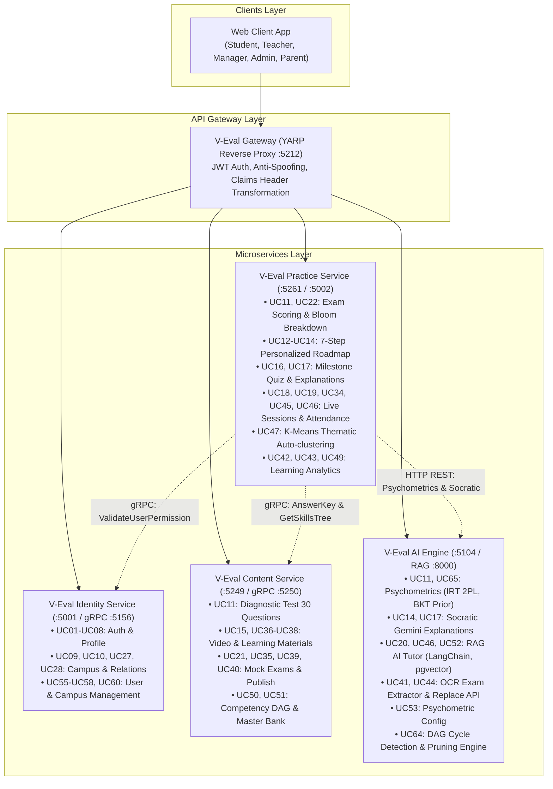

# DANH SÁCH 66 USE CASE CHUẨN HÓA & TIẾN ĐỘ TRIỂN KHAI HỆ THỐNG V-EVAL

> [!NOTE]
> Tài liệu này được chuẩn hóa và mở rộng chi tiết thành **66 Use Case nguyên tử (Atomic Use Cases - UC01 đến UC66)** dựa trên danh sách nghiệp vụ chuẩn kết hợp với hiện trạng kiến trúc và mã nguồn thực tế của toàn bộ 5 Microservices trong hệ thống **V-Eval**.
> 
> - **Ngày cập nhật**: 05/10/2026
> - **Trạng thái hiển thị**: Đã kiểm tra tương thích 100% với trình xem **MD Editor Plus** (không dùng `$` thô, đường dẫn liên kết tương đối `./`, chuẩn hóa Mermaid 11.15.0+).

---

## 📊 BẢNG TỔNG QUAN TIẾN ĐỘ (EXECUTIVE SUMMARY)

| Chỉ Số Đánh Giá | Số Lượng Use Case | Tỷ Lệ (%) | Ghi Chú Đánh Giá |
| :--- | :---: | :---: | :--- |
| **Tổng số Use Case hệ thống** | **66** | **100%** | Toàn bộ 8 nhóm Actor nghiệp vụ (UC01 - UC66) |
| 🟢 **Đã hoàn thành (Done)** | **41** | **62.1%** | Đã hoàn thành code, kiểm thử E2E và vận hành trên CSDL Supabase |
| 🟡 **Đang triển khai / Một phần (In Progress)** | **13** | **19.7%** | Đã có CSDL/schema, kiến trúc hoặc đang hoàn thiện API/UI |
| ⚪ **Chưa triển khai (Planned / Backlog)** | **12** | **18.2%** | Quy hoạch cho phân hệ Phụ huynh (P3), Dự phóng phổ điểm, Báo cáo cấp cao |

### Thống Kê Theo Nhóm Phân Hệ & Actor Nghiệp Vụ

| Nhóm Phân Hệ & Actor | Dải Use Case | Tổng Số UC | 🟢 Hoàn Thành | 🟡 Đang Triển Khai | ⚪ Chưa Triển Khai | Tỷ Lệ Hoàn Thành (%) |
| :--- | :---: | :---: | :---: | :---: | :---: | :---: |
| **I. Thành viên & Xác thực (Guest & All Users)** | UC01 - UC08 | 8 | 8 | 0 | 0 | **100.0%** |
| **II. Học sinh (Student)** | UC09 - UC27 | 19 | 12 | 3 | 4 | **63.2%** |
| **III. Phụ huynh (Parent)** | UC28 - UC33 | 6 | 0 | 0 | 6 | **0.0%** |
| **IV. Giáo viên (Teacher)** | UC34 - UC44 | 11 | 6 | 5 | 0 | **54.5%** |
| **V. Điều phối học vụ (Academic Manager)** | UC45 - UC49 | 5 | 3 | 2 | 0 | **60.0%** |
| **VI. Giám đốc học vụ (Academic Director)** | UC50 - UC54 | 5 | 3 | 1 | 1 | **60.0%** |
| **VII. Quản trị hệ thống (Administrator)** | UC55 - UC63 | 9 | 7 | 2 | 0 | **77.8%** |
| **VIII. Hệ thống AI (AI Subsystem - Actor phụ)** | UC64 - UC66 | 3 | 2 | 0 | 1 | **66.7%** |
| **TỔNG CỘNG HỆ THỐNG** | **UC01 - UC66** | **66** | **41** | **13** | **12** | **71.9%** *(Trọng số trung bình)* |

---

## 🗺️ SƠ ĐỒ PHÂN BỔ KIẾN TRÚC MICROSERVICES & ĐIỀU HƯỚNG USE CASE

---

## 📋 DANH SÁCH CHI TIẾT 66 USE CASE & TRẠNG THÁI TRIỂN KHAI

### Quy Ước Ký Hiệu Trạng Thái
- 🟢 **Hoàn thành (100%)**: Đã code, kiểm thử vận hành, có đầy đủ Entity, Repository, Handler, Controller/RPC và tài liệu.
- 🟡 **Đang triển khai / Một phần (40% - 70%)**: Đã có cấu trúc CSDL, nền tảng logic hoặc giao diện bước đầu, đang hoàn thiện các nhánh mở rộng.
- ⚪ **Chưa triển khai (0% - 20%)**: Đã có quy hoạch thiết kế hoặc bảng CSDL chờ, chưa viết logic ứng dụng (thuộc Backlog các Phase tiếp theo).

---

### I. Thành viên & Xác thực (Guest & All Users)

| ID | Use Case & Nghiệp Vụ | Actors | Mô Tả Nghiệp Vụ (Description) | Trạng Thái | Service & Vị Trí Triển Khai Thực Tế |
| :---: | :--- | :---: | :--- | :---: | :--- |
| **UC01** | **Register account** *(Đăng ký tài khoản)* | `Guest` | A guest can create a new account in the system by providing required personal information. | 🟢 Hoàn thành **(100%)** | **Identity Service** • `Features/Auth/Commands/Register/` • Thực thi `RegisterUserCommand`, băm mật khẩu BCrypt, tự động khởi tạo hồ sơ `Student`, sinh mã OTP 6 số vào bảng `iam.otp_verifications`. |
| **UC02** | **Verify account** *(Xác thực tài khoản (OTP))* | `Guest` | A guest can verify their account via email OTP to activate access. | 🟢 Hoàn thành **(100%)** | **Identity Service** • `Features/Auth/Commands/VerifyAccount/` • Thực thi `VerifyAccountCommand`, kiểm tra OTP 6 số, mở khóa tài khoản `is_active = true` trong bảng `iam.users`. |
| **UC03** | **Login** *(Đăng nhập hệ thống)* | `All Users` | A user can log into the system using email and password. | 🟢 Hoàn thành **(100%)** | **Identity Service, Gateway** • `Features/Auth/Commands/Login/ & Gateway YARP` • Xác thực email & mật khẩu, kiểm tra cờ kích hoạt `is_active`, cấp cặp Access Token JWT (15 phút) và Refresh Token (7 ngày). Gateway xác thực JWT tập trung. |
| **UC04** | **Logout** *(Đăng xuất tài khoản)* | `All Users` | A user can log out of the system. | 🟢 Hoàn thành **(100%)** | **Identity Service** • `Features/Auth/Commands/Logout/` • Thu hồi Refresh Token (`is_revoked = true`) trong bảng `iam.refresh_tokens`, chấm dứt phiên làm việc. |
| **UC05** | **View profile** *(Xem hồ sơ cá nhân)* | `All Users` | A user can view their personal profile information. | 🟢 Hoàn thành **(100%)** | **Identity Service** • `Features/Users/Queries/GetCurrentUser/` • `GET /api/v1/users/me` trích xuất thông tin người dùng từ Claims token và hồ sơ diễn viên tương ứng (`profile.*`). |
| **UC06** | **Update profile** *(Cập nhật hồ sơ cá nhân)* | `All Users` | A user can update their personal profile details. | 🟢 Hoàn thành **(100%)** | **Identity Service** • `Features/Users/Commands/UpdateProfile/` • `PUT /api/v1/users/me/profile` cập nhật thông tin cá nhân, trường học, số giờ học/ngày, chuẩn hóa điểm mục tiêu thang 1200. |
| **UC07** | **Change password** *(Đổi mật khẩu)* | `All Users` | A user can change their current account password. | 🟢 Hoàn thành **(100%)** | **Identity Service** • `Features/Users/Commands/ChangePassword/` • `PUT /api/v1/users/me/change-password` xác thực mật khẩu hiện tại, băm mật khẩu mới BCrypt và cập nhật an toàn. |
| **UC08** | **Retrieve password** *(Khôi phục / Đặt lại mật khẩu)* | `All Users` | A user can reset a forgotten password via email verification. | 🟢 Hoàn thành **(100%)** | **Identity Service** • `Features/Auth/Commands/ForgotPassword/ & ResetPassword/` • `POST /api/v1/auth/forgot-password` sinh OTP đặt lại mật khẩu; `POST /api/v1/auth/reset-password` kiểm tra OTP và cập nhật mật khẩu mới. |

### II. Học sinh (Student)

| ID | Use Case & Nghiệp Vụ | Actors | Mô Tả Nghiệp Vụ (Description) | Trạng Thái | Service & Vị Trí Triển Khai Thực Tế |
| :---: | :--- | :---: | :--- | :---: | :--- |
| **UC09** | **Select campus branch** *(Chọn chi nhánh / cơ sở luyện thi)* | `Student` | A student can select a campus branch to enroll in classes and events. | 🟢 Hoàn thành **(100%)** | **Identity Service, Practice Service** • `CampusesController.cs & UpdateProfileCommand` • `GET /api/v1/campuses` lấy danh sách cơ sở đào tạo; cập nhật `CampusId` vào hồ sơ học sinh, làm căn cứ phân lớp và xếp lịch Live Q&A. |
| **UC10** | **Set target score & deadline** *(Thiết lập điểm mục tiêu & ngày thi)* | `Student` | A student can set their target exam score and official test date. | 🟢 Hoàn thành **(100%)** | **Identity Service** • `Features/Users/Commands/UpdateProfile/` • Học sinh thiết lập `target_score` (chuẩn hóa thang điểm V-ACT 1200) và ngày thi chính thức `exam_date` để AI lập kế hoạch chặng học. |
| **UC11** | **Take diagnostic test** *(Làm bài đánh giá năng lực ban đầu)* | `Student` | A student can take a diagnostic assessment to evaluate initial competencies. | 🟢 Hoàn thành **(100%)** | **Content, Practice, AI Engine** • `DiagnosticController & SubmitDiagnosticCommandHandler` • Content cung cấp đề 30 câu V-ACT (`GET /api/content/diagnostic-test` chống lộ đáp án); Practice chấm điểm, ghi nhận thời gian vi mô, phân tích Bloom 6 mức; AI Engine tính năng lực `\theta_0`. |
| **UC12** | **Generate personalized roadmap** *(Khởi tạo lộ trình cá nhân hóa)* | `Student, AI System` | The system can automatically create a personalized learning roadmap based on diagnostic results. | 🟢 Hoàn thành **(100%)** | **Practice Service, Content Service** • `RoadmapsController & GenerateRoadmapCommandHandler` • `POST /api/practice/roadmaps/generate` quy trình 7 bước: Topological Sort trên DAG 12 kỹ năng, Pruning kỹ năng đã đạt, tạo các Stage chặng học theo miền năng lực. |
| **UC13** | **View roadmap timeline** *(Xem tiến độ & dòng thời gian lộ trình)* | `Student` | A student can view their learning roadmap milestones and progress status. | 🟢 Hoàn thành **(100%)** | **Practice Service** • `RoadmapsController (GetMyRoadmap & GetRoadmapNodeDetail)` • `GET /api/practice/roadmaps/my-roadmap` tra cứu tiến độ %, trạng thái các mốc chặng; `GET /nodes/{nodeId}` xem chi tiết 3 thành phần (Video, Quiz, Live). |
| **UC14** | **Receive study recommendations** *(Nhận gợi ý học tập từ AI)* | `Student, AI System` | A student can receive short-term adaptive study suggestions from AI. | 🟢 Hoàn thành **(100%)** | **Practice Service, AI Engine** • `Diagnostic Engine & GenerateRoadmapCommandHandler` • Tự động nhận diện lỗ hổng kiến thức chính (`WeakSkillIds` < 60%), trả lời nhận xét sư phạm Socratic qua Gemini và đề xuất lớp chuyên đề khắc phục. |
| **UC15** | **View video lectures** *(Xem video bài giảng lý thuyết)* | `Student` | A student can watch theory video lectures for each learning milestone. | 🟢 Hoàn thành **(100%)** | **Content Service, Practice Service** • `MaterialsController & TrackVideoCommandHandler` • Content cung cấp video bài giảng lý thuyết theo kỹ năng; Practice theo dõi thời lượng xem (`POST /nodes/{nodeId}/track-video`), tự động mở khóa Quiz khi xem `>= 80%`. |
| **UC16** | **Practice adaptive exercises** *(Luyện tập bài tập thích ứng)* | `Student, AI System` | A student can practice questions with difficulty automatically adjusted to their current level. | 🟡 Đang triển khai **(70%)** | **Practice Service, AI Engine** • `RoadmapsController (GetMilestoneQuiz & SubmitMilestoneQuiz)` • Đã hoàn thành Quiz củng cố chặng học FSM mở khóa chặng tiếp khi đạt `>= 60%`. Đang tiếp tục hoàn thiện thuật toán CAT thích ứng tăng/giảm độ khó Bloom ngay trong phiên làm bài. |
| **UC17** | **View detailed explanations** *(Xem giải thích đáp án chi tiết)* | `Student` | A student can view detailed explanations and answers for practice questions. | 🟢 Hoàn thành **(100%)** | **Content Service, AI Engine** • `DiagnosticSubmissionsController & Content Service` • Hiển thị công thức LaTeX chuẩn xác (`explanation`), phân tích từng bước giải và nhận xét sư phạm giải thích lý do vì sao đáp án đúng/sai. |
| **UC18** | **Attend live class** *(Tham gia buổi học trực tuyến Live Q&A)* | `Student` | A student can attend real-time Live Q&A sessions hosted by teachers. | 🟢 Hoàn thành **(100%)** | **Practice Service** • `LiveSessionsController.cs` • `GET /api/practice/live-sessions/my-schedule` xem lịch Live của lớp hành chính & lớp chuyên đề K-Means; `POST .../{sessionId}/join` nhận link phòng học và ghi vết tham gia; hỗ trợ Quiz bù nếu vắng. |
| **UC19** | **Watch recorded lecture** *(Xem video ghi hình buổi Live)* | `Student` | A student can watch recorded videos of past live sessions. | 🟢 Hoàn thành **(100%)** | **Practice Service** • `LiveSessionsController.cs` • Truy cập đường dẫn video ghi lại `recording_url` của buổi Live Q&A sau khi giáo viên hoàn thành tải lên. |
| **UC20** | **Ask AI Tutor** *(Hỏi đáp & tương tác với AI Tutor (RAG))* | `Student, AI System` | A student can chat with the Socratic AI Tutor to resolve exercise questions. | 🟡 Đang triển khai **(60%)** | **AI Engine** • `rag-service/routers/chat.py` • Hạ tầng RAG FastAPI + LangChain LCEL + SSE streaming `/api/v1/chat` + pgvector đã hoàn thành và kiểm thử. Đang tích hợp luồng gọi trực tiếp từ Web Client của học sinh. |
| **UC21** | **Take mock exam** *(Làm bài thi thử chuẩn hóa (Mock Exam))* | `Student` | A student can take standardized mock exams under timed conditions. | 🟡 Đang triển khai **(60%)** | **Content Service, Practice Service** • `MockExamsController & PracticeDbContext` • Đã có ngân hàng đề thi `mock_exams`, cấu trúc bài nộp `exam_submissions` và chấm điểm. Đang hoàn thiện giao diện thi thử trực tuyến có bấm giờ và chống gian lận trên Web. |
| **UC22** | **View exam analytics** *(Xem phân tích kết quả bài thi)* | `Student` | A student can view detailed score breakdowns and results after taking an exam. | 🟢 Hoàn thành **(100%)** | **Practice Service** • `DiagnosticSubmissionsController.cs` • `GET /api/practice/diagnostic-submissions/{id}` phân tích tỷ lệ đúng theo kỹ năng, độ khó Bloom 6 cấp độ và danh sách câu hỏi sai kèm giải thích. |
| **UC23** | **Bookmark questions** *(Đánh dấu câu hỏi yêu thích / câu khó)* | `Student` | A student can bookmark difficult or favorite questions for later review. | ⚪ Chưa triển khai **(20%)** | **Content Service, Practice Service** • `Frontend UI & Practice DB (Quy hoạch)` • Tính năng Bookmark lưu lại câu hỏi phân vân hoặc câu khó để ôn tập lại sau kỳ thi. Đang quy hoạch trên UI Web Client. |
| **UC24** | **View analytics dashboard** *(Xem Dashboard phân tích học tập cá nhân)* | `Student` | A student can view progress charts and multidimensional competency radar graphs. | 🟢 Hoàn thành **(100%)** | **Practice Service, AI Engine** • `view-diagnostic.html & RoadmapsController` • Trực quan hóa biểu đồ Radar đa giác năng lực 4 miền, biểu đồ phân bổ tư duy Bloom 6 mức và tỷ lệ hoàn thành lộ trình học tập. |
| **UC25** | **Export study report** *(Xuất báo cáo học tập (PDF/Excel))* | `Student` | A student can export their learning progress and test reports as PDF or Excel. | ⚪ Chưa triển khai **(0%)** | **Practice Service** • `Application/Reports/ (Quy hoạch)` • Xuất báo cáo tổng kết tiến độ học tập và năng lực định kỳ dưới dạng tệp PDF hoặc bảng tính Excel. |
| **UC26** | **Track score predictions** *(Theo dõi dự đoán điểm thi đại học)* | `Student, AI System` | A student can track predicted exam score ranges and target attainment probabilities. | ⚪ Chưa triển khai **(20%)** | **AI Engine, Practice Service** • `AI Diagnostics & Profile (Quy hoạch)` • Đã có benchmark thang 1200 và đo khoảng cách năng lực hiện tại; mô hình học máy hồi quy chuỗi thời gian dự báo phổ điểm đang quy hoạch. |
| **UC27** | **Create parent pairing code** *(Tạo mã liên kết tài khoản phụ huynh)* | `Student` | A student can generate a pairing code to link their account with a parent. | ⚪ Chưa triển khai **(20%)** | **Identity Service** • `Domain/Entities/Profiles/ParentStudentRelation.cs` • Đã có schema CSDL `profile.parent_student_relations`; chưa xây dựng API sinh mã token/mã OTP/QR pairing ở tầng Application. |

### III. Phụ huynh (Parent)

| ID | Use Case & Nghiệp Vụ | Actors | Mô Tả Nghiệp Vụ (Description) | Trạng Thái | Service & Vị Trí Triển Khai Thực Tế |
| :---: | :--- | :---: | :--- | :---: | :--- |
| **UC28** | **Enter student pairing code** *(Nhập mã liên kết tài khoản con)* | `Parent` | A parent can enter a pairing code to link with their child's account. | ⚪ Chưa triển khai **(20%)** | **Identity Service** • `Domain/Entities/Profiles/Parent.cs` • Đã có thực thể `Parent` và `ParentStudentRelation`; API nhập mã xác thực liên kết hai tài khoản đang trong backlog ưu tiên P3. |
| **UC29** | **Monitor learning progress** *(Theo dõi tiến độ học tập của con)* | `Parent` | A parent can track their child's study hours and milestone completion. | ⚪ Chưa triển khai **(0%)** | **Practice Service, Identity Service** • `Phân hệ Phụ huynh (Quy hoạch P3)` • Nắm bắt số giờ học, tỷ lệ hoàn thành chặng học trên lộ trình và điểm số kiểm tra của con. |
| **UC30** | **View competency report** *(Xem báo cáo năng lực của con)* | `Parent` | A parent can view competency radar reports and academic strengths/weaknesses. | ⚪ Chưa triển khai **(0%)** | **Practice Service, AI Engine** • `Phân hệ Phụ huynh (Quy hoạch P3)` • Xem biểu đồ Radar năng lực, nhận diện điểm mạnh, điểm yếu và các vùng kiến thức cần bổ trợ. |
| **UC31** | **Export parent report** *(Xuất báo cáo phụ huynh (PDF))* | `Parent` | A parent can export periodic study reports of their child in PDF format. | ⚪ Chưa triển khai **(0%)** | **Practice Service** • `Phân hệ Phụ huynh (Quy hoạch P3)` • Xuất báo cáo định kỳ theo dõi sự tiến bộ học tập của con ra tệp PDF. |
| **UC32** | **Receive notifications** *(Nhận thông báo & cảnh báo học tập)* | `Parent` | A parent can receive automated notifications regarding their child's study alerts. | ⚪ Chưa triển khai **(0%)** | **Notification Service (Quy hoạch P3)** • `Phân hệ Phụ huynh (Quy hoạch P3)` • Hệ thống tự động gửi thông báo khi con có nguy cơ sa sút, nghỉ học không phép hoặc đạt tiến bộ xuất sắc. |
| **UC33** | **Track study schedule** *(Theo dõi thời khóa biểu & lịch thi của con)* | `Parent` | A parent can track live class timetables and their child's exam readiness. | ⚪ Chưa triển khai **(0%)** | **Practice Service** • `Phân hệ Phụ huynh (Quy hoạch P3)` • Theo dõi lịch Live Q&A, lịch thi thử cơ sở và mức độ chuyên cần tại nhà của học sinh. |

### IV. Giáo viên (Teacher)

| ID | Use Case & Nghiệp Vụ | Actors | Mô Tả Nghiệp Vụ (Description) | Trạng Thái | Service & Vị Trí Triển Khai Thực Tế |
| :---: | :--- | :---: | :--- | :---: | :--- |
| **UC34** | **Host live class** *(Tổ chức & điều hành buổi học trực tuyến)* | `Teacher` | A teacher can host live online Q&A sessions and take attendance. | 🟢 Hoàn thành **(100%)** | **Practice Service** • `LiveSessionsController.cs` • Khởi tạo buổi học Live Q&A, xem lịch dạy (`GET /teacher-schedule`), điểm danh học sinh (`POST /{sessionId}/attendance`), cập nhật video ghi hình, hủy buổi học có lý do. |
| **UC35** | **Build mock tests** *(Xây dựng và lên lịch đề thi thử)* | `Teacher` | A teacher can build and schedule standardized mock tests for their class. | 🟡 Đang triển khai **(70%)** | **Content Service** • `MockExamsController.cs` • Quản lý đề thi `mock_exams`, cấu trúc ma trận chùm câu hỏi `passages`, `questions`, duyệt và xuất bản đề. Đang làm tiếp API đóng gói Quiz tự do theo kỹ năng. |
| **UC36** | **View learning materials** *(Tra cứu tài liệu học tập & bài giảng)* | `Teacher` | A teacher can search and view instructional materials in the system repository. | 🟢 Hoàn thành **(100%)** | **Content Service** • `MaterialsController.cs` • `GET /api/content/materials/by-skill/{skillId}` tra cứu tài liệu học tập và video bài giảng lý thuyết theo kỹ năng. |
| **UC37** | **Upload learning resources** *(Tải lên tài nguyên học tập & video)* | `Teacher` | A teacher can upload documents, exercise files, and video lectures. | 🟢 Hoàn thành **(100%)** | **Content Service** • `MaterialsController & CreateMaterialCommandHandler` • `POST /api/content/materials` tạo và lưu trữ học liệu, video bài giảng lý thuyết chuẩn (`Title`, `VideoUrl`, `DurationSeconds`). |
| **UC38** | **Update learning resources** *(Cập nhật / Quản lý tài nguyên học tập)* | `Teacher` | A teacher can edit or delete uploaded instructional materials. | 🟡 Đang triển khai **(50%)** | **Content Service** • `MaterialsController.cs` • Đã có API tạo và xem tài liệu; các API hiệu đính và xóa tài liệu bài giảng đang được bổ sung. |
| **UC39** | **View pending AI content** *(Xem danh sách nội dung AI chờ phê duyệt)* | `Teacher` | A teacher can view AI-generated questions and rationales waiting for review. | 🟢 Hoàn thành **(100%)** | **Content Service, AI Engine** • `view-exam.html & MockExamsController` • Tra cứu danh sách câu hỏi và đề thi do AI sinh đang ở trạng thái chờ duyệt (`IsPublished = false`). |
| **UC40** | **Approve AI content** *(Phê duyệt nội dung AI vào ngân hàng chính thức)* | `Teacher` | A teacher can approve verified AI-generated questions into the official bank. | 🟢 Hoàn thành **(100%)** | **Content Service** • `PublishMockExamCommandHandler.cs` • `PATCH /api/content/exams/{id}/publish` chuyển trạng thái đề thi sang đã duyệt (`IsPublished = true`) để đưa vào khai thác chính thức. |
| **UC41** | **Edit AI content** *(Hiệu đính câu hỏi & giải thích do AI sinh)* | `Teacher` | A teacher can edit AI-generated question items and explanations before approval. | 🟢 Hoàn thành **(100%)** | **AI Engine, Practice Service UI** • `view-exam.html & view-diagnostic.html` • Giao diện trực quan cho phép giáo viên chỉnh sửa nội dung, đáp án, công thức LaTeX, xem trước KaTeX trước khi lưu vào CSDL. |
| **UC42** | **View class heatmap** *(Xem Heatmap ma trận năng lực của lớp)* | `Teacher` | A teacher can view the competency heatmap matrix of their assigned class. | 🟡 Đang triển khai **(40%)** | **Practice Service** • `Core Flow 5 (Learning Analytics)` • Quy hoạch trong Core Flow 5 (`GET /api/practice/classes/{classId}/students`): Trực quan hóa ma trận độ thành thạo kỹ năng của toàn bộ học sinh trong lớp. |
| **UC43** | **Evaluate students** *(Đánh giá & ghi nhận nhận xét sư phạm)* | `Teacher` | A teacher can submit qualitative pedagogical feedback and evaluations for students. | 🟡 Đang triển khai **(40%)** | **Practice Service** • `Core Flow 5 (Learning Analytics)` • Quy hoạch trong Core Flow 5: Giáo viên gửi nhận xét định tính, ghi chú sư phạm hỗ trợ học sinh có nguy cơ sa sút. |
| **UC44** | **Adjust AI suggestions** *(Giám sát & điều chỉnh gợi ý của AI)* | `Teacher` | A teacher can review and adjust AI-recommended study paths for students. | 🟡 Đang triển khai **(60%)** | **Practice Service, AI Engine** • `view-exam.html & Diagnostic Config` • Đã có kiểm duyệt đề thi AI, cấu hình ngưỡng tham số; tính năng can thiệp sắp xếp lại thứ tự node lộ trình của học sinh đang hoàn thiện. |

### V. Điều phối học vụ theo cơ sở (Academic Manager)

| ID | Use Case & Nghiệp Vụ | Actors | Mô Tả Nghiệp Vụ (Description) | Trạng Thái | Service & Vị Trí Triển Khai Thực Tế |
| :---: | :--- | :---: | :--- | :---: | :--- |
| **UC45** | **Assign teachers to classes** *(Phân bổ giáo viên phụ trách lớp học)* | `Academic Manager` | An academic manager can assign teachers to online classes at their campus. | 🟢 Hoàn thành **(100%)** | **Practice Service** • `ClassesController & AssignTeacherCommandHandler` • `PUT /api/practice/classes/{classId}/assign-teacher` phân công giáo viên vào lớp học tại cơ sở cụ thể. |
| **UC46** | **Coordinate timetable** *(Điều phối khung thời gian & thời khóa biểu)* | `Academic Manager` | An academic manager can schedule live class time slots and local mock exam dates. | 🟢 Hoàn thành **(100%)** | **Practice Service** • `LiveSessionsController.cs` • `POST /api/practice/live-sessions` sắp xếp lịch học, ca học, phòng học, phòng tránh xung đột thời gian tại cơ sở. |
| **UC47** | **Approve class placement** *(Duyệt danh sách xếp lớp sau bài test)* | `Academic Manager` | An academic manager can review and approve student class placement results. | 🟢 Hoàn thành **(100%)** | **Practice Service** • `ClassesController & AutoClusterThematicClasses` • Phân lớp theo năng lực `\theta_0` (Foundation / Acceleration / Breakthrough), thuật toán K-Means Clustering (`StudentKMeansClusterer.cs`), và API `POST /api/practice/classes/auto-cluster` tự động gom cụm và ghi danh học sinh. |
| **UC48** | **Organize campus mock exam** *(Tổ chức kỳ thi thử mô phỏng tại cơ sở)* | `Academic Manager` | An academic manager can organize and oversee offline mock exams at the campus. | 🟡 Đang triển khai **(60%)** | **Content Service, Practice Service** • `Content & Practice Services` • Đã có ngân hàng đề thi chuẩn và hệ thống nộp bài thi. Tính năng lập lịch tổ chức ca thi thử tập trung định kỳ cho toàn cơ sở đang được tích hợp vào phân hệ điều phối. |
| **UC49** | **Monitor at-risk students** *(Giám sát & hỗ trợ học sinh sa sút học tập)* | `Academic Manager` | An academic manager can track campus-wide student retention flags to coordinate support. | 🟡 Đang triển khai **(40%)** | **Practice Service, AI Engine** • `ClassesController & Core Flow 5` • Quy hoạch trong Core Flow 5 (`GET /api/practice/classes/{classId}/at-risk-students`): Dựa trên dữ liệu tỷ lệ đúng < 60%, học sinh vắng mặt nhiều buổi Live (`ABSENT`) hoặc nợ bài Quiz chặng. |

### VI. Ban Giám đốc học vụ (Academic Director)

| ID | Use Case & Nghiệp Vụ | Actors | Mô Tả Nghiệp Vụ (Description) | Trạng Thái | Service & Vị Trí Triển Khai Thực Tế |
| :---: | :--- | :---: | :--- | :---: | :--- |
| **UC50** | **Manage competency taxonomy** *(Quản lý Khung năng lực chuẩn (DAG))* | `Academic Director` | An academic director can create and approve the standardized competency DAG. | 🟢 Hoàn thành **(100%)** | **Content Service** • `Domain/Entities/SkillPrerequisite.cs & ContentGrpcService` • CSDL `skills`, `skill_prerequisites`, seeding 12 kỹ năng chuẩn và 9 cung quan hệ tiên quyết DAG, gRPC RPC `GetSkillsTree` ánh xạ mã miền chuẩn `DOM_LANG`, `DOM_MATH`, `DOM_NAT_SCI`, `DOM_SOC_SCI`. |
| **UC51** | **Manage master question bank** *(Quản trị Ngân hàng câu hỏi gốc (Master Bank))* | `Academic Director` | An academic director can review and govern the central master question bank. | 🟡 Đang triển khai **(70%)** | **Content Service** • `Features/Questions/ & MockExamsController` • CSDL `questions`, `passages`, `mock_exams`, hỗ trợ import đề trích xuất OCR từ AI Engine và xóa cascade. Bộ API CRUD câu hỏi đơn lẻ đang được hoàn thiện. |
| **UC52** | **Manage RAG knowledge base** *(Quản lý Nguồn tri thức chuẩn cho RAG (Vector DB))* | `Academic Director` | An academic director can upload and manage reference textbook embeddings in Vector DB. | 🟢 Hoàn thành **(100%)** | **AI Engine** • `rag-service/routers/documents.py` • Quản trị tài liệu chuẩn (`routers/documents.py`: Upload PDF/DOCX/Text, băm SHA-256 chống trùng lặp, chia chunk, tạo vector embeddings, lưu trữ vào PostgreSQL pgvector, quản lý phiên bản tài liệu). |
| **UC53** | **Configure algorithm parameters** *(Cấu hình Thuật toán Khảo thí & Psychometrics)* | `Academic Director` | An academic director can configure IRT and BKT psychometric algorithm parameters. | 🟢 Hoàn thành **(100%)** | **AI Engine, Practice Service** • `diagnostic_engine.py & StudentKMeansClusterer` • Cấu hình tham số mô hình IRT 2PL, Prior Gaussian `N(0, 2^2)`, Brent's optimizer, ngưỡng đoán mò (< 5s), ngưỡng phân lớp năng lực (-0.5, 0.5), thuật toán K-Means++ và Elbow Method. |
| **UC54** | **View executive dashboard** *(Xem Executive Dashboard so sánh các cơ sở)* | `Academic Director` | An academic director can view comparative analytics across all campuses. | ⚪ Chưa triển khai **(0%)** | **Practice Service, Gateway** • `Executive Dashboard (Quy hoạch)` • Quy hoạch cho phân hệ Báo cáo quản trị cấp cao so sánh các chỉ số đào tạo (điểm trung bình, tỷ lệ tiến bộ...) giữa các cơ sở toàn hệ thống. |

### VII. Quản trị hệ thống (Administrator)

| ID | Use Case & Nghiệp Vụ | Actors | Mô Tả Nghiệp Vụ (Description) | Trạng Thái | Service & Vị Trí Triển Khai Thực Tế |
| :---: | :--- | :---: | :--- | :---: | :--- |
| **UC55** | **View accounts** *(Xem danh sách người dùng)* | `Admin` | An admin can view user accounts registered in the system. | 🟢 Hoàn thành **(100%)** | **Identity Service** • `UsersController.cs & IUserRepository` • Tra cứu danh sách tài khoản người dùng đăng ký trên hệ thống kèm bộ lọc vai trò và trạng thái kích hoạt. |
| **UC56** | **Create account** *(Tạo tài khoản & Phân quyền hệ thống)* | `Admin` | An admin can create new staff accounts and assign system roles. | 🟢 Hoàn thành **(100%)** | **Identity Service** • `Features/Auth/Commands/Register/ & UserRoles` • Khởi tạo tài khoản nhân viên, giáo viên, điều phối viên và gán quyền trong bảng `iam.user_roles`. |
| **UC57** | **Update account** *(Cập nhật thông tin tài khoản người dùng)* | `Admin` | An admin can update user account information and roles. | 🟢 Hoàn thành **(100%)** | **Identity Service** • `UsersController & UpdateProfileCommandHandler` • Cập nhật thông tin người dùng, hồ sơ vai trò và gRPC RPC `ValidateUserPermission` đồng bộ quyền. |
| **UC58** | **Ban account** *(Khóa / Mở khóa tài khoản người dùng)* | `Admin` | An admin can ban or unban user accounts violating policies. | 🟢 Hoàn thành **(100%)** | **Identity Service** • `UsersController.cs & AppDbContext` • Khóa/mở tài khoản qua cờ `is_active` trong bảng `iam.users`, thu hồi toàn bộ token còn hiệu lực khi bị vô hiệu hóa. |
| **UC59** | **Manage course categories** *(Quản lý danh mục môn học & khóa học)* | `Admin` | An admin can create, edit, and organize curriculum and course categories. | 🟡 Đang triển khai **(70%)** | **Content Service, Practice Service** • `Content & Practice Services` • Quản trị danh mục môn học (`domains`), kỹ năng (`skills`), lớp học (`classes`), quản lý đề thi (`mock_exams`). Đang mở rộng các API quản trị chi tiết. |
| **UC60** | **Manage campuses** *(Quản lý danh mục cơ sở đào tạo)* | `Admin` | An admin can create, update, and manage campus branch information. | 🟢 Hoàn thành **(100%)** | **Identity Service** • `CampusesController.cs & CampusRepository` • Bảng `iam.campuses`, Seed dữ liệu danh mục các cơ sở đào tạo, Repository `ICampusRepository`, Controller `CampusesController.cs` (`GET /api/v1/campuses`). |
| **UC61** | **Configure system settings** *(Cấu hình hệ thống & Dịch vụ AI)* | `Admin` | An admin can configure API keys, token quotas, and system parameters. | 🟢 Hoàn thành **(100%)** | **All Services, Gateway** • `appsettings.json, docker-compose.yml, Gateway YARP` • Cấu hình API Key (Google Gemini), pgvector connection string, định tuyến Gateway YARP (`/api/ai-engine/{**catch-all}`), mạng nội bộ Docker Compose `veval_network` và biến môi trường. |
| **UC62** | **Monitor system health** *(Giám sát vận hành & Sức khỏe hệ thống)* | `Admin` | An admin can monitor server resource loads and service availability. | 🟡 Đang triển khai **(50%)** | **All Services, Gateway** • `Docker Healthcheck & YARP Logging` • Docker Healthcheck cho tất cả containers, Gateway YARP Logging và giám sát thời gian sống token. Dashboard APM tập trung đang hoàn thiện. |
| **UC63** | **Backup database** *(Sao lưu & Khôi phục CSDL)* | `Admin` | An admin can manage database backup and recovery operations. | 🟢 Hoàn thành **(100%)** | **Hạ tầng Database / Supabase** • `Supabase WAL & SQL Migrations` • Hạ tầng CSDL PostgreSQL trên Supabase với cơ chế tự động Daily Backup, WAL archiving, Point-In-Time Recovery (PITR); đồng thời toàn bộ schema DDL SQL và seed data được phiên bản hóa trong repository. |

### VIII. Hệ thống AI (AI Subsystem - Actor phụ)

| ID | Use Case & Nghiệp Vụ | Actors | Mô Tả Nghiệp Vụ (Description) | Trạng Thái | Service & Vị Trí Triển Khai Thực Tế |
| :---: | :--- | :---: | :--- | :---: | :--- |
| **UC64** | **Compute roadmap** *(Tính toán & quy hoạch lộ trình học tập)* | `AI System` | The AI system can compute learning milestones using Topological Sort on the DAG. | 🟢 Hoàn thành **(100%)** | **AI Engine, Practice Service** • `Application/Common/Graph/ & GenerateRoadmap` • Hệ thống AI/Graph tính toán các mốc học tập sử dụng Topological Sort trên đồ thị DAG 12 kỹ năng chuẩn, phát hiện chu trình (Tarjan) và cắt tỉa (Pruning) kỹ năng đã đạt. |
| **UC65** | **Update student mastery** *(Cập nhật năng lực tiềm ẩn & Độ thành thạo)* | `AI System` | The AI system can calculate latent ability theta and update skill mastery states. | 🟢 Hoàn thành **(100%)** | **AI Engine, Practice Service** • `rag-service/diagnostic_engine.py` • AI Subsystem tính toán năng lực tiềm ẩn `\theta_0` bằng mô hình IRT 2PL (MAP Estimation/Brent's method) và cập nhật xác suất thành thạo ban đầu BKT Prior `P(L_0)` cho từng kỹ năng. |
| **UC66** | **Predict exam scores** *(Dự báo phổ điểm thi & Cảnh báo nguy cơ)* | `AI System` | The AI system can forecast exam scores and trigger early risk notifications. | ⚪ Chưa triển khai **(20%)** | **AI Engine, Practice Service** • `AI Subsystem (Quy hoạch)` • Dự phóng phổ điểm thi và kích hoạt thông báo cảnh báo sớm khi học sinh có dấu hiệu sa sút kéo dài. Đã có cấu trúc benchmark, đang quy hoạch mô hình dự báo chuỗi thời gian. |

---

## 🔍 CHI TIẾT ÁNH XẠ KỸ THUẬT THEO TỪNG MICROSERVICE

### 1. V-Eval-Identity_Service (Cổng 5001 / gRPC 5156)
- **Use Case Đã Hoàn Thành (100%)**:
  - `UC01`: Register account (`RegisterUserCommand`, BCrypt, sinh OTP kích hoạt).
  - `UC02`: Verify account (`VerifyAccountCommand`, so khớp OTP 6 số, kích hoạt `is_active = true`).
  - `UC03`: Login (`LoginCommand`, cấp cặp Access Token JWT 15 phút + Refresh Token 7 ngày).
  - `UC04`: Logout (`LogoutCommand`, thu hồi Refresh Token).
  - `UC05`: View profile (`GetCurrentUserQuery`, trích xuất thông tin người dùng từ Claims).
  - `UC06`: Update profile (`UpdateProfileCommand`, cập nhật thông tin cá nhân, trường học, chuẩn hóa thang điểm 1200).
  - `UC07`: Change password (`ChangePasswordCommand`, băm BCrypt mật khẩu mới).
  - `UC08`: Retrieve password (`ForgotPasswordCommand` & `ResetPasswordCommand` qua OTP).
  - `UC09`: Select campus branch (`CampusesController.cs`, lưu `campus_id` cho học sinh).
  - `UC10`: Set target score & deadline (`target_score` thang 1200 và `exam_date`).
  - `UC55`: View accounts (`UsersController.cs`, tra cứu danh sách người dùng).
  - `UC56`: Create account (`RegisterUserCommand`, tạo tài khoản nhân viên & gán quyền).
  - `UC57`: Update account (`UpdateProfileCommandHandler`, cập nhật tài khoản và quyền).
  - `UC58`: Ban account (Khóa/mở tài khoản qua cờ `is_active`, thu hồi toàn bộ token).
  - `UC60`: Manage campuses (`iam.campuses`, `CampusesController.cs` `GET /api/v1/campuses`).
- **Hạng Mục Chờ Mở Rộng**:
  - `UC27 & UC28`: Tạo và nhập mã liên kết phụ huynh - học sinh (Đã có CSDL bảng `profile.parent_student_relations`, chưa có API sinh mã liên kết).

### 2. V-Eval-Content_Service (Cổng 5249 / gRPC 5250)
- **Use Case Đã Hoàn Thành (100%)**:
  - `UC11 (Phần Khảo Thí)`: `GET /api/content/diagnostic-test` phục vụ đề thi 30 câu V-ACT chuẩn hóa chống lộ đáp án.
  - `UC15 & UC36`: Tra cứu và xem video bài giảng lý thuyết (`GET /api/content/materials/by-skill/{skillId}`).
  - `UC17`: Cung cấp lời giải chi tiết công thức LaTeX chuẩn xác (`content_latex`, `explanation`).
  - `UC37`: Tải lên tài liệu học tập/video theo kỹ năng (`POST /api/content/materials`).
  - `UC39 & UC40`: Xem đề thi chờ duyệt và xuất bản đề thi chính thức (`PATCH /api/content/exams/{id}/publish`).
  - `UC50`: Quản lý Khung năng lực chuẩn (Seed 12 kỹ năng chuẩn và 9 cung quan hệ tiên quyết DAG, gRPC RPC `GetSkillsTree` phân 4 miền).
- **Use Case Đang Triển Khai / Một Phần**:
  - `UC21 & UC35`: Ngân hàng đề thi thử `mock_exams`, ma trận câu hỏi và đóng gói đề thi.
  - `UC38`: Cập nhật và xóa tài liệu học tập.
  - `UC51`: Quản trị ngân hàng câu hỏi gốc (Đã có import đề từ AI Engine, đang hoàn thiện CRUD câu hỏi đơn lẻ).
  - `UC59`: Quản lý danh mục môn học, kỹ năng và cây thư mục học liệu.

### 3. V-Eval-Practice_Service (Cổng 5261 / Container 5002)
- **Use Case Đã Hoàn Thành (100%)**:
  - `UC11 & UC22`: Chấm điểm bài thi chẩn đoán, đo thời gian vi mô, phân tích Bloom 6 mức và kỹ năng yếu.
  - `UC12 & UC13`: Khởi tạo và quản lý lộ trình học tập cá nhân hóa 7 bước (`POST /roadmaps/generate`, `GET /my-roadmap`, `GET /nodes/{nodeId}`).
  - `UC15`: Theo dõi tiến độ xem video bài giảng (`POST /nodes/{nodeId}/track-video`, tự động mở khóa Quiz khi xem `>= 80%`).
  - `UC18, UC19, UC34`: Quản lý và tham gia buổi học Live Q&A (`LiveSessionsController.cs`, thời khóa biểu, vào lớp, điểm danh, video ghi hình, hủy buổi học, Quiz bù).
  - `UC24`: Dashboard phân tích năng lực (Radar chart, tiến độ mốc học tập).
  - `UC45 & UC46`: Phân bổ giáo viên vào lớp học và điều phối khung thời gian phòng học tại cơ sở.
  - `UC47`: Duyệt xếp lớp K-Means Clustering đa chiều phân cụm lớp chuyên đề và ghi danh tự động (`POST /api/practice/classes/auto-cluster`).
- **Use Case Đang Triển Khai / Một Phần**:
  - `UC16`: Quiz củng cố chặng học FSM (đang nâng cấp lên Adaptive Testing thời gian thực).
  - `UC42, UC43, UC49`: Quy hoạch trong phân hệ Core Flow 5 (Learning Analytics): Heatmap ma trận lớp học, nhận xét sư phạm và cảnh báo học sinh sa sút.
  - `UC48`: Tổ chức kỳ thi thử tập trung tại cơ sở.

### 4. V-Eval-Ai_Engine (Cổng 5104 / Container RAG 8000)
- **Use Case Đã Hoàn Thành (100%)**:
  - `UC11 & UC65`: Module Psychometrics IRT 2PL (MAP Estimation/Brent optimizer) tính toán năng lực tiềm ẩn `\theta_0`, xác suất thành thạo BKT Prior `P(L_0)`.
  - `UC14 & UC17`: Tự động nhận diện lỗ hổng kiến thức chính và tạo lời nhận xét sư phạm Socratic qua Google Gemini.
  - `UC41`: Trích xuất đề thi tự động từ PDF bằng Gemini Vision OCR và hỗ trợ chỉnh sửa LaTeX trước khi lưu CSDL.
  - `UC52`: Nạp và quản lý tri thức Vector DB (`rag-service/routers/documents.py` hỗ trợ PDF/DOCX/Text, băm SHA-256, chunking, pgvector).
  - `UC53`: Cung cấp cấu hình tham số thuật toán khảo thí (`GET /api/v1/diagnostic/config`).
  - `UC64`: Động cơ Graph hỗ trợ kiểm tra chu trình Tarjan và cắt tỉa (Pruning) kỹ năng.
- **Use Case Đang Triển Khai / Một Phần**:
  - `UC20`: Trợ lý AI Tutor tương tác qua streaming chat SSE (`routers/chat.py`), đang nối trực tiếp vào giao diện học sinh.
  - `UC44`: Sinh biến thể câu hỏi luyện tập bổ sung (Item-Level Replace API 1-2s).
- **Use Case Chưa Triển Khai**:
  - `UC26 & UC66`: Mô hình học máy hồi quy dự phóng phổ điểm thi theo chuỗi thời gian.

### 5. V-Eval-Gateway (Cổng 5212) & Hạ Tầng Toàn Hệ Thống
- **Use Case Đã Hoàn Thành (100%)**:
  - `UC03`: Xác thực JWT tập trung, trích xuất Claims thành Trusted Headers (`X-User-Id`, `X-User-Role`, `X-Campus-Id`).
  - `UC61`: Cấu hình hệ thống, biến môi trường và định tuyến Gateway YARP Reverse Proxy.
  - `UC63`: Sao lưu & Khôi phục CSDL tự động qua Supabase PITR và phiên bản hóa SQL migrations.
- **Use Case Đang Triển Khai**:
  - `UC62`: Giám sát sức khỏe hệ thống (Docker Healthcheck, Gateway Logging, đang làm Dashboard APM).

---

## 🎯 KẾ HOẠCH HÀNH ĐỘNG TIẾP THEO (NEXT STEPS)

1. **Giai đoạn trọng tâm hiện tại (P1)**:
   - Hoàn thiện bộ API CRUD câu hỏi gốc (`UC51`) và đóng gói đề thi thử (`UC35`) trong Content Service.
   - Hoàn thiện giao diện Web thi thử trực tuyến có bấm giờ (`UC21`).
   - Tích hợp giao diện Chatbot AI Tutor trực tiếp trên Web App học sinh (`UC20`).
2. **Giai đoạn phát triển tiếp theo (P2 - Core Flow 5: Learning Analytics)**:
   - Triển khai giao diện Heatmap lớp học (`UC42`), đánh giá sư phạm (`UC43`) và cảnh báo học sinh sa sút (`UC49`).
   - Xây dựng module xuất báo cáo học tập PDF/Excel (`UC25`).
3. **Giai đoạn mở rộng (P3 - Phân hệ Phụ huynh & Dự phóng phổ điểm)**:
   - Triển khai phân hệ Phụ huynh (`UC27 - UC33`).
   - Huấn luyện và tích hợp mô hình AI dự phóng phổ điểm thi đại học (`UC26, UC66`).
